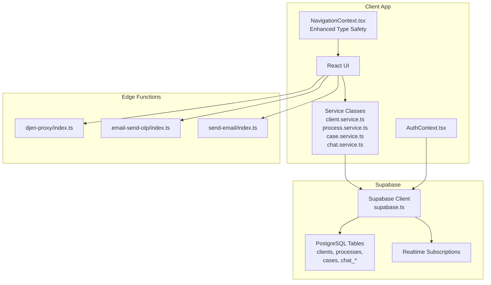
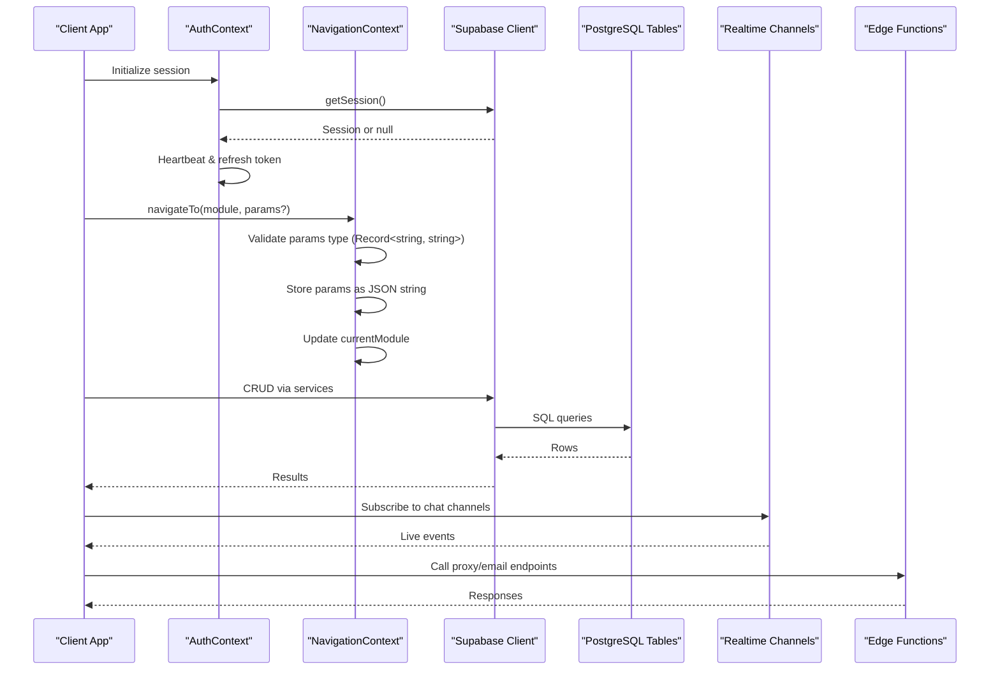
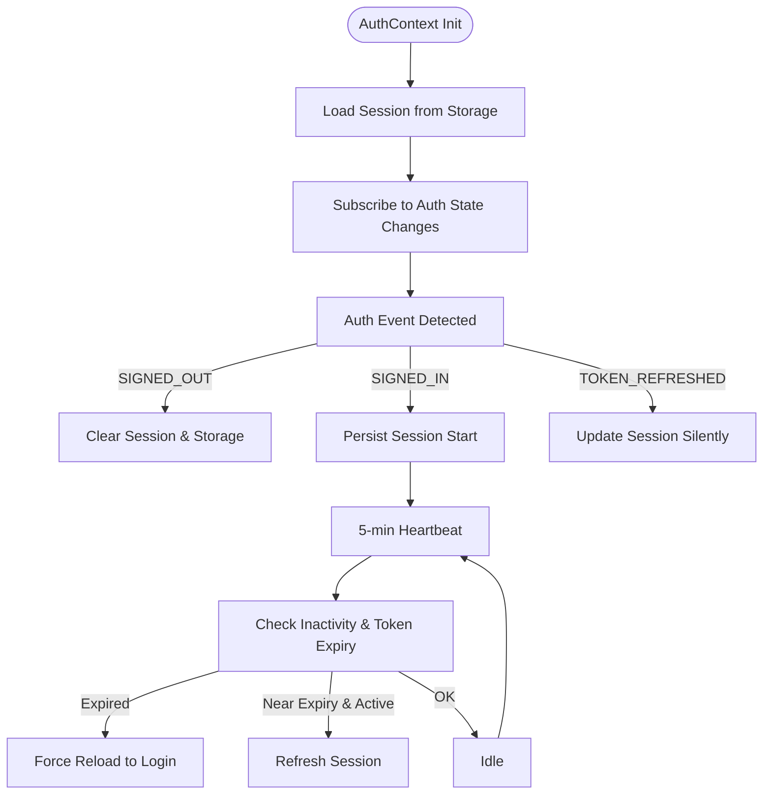
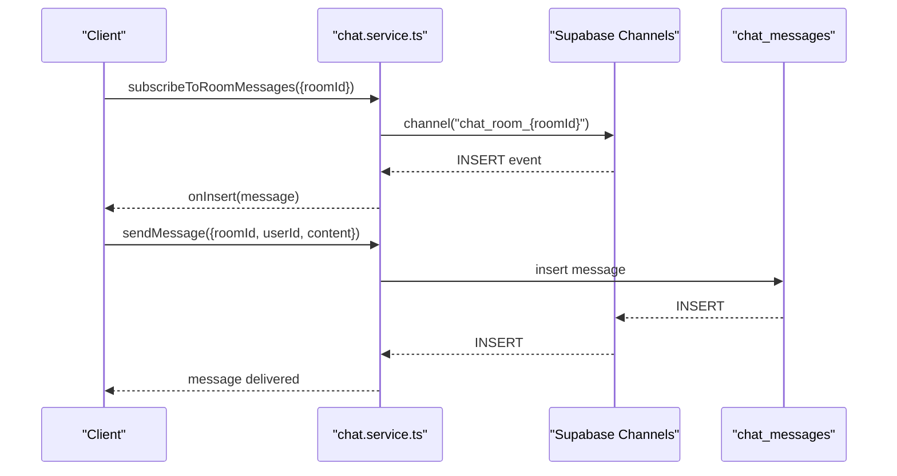
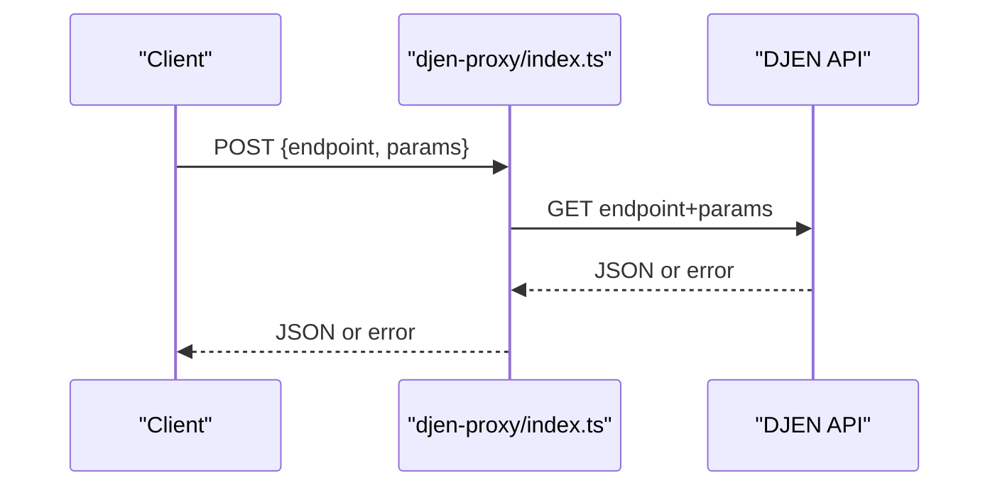
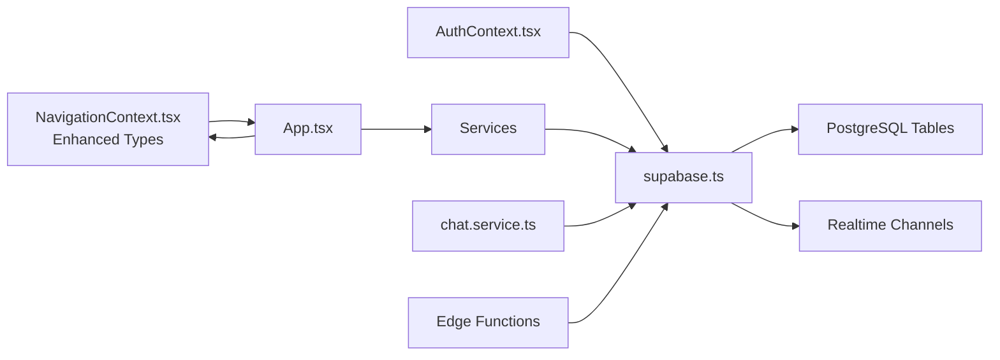

# API Reference

<cite>
**Referenced Files in This Document**
- [supabase.ts](file://src/config/supabase.ts)
- [AuthContext.tsx](file://src/contexts/AuthContext.tsx)
- [NavigationContext.tsx](file://src/contexts/NavigationContext.tsx)
- [main.tsx](file://src/main.tsx)
- [App.tsx](file://src/App.tsx)
- [client.service.ts](file://src/services/client.service.ts)
- [process.service.ts](file://src/services/process.service.ts)
- [case.service.ts](file://src/services/case.service.ts)
- [chat.service.ts](file://src/services/chat.service.ts)
- [chat.types.ts](file://src/types/chat.types.ts)
- [client.types.ts](file://src/types/client.types.ts)
- [process.types.ts](file://src/types/process.types.ts)
- [djen-proxy/index.ts](file://supabase/functions/djen-proxy/index.ts)
- [email-send-otp/index.ts](file://supabase/functions/email-send-otp/index.ts)
- [send-email/index.ts](file://supabase/functions/send-email/index.ts)
</cite>

## Update Summary
**Changes Made**
- Enhanced navigation API documentation with improved type annotations
- Updated NavigationContext documentation to reflect explicit Record<string, string> type definitions
- Added comprehensive coverage of navigation parameter typing and validation
- Expanded API reference for module navigation and parameter passing

## Table of Contents
1. [Introduction](#introduction)
2. [Project Structure](#project-structure)
3. [Core Components](#core-components)
4. [Architecture Overview](#architecture-overview)
5. [Detailed Component Analysis](#detailed-component-analysis)
6. [Navigation API](#navigation-api)
7. [Dependency Analysis](#dependency-analysis)
8. [Performance Considerations](#performance-considerations)
9. [Troubleshooting Guide](#troubleshooting-guide)
10. [Conclusion](#conclusion)
11. [Appendices](#appendices)

## Introduction
This document provides a comprehensive API reference for the CRM Jurídico system. It covers:
- Supabase-powered REST-like data access via client services
- Authentication and session lifecycle
- Real-time subscriptions for chat and presence-like features
- Edge function endpoints for external integrations (DJEN proxy, email OTP, email sending)
- Navigation API with enhanced type safety for module routing
- Request/response schemas, validation, and error handling
- Rate limiting, authentication headers, and API versioning considerations
- Webhook/callback patterns and monitoring approaches

## Project Structure
The API surface is primarily implemented through:
- Supabase client initialization and auth state management
- Service classes encapsulating CRUD operations against Supabase tables
- Edge functions for cross-origin proxying and email orchestration
- Real-time subscriptions leveraging Supabase channels
- Enhanced navigation system with explicit type annotations



**Diagram sources**
- [supabase.ts:1-34](file://src/config/supabase.ts#L1-L34)
- [AuthContext.tsx:1-285](file://src/contexts/AuthContext.tsx#L1-L285)
- [NavigationContext.tsx:1-94](file://src/contexts/NavigationContext.tsx#L1-L94)
- [client.service.ts:1-604](file://src/services/client.service.ts#L1-L604)
- [process.service.ts:1-192](file://src/services/process.service.ts#L1-L192)
- [case.service.ts:1-173](file://src/services/case.service.ts#L1-L173)
- [chat.service.ts:1-637](file://src/services/chat.service.ts#L1-L637)
- [djen-proxy/index.ts:1-82](file://supabase/functions/djen-proxy/index.ts#L1-L82)
- [email-send-otp/index.ts:1-298](file://supabase/functions/email-send-otp/index.ts#L1-L298)
- [send-email/index.ts:1-139](file://supabase/functions/send-email/index.ts#L1-L139)

**Section sources**
- [supabase.ts:1-34](file://src/config/supabase.ts#L1-L34)
- [main.tsx:1-90](file://src/main.tsx#L1-L90)

## Core Components
- Supabase client initialization and auth interceptor
- Authentication context managing session lifecycle, inactivity checks, and token refresh
- Service classes for clients, processes, cases, and chat
- Enhanced navigation system with explicit type annotations for module parameters
- Edge functions for DJEN proxy, email OTP, and email sending

Key responsibilities:
- Supabase client: centralized auth and DB access
- AuthContext: session persistence, heartbeat refresh, inactivity logout
- Services: typed CRUD, caching, and error propagation
- NavigationContext: type-safe module navigation with validated parameters
- Edge functions: CORS-safe external API access and email delivery

**Section sources**
- [supabase.ts:13-34](file://src/config/supabase.ts#L13-L34)
- [AuthContext.tsx:45-115](file://src/contexts/AuthContext.tsx#L45-L115)
- [NavigationContext.tsx:32-38](file://src/contexts/NavigationContext.tsx#L32-L38)
- [NavigationContext.tsx:54-62](file://src/contexts/NavigationContext.tsx#L54-L62)
- [client.service.ts:43-95](file://src/services/client.service.ts#L43-L95)
- [process.service.ts:42-93](file://src/services/process.service.ts#L42-L93)
- [case.service.ts:20-71](file://src/services/case.service.ts#L20-L71)
- [chat.service.ts:87-135](file://src/services/chat.service.ts#L87-L135)

## Architecture Overview
The system integrates:
- Frontend React app with Supabase client
- Supabase Auth for session management
- Supabase Tables for persistent data
- Supabase Realtime for live chat and reactions
- Enhanced NavigationContext for type-safe module routing
- Edge Functions for external integrations and email orchestration



**Diagram sources**
- [AuthContext.tsx:142-189](file://src/contexts/AuthContext.tsx#L142-L189)
- [NavigationContext.tsx:54-62](file://src/contexts/NavigationContext.tsx#L54-L62)
- [supabase.ts:22-33](file://src/config/supabase.ts#L22-L33)
- [chat.service.ts:585-633](file://src/services/chat.service.ts#L585-L633)
- [djen-proxy/index.ts:8-81](file://supabase/functions/djen-proxy/index.ts#L8-L81)
- [email-send-otp/index.ts:40-297](file://supabase/functions/email-send-otp/index.ts#L40-L297)
- [send-email/index.ts:22-138](file://supabase/functions/send-email/index.ts#L22-L138)

## Detailed Component Analysis

### Authentication and Session Management
- Initializes Supabase client with auto-refresh and persisted sessions
- Listens to auth state changes and debounces rapid events
- Implements heartbeat to refresh tokens and logs out after extended inactivity
- Tracks session start and supports manual extension



**Diagram sources**
- [AuthContext.tsx:45-115](file://src/contexts/AuthContext.tsx#L45-L115)
- [AuthContext.tsx:118-189](file://src/contexts/AuthContext.tsx#L118-L189)
- [supabase.ts:22-33](file://src/config/supabase.ts#L22-L33)

**Section sources**
- [supabase.ts:13-34](file://src/config/supabase.ts#L13-L34)
- [AuthContext.tsx:45-115](file://src/contexts/AuthContext.tsx#L45-L115)
- [AuthContext.tsx:118-189](file://src/contexts/AuthContext.tsx#L118-L189)

### Supabase Data Access Services

#### Clients API
- List, search, filter, and paginate clients
- Create, update, delete clients with validation
- Merge duplicate clients with conflict resolution
- Photo management and exclusion
- Search with accent-insensitive normalization

Endpoints and behaviors:
- GET /clients
  - Filters: status, client_type, search, sort_order
  - Returns array of clients
- GET /clients/:id
  - Returns single client or null
- GET /clients/by-cpf-cnpj/:cpfCnpj
  - Returns client or null
- GET /clients/by-email/:email
  - Returns client or null
- POST /clients
  - Validates uniqueness of CPF/CNPJ
  - Returns created client
- PUT /clients/:id
  - Validates uniqueness when updating CPF/CNPJ
  - Returns updated client
- DELETE /clients/:id
  - Deletes client
- POST /clients/:id/photo
  - Updates photo_path
- POST /clients/:id/exclude-photo
  - Adds to excluded_photo_paths

Validation and errors:
- Throws descriptive errors on duplicates, not found, and DB errors
- Uses accent-insensitive search and normalization

**Section sources**
- [client.service.ts:43-95](file://src/services/client.service.ts#L43-L95)
- [client.service.ts:100-175](file://src/services/client.service.ts#L100-L175)
- [client.service.ts:177-312](file://src/services/client.service.ts#L177-L312)
- [client.service.ts:317-432](file://src/services/client.service.ts#L317-L432)
- [client.service.ts:467-535](file://src/services/client.service.ts#L467-L535)
- [client.service.ts:537-599](file://src/services/client.service.ts#L537-L599)

#### Processes API
- List with server-side filters and client-side search
- Get by ID, create, update, update status, delete
- Built-in cache invalidated on mutations

Endpoints and behaviors:
- GET /processes
  - Filters: status, client_id, practice_area, requirement_id, requirement_role, search
  - Returns array of processes
- GET /processes/:id
  - Returns single process or null
- POST /processes
  - Defaults status if not provided
  - Returns created process
- PUT /processes/:id
  - Returns updated process
- PUT /processes/:id/status
  - Updates status only
  - Returns updated process
- DELETE /processes/:id
  - Deletes process

Validation and errors:
- Propagates DB errors with message
- Uses cache with TTL and filter-aware invalidation

**Section sources**
- [process.service.ts:42-93](file://src/services/process.service.ts#L42-L93)
- [process.service.ts:95-111](file://src/services/process.service.ts#L95-L111)
- [process.service.ts:113-132](file://src/services/process.service.ts#L113-L132)
- [process.service.ts:134-154](file://src/services/process.service.ts#L134-L154)
- [process.service.ts:156-173](file://src/services/process.service.ts#L156-L173)
- [process.service.ts:175-188](file://src/services/process.service.ts#L175-L188)

#### Cases API
- Manage cases, deadlines, and administrative requests
- CRUD operations with ordering and filtering

Endpoints and behaviors:
- Cases
  - GET /cases
  - GET /cases/:id
  - POST /cases
  - PUT /cases/:id
  - DELETE /cases/:id
- Deadlines
  - GET /cases/:caseId/deadlines
  - POST /deadlines
  - PUT /deadlines/:id
  - DELETE /deadlines/:id
- Administrative Requests
  - GET /cases/:caseId/administrative-requests
  - POST /administrative-requests
  - PUT /administrative-requests/:id
  - DELETE /administrative-requests/:id

Validation and errors:
- Throws error with message on DB failures

**Section sources**
- [case.service.ts:20-71](file://src/services/case.service.ts#L20-L71)
- [case.service.ts:74-120](file://src/services/case.service.ts#L74-L120)
- [case.service.ts:123-169](file://src/services/case.service.ts#L123-L169)

### Real-Time Chat API and Presence

#### Chat Rooms and Messages
- Create rooms (team or DM), manage members, broadcast
- List rooms, get last message, list messages with pagination
- Send, edit, delete messages
- Reactions and reaction toggling
- Unread counts and read state management

Subscriptions:
- Room messages: INSERT events filtered by room_id
- Room message updates: UPDATE events filtered by room_id
- Room reactions: postgres_changes on chat_message_reactions
- Nudges: per-user broadcast channel



**Diagram sources**
- [chat.service.ts:585-610](file://src/services/chat.service.ts#L585-L610)
- [chat.service.ts:467-494](file://src/services/chat.service.ts#L467-L494)

Presence and collaboration:
- Unread counts aggregated per user
- Last read timestamps per room member
- Mention detection and targeted notifications
- DM vs team room semantics

**Section sources**
- [chat.service.ts:87-135](file://src/services/chat.service.ts#L87-L135)
- [chat.service.ts:137-251](file://src/services/chat.service.ts#L137-L251)
- [chat.service.ts:272-335](file://src/services/chat.service.ts#L272-L335)
- [chat.service.ts:337-368](file://src/services/chat.service.ts#L337-L368)
- [chat.service.ts:370-416](file://src/services/chat.service.ts#L370-L416)
- [chat.service.ts:418-446](file://src/services/chat.service.ts#L418-L446)
- [chat.service.ts:448-465](file://src/services/chat.service.ts#L448-L465)
- [chat.service.ts:467-521](file://src/services/chat.service.ts#L467-L521)
- [chat.service.ts:523-558](file://src/services/chat.service.ts#L523-L558)
- [chat.service.ts:560-583](file://src/services/chat.service.ts#L560-L583)
- [chat.service.ts:585-633](file://src/services/chat.service.ts#L585-L633)
- [chat.types.ts:4-39](file://src/types/chat.types.ts#L4-L39)

### Edge Functions and External Integrations

#### DJEN Proxy
- Purpose: CORS-safe proxy to the DJEN API
- Request: JSON body with endpoint and params
- Response: Forwarded JSON or error payload
- Behavior: GET to constructed URL with query params



**Diagram sources**
- [djen-proxy/index.ts:8-81](file://supabase/functions/djen-proxy/index.ts#L8-L81)

**Section sources**
- [djen-proxy/index.ts:8-81](file://supabase/functions/djen-proxy/index.ts#L8-L81)

#### Email OTP (Send)
- Purpose: Send verification code via email to a signer
- Request: token, email
- Validation: signer exists, status pending, rate limit > 1 minute
- Side effects: stores hashed OTP with expiry, sends email via SMTP

**Section sources**
- [email-send-otp/index.ts:40-297](file://supabase/functions/email-send-otp/index.ts#L40-L297)

#### Send Email
- Purpose: Send email using authenticated user's email account
- Authentication: requires Authorization header
- Request: account_id, recipients, subject, body
- Behavior: validates account ownership, sends via SMTP, persists sent email

**Section sources**
- [send-email/index.ts:22-138](file://supabase/functions/send-email/index.ts#L22-L138)

## Navigation API

### Enhanced Type Safety
The navigation system now provides enhanced type safety through explicit `Record<string, string>` type definitions for navigation parameters. This ensures compile-time validation of navigation parameter types across the application.

#### Navigation Context Interface
The NavigationContext provides a strongly-typed interface for module navigation:

```typescript
interface NavigationContextType {
  currentModule: ModuleName;
  moduleParams: Record<string, string>;
  navigateTo: (module: ModuleName, params?: Record<string, string>) => void;
  setModuleParams: React.Dispatch<React.SetStateAction<Record<string, string>>>;
  clearModuleParams: (moduleKey: string) => void;
}
```

#### Module Parameter Handling
Navigation parameters are automatically serialized and deserialized:
- Parameters are stored as JSON strings in moduleParams
- Automatic JSON parsing when retrieving parameters
- Type-safe parameter validation through Record<string, string>

#### Safe Navigation Functions
The application provides two navigation functions with different parameter types:

1. **safeNavigateTo**: Accepts `Record<string, string>` parameters
2. **handleNavigateToModule**: Accepts `Record<string, string>` parameters

Both functions validate permissions before navigation and provide error handling for unauthorized access.

**Section sources**
- [NavigationContext.tsx:32-38](file://src/contexts/NavigationContext.tsx#L32-L38)
- [NavigationContext.tsx:54-62](file://src/contexts/NavigationContext.tsx#L54-L62)
- [App.tsx:375-386](file://src/App.tsx#L375-L386)

### Authentication Headers and Policies
- Supabase client configured with autoRefreshToken and persisted sessions
- Auth state change listener for cleanup and logging
- Frontend session heartbeat and inactivity logout
- Edge functions use Supabase service role keys and environment variables
- Navigation parameters use explicit Record<string, string> type definitions

Headers:
- Supabase client uses Authorization header for authenticated requests
- Edge functions accept Authorization header to verify caller

Rate limiting:
- Edge function enforces minimum interval between OTP requests
- No explicit global rate limits observed in services
- Navigation parameter validation prevents malformed parameter types

Versioning:
- No explicit API versioning headers or routes observed

**Section sources**
- [supabase.ts:13-20](file://src/config/supabase.ts#L13-L20)
- [supabase.ts:22-33](file://src/config/supabase.ts#L22-L33)
- [AuthContext.tsx:142-189](file://src/contexts/AuthContext.tsx#L142-L189)
- [NavigationContext.tsx:35](file://src/contexts/NavigationContext.tsx#L35)
- [email-send-otp/index.ts:46-50](file://supabase/functions/email-send-otp/index.ts#L46-L50)
- [send-email/index.ts:29-46](file://supabase/functions/send-email/index.ts#L29-L46)

### Request/Response Schemas

#### Clients
- Client model includes personal info, contact, address, status, photos, and metadata
- CreateClientDTO mirrors Client with optional fields
- UpdateClientDTO is partial with id
- Filters include status, client_type, search, sort_order

**Section sources**
- [client.types.ts:9-52](file://src/types/client.types.ts#L9-L52)
- [client.types.ts:54-87](file://src/types/client.types.ts#L54-L87)

#### Processes
- Process model includes status, practice area, priority, hearings, DJEN sync flags
- CreateProcessDTO mirrors Process with optional fields
- UpdateProcessDTO is partial
- Filters include status, client_id, search, practice_area, requirement fields

**Section sources**
- [process.types.ts:28-51](file://src/types/process.types.ts#L28-L51)
- [process.types.ts:53-75](file://src/types/process.types.ts#L53-L75)
- [process.types.ts:77-84](file://src/types/process.types.ts#L77-L84)

#### Chat
- ChatRoom, ChatRoomMember, ChatMessage, ChatReaction models
- Room types: team or dm; roles: member or admin

**Section sources**
- [chat.types.ts:4-39](file://src/types/chat.types.ts#L4-L39)

#### Navigation Parameters
- Module parameters are stored as JSON strings in moduleParams
- Automatic JSON parsing when retrieving parameters
- Type-safe parameter validation through Record<string, string>
- Supports arbitrary key-value pairs for module-specific configuration

**Section sources**
- [NavigationContext.tsx:28-30](file://src/contexts/NavigationContext.tsx#L28-L30)
- [NavigationContext.tsx:54-62](file://src/contexts/NavigationContext.tsx#L54-L62)

## Dependency Analysis
- Service classes depend on Supabase client for all DB operations
- AuthContext depends on Supabase auth and manages session lifecycle
- NavigationContext provides type-safe module navigation with validated parameters
- Edge functions depend on Supabase service role keys and environment variables
- Real-time subscriptions depend on Supabase channels and table events



**Diagram sources**
- [supabase.ts:1-34](file://src/config/supabase.ts#L1-L34)
- [AuthContext.tsx:1-285](file://src/contexts/AuthContext.tsx#L1-L285)
- [NavigationContext.tsx:1-94](file://src/contexts/NavigationContext.tsx#L1-L94)
- [App.tsx:177-184](file://src/App.tsx#L177-L184)
- [client.service.ts:1-604](file://src/services/client.service.ts#L1-L604)
- [process.service.ts:1-192](file://src/services/process.service.ts#L1-L192)
- [case.service.ts:1-173](file://src/services/case.service.ts#L1-L173)
- [chat.service.ts:1-637](file://src/services/chat.service.ts#L1-L637)
- [djen-proxy/index.ts:1-82](file://supabase/functions/djen-proxy/index.ts#L1-L82)
- [email-send-otp/index.ts:1-298](file://supabase/functions/email-send-otp/index.ts#L1-L298)
- [send-email/index.ts:1-139](file://supabase/functions/send-email/index.ts#L1-L139)

**Section sources**
- [supabase.ts:1-34](file://src/config/supabase.ts#L1-L34)
- [AuthContext.tsx:1-285](file://src/contexts/AuthContext.tsx#L1-L285)
- [NavigationContext.tsx:1-94](file://src/contexts/NavigationContext.tsx#L1-L94)
- [App.tsx:177-184](file://src/App.tsx#L177-L184)
- [client.service.ts:1-604](file://src/services/client.service.ts#L1-L604)
- [process.service.ts:1-192](file://src/services/process.service.ts#L1-L192)
- [case.service.ts:1-173](file://src/services/case.service.ts#L1-L173)
- [chat.service.ts:1-637](file://src/services/chat.service.ts#L1-L637)

## Performance Considerations
- Client-side caching in ProcessService reduces repeated queries
- Accent-insensitive search and normalization performed client-side for flexibility
- Debounced auth events prevent redundant handlers
- Real-time subscriptions minimize polling and keep UI synchronized
- Enhanced navigation type checking prevents runtime parameter errors
- JSON serialization of navigation parameters optimizes storage efficiency

Recommendations:
- Add pagination and server-side filtering for large datasets
- Consider indexing on frequently queried columns
- Monitor realtime channel usage and unsubscribe on unmount
- Leverage navigation parameter type safety to catch errors early
- Use consistent parameter naming conventions across modules

**Section sources**
- [process.service.ts:12-40](file://src/services/process.service.ts#L12-L40)
- [process.service.ts:42-93](file://src/services/process.service.ts#L42-L93)
- [client.service.ts:69-88](file://src/services/client.service.ts#L69-L88)
- [AuthContext.tsx:75-114](file://src/contexts/AuthContext.tsx#L75-L114)
- [NavigationContext.tsx:54-62](file://src/contexts/NavigationContext.tsx#L54-L62)

## Troubleshooting Guide
Common issues and resolutions:
- Authentication failures
  - Verify environment variables for Supabase URL and keys
  - Check auth state change logs and heartbeat intervals
- Session expired or logout
  - Inactivity triggers forced reload; extend session manually
  - Inspect token refresh logs and recent activity thresholds
- Real-time not updating
  - Ensure proper channel subscriptions and filters
  - Confirm table event permissions and RLS policies
- Edge function errors
  - Check Supabase service role key configuration
  - Review SMTP credentials and network connectivity
- Navigation parameter errors
  - Verify parameter types match Record<string, string> interface
  - Check JSON serialization/deserialization of parameters
  - Ensure module parameter keys are properly formatted
- Client search not matching accents
  - Normalize search terms and ensure accent-insensitive comparison

Monitoring:
- Console logs for auth events, heartbeat, and realtime updates
- Network tab for Supabase requests and edge function responses
- Supabase dashboard for DB performance and edge function logs
- Navigation parameter validation logs for debugging type errors

**Section sources**
- [supabase.ts:9-11](file://src/config/supabase.ts#L9-L11)
- [AuthContext.tsx:118-189](file://src/contexts/AuthContext.tsx#L118-L189)
- [chat.service.ts:585-633](file://src/services/chat.service.ts#L585-L633)
- [email-send-otp/index.ts:46-50](file://supabase/functions/email-send-otp/index.ts#L46-L50)
- [send-email/index.ts:29-46](file://supabase/functions/send-email/index.ts#L29-L46)
- [NavigationContext.tsx:54-62](file://src/contexts/NavigationContext.tsx#L54-L62)

## Conclusion
The CRM Jurídico API leverages Supabase for robust data access, real-time collaboration, and secure authentication. Enhanced navigation type safety through explicit Record<string, string> type definitions improves developer experience and reduces runtime errors. Edge functions extend capabilities to external systems and email workflows. The documented endpoints, schemas, and patterns enable reliable client implementations and maintainable integrations.

## Appendices

### API Testing Strategies
- Unit tests for service methods focusing on error propagation and caching behavior
- Integration tests for Supabase queries and edge functions
- Real-time tests verifying channel subscriptions and event delivery
- End-to-end tests covering authentication flows and protected routes
- Navigation parameter validation tests for type safety
- Permission guard tests for module access control

### Monitoring Approaches
- Track Supabase request latency and error rates
- Observe edge function execution duration and failure logs
- Monitor real-time channel subscribers and event throughput
- Use browser devtools to inspect network and console logs
- Monitor navigation parameter serialization and deserialization
- Track type safety violations in navigation parameter handling