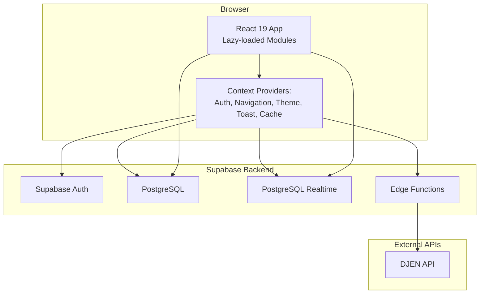
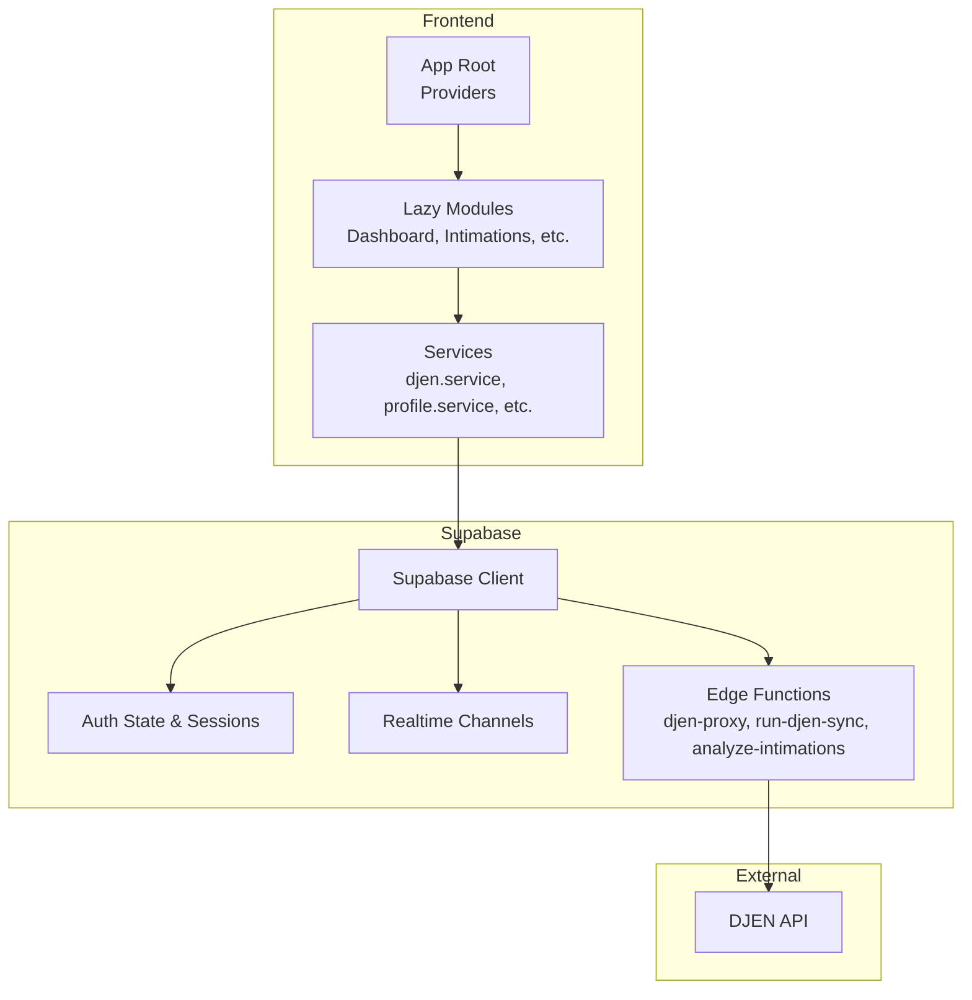
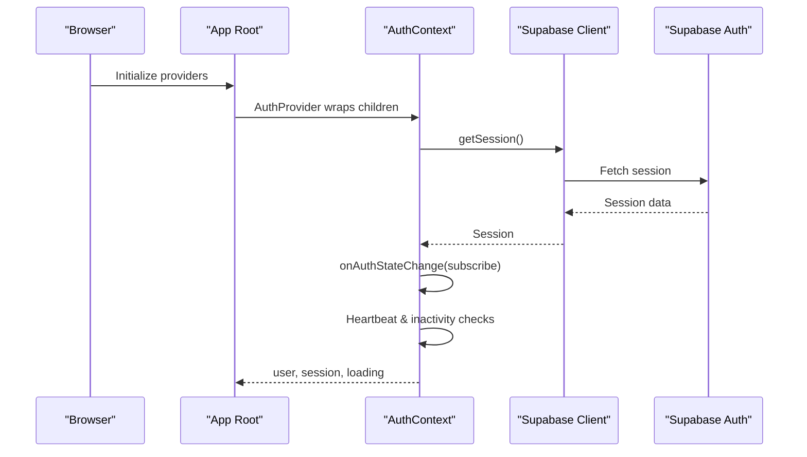
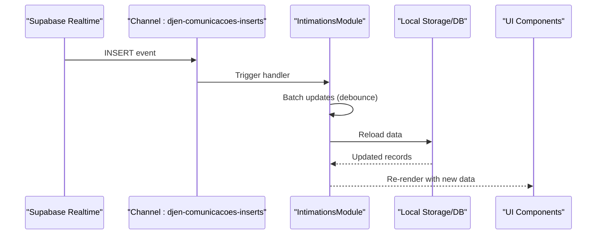
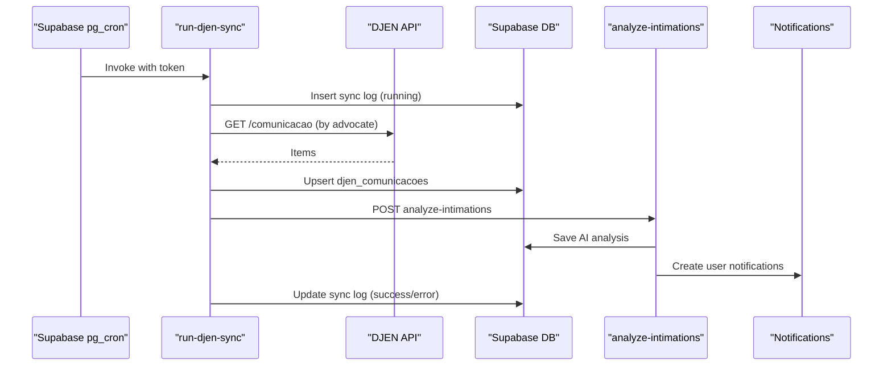
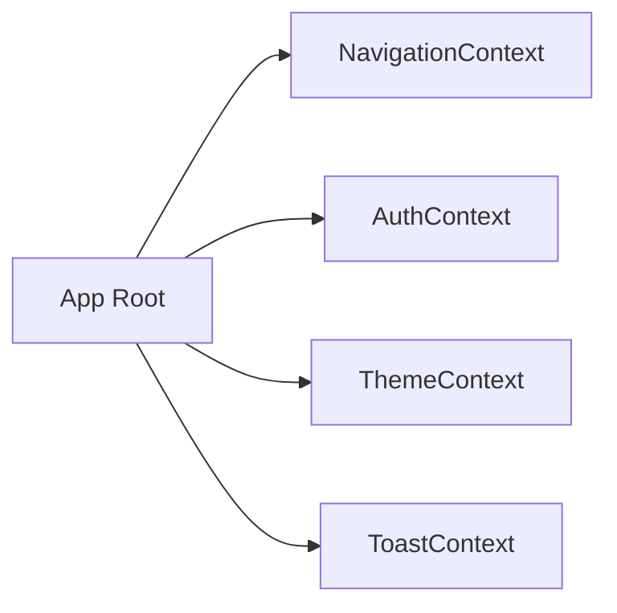
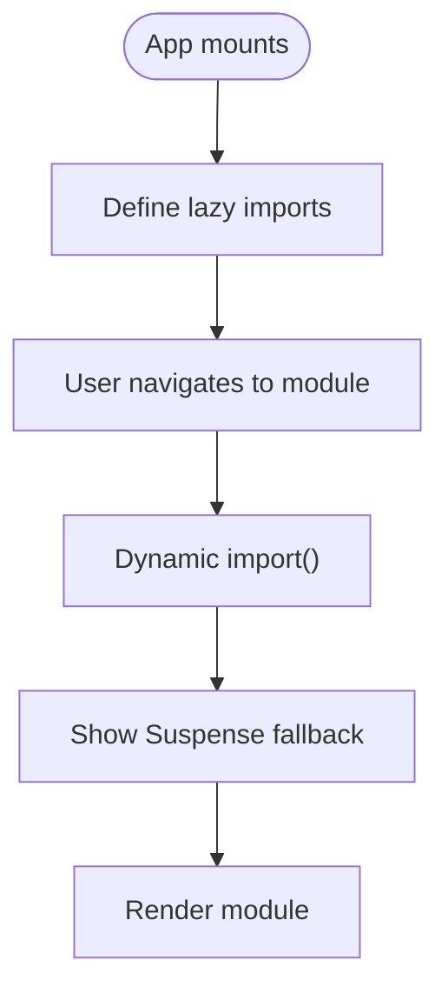
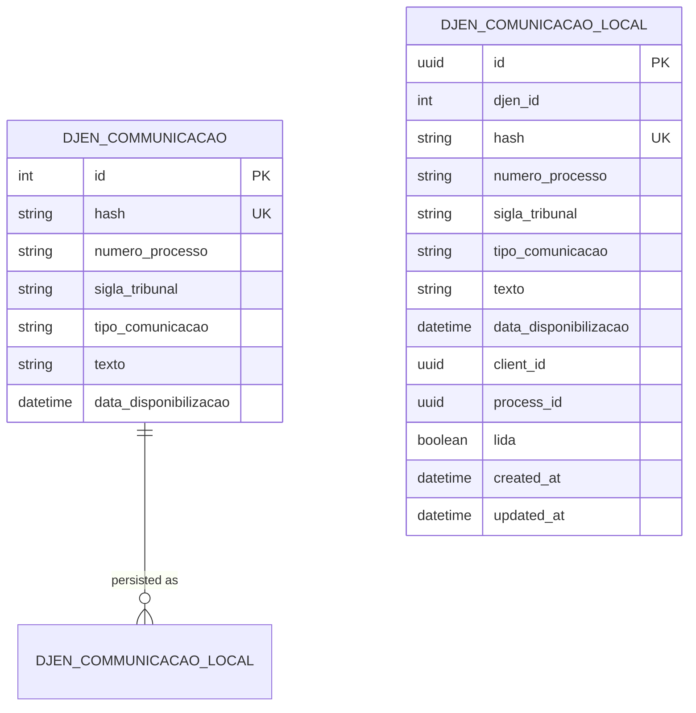
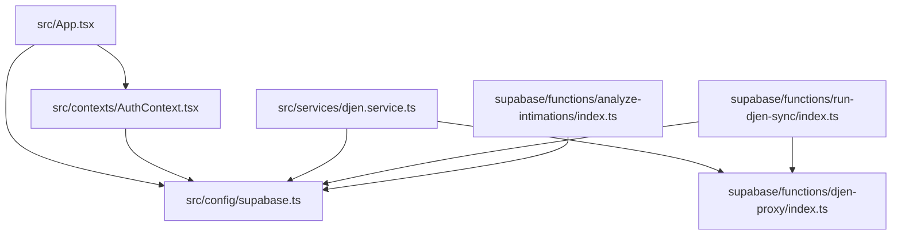

# Architecture Overview

<cite>
**Referenced Files in This Document**
- [README.md](file://README.md)
- [package.json](file://package.json)
- [src/main.tsx](file://src/main.tsx)
- [src/App.tsx](file://src/App.tsx)
- [src/config/supabase.ts](file://src/config/supabase.ts)
- [src/contexts/AuthContext.tsx](file://src/contexts/AuthContext.tsx)
- [src/contexts/NavigationContext.tsx](file://src/contexts/NavigationContext.tsx)
- [src/contexts/ThemeContext.tsx](file://src/contexts/ThemeContext.tsx)
- [src/contexts/ToastContext.tsx](file://src/contexts/ToastContext.tsx)
- [src/services/djen.service.ts](file://src/services/djen.service.ts)
- [src/hooks/useDjenSync.ts](file://src/hooks/useDjenSync.ts)
- [src/components/IntimationsModule.tsx](file://src/components/IntimationsModule.tsx)
- [src/types/djen.types.ts](file://src/types/djen.types.ts)
- [supabase/functions/djen-proxy/index.ts](file://supabase/functions/djen-proxy/index.ts)
- [supabase/functions/run-djen-sync/index.ts](file://supabase/functions/run-djen-sync/index.ts)
- [supabase/functions/analyze-intimations/index.ts](file://supabase/functions/analyze-intimations/index.ts)
</cite>

## Table of Contents
1. [Introduction](#introduction)
2. [Project Structure](#project-structure)
3. [Core Components](#core-components)
4. [Architecture Overview](#architecture-overview)
5. [Detailed Component Analysis](#detailed-component-analysis)
6. [Dependency Analysis](#dependency-analysis)
7. [Performance Considerations](#performance-considerations)
8. [Troubleshooting Guide](#troubleshooting-guide)
9. [Conclusion](#conclusion)

## Introduction
This document presents the architecture of CRM Jurídico, a React 19-based CRM tailored for law offices. It covers high-level design patterns, system boundaries, and component interactions across the frontend, Supabase backend, and external APIs such as DJEN. It also documents the real-time data flow, authentication architecture, state management patterns, modular component structure, lazy loading implementation, performance considerations, technology stack decisions, scalability factors, and deployment architecture.

## Project Structure
The project follows a feature-driven frontend structure with clear separation of concerns:
- Frontend: React 19 with Vite, TypeScript, TailwindCSS, and Lucide React icons
- Backend: Supabase (PostgreSQL, Auth, Edge Functions, Realtime)
- External integrations: DJEN API with a Supabase Edge Function proxy
- Services and utilities: Modular service layer, typed DTOs, and shared UI components

**Diagram sources**
- [src/main.tsx:32-46](file://src/main.tsx#L32-L46)
- [src/App.tsx:45-76](file://src/App.tsx#L45-L76)
- [src/config/supabase.ts:13-20](file://src/config/supabase.ts#L13-L20)
- [supabase/functions/djen-proxy/index.ts:8-81](file://supabase/functions/djen-proxy/index.ts#L8-L81)

**Section sources**
- [README.md:23-36](file://README.md#L23-L36)
- [package.json:28-77](file://package.json#L28-L77)
- [src/main.tsx:1-90](file://src/main.tsx#L1-L90)
- [src/App.tsx:45-76](file://src/App.tsx#L45-L76)

## Core Components
- Context Providers: Centralized state and cross-cutting concerns
  - Authentication: [src/contexts/AuthContext.tsx](file://src/contexts/AuthContext.tsx)
  - Navigation: [src/contexts/NavigationContext.tsx](file://src/contexts/NavigationContext.tsx)
  - Theme: [src/contexts/ThemeContext.tsx](file://src/contexts/ThemeContext.tsx)
  - Toast notifications: [src/contexts/ToastContext.tsx](file://src/contexts/ToastContext.tsx)
- Supabase client initialization and auth state change listener: [src/config/supabase.ts](file://src/config/supabase.ts)
- DJEN integration and synchronization:
  - Service abstraction: [src/services/djen.service.ts](file://src/services/djen.service.ts)
  - Hook for periodic sync: [src/hooks/useDjenSync.ts](file://src/hooks/useDjenSync.ts)
  - Intimations module orchestrating sync and UI: [src/components/IntimationsModule.tsx](file://src/components/IntimationsModule.tsx)
- Edge Functions:
  - DJEN proxy: [supabase/functions/djen-proxy/index.ts](file://supabase/functions/djen-proxy/index.ts)
  - Scheduled DJEN sync: [supabase/functions/run-djen-sync/index.ts](file://supabase/functions/run-djen-sync/index.ts)
  - AI analysis and notifications: [supabase/functions/analyze-intimations/index.ts](file://supabase/functions/analyze-intimations/index.ts)

**Section sources**
- [src/contexts/AuthContext.tsx:1-285](file://src/contexts/AuthContext.tsx#L1-L285)
- [src/contexts/NavigationContext.tsx:1-94](file://src/contexts/NavigationContext.tsx#L1-L94)
- [src/contexts/ThemeContext.tsx:1-88](file://src/contexts/ThemeContext.tsx#L1-L88)
- [src/contexts/ToastContext.tsx:1-42](file://src/contexts/ToastContext.tsx#L1-L42)
- [src/config/supabase.ts:1-34](file://src/config/supabase.ts#L1-L34)
- [src/services/djen.service.ts:1-262](file://src/services/djen.service.ts#L1-L262)
- [src/hooks/useDjenSync.ts:1-41](file://src/hooks/useDjenSync.ts#L1-L41)
- [src/components/IntimationsModule.tsx:1-800](file://src/components/IntimationsModule.tsx#L1-L800)
- [supabase/functions/djen-proxy/index.ts:1-82](file://supabase/functions/djen-proxy/index.ts#L1-L82)
- [supabase/functions/run-djen-sync/index.ts:1-639](file://supabase/functions/run-djen-sync/index.ts#L1-L639)
- [supabase/functions/analyze-intimations/index.ts:1-375](file://supabase/functions/analyze-intimations/index.ts#L1-L375)

## Architecture Overview
The system is built around a React 19 single-page application with a layered architecture:
- Presentation Layer: React components and lazy-loaded modules
- Domain Layer: Services encapsulating business logic (e.g., DJEN, AI analysis)
- Infrastructure Layer: Supabase client, Edge Functions, and external API integrations
- Real-time Layer: Supabase Realtime channels for live updates

**Diagram sources**
- [src/App.tsx:45-76](file://src/App.tsx#L45-L76)
- [src/services/djen.service.ts:20-102](file://src/services/djen.service.ts#L20-L102)
- [src/config/supabase.ts:13-20](file://src/config/supabase.ts#L13-L20)
- [supabase/functions/djen-proxy/index.ts:8-81](file://supabase/functions/djen-proxy/index.ts#L8-L81)
- [supabase/functions/run-djen-sync/index.ts:29-348](file://supabase/functions/run-djen-sync/index.ts#L29-L348)
- [supabase/functions/analyze-intimations/index.ts:225-374](file://supabase/functions/analyze-intimations/index.ts#L225-L374)

## Detailed Component Analysis

### Authentication Architecture
The authentication layer leverages Supabase Auth with robust session lifecycle management, automatic token refresh, and inactivity-based logout. It integrates with the global App state via a dedicated provider.

**Diagram sources**
- [src/App.tsx:246-270](file://src/App.tsx#L246-L270)
- [src/contexts/AuthContext.tsx:45-115](file://src/contexts/AuthContext.tsx#L45-L115)
- [src/contexts/AuthContext.tsx:117-189](file://src/contexts/AuthContext.tsx#L117-L189)
- [src/contexts/AuthContext.tsx:191-222](file://src/contexts/AuthContext.tsx#L191-L222)
- [src/config/supabase.ts:22-33](file://src/config/supabase.ts#L22-L33)

**Section sources**
- [src/contexts/AuthContext.tsx:1-285](file://src/contexts/AuthContext.tsx#L1-L285)
- [src/config/supabase.ts:1-34](file://src/config/supabase.ts#L1-L34)
- [src/App.tsx:246-270](file://src/App.tsx#L246-L270)

### Real-time Data Flow and State Management
Supabase Realtime channels are used to receive live updates for DJEN communications. The Intimations module subscribes to insert events and batches updates to avoid frequent re-renders. Context providers manage global state (navigation, theme, toasts), while services encapsulate domain logic.

**Diagram sources**
- [src/components/IntimationsModule.tsx:534-587](file://src/components/IntimationsModule.tsx#L534-L587)

**Section sources**
- [src/components/IntimationsModule.tsx:534-587](file://src/components/IntimationsModule.tsx#L534-L587)

### DJEN Integration and Synchronization
The system synchronizes with DJEN through two pathways:
- Edge Function proxy to bypass CORS during development
- Scheduled sync via a Supabase Edge Function that queries DJEN, persists data, and triggers AI analysis and notifications

**Diagram sources**
- [supabase/functions/run-djen-sync/index.ts:29-348](file://supabase/functions/run-djen-sync/index.ts#L29-L348)
- [supabase/functions/analyze-intimations/index.ts:225-374](file://supabase/functions/analyze-intimations/index.ts#L225-L374)
- [supabase/functions/djen-proxy/index.ts:8-81](file://supabase/functions/djen-proxy/index.ts#L8-L81)

**Section sources**
- [src/services/djen.service.ts:20-102](file://src/services/djen.service.ts#L20-L102)
- [src/hooks/useDjenSync.ts:1-41](file://src/hooks/useDjenSync.ts#L1-L41)
- [supabase/functions/run-djen-sync/index.ts:1-639](file://supabase/functions/run-djen-sync/index.ts#L1-L639)
- [supabase/functions/analyze-intimations/index.ts:1-375](file://supabase/functions/analyze-intimations/index.ts#L1-L375)
- [supabase/functions/djen-proxy/index.ts:1-82](file://supabase/functions/djen-proxy/index.ts#L1-L82)

### Context Providers and Global State
The application initializes multiple context providers at the root to manage:
- Navigation state and module routing
- Theme preferences and persistence
- Toast notifications
- Authentication state and lifecycle
- Cache and UI state helpers

**Diagram sources**
- [src/main.tsx:32-46](file://src/main.tsx#L32-L46)
- [src/contexts/NavigationContext.tsx:47-84](file://src/contexts/NavigationContext.tsx#L47-L84)
- [src/contexts/ThemeContext.tsx:13-78](file://src/contexts/ThemeContext.tsx#L13-L78)
- [src/contexts/ToastContext.tsx:24-32](file://src/contexts/ToastContext.tsx#L24-L32)
- [src/contexts/AuthContext.tsx:21-276](file://src/contexts/AuthContext.tsx#L21-L276)

**Section sources**
- [src/main.tsx:1-90](file://src/main.tsx#L1-L90)
- [src/contexts/NavigationContext.tsx:1-94](file://src/contexts/NavigationContext.tsx#L1-L94)
- [src/contexts/ThemeContext.tsx:1-88](file://src/contexts/ThemeContext.tsx#L1-L88)
- [src/contexts/ToastContext.tsx:1-42](file://src/contexts/ToastContext.tsx#L1-L42)
- [src/contexts/AuthContext.tsx:1-285](file://src/contexts/AuthContext.tsx#L1-L285)

### Modular Component Structure and Lazy Loading
The application uses React.lazy and Suspense to load modules on demand, reducing initial bundle size and improving perceived performance. The App component defines lazy-loaded modules and a fallback skeleton for CloudModule.

**Diagram sources**
- [src/App.tsx:45-76](file://src/App.tsx#L45-L76)
- [src/App.tsx:110-175](file://src/App.tsx#L110-L175)

**Section sources**
- [src/App.tsx:45-76](file://src/App.tsx#L45-L76)
- [src/App.tsx:110-175](file://src/App.tsx#L110-L175)

### Data Types for DJEN Integration
The system defines strong TypeScript types for DJEN communication records, local persistence, and query parameters to ensure type safety across services and components.

**Diagram sources**
- [src/types/djen.types.ts:28-49](file://src/types/djen.types.ts#L28-L49)
- [src/types/djen.types.ts:84-122](file://src/types/djen.types.ts#L84-L122)

**Section sources**
- [src/types/djen.types.ts:1-154](file://src/types/djen.types.ts#L1-L154)

## Dependency Analysis
The frontend depends on Supabase for authentication, database, and Edge Functions. The DJEN integration relies on either direct API calls or a proxy Edge Function. The Edge Functions depend on Supabase credentials and external AI providers.

**Diagram sources**
- [src/App.tsx:87-88](file://src/App.tsx#L87-L88)
- [src/contexts/AuthContext.tsx:2-3](file://src/contexts/AuthContext.tsx#L2-L3)
- [src/config/supabase.ts:4-7](file://src/config/supabase.ts#L4-L7)
- [src/services/djen.service.ts:6](file://src/services/djen.service.ts#L6)
- [supabase/functions/djen-proxy/index.ts:4](file://supabase/functions/djen-proxy/index.ts#L4)
- [supabase/functions/run-djen-sync/index.ts:13-14](file://supabase/functions/run-djen-sync/index.ts#L13-L14)
- [supabase/functions/analyze-intimations/index.ts:1-2](file://supabase/functions/analyze-intimations/index.ts#L1-L2)

**Section sources**
- [src/App.tsx:87-88](file://src/App.tsx#L87-L88)
- [src/contexts/AuthContext.tsx:2-3](file://src/contexts/AuthContext.tsx#L2-L3)
- [src/config/supabase.ts:4-7](file://src/config/supabase.ts#L4-L7)
- [src/services/djen.service.ts:6](file://src/services/djen.service.ts#L6)
- [supabase/functions/djen-proxy/index.ts:4](file://supabase/functions/djen-proxy/index.ts#L4)
- [supabase/functions/run-djen-sync/index.ts:13-14](file://supabase/functions/run-djen-sync/index.ts#L13-L14)
- [supabase/functions/analyze-intimations/index.ts:1-2](file://supabase/functions/analyze-intimations/index.ts#L1-L2)

## Performance Considerations
- Lazy loading: Modules are loaded on demand to reduce initial payload and improve startup time.
- Prefetching: The App prefetches likely future modules using idle callbacks to accelerate navigation.
- Real-time batching: IntimationsModule batches incoming inserts to minimize re-renders.
- Local caching: Profile and theme preferences are cached locally to reduce network requests.
- Rate limiting: DJEN queries include delays to respect rate limits and avoid 429 errors.
- Edge Functions: Offloads heavy work (sync, AI analysis, notifications) from the client to serverless functions.

[No sources needed since this section provides general guidance]

## Troubleshooting Guide
Common issues and resolutions:
- Authentication state changes: The AuthContext listens for Supabase auth events and clears state on logout. Verify auto-refresh and session persistence settings.
- DJEN proxy errors: If CORS issues occur, ensure the Edge Function proxy is invoked; otherwise, switch to direct API calls with proper headers.
- Sync failures: The scheduled sync writes logs to djen_sync_history. Inspect the latest entries for error messages and token verification status.
- AI analysis failures: Confirm GROQ/OpenAI API keys are configured in Supabase secrets; the analyze-intimations function attempts both providers.
- Real-time updates: Ensure Realtime is enabled and the channel subscription is active; verify PostgreSQL policies allow INSERT events.

**Section sources**
- [src/contexts/AuthContext.tsx:75-115](file://src/contexts/AuthContext.tsx#L75-L115)
- [src/services/djen.service.ts:85-101](file://src/services/djen.service.ts#L85-L101)
- [supabase/functions/run-djen-sync/index.ts:350-359](file://supabase/functions/run-djen-sync/index.ts#L350-L359)
- [supabase/functions/analyze-intimations/index.ts:229-238](file://supabase/functions/analyze-intimations/index.ts#L229-L238)
- [src/components/IntimationsModule.tsx:534-587](file://src/components/IntimationsModule.tsx#L534-L587)

## Conclusion
CRM Jurídico employs a clean, layered architecture leveraging React 19, Supabase, and Edge Functions to deliver a responsive, real-time CRM for law offices. The design emphasizes modularity, lazy loading, and robust authentication and real-time capabilities. The DJEN integration is handled through a flexible proxy and scheduled sync with AI-powered analysis and notifications, ensuring timely and actionable insights for legal teams.