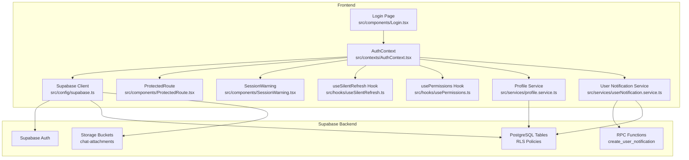
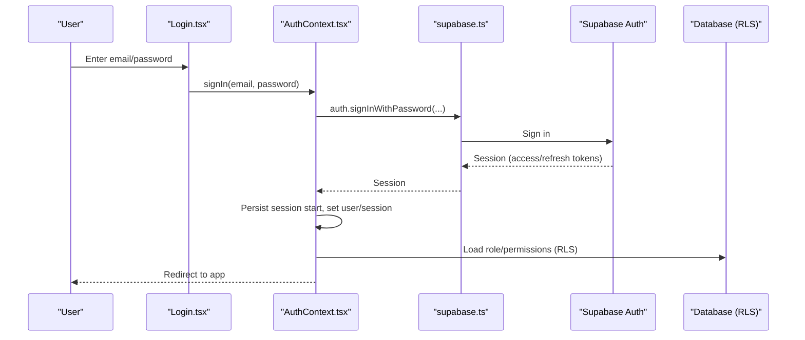
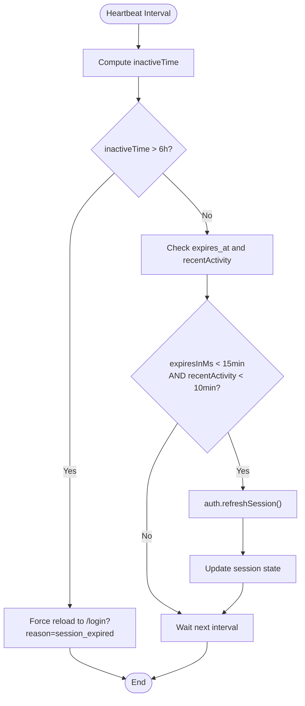
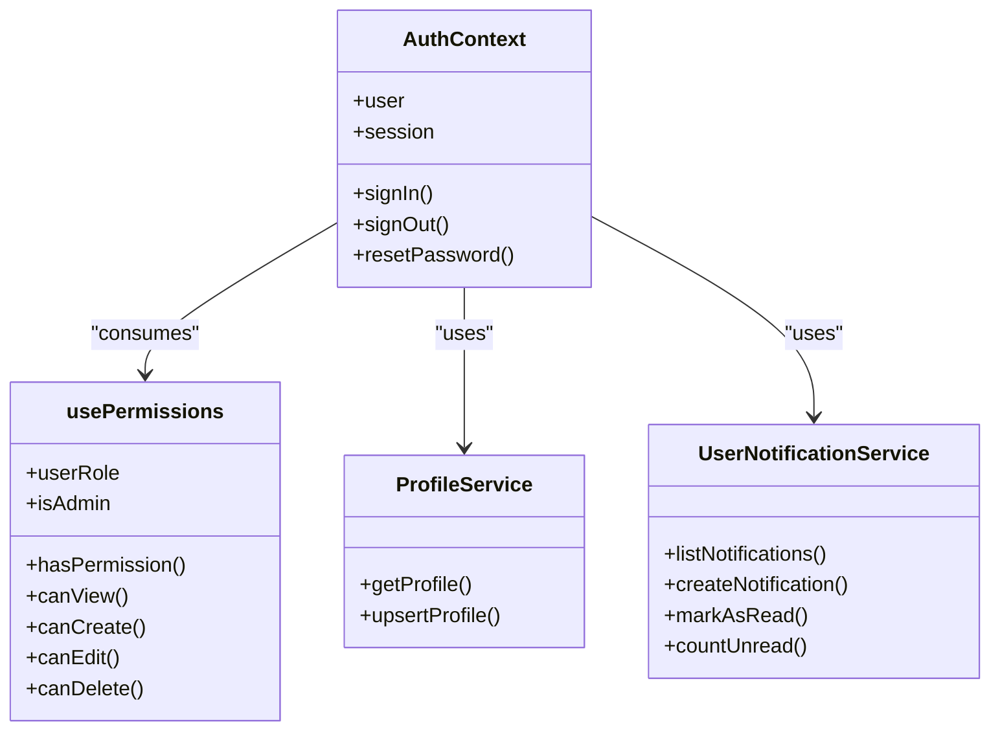
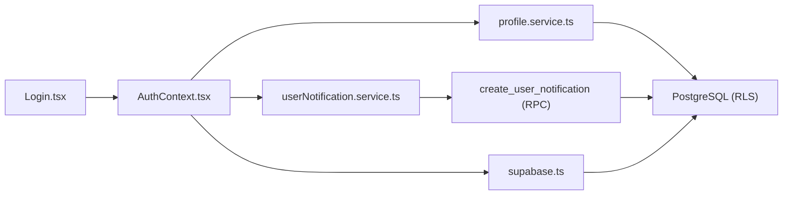

# Authentication & Security

<cite>
**Referenced Files in This Document**
- [supabase.ts](file://src/config/supabase.ts)
- [AuthContext.tsx](file://src/contexts/AuthContext.tsx)
- [Login.tsx](file://src/components/Login.tsx)
- [ProtectedRoute.tsx](file://src/components/ProtectedRoute.tsx)
- [SessionWarning.tsx](file://src/components/SessionWarning.tsx)
- [useSilentRefresh.ts](file://src/hooks/useSilentRefresh.ts)
- [usePermissions.ts](file://src/hooks/usePermissions.ts)
- [profile.service.ts](file://src/services/profile.service.ts)
- [userNotification.service.ts](file://src/services/userNotification.service.ts)
- [fix-all-rls-policies.sql](file://fix-all-rls-policies.sql)
- [fix-supabase-issues.sql](file://fix-supabase-issues.sql)
- [20250110_fix_user_notifications_rls.sql](file://supabase/migrations/20250110_fix_user_notifications_rls.sql)
- [20250110_rpc_create_user_notification.sql](file://supabase/migrations/20250110_rpc_create_user_notification.sql)
</cite>

## Table of Contents
1. [Introduction](#introduction)
2. [Project Structure](#project-structure)
3. [Core Components](#core-components)
4. [Architecture Overview](#architecture-overview)
5. [Detailed Component Analysis](#detailed-component-analysis)
6. [Dependency Analysis](#dependency-analysis)
7. [Performance Considerations](#performance-considerations)
8. [Security Best Practices](#security-best-practices)
9. [GDPR and Privacy Compliance](#gdpr-and-privacy-compliance)
10. [Troubleshooting Guide](#troubleshooting-guide)
11. [Conclusion](#conclusion)

## Introduction
This document explains the authentication and security model for CRM Jurídico, focusing on Supabase Auth integration, JWT lifecycle, session handling, role-based access control (RBAC), row-level security (RLS), and user permission management. It also covers the authentication flow from login to persistent sessions, refresh token handling, automatic logout, and practical guidance for configuration, troubleshooting, and compliance with data privacy regulations relevant to legal practice management.

## Project Structure
Authentication and security logic is implemented across configuration, context providers, UI components, hooks, services, and database policies. The frontend integrates with Supabase Auth to manage sessions, while database-level RLS and stored procedures enforce access control.

**Diagram sources**
- [supabase.ts:1-34](file://src/config/supabase.ts#L1-L34)
- [AuthContext.tsx:1-285](file://src/contexts/AuthContext.tsx#L1-L285)
- [Login.tsx:1-1059](file://src/components/Login.tsx#L1-L1059)
- [ProtectedRoute.tsx:1-35](file://src/components/ProtectedRoute.tsx#L1-L35)
- [SessionWarning.tsx:1-53](file://src/components/SessionWarning.tsx#L1-L53)
- [useSilentRefresh.ts:1-71](file://src/hooks/useSilentRefresh.ts#L1-L71)
- [usePermissions.ts:1-159](file://src/hooks/usePermissions.ts#L1-L159)
- [profile.service.ts:1-200](file://src/services/profile.service.ts#L1-L200)
- [userNotification.service.ts:1-252](file://src/services/userNotification.service.ts#L1-L252)

**Section sources**
- [supabase.ts:1-34](file://src/config/supabase.ts#L1-L34)
- [AuthContext.tsx:1-285](file://src/contexts/AuthContext.tsx#L1-L285)

## Core Components
- Supabase client configuration with auto-refresh, persisted sessions, and local storage storage.
- Auth provider managing session state, activity detection, heartbeat refresh, and automatic logout.
- Login page supporting email/CPF/CNPJ identification and localized messaging.
- Protected route guard enforcing authentication.
- Session warning UI prompting users to extend or log out before timeout.
- Silent refresh hook coordinating periodic token refresh.
- RBAC and permissions hook reading user roles and module permissions.
- Services interacting with Supabase tables and RPCs for profile and notifications.

**Section sources**
- [supabase.ts:13-20](file://src/config/supabase.ts#L13-L20)
- [AuthContext.tsx:45-115](file://src/contexts/AuthContext.tsx#L45-L115)
- [Login.tsx:481-621](file://src/components/Login.tsx#L481-L621)
- [ProtectedRoute.tsx:13-34](file://src/components/ProtectedRoute.tsx#L13-L34)
- [SessionWarning.tsx:5-50](file://src/components/SessionWarning.tsx#L5-L50)
- [useSilentRefresh.ts:10-64](file://src/hooks/useSilentRefresh.ts#L10-L64)
- [usePermissions.ts:16-91](file://src/hooks/usePermissions.ts#L16-L91)
- [profile.service.ts:45-131](file://src/services/profile.service.ts#L45-L131)
- [userNotification.service.ts:4-70](file://src/services/userNotification.service.ts#L4-L70)

## Architecture Overview
The system uses Supabase Auth for identity and session management, with the frontend maintaining a local session state and automatically refreshing tokens. Database access is governed by RLS policies and a dedicated RPC for creating notifications while preserving user isolation.

**Diagram sources**
- [Login.tsx:623-658](file://src/components/Login.tsx#L623-L658)
- [AuthContext.tsx:224-235](file://src/contexts/AuthContext.tsx#L224-L235)
- [supabase.ts:22-33](file://src/config/supabase.ts#L22-L33)

## Detailed Component Analysis

### Supabase Client Configuration
- Initializes Supabase client with environment variables for URL and anonymous key.
- Enables auto-refresh of tokens, persistence of sessions, detection of sessions in URL, and uses localStorage for storage.
- Registers an auth state change listener to observe SIGNED_OUT and TOKEN_REFRESHED events.

**Section sources**
- [supabase.ts:6-20](file://src/config/supabase.ts#L6-L20)
- [supabase.ts:22-33](file://src/config/supabase.ts#L22-L33)

### Auth Provider and Session Lifecycle
- Loads initial session and sets user/session state.
- Subscribes to auth state changes with debouncing to avoid duplicate events.
- Implements heartbeat mechanism:
  - Checks inactivity threshold (6 hours) and forces reload to logout.
  - Refreshes session automatically when token expires within 15 minutes and user has recent activity.
- Tracks session start time in localStorage for analytics and policy enforcement.
- Provides sign-in, sign-out, and password reset functions.

**Diagram sources**
- [AuthContext.tsx:117-189](file://src/contexts/AuthContext.tsx#L117-L189)

**Section sources**
- [AuthContext.tsx:45-115](file://src/contexts/AuthContext.tsx#L45-L115)
- [AuthContext.tsx:117-189](file://src/contexts/AuthContext.tsx#L117-L189)

### Login Page and Identifier Resolution
- Supports login via email, CPF, or CNPJ with dynamic profile lookup.
- Formats CPF input and persists last successful CPF in sessionStorage.
- Resolves user identity from profiles or client records and pre-fills email when available.
- Translates common Supabase auth errors into user-friendly messages.

**Section sources**
- [Login.tsx:481-621](file://src/components/Login.tsx#L481-L621)
- [Login.tsx:429-453](file://src/components/Login.tsx#L429-L453)

### Protected Routes and Automatic Logout
- ProtectedRoute redirects unauthenticated users to the login page and preserves intended destination.
- Automatic logout triggers after extended inactivity, ensuring clean state and preventing data leakage.

**Section sources**
- [ProtectedRoute.tsx:13-34](file://src/components/ProtectedRoute.tsx#L13-L34)
- [AuthContext.tsx:126-130](file://src/contexts/AuthContext.tsx#L126-L130)

### Session Warning and Extension
- Displays a warning 5 minutes before logout due to inactivity.
- Allows extending the session or logging out immediately.

**Section sources**
- [SessionWarning.tsx:5-50](file://src/components/SessionWarning.tsx#L5-L50)
- [AuthContext.tsx:134-139](file://src/contexts/AuthContext.tsx#L134-L139)
- [AuthContext.tsx:255-259](file://src/contexts/AuthContext.tsx#L255-L259)

### Silent Refresh Mechanism
- Schedules silent refreshes on focus and visibility changes.
- Periodically refreshes tokens at a configurable interval when the tab is visible.

**Section sources**
- [useSilentRefresh.ts:10-64](file://src/hooks/useSilentRefresh.ts#L10-L64)

### Role-Based Access Control (RBAC) and Permissions
- Loads user role from the profiles table.
- Fetches module permissions from role_permissions and caches them.
- Provides helpers to check view/create/edit/delete permissions, with admin override.

**Diagram sources**
- [AuthContext.tsx:1-285](file://src/contexts/AuthContext.tsx#L1-L285)
- [usePermissions.ts:16-155](file://src/hooks/usePermissions.ts#L16-L155)
- [profile.service.ts:45-131](file://src/services/profile.service.ts#L45-L131)
- [userNotification.service.ts:26-70](file://src/services/userNotification.service.ts#L26-L70)

**Section sources**
- [usePermissions.ts:16-91](file://src/hooks/usePermissions.ts#L16-L91)
- [usePermissions.ts:93-155](file://src/hooks/usePermissions.ts#L93-L155)

### Row-Level Security (RLS) Policies
- Global RLS policies applied across major tables (tasks, messages, conversations, clients, processes, deadlines, requirements, calendar events, document templates, profiles).
- Storage bucket policies for chat attachments restrict uploads, reads, and deletions by authenticated users and ownership.
- Notifications RLS allows creation for others (mentions) and selective read/update/delete per user.

**Section sources**
- [fix-all-rls-policies.sql:10-27](file://fix-all-rls-policies.sql#L10-L27)
- [fix-all-rls-policies.sql:32-61](file://fix-all-rls-policies.sql#L32-L61)
- [fix-all-rls-policies.sql:222-240](file://fix-all-rls-policies.sql#L222-L240)
- [fix-all-rls-policies.sql:263-291](file://fix-all-rls-policies.sql#L263-L291)
- [fix-supabase-issues.sql:10-41](file://fix-supabase-issues.sql#L10-L41)
- [fix-supabase-issues.sql:54-70](file://fix-supabase-issues.sql#L54-L70)
- [20250110_fix_user_notifications_rls.sql:15-45](file://supabase/migrations/20250110_fix_user_notifications_rls.sql#L15-L45)

### Notification System and RPC
- Uses a security-definer RPC to create user notifications bypassing RLS while enforcing authentication.
- Services wrap RPC calls and provide deduplication and metadata handling.

**Section sources**
- [20250110_rpc_create_user_notification.sql:4-29](file://supabase/migrations/20250110_rpc_create_user_notification.sql#L4-L29)
- [userNotification.service.ts:50-70](file://src/services/userNotification.service.ts#L50-L70)
- [userNotification.service.ts:72-111](file://src/services/userNotification.service.ts#L72-L111)

## Dependency Analysis
- Frontend depends on Supabase client for authentication and data operations.
- AuthContext orchestrates session state and integrates with Supabase Auth events.
- Services encapsulate database interactions and rely on RLS for access control.
- Database policies and RPCs define the authoritative access rules.

**Diagram sources**
- [Login.tsx:623-658](file://src/components/Login.tsx#L623-L658)
- [AuthContext.tsx:224-235](file://src/contexts/AuthContext.tsx#L224-L235)
- [supabase.ts:22-33](file://src/config/supabase.ts#L22-L33)
- [profile.service.ts:45-131](file://src/services/profile.service.ts#L45-L131)
- [userNotification.service.ts:50-70](file://src/services/userNotification.service.ts#L50-L70)
- [20250110_rpc_create_user_notification.sql:4-29](file://supabase/migrations/20250110_rpc_create_user_notification.sql#L4-L29)

**Section sources**
- [AuthContext.tsx:1-285](file://src/contexts/AuthContext.tsx#L1-L285)
- [supabase.ts:1-34](file://src/config/supabase.ts#L1-L34)
- [profile.service.ts:1-200](file://src/services/profile.service.ts#L1-L200)
- [userNotification.service.ts:1-252](file://src/services/userNotification.service.ts#L1-L252)

## Performance Considerations
- Debounced auth state changes reduce redundant updates.
- Heartbeat refresh checks occur every 5 minutes and only refresh when close to expiry and user is active.
- Silent refresh leverages focus and visibility events to minimize unnecessary network calls.
- Local caching of permissions reduces repeated database queries for RBAC checks.

[No sources needed since this section provides general guidance]

## Security Best Practices
- Environment variables for Supabase URL and anonymous key must be configured; otherwise initialization fails fast.
- Always use Supabase Auth for session management and avoid storing sensitive tokens in memory beyond lifecycle.
- RLS policies should be reviewed regularly; ensure they match business rules and least privilege.
- Storage bucket policies restrict access to authenticated users and ownership; verify bucket existence and policies.
- RPCs with security definer must validate authentication and sanitize inputs to prevent abuse.
- Password reset links redirect to the origin; ensure HTTPS and secure cookies in production.
- Avoid exposing internal error messages to users; translate errors to user-friendly messages.

**Section sources**
- [supabase.ts:9-11](file://src/config/supabase.ts#L9-L11)
- [fix-supabase-issues.sql:44-70](file://fix-supabase-issues.sql#L44-L70)
- [20250110_rpc_create_user_notification.sql:19-21](file://supabase/migrations/20250110_rpc_create_user_notification.sql#L19-L21)

## GDPR and Privacy Compliance
- Data minimization: collect only necessary personal data (e.g., CPF for identification) and avoid storing sensitive fields if not required.
- Consent and transparency: display privacy policy and terms; obtain consent for data processing activities.
- Right to erasure: implement deletion procedures for user data upon request; ensure cascading deletes respect RLS.
- Data subject rights: enable users to access, rectify, and port their data via profile and notification services.
- Storage security: restrict storage bucket access to authenticated users and enforce ownership-based deletions.
- Logging and audit: maintain minimal logs; avoid logging sensitive data; anonymize logs where possible.
- Cross-border transfers: ensure adequate safeguards for international data transfers; use EU SCCs if applicable.

[No sources needed since this section provides general guidance]

## Troubleshooting Guide
Common issues and resolutions:
- Environment variables not set: Initialization throws an error; verify VITE_SUPABASE_URL and VITE_SUPABASE_ANON_KEY.
- Rate limits or too many requests: Login translates to a user-friendly message; wait and retry.
- Network errors: Indicates connectivity problems; check network and Supabase status.
- Session expired: Automatic redirect to login with a reason query parameter; heartbeat enforces logout after 6 hours.
- Storage access denied: Verify bucket exists and policies allow authenticated uploads and owner deletions.
- Notification creation failures: Ensure RPC exists and authenticated user context; check metadata and types.

**Section sources**
- [supabase.ts:9-11](file://src/config/supabase.ts#L9-L11)
- [Login.tsx:429-453](file://src/components/Login.tsx#L429-L453)
- [AuthContext.tsx:126-130](file://src/contexts/AuthContext.tsx#L126-L130)
- [fix-supabase-issues.sql:44-70](file://fix-supabase-issues.sql#L44-L70)
- [20250110_rpc_create_user_notification.sql:19-21](file://supabase/migrations/20250110_rpc_create_user_notification.sql#L19-L21)

## Conclusion
CRM Jurídico’s authentication and security model combines Supabase Auth for robust session management, React context for centralized state, and database-level RLS for strict access control. The system provides automatic session renewal, inactivity-based logout, and a clear RBAC framework. By following the best practices and troubleshooting steps outlined here, administrators and developers can maintain a secure, compliant, and reliable platform for legal practice management.