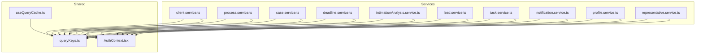
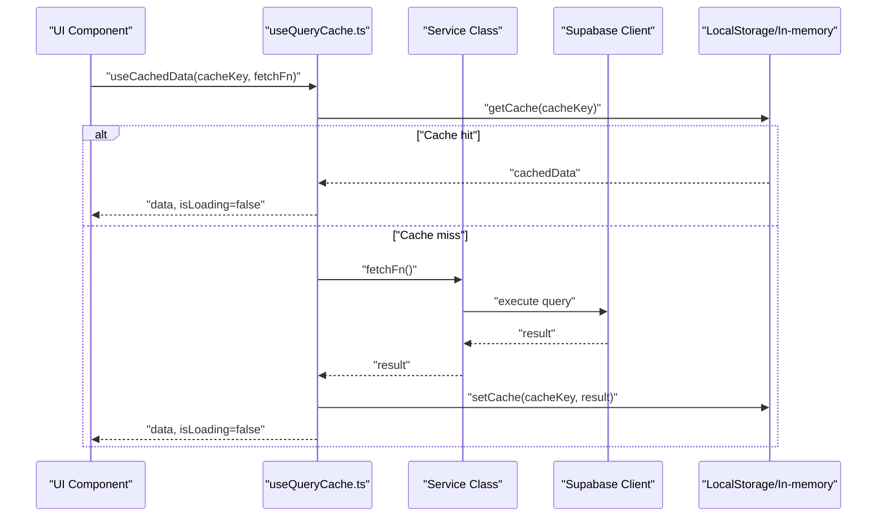
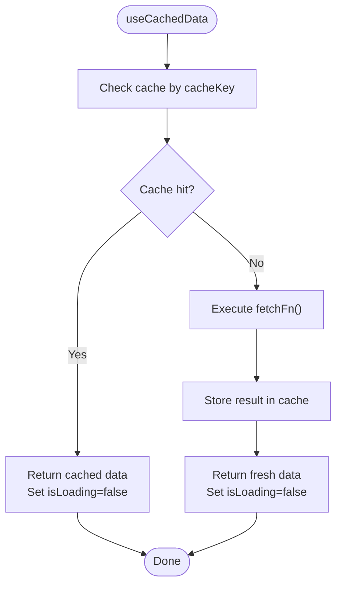
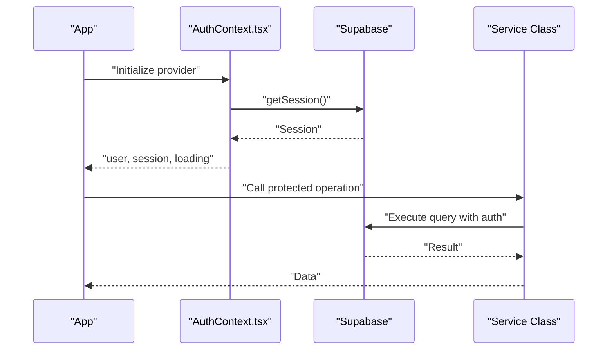
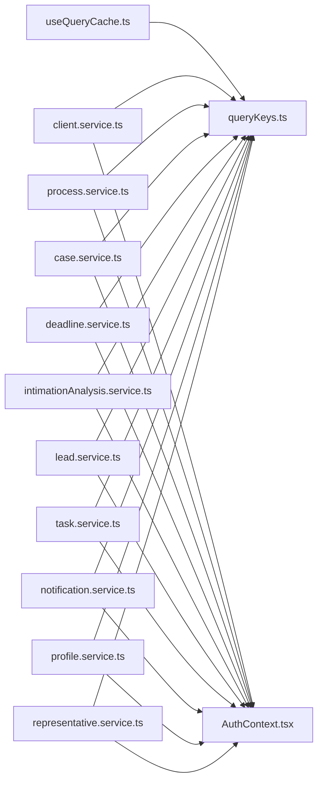

# API Services

<cite>
**Referenced Files in This Document**
- [queryKeys.ts](file://src/constants/queryKeys.ts)
- [useQueryCache.ts](file://src/hooks/useQueryCache.ts)
- [AuthContext.tsx](file://src/contexts/AuthContext.tsx)
- [client.service.ts](file://src/services/client.service.ts)
- [process.service.ts](file://src/services/process.service.ts)
- [case.service.ts](file://src/services/case.service.ts)
- [deadline.service.ts](file://src/services/deadline.service.ts)
- [intimationAnalysis.service.ts](file://src/services/intimationAnalysis.service.ts)
- [lead.service.ts](file://src/services/lead.service.ts)
- [task.service.ts](file://src/services/task.service.ts)
- [notification.service.ts](file://src/services/notification.service.ts)
- [profile.service.ts](file://src/services/profile.service.ts)
- [representative.service.ts](file://src/services/representative.service.ts)
</cite>

## Table of Contents
1. [Introduction](#introduction)
2. [Project Structure](#project-structure)
3. [Core Components](#core-components)
4. [Architecture Overview](#architecture-overview)
5. [Detailed Component Analysis](#detailed-component-analysis)
6. [Dependency Analysis](#dependency-analysis)
7. [Performance Considerations](#performance-considerations)
8. [Troubleshooting Guide](#troubleshooting-guide)
9. [Conclusion](#conclusion)

## Introduction
This document describes the API services layer of the CRM Jurídico frontend. It explains the service architecture pattern, endpoint organization, and data-fetching strategies. It covers query caching, optimistic updates, and stale-while-revalidate patterns. It also documents service composition, error handling, retries, authentication integration, request/response transformations, data normalization, custom hooks for data fetching and mutations, and performance optimizations such as caching, batching, and lazy loading.

## Project Structure
The API services are organized by domain entities and grouped under a dedicated services folder. Each service encapsulates CRUD operations and domain-specific logic for a resource. Shared caching and query keys are centralized for consistent cache behavior across the app. Authentication is integrated via Supabase and exposed through a React context.

**Diagram sources**
- [client.service.ts](file://src/services/client.service.ts)
- [process.service.ts](file://src/services/process.service.ts)
- [case.service.ts](file://src/services/case.service.ts)
- [deadline.service.ts](file://src/services/deadline.service.ts)
- [intimationAnalysis.service.ts](file://src/services/intimationAnalysis.service.ts)
- [lead.service.ts](file://src/services/lead.service.ts)
- [task.service.ts](file://src/services/task.service.ts)
- [notification.service.ts](file://src/services/notification.service.ts)
- [profile.service.ts](file://src/services/profile.service.ts)
- [representative.service.ts](file://src/services/representative.service.ts)
- [queryKeys.ts](file://src/constants/queryKeys.ts)
- [useQueryCache.ts](file://src/hooks/useQueryCache.ts)
- [AuthContext.tsx](file://src/contexts/AuthContext.tsx)

**Section sources**
- [queryKeys.ts:1-42](file://src/constants/queryKeys.ts#L1-L42)
- [useQueryCache.ts:1-88](file://src/hooks/useQueryCache.ts#L1-L88)
- [AuthContext.tsx:1-285](file://src/contexts/AuthContext.tsx#L1-L285)

## Core Components
- Service classes per domain entity encapsulate database operations and business logic. They use Supabase for data access and emit system events on changes.
- Centralized query keys define cache keys for React Query and other caches.
- Custom hooks provide cached data fetching and mutation with cache invalidation.
- Authentication is managed via Supabase and exposed through a React context with session heartbeat and auto-logout safeguards.

Key responsibilities:
- Data fetching, filtering, sorting, and normalization
- Mutations with optimistic updates and cache invalidation
- Local storage-backed notifications
- Profile and presence management
- Representative and appointment management

**Section sources**
- [client.service.ts:37-604](file://src/services/client.service.ts#L37-L604)
- [process.service.ts:20-192](file://src/services/process.service.ts#L20-L192)
- [case.service.ts:14-173](file://src/services/case.service.ts#L14-L173)
- [deadline.service.ts:11-207](file://src/services/deadline.service.ts#L11-L207)
- [intimationAnalysis.service.ts:23-191](file://src/services/intimationAnalysis.service.ts#L23-L191)
- [lead.service.ts:4-70](file://src/services/lead.service.ts#L4-L70)
- [task.service.ts:5-165](file://src/services/task.service.ts#L5-L165)
- [notification.service.ts:76-115](file://src/services/notification.service.ts#L76-L115)
- [profile.service.ts:45-200](file://src/services/profile.service.ts#L45-L200)
- [representative.service.ts:15-315](file://src/services/representative.service.ts#L15-L315)
- [queryKeys.ts:1-42](file://src/constants/queryKeys.ts#L1-L42)
- [useQueryCache.ts:1-88](file://src/hooks/useQueryCache.ts#L1-L88)
- [AuthContext.tsx:17-285](file://src/contexts/AuthContext.tsx#L17-L285)

## Architecture Overview
The services layer follows a domain-driven service pattern with:
- Supabase ORM for database queries
- Centralized cache keys for consistent cache behavior
- Optional local cache within services for short-lived lists
- Custom React hooks for cached data and mutations
- Authentication integration via Supabase context

**Diagram sources**
- [useQueryCache.ts:17-47](file://src/hooks/useQueryCache.ts#L17-L47)
- [client.service.ts:43-95](file://src/services/client.service.ts#L43-L95)
- [process.service.ts:42-93](file://src/services/process.service.ts#L42-L93)

## Detailed Component Analysis

### Service Classes and Patterns
- Domain services encapsulate CRUD and domain logic. They:
  - Build queries with Supabase
  - Apply server-side filters and ordering
  - Perform client-side normalization and deduplication where needed
  - Invalidate caches on create/update/delete
  - Emit system events on significant changes

```mermaid
classDiagram
class ClientService {
+listClients(filters) Promise<Client[]>
+getClientById(id) Promise<Client|null>
+getClientByCpfCnpj(cpfCnpj) Promise<Client|null>
+getClientByEmail(email) Promise<Client|null>
+mergeClients(targetId, sourceIds) Promise<Client>
+createClient(clientData) Promise<Client>
+updateClient(id, updates) Promise<Client>
+deleteClient(id) Promise<void>
+countClients(filters) Promise<number>
+setClientPhoto(id, photoPath) Promise<void>
+excludeClientPhoto(id, photoPath) Promise<string[]>
+searchClients(query, limit) Promise<ClientPreview[]>
}
class ProcessService {
-cache ProcessCache
+listProcesses(filters) Promise<Process[]>
+getProcessById(id) Promise<Process|null>
+createProcess(payload) Promise<Process>
+updateProcess(id, payload) Promise<Process>
+updateStatus(id, status) Promise<Process>
+deleteProcess(id) Promise<void>
-isCacheValid(filters) boolean
-invalidateCache() void
}
class CaseService {
+listCases() Promise<Case[]>
+getCaseById(id) Promise<Case|null>
+createCase(payload) Promise<Case>
+updateCase(id, payload) Promise<Case>
+deleteCase(id) Promise<void>
+listDeadlines(caseId?) Promise<CaseDeadline[]>
+createDeadline(payload) Promise<CaseDeadline>
+updateDeadline(id, payload) Promise<CaseDeadline>
+deleteDeadline(id) Promise<void>
+listAdminRequests(caseId?) Promise<AdministrativeRequest[]>
+createAdminRequest(payload) Promise<AdministrativeRequest>
+updateAdminRequest(id, payload) Promise<AdministrativeRequest>
+deleteAdminRequest(id) Promise<void>
}
class DeadlineService {
+listDeadlines(filters) Promise<Deadline[]>
+getDeadlineById(id) Promise<Deadline|null>
+createDeadline(payload) Promise<Deadline>
+updateDeadline(id, payload) Promise<Deadline>
+updateStatus(id, status) Promise<Deadline>
+deleteDeadline(id) Promise<void>
+getUpcomingDeadlines(daysAhead) Promise<Deadline[]>
+getOverdueDeadlines() Promise<Deadline[]>
}
class IntimationAnalysisService {
+saveAnalysis(intimationId, analysis, userId?) Promise<DBAnalysis>
+getAnalysis(intimationId) Promise<DBAnalysis|null>
+getAnalysesByIntimationIds(ids) Promise<Map>
+listAnalyses(filters?) Promise<DBAnalysis[]>
+deleteAnalysis(intimationId) Promise<void>
+convertToIntimationAnalysis(db) IntimationAnalysis
}
class LeadService {
+listLeads() Promise<Lead[]>
+getLeadById(id) Promise<Lead|null>
+createLead(payload) Promise<Lead>
+updateLead(id, payload) Promise<Lead>
+deleteLead(id) Promise<void>
+convertLeadToClient(leadId, clientId) Promise<Lead>
}
class TaskService {
+listTasks() Promise<Task[]>
+getTask(id) Promise<Task|null>
+createTask(task) Promise<Task>
+updateTask(id, updates) Promise<Task>
+toggleTaskStatus(id) Promise<Task>
+deleteTask(id) Promise<void>
+updateTaskPositions(updates) Promise<void>
}
class NotificationService {
+list() Promise<NotificationItem[]>
+add(notification) Promise<NotificationItem>
+markAsRead(id) Promise<void>
+markAllAsRead() Promise<void>
+clear() Promise<void>
}
class ProfileService {
+getProfile(userId) Promise<Profile|null>
+upsertProfile(userId, payload) Promise<Profile>
+listMembers() Promise<Profile[]>
+searchMembers(query) Promise<Profile[]>
+getMyProfile() Promise<Profile|null>
+updateThemePreference(userId, theme) Promise<void>
+setPresenceStatus(userId, status) Promise<void>
+setOnline(userId) Promise<void>
+setAway(userId) Promise<void>
+setOffline(userId) Promise<void>
}
class RepresentativeService {
+listRepresentatives() Promise<Representative[]>
+getRepresentativeById(id) Promise<Representative|null>
+createRepresentative(dto) Promise<Representative>
+updateRepresentative(id, dto) Promise<Representative>
+deleteRepresentative(id) Promise<void>
+listAppointments(filters?) Promise<RepresentativeAppointment[]>
+getAppointmentById(id) Promise<RepresentativeAppointment|null>
+getAppointmentsByEventId(id) Promise<RepresentativeAppointment[]>
+createAppointment(dto) Promise<RepresentativeAppointment>
+updateAppointment(id, dto) Promise<RepresentativeAppointment>
+deleteAppointment(id) Promise<void>
+markAsPaid(id, paymentData) Promise<RepresentativeAppointment>
+updateServiceStatus(id, status) Promise<RepresentativeAppointment>
+archiveAppointment(id) Promise<RepresentativeAppointment>
+reactivateAppointment(id) Promise<RepresentativeAppointment>
+getStats(filters?) Promise<Stats>
}
```

**Diagram sources**
- [client.service.ts:37-604](file://src/services/client.service.ts#L37-L604)
- [process.service.ts:20-192](file://src/services/process.service.ts#L20-L192)
- [case.service.ts:14-173](file://src/services/case.service.ts#L14-L173)
- [deadline.service.ts:11-207](file://src/services/deadline.service.ts#L11-L207)
- [intimationAnalysis.service.ts:23-191](file://src/services/intimationAnalysis.service.ts#L23-L191)
- [lead.service.ts:4-70](file://src/services/lead.service.ts#L4-L70)
- [task.service.ts:5-165](file://src/services/task.service.ts#L5-L165)
- [notification.service.ts:76-115](file://src/services/notification.service.ts#L76-L115)
- [profile.service.ts:45-200](file://src/services/profile.service.ts#L45-L200)
- [representative.service.ts:15-315](file://src/services/representative.service.ts#L15-L315)

**Section sources**
- [client.service.ts:37-604](file://src/services/client.service.ts#L37-L604)
- [process.service.ts:20-192](file://src/services/process.service.ts#L20-L192)
- [case.service.ts:14-173](file://src/services/case.service.ts#L14-L173)
- [deadline.service.ts:11-207](file://src/services/deadline.service.ts#L11-L207)
- [intimationAnalysis.service.ts:23-191](file://src/services/intimationAnalysis.service.ts#L23-L191)
- [lead.service.ts:4-70](file://src/services/lead.service.ts#L4-L70)
- [task.service.ts:5-165](file://src/services/task.service.ts#L5-L165)
- [notification.service.ts:76-115](file://src/services/notification.service.ts#L76-L115)
- [profile.service.ts:45-200](file://src/services/profile.service.ts#L45-L200)
- [representative.service.ts:15-315](file://src/services/representative.service.ts#L15-L315)

### Query Cache Implementation
- Centralized cache keys are defined for consistent cache behavior across the app.
- A custom hook provides cached data fetching with immediate cache reads and optional refetch.
- Mutations support cache invalidation by key(s) after successful updates.

**Diagram sources**
- [useQueryCache.ts:17-47](file://src/hooks/useQueryCache.ts#L17-L47)
- [queryKeys.ts:1-42](file://src/constants/queryKeys.ts#L1-L42)

**Section sources**
- [queryKeys.ts:1-42](file://src/constants/queryKeys.ts#L1-L42)
- [useQueryCache.ts:1-88](file://src/hooks/useQueryCache.ts#L1-L88)

### Optimistic Updates and Stale-While-Revalidate
- Services invalidate caches on create/update/delete to ensure subsequent reads reflect the latest state.
- The custom mutation hook supports invalidating cache keys after successful mutations.
- For real-time updates, services can leverage Supabase Realtime subscriptions (not shown in the referenced files) to keep UI in sync.

Recommended approach:
- Perform optimistic UI updates in the UI layer
- Invalidate cache keys after successful mutation
- Allow background refetch to reconcile with server state

**Section sources**
- [client.service.ts:346-357](file://src/services/client.service.ts#L346-L357)
- [process.service.ts:128-188](file://src/services/process.service.ts#L128-L188)
- [useQueryCache.ts:49-87](file://src/hooks/useQueryCache.ts#L49-L87)

### Service Composition Patterns
- Services compose together for related operations (e.g., tasks depend on profile data).
- Cross-cutting concerns like authentication and presence are accessed via Supabase and profile service helpers.

Example composition:
- Task creation depends on the authenticated user and profile metadata to populate creator/completer fields.

**Section sources**
- [task.service.ts:33-78](file://src/services/task.service.ts#L33-L78)
- [profile.service.ts:123-131](file://src/services/profile.service.ts#L123-L131)

### Error Handling Mechanisms and Retry Strategies
- Services wrap Supabase calls in try/catch blocks and throw descriptive errors.
- Some services include retry logic for schema mismatches (e.g., profile upsert without CPF column).
- UI-level retry can be implemented by refetching data via the custom hook.

Recommendations:
- Surface user-friendly messages while preserving original error details
- Implement exponential backoff for retryable network errors
- Use cache invalidation to force fresh data after recoverable failures

**Section sources**
- [client.service.ts:91-94](file://src/services/client.service.ts#L91-L94)
- [profile.service.ts:78-94](file://src/services/profile.service.ts#L78-L94)

### Authentication Integration
- Authentication is provided by Supabase and exposed via a React context.
- The context manages session lifecycle, heartbeat, auto-logout, and activity detection.
- Services consistently rely on Supabase for user context and protected operations.

**Diagram sources**
- [AuthContext.tsx:45-115](file://src/contexts/AuthContext.tsx#L45-L115)
- [task.service.ts:7-8](file://src/services/task.service.ts#L7-L8)
- [profile.service.ts:123-131](file://src/services/profile.service.ts#L123-L131)

**Section sources**
- [AuthContext.tsx:17-285](file://src/contexts/AuthContext.tsx#L17-L285)
- [task.service.ts:7-8](file://src/services/task.service.ts#L7-L8)
- [profile.service.ts:123-131](file://src/services/profile.service.ts#L123-L131)

### Request/Response Transformation and Data Normalization
- Client service performs accent-insensitive search and deduplication for client searches.
- Deadline service applies client-side filtering for search terms.
- Intimation analysis service converts between DB and application formats, encoding special fields for backward compatibility.
- Profile service normalizes search queries and orders badges consistently.

**Section sources**
- [client.service.ts:537-599](file://src/services/client.service.ts#L537-L599)
- [deadline.service.ts:64-66](file://src/services/deadline.service.ts#L64-L66)
- [intimationAnalysis.service.ts:162-187](file://src/services/intimationAnalysis.service.ts#L162-L187)
- [profile.service.ts:107-121](file://src/services/profile.service.ts#L107-L121)

### Custom Hooks for Data Fetching and Mutation
- useCachedData: Returns cached data immediately if present, otherwise fetches and stores in cache. Supports refetch.
- useCachedMutation: Executes mutations with optional cache invalidation and success callbacks.

Usage patterns:
- Wrap service methods in fetch functions passed to useCachedData
- Pass invalidate keys to trigger cache invalidation after mutations

**Section sources**
- [useQueryCache.ts:1-88](file://src/hooks/useQueryCache.ts#L1-L88)

### Examples of Service Method Usage
- List clients with filters and search, then sort by status and name
- List processes with multiple filter conditions and client-side search
- Create/update deadlines with defaults and status transitions
- Upsert profile with retry fallback for missing schema columns
- Manage representative appointments with nested relations and statistics

Note: Replace code snippets with the referenced file paths for examples.

**Section sources**
- [client.service.ts:43-95](file://src/services/client.service.ts#L43-L95)
- [process.service.ts:42-93](file://src/services/process.service.ts#L42-L93)
- [deadline.service.ts:87-152](file://src/services/deadline.service.ts#L87-L152)
- [profile.service.ts:59-94](file://src/services/profile.service.ts#L59-L94)
- [representative.service.ts:168-222](file://src/services/representative.service.ts#L168-L222)

## Dependency Analysis
- Services depend on Supabase for data access and on shared query keys for cache consistency.
- The custom hooks depend on the cache context and expose a simple API for consumers.
- Authentication is injected via the AuthContext and used by services requiring user context.

**Diagram sources**
- [useQueryCache.ts:1-88](file://src/hooks/useQueryCache.ts#L1-L88)
- [queryKeys.ts:1-42](file://src/constants/queryKeys.ts#L1-L42)
- [AuthContext.tsx:17-285](file://src/contexts/AuthContext.tsx#L17-L285)
- [client.service.ts:37-604](file://src/services/client.service.ts#L37-L604)
- [process.service.ts:20-192](file://src/services/process.service.ts#L20-L192)
- [case.service.ts:14-173](file://src/services/case.service.ts#L14-L173)
- [deadline.service.ts:11-207](file://src/services/deadline.service.ts#L11-L207)
- [intimationAnalysis.service.ts:23-191](file://src/services/intimationAnalysis.service.ts#L23-L191)
- [lead.service.ts:4-70](file://src/services/lead.service.ts#L4-L70)
- [task.service.ts:5-165](file://src/services/task.service.ts#L5-L165)
- [notification.service.ts:76-115](file://src/services/notification.service.ts#L76-L115)
- [profile.service.ts:45-200](file://src/services/profile.service.ts#L45-L200)
- [representative.service.ts:15-315](file://src/services/representative.service.ts#L15-L315)

**Section sources**
- [useQueryCache.ts:1-88](file://src/hooks/useQueryCache.ts#L1-L88)
- [queryKeys.ts:1-42](file://src/constants/queryKeys.ts#L1-L42)
- [AuthContext.tsx:17-285](file://src/contexts/AuthContext.tsx#L17-L285)

## Performance Considerations
- Caching
  - Use centralized query keys to ensure consistent cache behavior
  - Invalidate caches on mutations to maintain correctness
- Local cache within services
  - Process list uses an in-memory cache with TTL to reduce frequent queries
- Lazy loading
  - Use filters and pagination where supported to avoid loading large datasets
- Batching
  - Batch related updates and invalidate caches in bulk when possible
- Search normalization
  - Normalize search queries to improve match quality and reduce redundant work

[No sources needed since this section provides general guidance]

## Troubleshooting Guide
- Authentication errors
  - Ensure the AuthContext is initialized and sessions are refreshed
  - Verify heartbeat intervals and auto-logout thresholds
- Cache misses
  - Confirm cache keys match between hook and service
  - Trigger refetch via the hook’s refetch function
- Schema mismatches
  - Profile upsert includes a retry fallback for missing columns
- Network failures
  - Implement retry logic at the UI level and invalidate cache on success

**Section sources**
- [AuthContext.tsx:117-189](file://src/contexts/AuthContext.tsx#L117-L189)
- [profile.service.ts:78-94](file://src/services/profile.service.ts#L78-L94)
- [useQueryCache.ts:17-47](file://src/hooks/useQueryCache.ts#L17-L47)

## Conclusion
The CRM Jurídico API services layer employs a robust, domain-driven pattern with Supabase as the backend. Centralized cache keys, custom hooks for cached data and mutations, and service-level caching enable efficient and responsive UIs. Authentication is tightly integrated via Supabase, and services provide consistent request/response transformations and normalization. By following the outlined patterns—cache invalidation, optimistic updates, and retry strategies—the system achieves reliability and performance at scale.