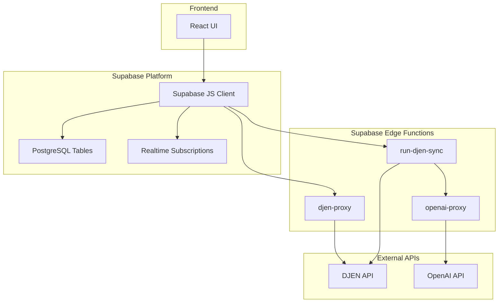
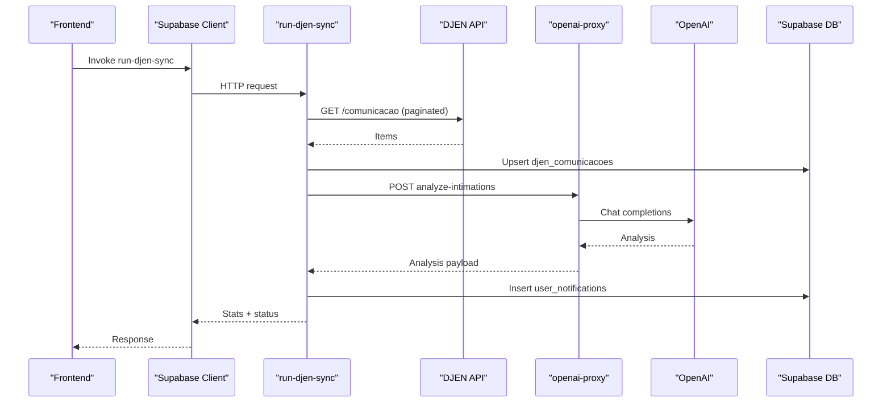
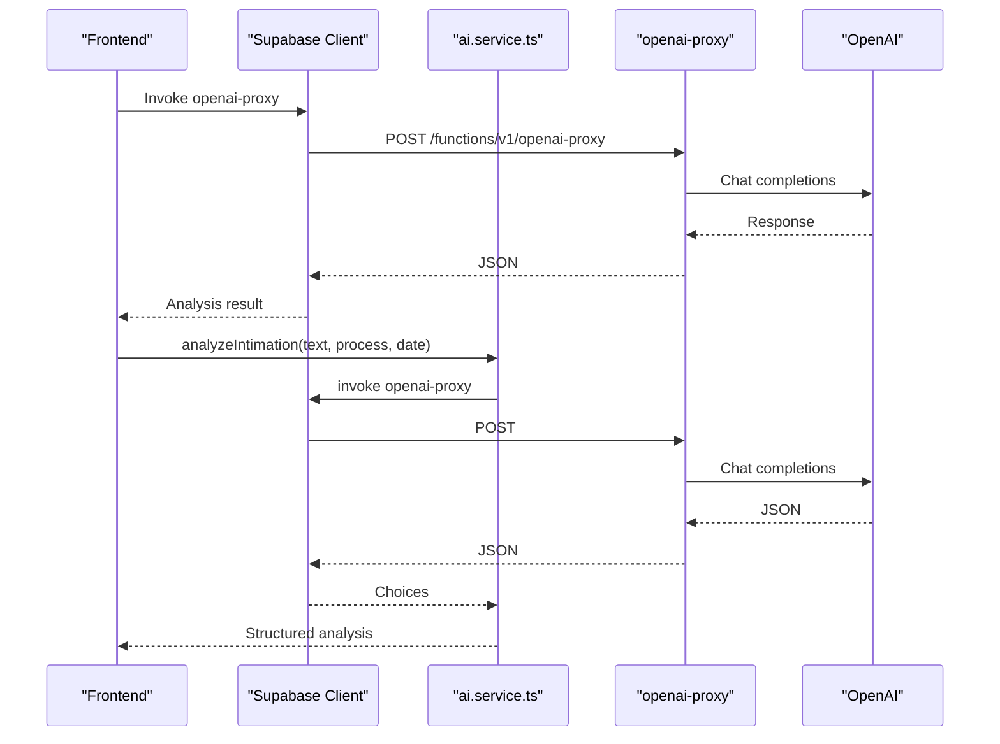
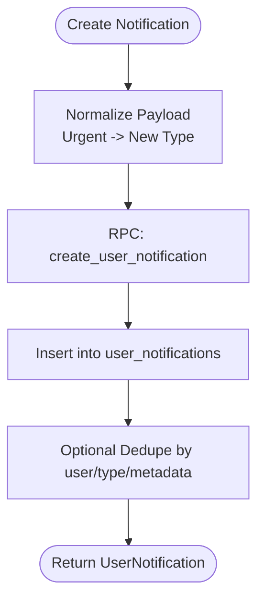
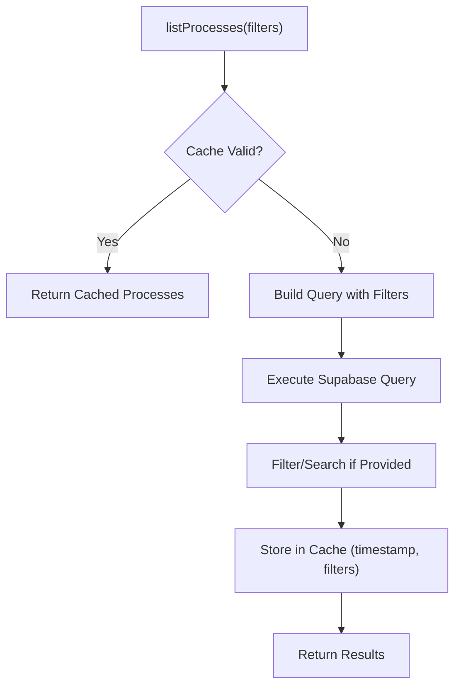
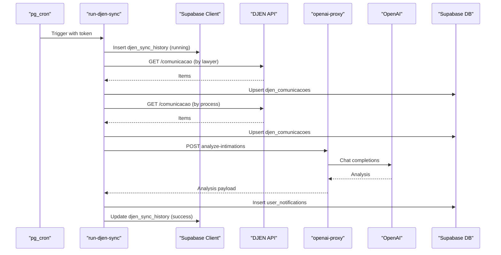
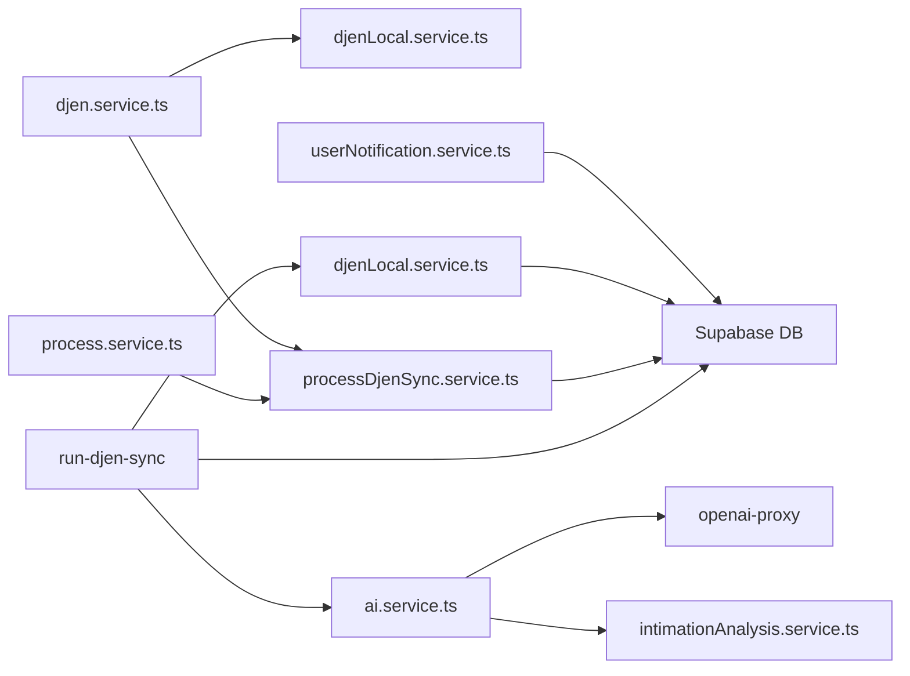

# Backend Services

<cite>
**Referenced Files in This Document**
- [djen.service.ts](file://src/services/djen.service.ts)
- [djenLocal.service.ts](file://src/services/djenLocal.service.ts)
- [djenSyncStatus.service.ts](file://src/services/djenSyncStatus.service.ts)
- [processDjenSync.service.ts](file://src/services/processDjenSync.service.ts)
- [ai.service.ts](file://src/services/ai.service.ts)
- [intimationAnalysis.service.ts](file://src/services/intimationAnalysis.service.ts)
- [process.service.ts](file://src/services/process.service.ts)
- [notification.service.ts](file://src/services/notification.service.ts)
- [userNotification.service.ts](file://src/services/userNotification.service.ts)
- [supabase.ts](file://src/config/supabase.ts)
- [djen.types.ts](file://src/types/djen.types.ts)
- [ai.types.ts](file://src/types/ai.types.ts)
- [run-djen-sync/index.ts](file://supabase/functions/run-djen-sync/index.ts)
- [djen-proxy/index.ts](file://supabase/functions/djen-proxy/index.ts)
- [openai-proxy/index.ts](file://supabase/functions/openai-proxy/index.ts)
</cite>

## Table of Contents
1. [Introduction](#introduction)
2. [Project Structure](#project-structure)
3. [Core Components](#core-components)
4. [Architecture Overview](#architecture-overview)
5. [Detailed Component Analysis](#detailed-component-analysis)
6. [Dependency Analysis](#dependency-analysis)
7. [Performance Considerations](#performance-considerations)
8. [Troubleshooting Guide](#troubleshooting-guide)
9. [Conclusion](#conclusion)
10. [Appendices](#appendices)

## Introduction
This document describes the backend services powering CRM Jurídico, focusing on the service layer architecture, API integration patterns, and business logic. It explains Supabase integration, real-time subscription handling, and edge function orchestration. It also covers service composition patterns, error handling strategies, caching mechanisms, external API integrations (DJEN, OpenAI), webhook handling, background job processing, asynchronous operations, testing strategies, monitoring approaches, and performance optimization techniques. Practical examples demonstrate how to develop and integrate custom services into the existing architecture.

## Project Structure
The backend is organized around a modular service layer and Supabase edge functions:
- Service layer: TypeScript services under src/services handle business logic, caching, and database interactions.
- Edge functions: Supabase Edge Functions under supabase/functions implement serverless orchestration, proxying, and scheduled tasks.
- Configuration: Supabase client initialization and auth lifecycle are centralized in src/config/supabase.ts.
- Types: Strong typing for DJEN, AI, and notification domains live under src/types.



**Diagram sources**
- [supabase.ts:1-34](file://src/config/supabase.ts#L1-L34)
- [run-djen-sync/index.ts:1-639](file://supabase/functions/run-djen-sync/index.ts#L1-L639)
- [djen-proxy/index.ts:1-82](file://supabase/functions/djen-proxy/index.ts#L1-L82)
- [openai-proxy/index.ts:1-65](file://supabase/functions/openai-proxy/index.ts#L1-L65)

**Section sources**
- [supabase.ts:1-34](file://src/config/supabase.ts#L1-L34)
- [run-djen-sync/index.ts:1-639](file://supabase/functions/run-djen-sync/index.ts#L1-L639)

## Core Components
- DJEN integration services:
  - djen.service.ts: Direct and proxied DJEN API consumption with pagination and rate-limit handling.
  - djenLocal.service.ts: Local persistence, auto-linking, normalization, and batch import of DJEN communications.
  - djenSyncStatus.service.ts: Logging and auditing of synchronization runs.
  - processDjenSync.service.ts: Process-centric DJEN sync and metadata enrichment.
- AI services:
  - ai.service.ts: OpenAI/Groq orchestration with edge-function proxy, fallback, and deadline calculation.
  - intimationAnalysis.service.ts: Persistence and retrieval of AI analyses for intimation records.
- Notifications:
  - notification.service.ts: Local storage notifications for UI.
  - userNotification.service.ts: User-scoped notifications persisted via RPC.
- Process management:
  - process.service.ts: CRUD and caching for process entities.
- Supabase configuration:
  - supabase.ts: Client initialization and auth state change handling.

**Section sources**
- [djen.service.ts:1-262](file://src/services/djen.service.ts#L1-L262)
- [djenLocal.service.ts:1-747](file://src/services/djenLocal.service.ts#L1-L747)
- [djenSyncStatus.service.ts:1-99](file://src/services/djenSyncStatus.service.ts#L1-L99)
- [processDjenSync.service.ts:1-233](file://src/services/processDjenSync.service.ts#L1-L233)
- [ai.service.ts:1-813](file://src/services/ai.service.ts#L1-L813)
- [intimationAnalysis.service.ts:1-191](file://src/services/intimationAnalysis.service.ts#L1-L191)
- [notification.service.ts:1-115](file://src/services/notification.service.ts#L1-L115)
- [userNotification.service.ts:1-252](file://src/services/userNotification.service.ts#L1-L252)
- [process.service.ts:1-192](file://src/services/process.service.ts#L1-L192)
- [supabase.ts:1-34](file://src/config/supabase.ts#L1-L34)

## Architecture Overview
The system integrates external APIs (DJEN, OpenAI) through Supabase Edge Functions to avoid CORS and centralize authentication. The service layer encapsulates business logic, caching, and persistence. Realtime subscriptions enable reactive UI updates.



**Diagram sources**
- [run-djen-sync/index.ts:1-639](file://supabase/functions/run-djen-sync/index.ts#L1-L639)
- [openai-proxy/index.ts:1-65](file://supabase/functions/openai-proxy/index.ts#L1-L65)
- [djen.service.ts:1-262](file://src/services/djen.service.ts#L1-L262)

## Detailed Component Analysis

### DJEN Integration Services
- djen.service.ts
  - Provides paginated queries, rate-limit awareness, and optional proxy usage via Supabase Edge Function.
  - Implements bulk fetching across pages and across multiple process numbers with delays.
  - Offers tribunal listing and date helpers.
- djenLocal.service.ts
  - Persists DJEN communications locally with auto-linking to clients/processes using normalization and fuzzy matching.
  - Supports batch import, propagation of links across same-process communications, and cleanup utilities.
- djenSyncStatus.service.ts
  - Records sync runs with status, timestamps, and metrics for observability.
- processDjenSync.service.ts
  - Synchronizes a single process with DJEN, enriching process metadata and marking sync state.

```mermaid
classDiagram
class DjenService {
+consultarComunicacoes(params) Promise~DjenConsultaResponse~
+consultarTodasComunicacoes(params, onProgress?) Promise~DjenConsultaResponse~
+listarTribunais() Promise~DjenTribunal[]~
+formatarDataParaApi(date) string
+getDataHoje() string
+getDataDiasAtras(dias) string
+consultarPorProcessos(nums, params, onProgress?) Promise~DjenConsultaResponse~
}
class DjenLocalService {
+listComunicacoes(filters) Promise~DjenComunicacaoLocal[]~
+getComunicacaoByHash(hash) Promise~DjenComunicacaoLocal|null~
+saveComunicacao(payload) Promise~DjenComunicacaoLocal~
+saveComunicacoes(comms, options) Promise~SaveResult~
+propagarVinculosDoMesmoProcesso() Promise~void~
+updateComunicacao(id, payload) Promise~DjenComunicacaoLocal~
+marcarComoLida(id) Promise~DjenComunicacaoLocal~
+clearAll() Promise~void~
+deleteByIds(ids) Promise~number~
+deleteRead() Promise~number~
+vincularCliente(id, clientId) Promise~DjenComunicacaoLocal~
+vincularProcesso(id, processId) Promise~DjenComunicacaoLocal~
+agruparPorCliente() Promise~Map~
+contarNaoLidas() Promise~number~
+deleteIntimationsByDate(date) Promise~{deleted}~
+cleanOldIntimations(days) Promise~{deleted}~
+getArchivedIntimations(days) Promise~DjenComunicacaoLocal[]~
}
class DjenSyncStatusService {
+listRecent(limit) Promise~DjenSyncLog[]~
+logSync(params) Promise~DjenSyncLog|null~
+updateSync(id, params) Promise~void~
}
class ProcessDjenSyncService {
+syncProcessWithDjen(process) Promise~SyncResult~
+syncPendingProcesses() Promise~BatchSyncStats~
-extractDistributedDate(code) string?
-mapClasseToArea(nomeClasse) string?
}
DjenLocalService --> DjenService : "uses"
ProcessDjenSyncService --> DjenService : "uses"
ProcessDjenSyncService --> ProcessService : "updates"
```

**Diagram sources**
- [djen.service.ts:1-262](file://src/services/djen.service.ts#L1-L262)
- [djenLocal.service.ts:1-747](file://src/services/djenLocal.service.ts#L1-L747)
- [djenSyncStatus.service.ts:1-99](file://src/services/djenSyncStatus.service.ts#L1-L99)
- [processDjenSync.service.ts:1-233](file://src/services/processDjenSync.service.ts#L1-L233)
- [process.service.ts:1-192](file://src/services/process.service.ts#L1-L192)

**Section sources**
- [djen.service.ts:1-262](file://src/services/djen.service.ts#L1-L262)
- [djenLocal.service.ts:1-747](file://src/services/djenLocal.service.ts#L1-L747)
- [djenSyncStatus.service.ts:1-99](file://src/services/djenSyncStatus.service.ts#L1-L99)
- [processDjenSync.service.ts:1-233](file://src/services/processDjenSync.service.ts#L1-L233)

### AI and Analysis Services
- ai.service.ts
  - Initializes providers (OpenAI/Groq), supports edge-function proxy to bypass CORS, and implements fallback logic.
  - Provides text generation, legal text editing, deadline extraction, urgency classification, and summarization.
  - Calculates business days for deadlines and formats qualification text.
- intimationAnalysis.service.ts
  - Persists and retrieves AI analyses for intimation records, encoding special fields for backward compatibility.



**Diagram sources**
- [ai.service.ts:1-813](file://src/services/ai.service.ts#L1-L813)
- [openai-proxy/index.ts:1-65](file://supabase/functions/openai-proxy/index.ts#L1-L65)

**Section sources**
- [ai.service.ts:1-813](file://src/services/ai.service.ts#L1-L813)
- [intimationAnalysis.service.ts:1-191](file://src/services/intimationAnalysis.service.ts#L1-L191)

### Notifications Services
- notification.service.ts
  - Manages UI notifications in localStorage with typed validation and sorting.
- userNotification.service.ts
  - Persists user-specific notifications via a stored procedure (RPC), deduplication by metadata, and read-state management.



**Diagram sources**
- [userNotification.service.ts:1-252](file://src/services/userNotification.service.ts#L1-L252)

**Section sources**
- [notification.service.ts:1-115](file://src/services/notification.service.ts#L1-L115)
- [userNotification.service.ts:1-252](file://src/services/userNotification.service.ts#L1-L252)

### Process Management and Caching
- process.service.ts
  - Implements a lightweight in-memory cache keyed by filter parameters with TTL to reduce DB load.
  - Provides CRUD operations and invalidation on mutations.



**Diagram sources**
- [process.service.ts:1-192](file://src/services/process.service.ts#L1-L192)

**Section sources**
- [process.service.ts:1-192](file://src/services/process.service.ts#L1-L192)

### Supabase Integration and Edge Functions
- supabase.ts
  - Initializes the Supabase client with auth settings and logs auth state changes.
- run-djen-sync/index.ts
  - Scheduled orchestrator that:
    - Validates token (currently disabled for testing),
    - Fetches DJEN communications by lawyer and by process,
    - Saves to DB with auto-linking,
    - Invokes AI analysis and notification creation,
    - Updates sync history.
- djen-proxy/index.ts
  - Proxies DJEN requests to avoid CORS in the browser.
- openai-proxy/index.ts
  - Proxies OpenAI requests through Supabase Edge Functions to avoid exposing API keys in the frontend.



**Diagram sources**
- [run-djen-sync/index.ts:1-639](file://supabase/functions/run-djen-sync/index.ts#L1-L639)
- [djen-proxy/index.ts:1-82](file://supabase/functions/djen-proxy/index.ts#L1-L82)
- [openai-proxy/index.ts:1-65](file://supabase/functions/openai-proxy/index.ts#L1-L65)

**Section sources**
- [supabase.ts:1-34](file://src/config/supabase.ts#L1-L34)
- [run-djen-sync/index.ts:1-639](file://supabase/functions/run-djen-sync/index.ts#L1-L639)
- [djen-proxy/index.ts:1-82](file://supabase/functions/djen-proxy/index.ts#L1-L82)
- [openai-proxy/index.ts:1-65](file://supabase/functions/openai-proxy/index.ts#L1-L65)

## Dependency Analysis
- Service-to-service dependencies:
  - djenLocal.service.ts depends on djen.service.ts for upstream data.
  - processDjenSync.service.ts depends on djen.service.ts and process.service.ts.
  - ai.service.ts invokes openai-proxy via Supabase functions.
  - intimationAnalysis.service.ts persists AI results into intimation_ai_analysis.
  - userNotification.service.ts relies on RPC create_user_notification.
- External dependencies:
  - DJEN API for official communications.
  - OpenAI API for analysis and completions.
- Internal dependencies:
  - Supabase client for DB and auth operations.
  - Edge functions for CORS-free API access and scheduled jobs.



**Diagram sources**
- [djen.service.ts:1-262](file://src/services/djen.service.ts#L1-L262)
- [djenLocal.service.ts:1-747](file://src/services/djenLocal.service.ts#L1-L747)
- [processDjenSync.service.ts:1-233](file://src/services/processDjenSync.service.ts#L1-L233)
- [process.service.ts:1-192](file://src/services/process.service.ts#L1-L192)
- [ai.service.ts:1-813](file://src/services/ai.service.ts#L1-L813)
- [intimationAnalysis.service.ts:1-191](file://src/services/intimationAnalysis.service.ts#L1-L191)
- [userNotification.service.ts:1-252](file://src/services/userNotification.service.ts#L1-L252)
- [run-djen-sync/index.ts:1-639](file://supabase/functions/run-djen-sync/index.ts#L1-L639)

**Section sources**
- [djen.service.ts:1-262](file://src/services/djen.service.ts#L1-L262)
- [djenLocal.service.ts:1-747](file://src/services/djenLocal.service.ts#L1-L747)
- [processDjenSync.service.ts:1-233](file://src/services/processDjenSync.service.ts#L1-L233)
- [process.service.ts:1-192](file://src/services/process.service.ts#L1-L192)
- [ai.service.ts:1-813](file://src/services/ai.service.ts#L1-L813)
- [intimationAnalysis.service.ts:1-191](file://src/services/intimationAnalysis.service.ts#L1-L191)
- [userNotification.service.ts:1-252](file://src/services/userNotification.service.ts#L1-L252)
- [run-djen-sync/index.ts:1-639](file://supabase/functions/run-djen-sync/index.ts#L1-L639)

## Performance Considerations
- Rate limiting and backoff:
  - DJEN calls enforce delays between requests to avoid throttling.
  - AI provider fallback mitigates rate limits by switching to OpenAI when Groq returns 429.
- Caching:
  - Process listing caches results for 5 minutes with filter-aware keys to reduce DB load.
- Pagination and batching:
  - DJEN queries use controlled page sizes and incremental fetching.
  - Batch imports normalize and deduplicate during save to minimize DB writes.
- Edge functions:
  - Proxies and scheduled functions centralize network logic and reduce client-side overhead.
- Business day calculations:
  - Deadline computation avoids weekends to reflect realistic due dates.

[No sources needed since this section provides general guidance]

## Troubleshooting Guide
- DJEN API errors:
  - Check rate-limit responses and adjust delays.
  - Validate date range and pagination parameters.
- Edge function failures:
  - Verify token configuration and JWT verification settings.
  - Inspect logs for proxy errors and missing environment variables.
- AI provider issues:
  - Confirm API keys and model availability.
  - Monitor fallback behavior when providers throttle.
- Notification persistence:
  - Ensure RPC exists and permissions are granted.
  - Deduplication requires proper metadata keys.
- Process cache:
  - Invalidate cache after mutations to prevent stale reads.

**Section sources**
- [djen.service.ts:85-94](file://src/services/djen.service.ts#L85-L94)
- [run-djen-sync/index.ts:50-86](file://supabase/functions/run-djen-sync/index.ts#L50-L86)
- [ai.service.ts:178-190](file://src/services/ai.service.ts#L178-L190)
- [userNotification.service.ts:75-111](file://src/services/userNotification.service.ts#L75-L111)
- [process.service.ts:25-40](file://src/services/process.service.ts#L25-L40)

## Conclusion
CRM Jurídico’s backend leverages a robust service layer integrated with Supabase Edge Functions to orchestrate external API integrations, manage caching, and deliver responsive notifications. The architecture balances reliability (fallbacks, logging, deduplication) with performance (caching, batching, proxies). The provided patterns and diagrams offer a blueprint for extending the system with new services and integrations.

[No sources needed since this section summarizes without analyzing specific files]

## Appendices

### API Definitions and Types
- DJEN domain types define communication records, query parameters, and local persistence structures.
- AI domain types specify analysis outputs and extraction results.

**Section sources**
- [djen.types.ts:1-154](file://src/types/djen.types.ts#L1-L154)
- [ai.types.ts:1-45](file://src/types/ai.types.ts#L1-L45)

### Example: Creating a Custom Service
- Define a new service class under src/services with clear responsibilities (e.g., enrichment, reporting).
- Use supabase client for DB operations and invoke Edge Functions for external calls.
- Add RPCs or migrations as needed for persistence.
- Integrate with existing caching and error-handling patterns.

[No sources needed since this section provides general guidance]