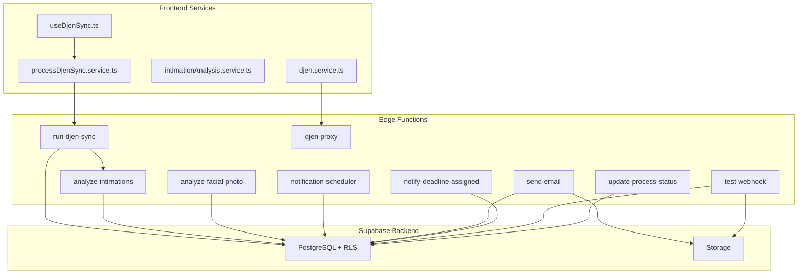
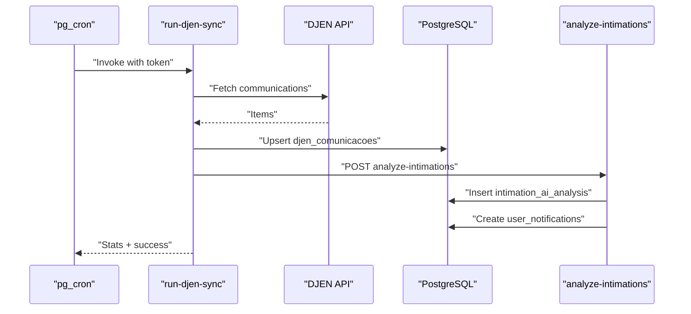
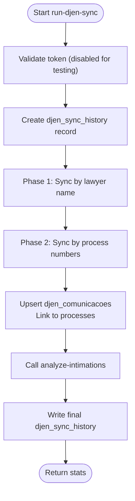
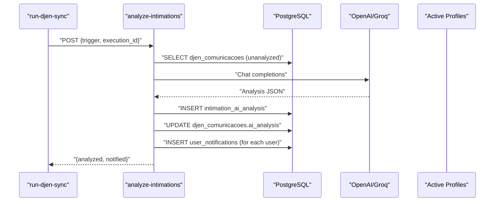
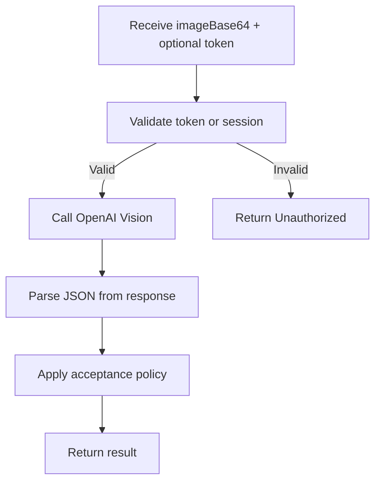
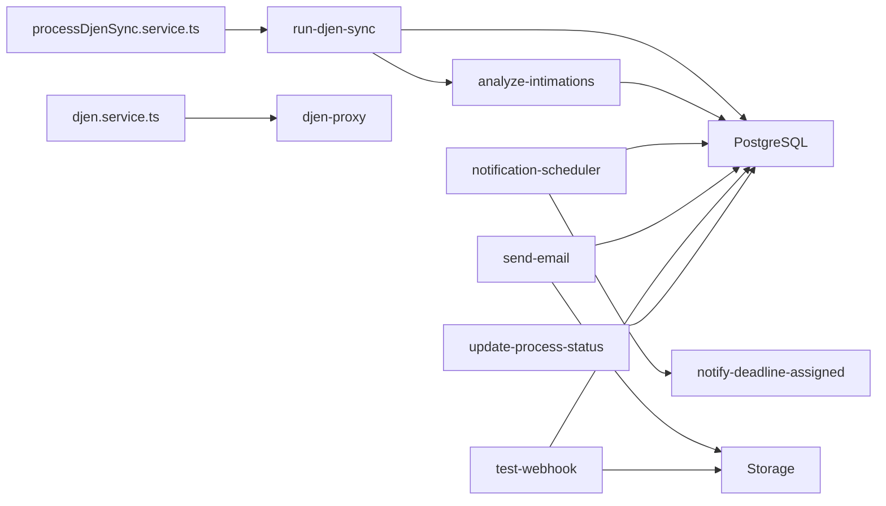
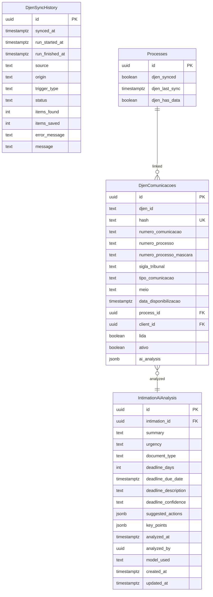

# Edge Functions

<cite>
**Referenced Files in This Document**
- [run-djen-sync/index.ts](file://supabase/functions/run-djen-sync/index.ts)
- [analyze-intimations/index.ts](file://supabase/functions/analyze-intimations/index.ts)
- [analyze-facial-photo/index.ts](file://supabase/functions/analyze-facial-photo/index.ts)
- [djen-proxy/index.ts](file://supabase/functions/djen-proxy/index.ts)
- [notification-scheduler/index.ts](file://supabase/functions/notification-scheduler/index.ts)
- [send-email/index.ts](file://supabase/functions/send-email/index.ts)
- [notify-deadline-assigned/index.ts](file://supabase/functions/notify-deadline-assigned/index.ts)
- [test-webhook/index.ts](file://supabase/functions/test-webhook/index.ts)
- [update-process-status/index.ts](file://supabase/functions/update-process-status/index.ts)
- [djen.service.ts](file://src/services/djen.service.ts)
- [intimationAnalysis.service.ts](file://src/services/intimationAnalysis.service.ts)
- [processDjenSync.service.ts](file://src/services/processDjenSync.service.ts)
- [useDjenSync.ts](file://src/hooks/useDjenSync.ts)
- [create_ai_analysis_table.sql](file://sql/create_ai_analysis_table.sql)
- [MIGRATION_DJEN_SYNC.sql](file://MIGRATION_DJEN_SYNC.sql)
</cite>

## Table of Contents
1. [Introduction](#introduction)
2. [Project Structure](#project-structure)
3. [Core Components](#core-components)
4. [Architecture Overview](#architecture-overview)
5. [Detailed Component Analysis](#detailed-component-analysis)
6. [Dependency Analysis](#dependency-analysis)
7. [Performance Considerations](#performance-considerations)
8. [Troubleshooting Guide](#troubleshooting-guide)
9. [Conclusion](#conclusion)
10. [Appendices](#appendices)

## Introduction
This document describes the Supabase Edge Functions implementation powering CRM Jurídico’s legal workflow automation. It covers the edge function architecture, deployment patterns, execution environment, and operational flows for DJEN synchronization, AI-driven document analysis, and notification scheduling. It also documents function triggers, input/output schemas, error handling, webhook integrations, scheduled executions, logging and monitoring, and security and performance considerations.

## Project Structure
The Edge Functions live under the Supabase project directory and are organized per functional domain:
- DJEN synchronization and status updates
- AI analysis and notifications
- Email delivery and deadline reminders
- Webhook dispatch for external systems
- Proxy for third-party APIs
- Facial photo validation for digital signatures

**Diagram sources**
- [run-djen-sync/index.ts:1-348](file://supabase/functions/run-djen-sync/index.ts#L1-L348)
- [analyze-intimations/index.ts:1-375](file://supabase/functions/analyze-intimations/index.ts#L1-L375)
- [analyze-facial-photo/index.ts:1-243](file://supabase/functions/analyze-facial-photo/index.ts#L1-L243)
- [djen-proxy/index.ts:1-82](file://supabase/functions/djen-proxy/index.ts#L1-L82)
- [notification-scheduler/index.ts:1-461](file://supabase/functions/notification-scheduler/index.ts#L1-L461)
- [send-email/index.ts:1-139](file://supabase/functions/send-email/index.ts#L1-L139)
- [notify-deadline-assigned/index.ts:1-294](file://supabase/functions/notify-deadline-assigned/index.ts#L1-L294)
- [test-webhook/index.ts:1-249](file://supabase/functions/test-webhook/index.ts#L1-L249)
- [update-process-status/index.ts:1-374](file://supabase/functions/update-process-status/index.ts#L1-L374)
- [djen.service.ts:1-262](file://src/services/djen.service.ts#L1-L262)
- [intimationAnalysis.service.ts:1-191](file://src/services/intimationAnalysis.service.ts#L1-L191)
- [processDjenSync.service.ts:1-233](file://src/services/processDjenSync.service.ts#L1-L233)
- [useDjenSync.ts:1-41](file://src/hooks/useDjenSync.ts#L1-L41)

**Section sources**
- [run-djen-sync/index.ts:1-348](file://supabase/functions/run-djen-sync/index.ts#L1-L348)
- [analyze-intimations/index.ts:1-375](file://supabase/functions/analyze-intimations/index.ts#L1-L375)
- [djen.service.ts:1-262](file://src/services/djen.service.ts#L1-L262)

## Core Components
- DJEN synchronization orchestrator: coordinates periodic sync, saves communications, and triggers AI analysis.
- AI analysis engine: extracts urgency, deadlines, and summaries from communications and creates notifications.
- Facial photo validator: validates selfie images for digital signature eligibility.
- DJEN proxy: bypasses CORS for frontend requests.
- Notification scheduler: consolidates reminders and alerts across deadlines, appointments, urgent communications, requirements, and pending signatures.
- Email sender: authenticates via Supabase session, sends via SMTP, and records sent emails.
- Deadline reminder notifier: sends branded HTML emails for assigned deadlines.
- Webhook dispatcher: posts signature completion events to external systems.
- Process status updater: periodically checks DJEN for status changes and notifies stakeholders.

**Section sources**
- [run-djen-sync/index.ts:1-348](file://supabase/functions/run-djen-sync/index.ts#L1-L348)
- [analyze-intimations/index.ts:1-375](file://supabase/functions/analyze-intimations/index.ts#L1-L375)
- [analyze-facial-photo/index.ts:1-243](file://supabase/functions/analyze-facial-photo/index.ts#L1-L243)
- [djen-proxy/index.ts:1-82](file://supabase/functions/djen-proxy/index.ts#L1-L82)
- [notification-scheduler/index.ts:1-461](file://supabase/functions/notification-scheduler/index.ts#L1-L461)
- [send-email/index.ts:1-139](file://supabase/functions/send-email/index.ts#L1-L139)
- [notify-deadline-assigned/index.ts:1-294](file://supabase/functions/notify-deadline-assigned/index.ts#L1-L294)
- [test-webhook/index.ts:1-249](file://supabase/functions/test-webhook/index.ts#L1-L249)
- [update-process-status/index.ts:1-374](file://supabase/functions/update-process-status/index.ts#L1-L374)

## Architecture Overview
The system uses Supabase Edge Functions as serverless compute, PostgreSQL for persistence, and Supabase Storage for signed URLs. Frontend services invoke functions via Supabase JS client or direct HTTP calls. Scheduled triggers (pg_cron) and React hooks orchestrate recurring tasks.

**Diagram sources**
- [run-djen-sync/index.ts:260-303](file://supabase/functions/run-djen-sync/index.ts#L260-L303)
- [analyze-intimations/index.ts:225-374](file://supabase/functions/analyze-intimations/index.ts#L225-L374)

**Section sources**
- [run-djen-sync/index.ts:29-348](file://supabase/functions/run-djen-sync/index.ts#L29-L348)
- [analyze-intimations/index.ts:225-374](file://supabase/functions/analyze-intimations/index.ts#L225-L374)

## Detailed Component Analysis

### DJEN Synchronization Orchestration (run-djen-sync)
- Purpose: Periodic synchronization of DJEN communications, deduplication, linking to processes, and triggering AI analysis.
- Triggers: pg_cron invoking the function with a custom token parameter.
- Execution flow:
  - Validates token (currently disabled for testing).
  - Logs start in djen_sync_history.
  - Fetches profiles and processes, builds date range.
  - Two-phase sync:
    - By lawyer name.
    - By process numbers.
  - Saves communications to djen_comunicacoes with deduplication by hash.
  - Links to existing processes and updates process flags/status.
  - Calls analyze-intimations to generate AI insights and notifications.
  - Writes final sync log with stats.
- Security: Uses custom token in query param; JWT verification disabled for this function.
- Error handling: Writes error entries to djen_sync_history; returns structured JSON.

**Diagram sources**
- [run-djen-sync/index.ts:98-246](file://supabase/functions/run-djen-sync/index.ts#L98-L246)

**Section sources**
- [run-djen-sync/index.ts:1-348](file://supabase/functions/run-djen-sync/index.ts#L1-L348)
- [MIGRATION_DJEN_SYNC.sql:1-17](file://MIGRATION_DJEN_SYNC.sql#L1-L17)

### AI Analysis Engine (analyze-intimations)
- Purpose: Extract urgency, deadlines, and summaries from communications; create notifications; persist analysis.
- Inputs: Function invoked with trigger context and execution ID.
- Processing:
  - Loads GROQ or OpenAI API keys from environment.
  - Skips previously analyzed communications.
  - Limits batch size for throughput control.
  - Chooses model (Groq or OpenAI) based on availability.
  - Persists analysis to intimation_ai_analysis and enriches djen_comunicacoes.
  - Creates user notifications for all active users.
- Outputs: JSON with analyzed and notified counts.

**Diagram sources**
- [run-djen-sync/index.ts:268-296](file://supabase/functions/run-djen-sync/index.ts#L268-L296)
- [analyze-intimations/index.ts:225-374](file://supabase/functions/analyze-intimations/index.ts#L225-L374)

**Section sources**
- [analyze-intimations/index.ts:1-375](file://supabase/functions/analyze-intimations/index.ts#L1-L375)
- [create_ai_analysis_table.sql:1-94](file://sql/create_ai_analysis_table.sql#L1-L94)

### Facial Photo Validation (analyze-facial-photo)
- Purpose: Validate selfie images for digital signature eligibility using OpenAI Vision.
- Authentication:
  - Accepts either a public signing token (validated via RPC) or authenticated user via Authorization header.
- Processing:
  - Parses base64 image, removes data URI prefix.
  - Sends image to OpenAI Vision API with strict validation rules.
  - Applies acceptance policy heuristics to accept borderline cases safely.
- Output: JSON with validity, score, issues, and friendly message.

**Diagram sources**
- [analyze-facial-photo/index.ts:90-242](file://supabase/functions/analyze-facial-photo/index.ts#L90-L242)

**Section sources**
- [analyze-facial-photo/index.ts:1-243](file://supabase/functions/analyze-facial-photo/index.ts#L1-L243)

### DJEN Proxy (djen-proxy)
- Purpose: Frontend-safe proxy to DJEN API to avoid CORS issues.
- Input: JSON body with endpoint and query params.
- Behavior: Builds URL, forwards GET request, logs and returns standardized responses.

**Section sources**
- [djen-proxy/index.ts:1-82](file://supabase/functions/djen-proxy/index.ts#L1-L82)
- [djen.service.ts:20-102](file://src/services/djen.service.ts#L20-L102)

### Notification Scheduler (notification-scheduler)
- Purpose: Centralized scheduler for reminders and alerts across deadlines, appointments, urgent communications, requirements, and pending signatures.
- Processing:
  - Checks deadlines due soon and sends notifications with deduplication.
  - Sends reminder emails to responsible users via notify-deadline-assigned.
  - Checks upcoming calendar events and sends reminders.
  - Identifies urgent intimation notifications.
  - Monitors requirement analysis milestones.
  - Flags pending signatures after threshold.
- Deduplication: Supports permanent deduplication via metadata key and 24-hour fallback.

**Section sources**
- [notification-scheduler/index.ts:1-461](file://supabase/functions/notification-scheduler/index.ts#L1-L461)
- [notify-deadline-assigned/index.ts:1-294](file://supabase/functions/notify-deadline-assigned/index.ts#L1-L294)

### Email Sender (send-email)
- Purpose: Securely send emails using SMTP with Supabase session authentication.
- Authentication: Requires authenticated user; retrieves account credentials from user’s email account configuration.
- Delivery: Sends via SMTP, records sent email in emails table.

**Section sources**
- [send-email/index.ts:1-139](file://supabase/functions/send-email/index.ts#L1-L139)

### Webhook Dispatcher (test-webhook)
- Purpose: Test and dispatch signature completion webhooks to external systems.
- Behavior: Queries signed requests/signers, generates signed storage URLs, posts webhook with secret header if configured.

**Section sources**
- [test-webhook/index.ts:1-249](file://supabase/functions/test-webhook/index.ts#L1-L249)

### Process Status Updater (update-process-status)
- Purpose: Periodically check DJEN for status changes and update processes; notify stakeholders if archived with pending deadlines.
- Behavior: Iterates active processes, queries DJEN, detects status transitions, updates process records, and creates notifications.

**Section sources**
- [update-process-status/index.ts:1-374](file://supabase/functions/update-process-status/index.ts#L1-L374)

## Dependency Analysis
- Runtime: All functions run on Deno runtime within Supabase Edge Functions.
- Dependencies:
  - Supabase client SDK for database and auth operations.
  - External APIs: DJEN, OpenAI, Groq, SMTP servers.
  - Storage: Signed URLs for document attachments.
- Coupling:
  - run-djen-sync depends on analyze-intimations for downstream analysis.
  - notification-scheduler coordinates multiple subsystems and calls notify-deadline-assigned.
  - Frontend services depend on djen.service.ts and processDjenSync.service.ts for orchestration.

**Diagram sources**
- [run-djen-sync/index.ts:268-296](file://supabase/functions/run-djen-sync/index.ts#L268-L296)
- [analyze-intimations/index.ts:225-374](file://supabase/functions/analyze-intimations/index.ts#L225-L374)
- [notification-scheduler/index.ts:160-194](file://supabase/functions/notification-scheduler/index.ts#L160-L194)
- [send-email/index.ts:22-139](file://supabase/functions/send-email/index.ts#L22-L139)
- [test-webhook/index.ts:113-230](file://supabase/functions/test-webhook/index.ts#L113-L230)
- [update-process-status/index.ts:66-199](file://supabase/functions/update-process-status/index.ts#L66-L199)
- [processDjenSync.service.ts:119-178](file://src/services/processDjenSync.service.ts#L119-L178)
- [djen.service.ts:20-102](file://src/services/djen.service.ts#L20-L102)

**Section sources**
- [run-djen-sync/index.ts:1-348](file://supabase/functions/run-djen-sync/index.ts#L1-L348)
- [notification-scheduler/index.ts:1-461](file://supabase/functions/notification-scheduler/index.ts#L1-L461)
- [processDjenSync.service.ts:1-233](file://src/services/processDjenSync.service.ts#L1-L233)

## Performance Considerations
- Rate limiting:
  - DJEN: Respect rate limits; the frontend service introduces delays between requests.
  - Internal: Functions use timeouts and controlled concurrency (e.g., 1–2 seconds between requests).
- Throughput:
  - Limit batch sizes for AI analysis and notifications.
  - Use pagination and incremental processing.
- Caching and deduplication:
  - Hash-based deduplication for communications.
  - Deduplication keys for notifications.
- Storage:
  - Prefer signed URLs for temporary access to reduce load.

[No sources needed since this section provides general guidance]

## Troubleshooting Guide
- Logging:
  - Functions log execution steps, errors, and stats to stdout/stderr.
  - run-djen-sync writes djen_sync_history entries for start, progress, and completion.
- Common issues:
  - Missing environment secrets (OpenAI/Groq, SMTP, DJEN token).
  - DJEN API rate limits or transient errors.
  - Invalid or missing token for protected endpoints.
  - Network timeouts to external APIs.
- Remediation:
  - Verify environment variables in Supabase Functions Secrets.
  - Add exponential backoff and retry logic around external calls.
  - Monitor djen_sync_history for failed runs and error_message fields.
  - Validate CORS and proxy configurations for djen.service.ts.

**Section sources**
- [run-djen-sync/index.ts:35-86](file://supabase/functions/run-djen-sync/index.ts#L35-L86)
- [notification-scheduler/index.ts:435-460](file://supabase/functions/notification-scheduler/index.ts#L435-L460)
- [djen.service.ts:85-94](file://src/services/djen.service.ts#L85-L94)

## Conclusion
The Edge Functions implementation provides a robust, modular foundation for automating legal workflows: synchronizing DJEN data, extracting insights via AI, validating digital signatures, sending timely notifications, and integrating with external systems via webhooks. The architecture balances reliability, scalability, and maintainability through careful error handling, deduplication, and scheduled orchestration.

[No sources needed since this section summarizes without analyzing specific files]

## Appendices

### Data Models and Schemas
- intimation_ai_analysis: Stores AI-generated insights per communication.
- djen_comunicacoes: Persisted DJEN communications with linkage to processes.
- djen_sync_history: Execution logs for synchronization runs.
- processes: Extended with DJEN sync flags and timestamps.

**Diagram sources**
- [create_ai_analysis_table.sql:8-61](file://sql/create_ai_analysis_table.sql#L8-L61)
- [MIGRATION_DJEN_SYNC.sql:4-11](file://MIGRATION_DJEN_SYNC.sql#L4-L11)
- [run-djen-sync/index.ts:417-557](file://supabase/functions/run-djen-sync/index.ts#L417-L557)

**Section sources**
- [create_ai_analysis_table.sql:1-94](file://sql/create_ai_analysis_table.sql#L1-L94)
- [MIGRATION_DJEN_SYNC.sql:1-17](file://MIGRATION_DJEN_SYNC.sql#L1-L17)

### Function Triggers and Scheduling
- Scheduled triggers:
  - run-djen-sync: pg_cron invocation with custom token.
  - notification-scheduler: periodic check for reminders and alerts.
  - update-process-status: periodic status reconciliation.
- Manual triggers:
  - Frontend hook useDjenSync initiates periodic syncs at intervals.

**Section sources**
- [run-djen-sync/index.ts:35-96](file://supabase/functions/run-djen-sync/index.ts#L35-L96)
- [notification-scheduler/index.ts:435-461](file://supabase/functions/notification-scheduler/index.ts#L435-L461)
- [update-process-status/index.ts:33-64](file://supabase/functions/update-process-status/index.ts#L33-L64)
- [useDjenSync.ts:8-39](file://src/hooks/useDjenSync.ts#L8-L39)

### Security and Access Control
- JWT verification:
  - run-djen-sync: JWT verification disabled; relies on custom token in query param.
- Authentication:
  - send-email: requires authenticated user session.
  - analyze-facial-photo: accepts either public signing token or session.
- Secrets:
  - Store API keys and tokens in Supabase Functions Secrets.
- CORS:
  - Functions set appropriate Access-Control headers.

**Section sources**
- [run-djen-sync/index.ts:1-11](file://supabase/functions/run-djen-sync/index.ts#L1-L11)
- [send-email/index.ts:22-47](file://supabase/functions/send-email/index.ts#L22-L47)
- [analyze-facial-photo/index.ts:73-109](file://supabase/functions/analyze-facial-photo/index.ts#L73-L109)

### Examples and Best Practices
- Custom edge function development:
  - Use Deno.serve for HTTP handlers; return Response with proper headers.
  - Validate inputs and handle errors gracefully; log meaningful context.
- Dependency management:
  - Keep external API calls behind timeouts; implement retries with backoff.
- Performance optimization:
  - Batch operations; limit concurrent external calls; leverage caching and deduplication.
- Cost optimization:
  - Minimize outbound requests; reuse connections; prefer signed URLs for storage access.

[No sources needed since this section provides general guidance]