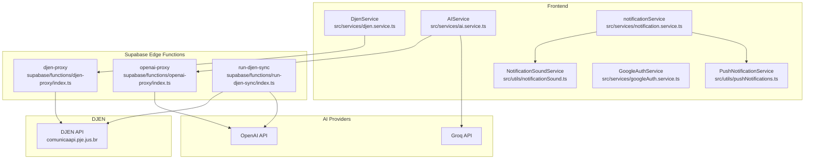
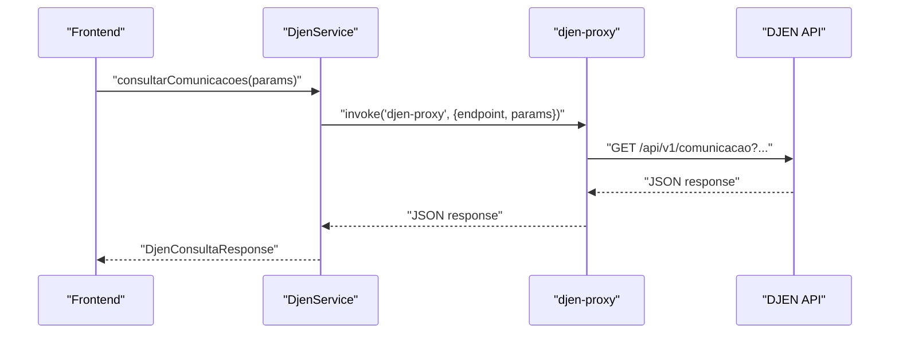
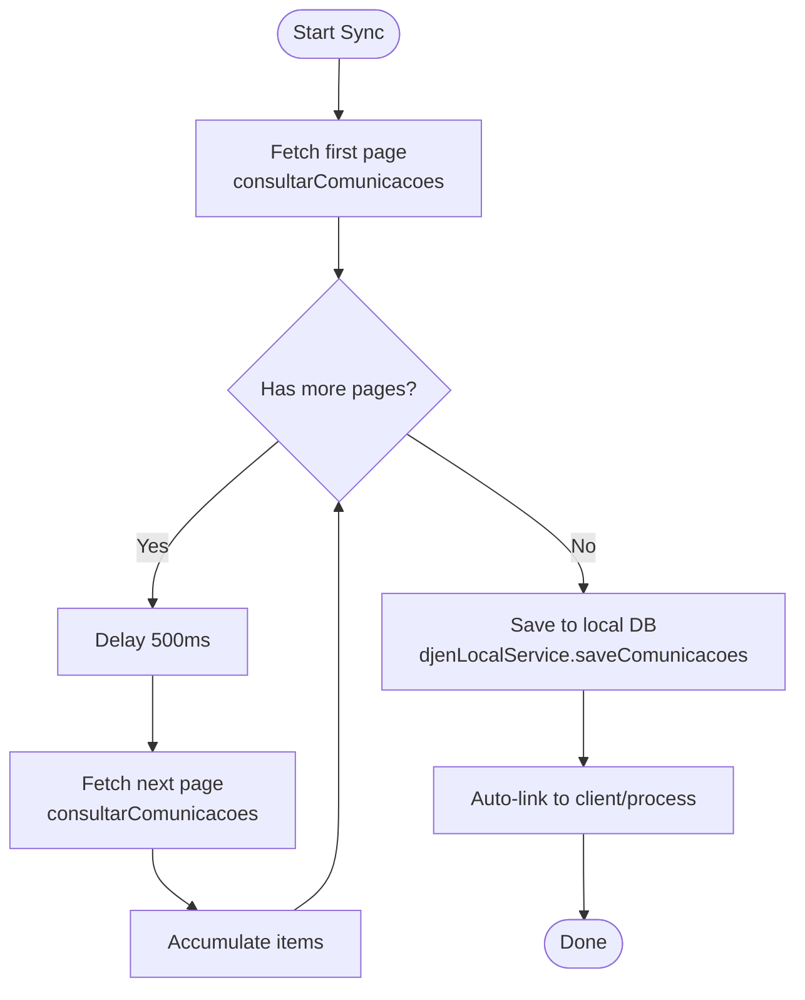
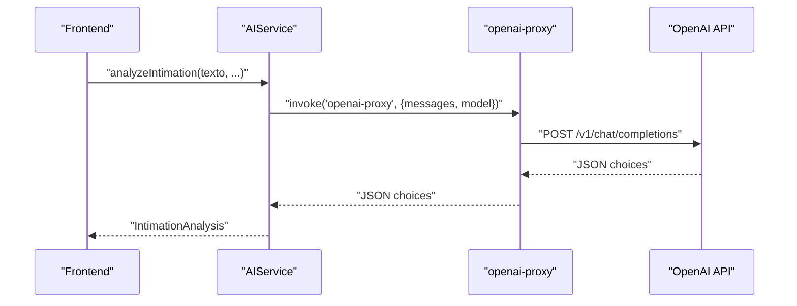
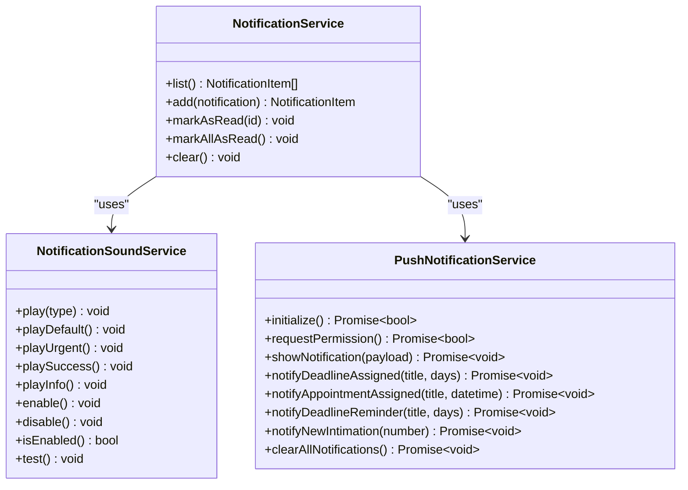
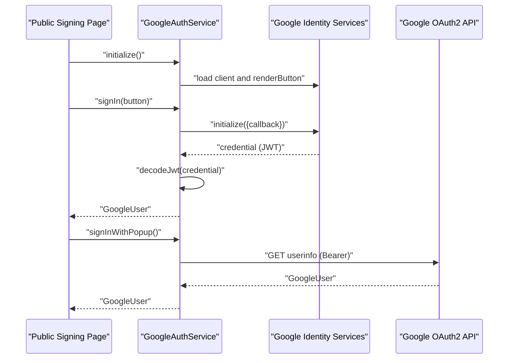
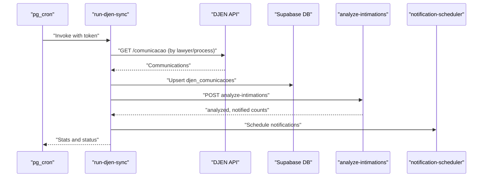
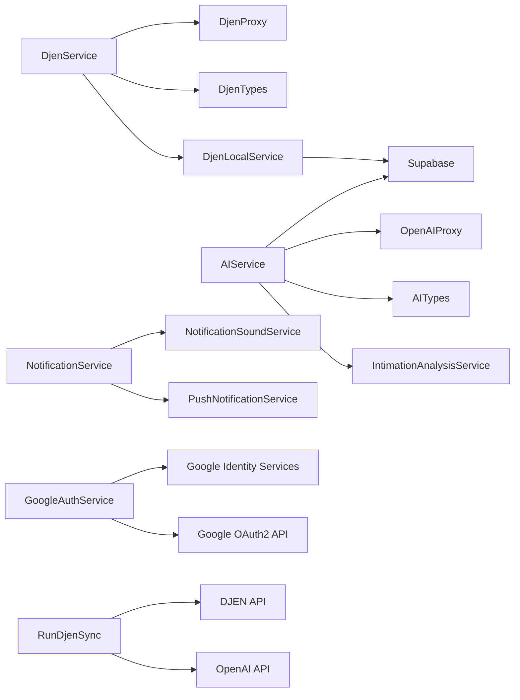

# External Integrations

<cite>
**Referenced Files in This Document**
- [djen.service.ts](file://src/services/djen.service.ts)
- [djenLocal.service.ts](file://src/services/djenLocal.service.ts)
- [djenSyncStatus.service.ts](file://src/services/djenSyncStatus.service.ts)
- [djen.types.ts](file://src/types/djen.types.ts)
- [djen-proxy/index.ts](file://supabase/functions/djen-proxy/index.ts)
- [openai-proxy/index.ts](file://supabase/functions/openai-proxy/index.ts)
- [run-djen-sync/index.ts](file://supabase/functions/run-djen-sync/index.ts)
- [ai.service.ts](file://src/services/ai.service.ts)
- [intimationAnalysis.service.ts](file://src/services/intimationAnalysis.service.ts)
- [ai.types.ts](file://src/types/ai.types.ts)
- [notification.service.ts](file://src/services/notification.service.ts)
- [notification.types.ts](file://src/types/notification.types.ts)
- [pushNotifications.ts](file://src/utils/pushNotifications.ts)
- [notificationSound.ts](file://src/utils/notificationSound.ts)
- [googleAuth.service.ts](file://src/services/googleAuth.service.ts)
- [useDjenSync.ts](file://src/hooks/useDjenSync.ts)
</cite>

## Table of Contents
1. [Introduction](#introduction)
2. [Project Structure](#project-structure)
3. [Core Components](#core-components)
4. [Architecture Overview](#architecture-overview)
5. [Detailed Component Analysis](#detailed-component-analysis)
6. [Dependency Analysis](#dependency-analysis)
7. [Performance Considerations](#performance-considerations)
8. [Troubleshooting Guide](#troubleshooting-guide)
9. [Conclusion](#conclusion)
10. [Appendices](#appendices)

## Introduction
This document explains external API integrations in CRM Jurídico, focusing on:
- DJEN API integration for retrieving and synchronizing judicial communications
- OpenAI/Groq integration for document analysis and AI-powered features
- Notification services for browser push notifications, sound feedback, and local storage-backed notifications
- Google OAuth integration for public signing pages
- Edge Functions acting as proxies and schedulers for secure, rate-limited, and monitored external calls
- Asynchronous operation patterns, error handling, and fallback strategies

## Project Structure
The integration surface spans:
- Frontend services for DJEN and AI
- Supabase Edge Functions for proxying and scheduling
- Local storage and service worker-based notification utilities
- Types and models for typed integration contracts

**Diagram sources**
- [djen.service.ts:1-262](file://src/services/djen.service.ts#L1-L262)
- [djen-proxy/index.ts:1-82](file://supabase/functions/djen-proxy/index.ts#L1-L82)
- [openai-proxy/index.ts:1-65](file://supabase/functions/openai-proxy/index.ts#L1-L65)
- [run-djen-sync/index.ts:1-639](file://supabase/functions/run-djen-sync/index.ts#L1-L639)
- [ai.service.ts:1-813](file://src/services/ai.service.ts#L1-L813)
- [notification.service.ts:1-115](file://src/services/notification.service.ts#L1-L115)
- [pushNotifications.ts:1-213](file://src/utils/pushNotifications.ts#L1-L213)
- [notificationSound.ts:1-139](file://src/utils/notificationSound.ts#L1-L139)
- [googleAuth.service.ts:1-264](file://src/services/googleAuth.service.ts#L1-L264)

**Section sources**
- [djen.service.ts:1-262](file://src/services/djen.service.ts#L1-L262)
- [ai.service.ts:1-813](file://src/services/ai.service.ts#L1-L813)
- [notification.service.ts:1-115](file://src/services/notification.service.ts#L1-L115)
- [pushNotifications.ts:1-213](file://src/utils/pushNotifications.ts#L1-L213)
- [notificationSound.ts:1-139](file://src/utils/notificationSound.ts#L1-L139)
- [googleAuth.service.ts:1-264](file://src/services/googleAuth.service.ts#L1-L264)
- [djen-proxy/index.ts:1-82](file://supabase/functions/djen-proxy/index.ts#L1-L82)
- [openai-proxy/index.ts:1-65](file://supabase/functions/openai-proxy/index.ts#L1-L65)
- [run-djen-sync/index.ts:1-639](file://supabase/functions/run-djen-sync/index.ts#L1-L639)

## Core Components
- DJEN API client with proxy support, pagination, rate-limit handling, and batch operations
- Local persistence and auto-linking of DJEN communications to clients/processes
- Edge Function proxies for DJEN and OpenAI to avoid CORS and centralize secrets
- AI service supporting OpenAI and Groq with fallback, cooldown, and JSON extraction
- Notification pipeline with local storage, browser push, and sound feedback
- Google OAuth for public signing pages with Identity Services and popup fallback
- Scheduled synchronization with analytics and optional AI analysis

**Section sources**
- [djen.service.ts:1-262](file://src/services/djen.service.ts#L1-L262)
- [djenLocal.service.ts:1-747](file://src/services/djenLocal.service.ts#L1-L747)
- [djenSyncStatus.service.ts:1-99](file://src/services/djenSyncStatus.service.ts#L1-L99)
- [djen.types.ts:1-154](file://src/types/djen.types.ts#L1-L154)
- [djen-proxy/index.ts:1-82](file://supabase/functions/djen-proxy/index.ts#L1-L82)
- [openai-proxy/index.ts:1-65](file://supabase/functions/openai-proxy/index.ts#L1-L65)
- [run-djen-sync/index.ts:1-639](file://supabase/functions/run-djen-sync/index.ts#L1-L639)
- [ai.service.ts:1-813](file://src/services/ai.service.ts#L1-L813)
- [intimationAnalysis.service.ts:1-191](file://src/services/intimationAnalysis.service.ts#L1-L191)
- [ai.types.ts:1-45](file://src/types/ai.types.ts#L1-L45)
- [notification.service.ts:1-115](file://src/services/notification.service.ts#L1-L115)
- [pushNotifications.ts:1-213](file://src/utils/pushNotifications.ts#L1-L213)
- [notificationSound.ts:1-139](file://src/utils/notificationSound.ts#L1-L139)
- [googleAuth.service.ts:1-264](file://src/services/googleAuth.service.ts#L1-L264)

## Architecture Overview
The system integrates external APIs through a layered approach:
- Frontend services encapsulate API calls and domain logic
- Edge Functions act as secure gateways, enforcing CORS policies and managing secrets
- Local services persist and enrich data, linking to internal clients/processes
- AI services provide analysis and suggestions, with robust fallback and rate-limit handling
- Notification utilities deliver timely alerts via browser push and sound

**Diagram sources**
- [djen.service.ts:20-102](file://src/services/djen.service.ts#L20-L102)
- [djen-proxy/index.ts:20-67](file://supabase/functions/djen-proxy/index.ts#L20-L67)

**Section sources**
- [djen.service.ts:1-262](file://src/services/djen.service.ts#L1-L262)
- [djen-proxy/index.ts:1-82](file://supabase/functions/djen-proxy/index.ts#L1-L82)

## Detailed Component Analysis

### DJEN API Integration
- Authentication and request patterns
  - Direct GET requests to the DJEN API with query parameters
  - Optional Edge Function proxy to bypass CORS during development
  - Rate-limit handling with explicit 429 error messaging
- Response handling and pagination
  - Single-page queries via a dedicated method
  - Automatic pagination across all pages with controlled delays
  - Batch queries per process number with per-request delays
- Local persistence and auto-linking
  - Save and update local records with deduplication by hash
  - Auto-link to existing clients/processes using normalized names and process numbers
  - Propagate links across multiple communications of the same process
- Synchronization status logging
  - Track runs, items found/saved, and errors in a dedicated history table

**Diagram sources**
- [djen.service.ts:108-162](file://src/services/djen.service.ts#L108-L162)
- [djenLocal.service.ts:125-460](file://src/services/djenLocal.service.ts#L125-L460)

**Section sources**
- [djen.service.ts:1-262](file://src/services/djen.service.ts#L1-L262)
- [djenLocal.service.ts:1-747](file://src/services/djenLocal.service.ts#L1-L747)
- [djenSyncStatus.service.ts:1-99](file://src/services/djenSyncStatus.service.ts#L1-L99)
- [djen.types.ts:1-154](file://src/types/djen.types.ts#L1-L154)

### OpenAI API Integration for Document Analysis
- Provider selection and fallback
  - Primary provider configured via environment variable
  - Secondary provider (Groq) with cooldown after rate limits
  - Edge Function proxy to avoid CORS and centralize secrets
- Request patterns and response handling
  - JSON-formatted prompts for structured outputs
  - Extraction of deadlines, urgency, actions, and key points
  - Business day calculations for due dates
- AI analysis persistence
  - Upsert analysis records with conflict handling
  - Round-trip encoding for highlighted passages

**Diagram sources**
- [ai.service.ts:279-461](file://src/services/ai.service.ts#L279-L461)
- [openai-proxy/index.ts:23-53](file://supabase/functions/openai-proxy/index.ts#L23-L53)

**Section sources**
- [ai.service.ts:1-813](file://src/services/ai.service.ts#L1-L813)
- [intimationAnalysis.service.ts:1-191](file://src/services/intimationAnalysis.service.ts#L1-L191)
- [ai.types.ts:1-45](file://src/types/ai.types.ts#L1-L45)
- [openai-proxy/index.ts:1-65](file://supabase/functions/openai-proxy/index.ts#L1-L65)

### Notification Service Integrations
- Local storage-backed notifications
  - CRUD operations for notification items
  - Sorting and filtering by category
- Browser push notifications
  - Permission checks and service worker registration
  - Fallback to Notification API when SW unavailable
  - Tagging and interaction requirements for critical alerts
- Sound feedback
  - Web Audio API tones for different notification types
  - Preference persistence and runtime toggles

**Diagram sources**
- [notification.service.ts:76-115](file://src/services/notification.service.ts#L76-L115)
- [pushNotifications.ts:14-213](file://src/utils/pushNotifications.ts#L14-L213)
- [notificationSound.ts:5-139](file://src/utils/notificationSound.ts#L5-L139)

**Section sources**
- [notification.service.ts:1-115](file://src/services/notification.service.ts#L1-L115)
- [pushNotifications.ts:1-213](file://src/utils/pushNotifications.ts#L1-L213)
- [notificationSound.ts:1-139](file://src/utils/notificationSound.ts#L1-L139)
- [notification.types.ts:1-19](file://src/types/notification.types.ts#L1-L19)

### Google OAuth Integration
- Identity Services initialization and rendering
  - Dynamic script injection and readiness polling
  - One Tap and button rendering with customization
- Popup OAuth fallback
  - Authorization URL construction and popup lifecycle
  - Access token retrieval and user info fetching
- JWT decoding and session management
  - Decoding ID tokens to extract user claims
  - Sign-out and authentication state helpers

**Diagram sources**
- [googleAuth.service.ts:24-204](file://src/services/googleAuth.service.ts#L24-L204)

**Section sources**
- [googleAuth.service.ts:1-264](file://src/services/googleAuth.service.ts#L1-L264)

### Webhook Handling and Asynchronous Operations
- Scheduled synchronization
  - Edge Function invoked periodically to sync DJEN communications
  - Token-based protection and configurable bypass for testing
  - Execution logs and status updates in a history table
- AI analysis and notifications
  - Optional immediate analysis and notification generation after saving new communications
  - Controlled timeouts and error propagation
- Frontend periodic sync hook
  - React hook triggering scheduled sync every hour with initial delayed start

**Diagram sources**
- [run-djen-sync/index.ts:29-348](file://supabase/functions/run-djen-sync/index.ts#L29-L348)

**Section sources**
- [run-djen-sync/index.ts:1-639](file://supabase/functions/run-djen-sync/index.ts#L1-L639)
- [useDjenSync.ts:1-41](file://src/hooks/useDjenSync.ts#L1-L41)

## Dependency Analysis
- DJEN client depends on:
  - Edge Function proxy for CORS avoidance
  - Supabase client for local persistence
  - Types for request/response contracts
- AI service depends on:
  - Edge Function proxy for OpenAI
  - Environment variables for provider keys
  - Supabase client for analysis persistence
- Notification services depend on:
  - Browser APIs (Service Worker, Notification)
  - Local storage for preferences and items
- Google OAuth depends on:
  - Global Identity Services SDK
  - Google OAuth2 userinfo endpoint

**Diagram sources**
- [djen.service.ts:1-262](file://src/services/djen.service.ts#L1-L262)
- [djenLocal.service.ts:1-747](file://src/services/djenLocal.service.ts#L1-L747)
- [djen.types.ts:1-154](file://src/types/djen.types.ts#L1-L154)
- [ai.service.ts:1-813](file://src/services/ai.service.ts#L1-L813)
- [intimationAnalysis.service.ts:1-191](file://src/services/intimationAnalysis.service.ts#L1-L191)
- [ai.types.ts:1-45](file://src/types/ai.types.ts#L1-L45)
- [notification.service.ts:1-115](file://src/services/notification.service.ts#L1-L115)
- [pushNotifications.ts:1-213](file://src/utils/pushNotifications.ts#L1-L213)
- [notificationSound.ts:1-139](file://src/utils/notificationSound.ts#L1-L139)
- [googleAuth.service.ts:1-264](file://src/services/googleAuth.service.ts#L1-L264)
- [djen-proxy/index.ts:1-82](file://supabase/functions/djen-proxy/index.ts#L1-L82)
- [openai-proxy/index.ts:1-65](file://supabase/functions/openai-proxy/index.ts#L1-L65)
- [run-djen-sync/index.ts:1-639](file://supabase/functions/run-djen-sync/index.ts#L1-L639)

**Section sources**
- [djen.service.ts:1-262](file://src/services/djen.service.ts#L1-L262)
- [ai.service.ts:1-813](file://src/services/ai.service.ts#L1-L813)
- [notification.service.ts:1-115](file://src/services/notification.service.ts#L1-L115)
- [pushNotifications.ts:1-213](file://src/utils/pushNotifications.ts#L1-L213)
- [notificationSound.ts:1-139](file://src/utils/notificationSound.ts#L1-L139)
- [googleAuth.service.ts:1-264](file://src/services/googleAuth.service.ts#L1-L264)
- [djen-proxy/index.ts:1-82](file://supabase/functions/djen-proxy/index.ts#L1-L82)
- [openai-proxy/index.ts:1-65](file://supabase/functions/openai-proxy/index.ts#L1-L65)
- [run-djen-sync/index.ts:1-639](file://supabase/functions/run-djen-sync/index.ts#L1-L639)

## Performance Considerations
- Rate limiting
  - Built-in delays between requests to DJEN (500ms per page, 600ms per process)
  - 429 handling with explicit user-facing messages
  - Cooldown for Groq fallback after rate limit
- Concurrency and batching
  - Paginated retrieval with progress callbacks
  - Batch saves with auto-linking and propagation across same-process communications
- Network resilience
  - Edge Function proxies reduce latency and centralize error handling
  - Fallback providers and JSON extraction improve robustness
- Storage efficiency
  - Deduplication by hash prevents redundant writes
  - Normalization and indexing for client/process matching

[No sources needed since this section provides general guidance]

## Troubleshooting Guide
- DJEN API errors
  - 429 responses are surfaced with retry guidance
  - Proxy failures return structured error payloads
  - Verify date range and pagination parameters
- AI service issues
  - Missing API keys disable AI features; check environment variables
  - JSON parsing errors indicate provider response inconsistencies; fallback applies automatically
  - Cooldown after rate limit; wait for cooldown period
- Notification delivery
  - Permission denied or unsupported browsers require user-initiated permission requests
  - Service worker registration failures should be logged and retried
  - Sound disabled by preference; toggle in settings
- Google OAuth
  - Identity Services loading timeout indicates network or CSP issues
  - Popup blocked errors require user gesture; retry with enabled popups
  - Token decoding failures indicate malformed ID tokens

**Section sources**
- [djen.service.ts:85-101](file://src/services/djen.service.ts#L85-L101)
- [djen-proxy/index.ts:47-80](file://supabase/functions/djen-proxy/index.ts#L47-L80)
- [ai.service.ts:178-241](file://src/services/ai.service.ts#L178-L241)
- [pushNotifications.ts:42-55](file://src/utils/pushNotifications.ts#L42-L55)
- [notificationSound.ts:109-121](file://src/utils/notificationSound.ts#L109-L121)
- [googleAuth.service.ts:28-76](file://src/services/googleAuth.service.ts#L28-L76)

## Conclusion
CRM Jurídico’s external integrations are designed for reliability and scalability:
- DJEN integration uses a robust client with proxying, pagination, and intelligent auto-linking
- AI capabilities leverage multiple providers with fallback and structured outputs
- Notifications combine browser push, sound, and local storage for comprehensive alerting
- Google OAuth supports modern Identity Services with graceful fallbacks
- Edge Functions centralize secrets, enforce CORS policies, and orchestrate scheduled tasks with monitoring

[No sources needed since this section summarizes without analyzing specific files]

## Appendices

### Setup Examples
- DJEN
  - Configure proxy usage in development; production uses direct API
  - Use date range helpers and pagination controls for efficient queries
- OpenAI/Groq
  - Set environment variables for primary and fallback providers
  - Use Edge Function proxy to avoid CORS in the browser
- Notifications
  - Initialize push service and request permissions early
  - Persist sound preferences and handle permission changes
- Google OAuth
  - Load Identity Services dynamically and render sign-in button
  - Implement popup fallback for environments blocking redirects

**Section sources**
- [djen.service.ts:198-214](file://src/services/djen.service.ts#L198-L214)
- [ai.service.ts:40-73](file://src/services/ai.service.ts#L40-L73)
- [pushNotifications.ts:194-209](file://src/utils/pushNotifications.ts#L194-L209)
- [notificationSound.ts:10-14](file://src/utils/notificationSound.ts#L10-L14)
- [googleAuth.service.ts:24-80](file://src/services/googleAuth.service.ts#L24-L80)

### Security and Monitoring
- Secrets management
  - Store API keys in Edge Function environment variables
  - Avoid exposing keys in client-side code
- Rate limiting and throttling
  - Respect provider quotas; implement backoff and jitter
- Observability
  - Log sync runs, errors, and outcomes
  - Monitor provider health and fallback triggers

**Section sources**
- [djen-sync-status.service.ts:37-95](file://src/services/djenSyncStatus.service.ts#L37-L95)
- [run-djen-sync/index.ts:99-246](file://supabase/functions/run-djen-sync/index.ts#L99-L246)