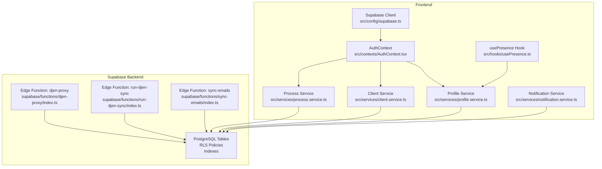
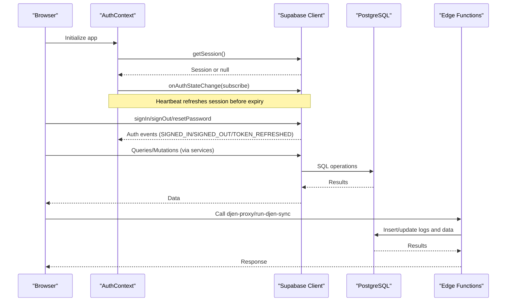
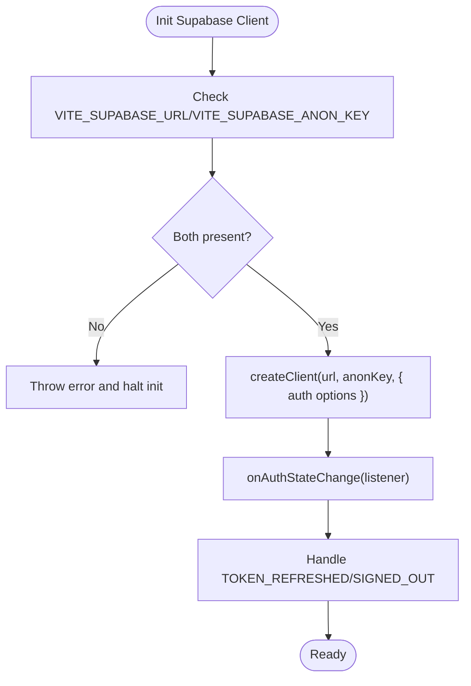
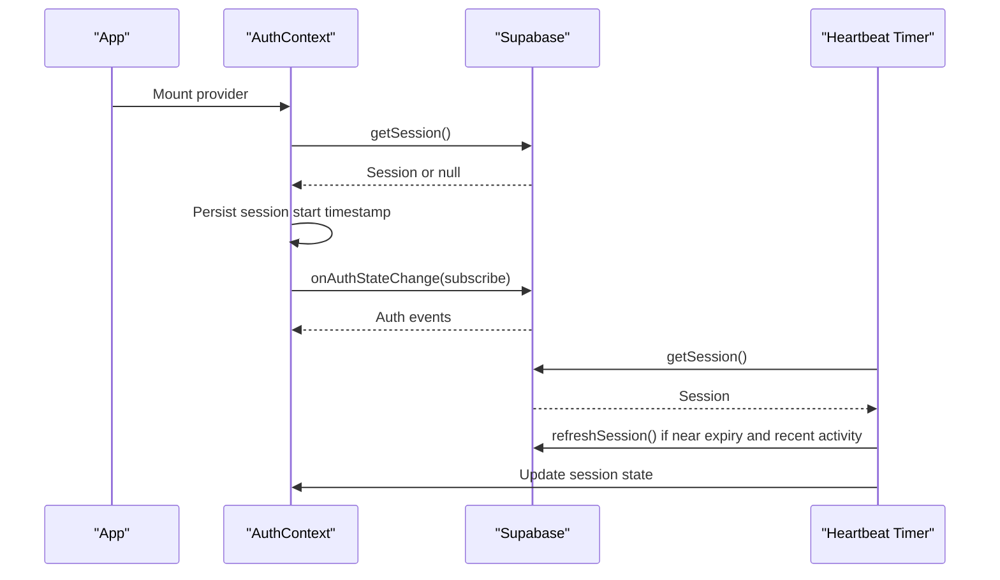
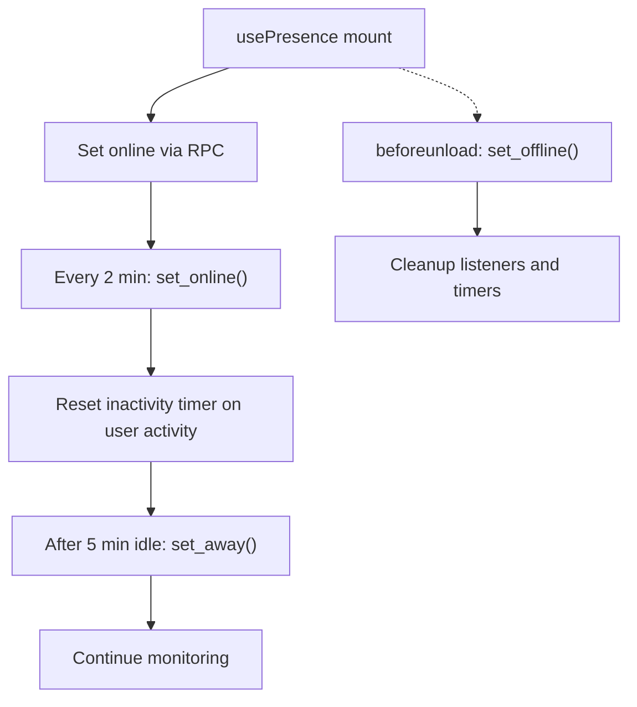
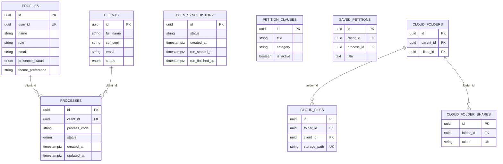
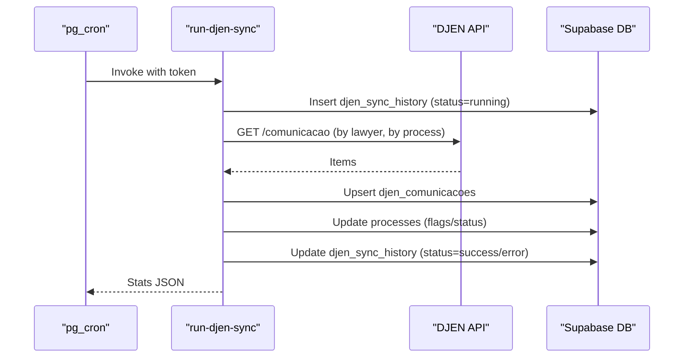
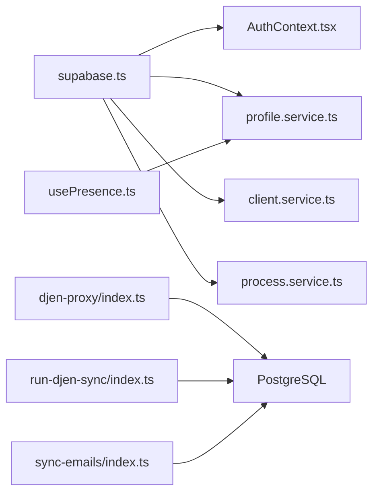

# Supabase Integration

<cite>
**Referenced Files in This Document**
- [supabase.ts](file://src/config/supabase.ts)
- [AuthContext.tsx](file://src/contexts/AuthContext.tsx)
- [usePresence.ts](file://src/hooks/usePresence.ts)
- [profile.service.ts](file://src/services/profile.service.ts)
- [client.service.ts](file://src/services/client.service.ts)
- [process.service.ts](file://src/services/process.service.ts)
- [notification.service.ts](file://src/services/notification.service.ts)
- [20251227_djen_sync_history.sql](file://supabase/migrations/20251227_djen_sync_history.sql)
- [20251228_petition_editor.sql](file://supabase/migrations/20251228_petition_editor.sql)
- [20251229_fix_petition_blocks_rls.sql](file://supabase/migrations/20251229_fix_petition_blocks_rls.sql)
- [20260308_cloud_module.sql](file://supabase/migrations/20260308_cloud_module.sql)
- [djen-proxy/index.ts](file://supabase/functions/djen-proxy/index.ts)
- [run-djen-sync/index.ts](file://supabase/functions/run-djen-sync/index.ts)
- [sync-emails/index.ts](file://supabase/functions/sync-emails/index.ts)
</cite>

## Table of Contents
1. [Introduction](#introduction)
2. [Project Structure](#project-structure)
3. [Core Components](#core-components)
4. [Architecture Overview](#architecture-overview)
5. [Detailed Component Analysis](#detailed-component-analysis)
6. [Dependency Analysis](#dependency-analysis)
7. [Performance Considerations](#performance-considerations)
8. [Troubleshooting Guide](#troubleshooting-guide)
9. [Conclusion](#conclusion)
10. [Appendices](#appendices)

## Introduction
This document explains the Supabase integration in the CRM Jurídico system. It covers client configuration, authentication and session management, presence and real-time patterns, database connection and Row Level Security (RLS), storage buckets, offline caching strategies, and practical examples for queries, mutations, and subscriptions. It also outlines performance optimization, connection pooling considerations, and error recovery strategies grounded in the repository’s code and migrations.

## Project Structure
The Supabase integration spans configuration, context providers, services, hooks, and Supabase Edge Functions and migrations:
- Client configuration and auth interceptor live in the Supabase client module.
- Authentication state is managed in a React context provider with heartbeat and inactivity handling.
- Presence is tracked via RPC calls and periodic updates.
- Services encapsulate CRUD operations against Supabase tables and local caches.
- Edge Functions implement proxying, scheduled sync, and email sync coordination.
- Migrations define schema, indexes, triggers, and RLS policies.

**Diagram sources**
- [supabase.ts:1-34](file://src/config/supabase.ts#L1-L34)
- [AuthContext.tsx:1-285](file://src/contexts/AuthContext.tsx#L1-L285)
- [usePresence.ts:1-63](file://src/hooks/usePresence.ts#L1-L63)
- [profile.service.ts:1-200](file://src/services/profile.service.ts#L1-L200)
- [client.service.ts:1-604](file://src/services/client.service.ts#L1-L604)
- [process.service.ts:1-192](file://src/services/process.service.ts#L1-L192)
- [notification.service.ts:1-115](file://src/services/notification.service.ts#L1-L115)
- [djen-proxy/index.ts:1-82](file://supabase/functions/djen-proxy/index.ts#L1-L82)
- [run-djen-sync/index.ts:1-639](file://supabase/functions/run-djen-sync/index.ts#L1-L639)
- [sync-emails/index.ts:1-96](file://supabase/functions/sync-emails/index.ts#L1-L96)

**Section sources**
- [supabase.ts:1-34](file://src/config/supabase.ts#L1-L34)
- [AuthContext.tsx:1-285](file://src/contexts/AuthContext.tsx#L1-L285)
- [profile.service.ts:1-200](file://src/services/profile.service.ts#L1-L200)
- [client.service.ts:1-604](file://src/services/client.service.ts#L1-L604)
- [process.service.ts:1-192](file://src/services/process.service.ts#L1-L192)
- [notification.service.ts:1-115](file://src/services/notification.service.ts#L1-L115)
- [djen-proxy/index.ts:1-82](file://supabase/functions/djen-proxy/index.ts#L1-L82)
- [run-djen-sync/index.ts:1-639](file://supabase/functions/run-djen-sync/index.ts#L1-L639)
- [sync-emails/index.ts:1-96](file://supabase/functions/sync-emails/index.ts#L1-L96)

## Core Components
- Supabase client configuration with auth persistence and interceptor.
- Authentication context managing session lifecycle, heartbeat, and inactivity.
- Presence hook and service for online/away/offline states.
- Services for clients, processes, and notifications with local caching and normalization.
- Edge Functions for DJEN proxy, scheduled sync, and email sync coordination.

**Section sources**
- [supabase.ts:1-34](file://src/config/supabase.ts#L1-L34)
- [AuthContext.tsx:1-285](file://src/contexts/AuthContext.tsx#L1-L285)
- [usePresence.ts:1-63](file://src/hooks/usePresence.ts#L1-L63)
- [profile.service.ts:1-200](file://src/services/profile.service.ts#L1-L200)
- [client.service.ts:1-604](file://src/services/client.service.ts#L1-L604)
- [process.service.ts:1-192](file://src/services/process.service.ts#L1-L192)
- [notification.service.ts:1-115](file://src/services/notification.service.ts#L1-L115)

## Architecture Overview
The system integrates Supabase as the backend for authentication, data, storage, and serverless functions. The frontend authenticates users, maintains sessions, and performs CRUD through services. Presence is tracked via RPC calls. Edge Functions handle external integrations (DJEN) and scheduled tasks. Migrations define schema, RLS, and storage policies.

**Diagram sources**
- [AuthContext.tsx:45-115](file://src/contexts/AuthContext.tsx#L45-L115)
- [supabase.ts:22-33](file://src/config/supabase.ts#L22-L33)
- [run-djen-sync/index.ts:29-348](file://supabase/functions/run-djen-sync/index.ts#L29-L348)
- [djen-proxy/index.ts:8-81](file://supabase/functions/djen-proxy/index.ts#L8-L81)

## Detailed Component Analysis

### Supabase Client Configuration and Auth Interceptor
- Creates the Supabase client with environment variables for URL and anonymous key.
- Enables automatic token refresh, persistent sessions, URL detection, and localStorage-backed storage.
- Subscribes to auth state changes to log TOKEN_REFRESHED and SIGNED_OUT events.

**Diagram sources**
- [supabase.ts:6-33](file://src/config/supabase.ts#L6-L33)

**Section sources**
- [supabase.ts:1-34](file://src/config/supabase.ts#L1-L34)

### Authentication Flow and Session Management
- Initializes session from localStorage and sets user/session state.
- Subscribes to auth state changes with deduplication to avoid redundant handlers.
- Implements heartbeat to refresh tokens before expiry and enforce inactivity logout after 6 hours.
- Throttles user activity detection to reduce frequent updates.
- Provides sign-in, sign-out, and password reset flows via Supabase auth.

**Diagram sources**
- [AuthContext.tsx:45-189](file://src/contexts/AuthContext.tsx#L45-L189)

**Section sources**
- [AuthContext.tsx:1-285](file://src/contexts/AuthContext.tsx#L1-L285)

### Presence System and Real-Time Patterns
- On mount, marks user as online and periodically updates presence every 2 minutes.
- Uses beforeunload to mark user offline via beacon for reliability.
- Tracks inactivity and switches to away after 5 minutes without activity.
- Presence state is persisted via RPC calls (set_user_online/set_user_away/set_user_offline).

**Diagram sources**
- [usePresence.ts:11-61](file://src/hooks/usePresence.ts#L11-L61)
- [profile.service.ts:142-157](file://src/services/profile.service.ts#L142-L157)

**Section sources**
- [usePresence.ts:1-63](file://src/hooks/usePresence.ts#L1-L63)
- [profile.service.ts:1-200](file://src/services/profile.service.ts#L1-L200)

### Database Connection Management and RLS
- Services use the shared Supabase client for all operations.
- RLS is enabled and configured across relevant tables via migrations:
  - djen_sync_history: authenticated users can select; insert/update with authenticated.
  - petition_clauses and saved_petitions: authenticated users can read/insert/update/delete.
  - cloud_folders, cloud_files, cloud_folder_shares: authenticated access with granular policies and storage bucket policy for cloud-files.
- Indexes improve query performance on frequently filtered columns.

**Diagram sources**
- [20251227_djen_sync_history.sql:72-97](file://supabase/migrations/20251227_djen_sync_history.sql#L72-L97)
- [20251228_petition_editor.sql:6-100](file://supabase/migrations/20251228_petition_editor.sql#L6-L100)
- [20260308_cloud_module.sql:3-92](file://supabase/migrations/20260308_cloud_module.sql#L3-L92)

**Section sources**
- [20251227_djen_sync_history.sql:1-98](file://supabase/migrations/20251227_djen_sync_history.sql#L1-L98)
- [20251228_petition_editor.sql:1-161](file://supabase/migrations/20251228_petition_editor.sql#L1-L161)
- [20251229_fix_petition_blocks_rls.sql:1-28](file://supabase/migrations/20251229_fix_petition_blocks_rls.sql#L1-L28)
- [20260308_cloud_module.sql:1-151](file://supabase/migrations/20260308_cloud_module.sql#L1-L151)

### Storage Bucket Configuration
- A private bucket named cloud-files is ensured and protected by policies:
  - Authenticated users can perform all operations on storage.objects where bucket_id equals cloud-files.
  - Anonymous users can only select objects under active shares derived from folder tree traversal.

**Section sources**
- [20260308_cloud_module.sql:132-151](file://supabase/migrations/20260308_cloud_module.sql#L132-L151)

### Database Schema Relationships and Constraints
- Clients and Processes: client_id foreign keys link processes to clients; status and timestamps are used for filtering and ordering.
- Profiles: user_id is unique; presence_status and theme_preference are optional attributes.
- Petition editor: categories and formatting constraints ensure structured reuse of clause blocks.
- Cloud module: hierarchical folders with self-referencing parent_id; unique storage_path ensures safe uploads.

**Section sources**
- [client.service.ts:37-121](file://src/services/client.service.ts#L37-L121)
- [process.service.ts:20-111](file://src/services/process.service.ts#L20-L111)
- [20251228_petition_editor.sql:6-18](file://supabase/migrations/20251228_petition_editor.sql#L6-L18)
- [20260308_cloud_module.sql:3-26](file://supabase/migrations/20260308_cloud_module.sql#L3-L26)

### Data Validation Rules
- Clients: uniqueness of cpf_cnpj and email validated before create/update; normalization applied to full_name.
- Processes: default status set during creation; cache invalidated on create/update/delete.
- Petition clauses: category and formatting constrained via CHECK; order and defaults support curated templates.

**Section sources**
- [client.service.ts:317-406](file://src/services/client.service.ts#L317-L406)
- [process.service.ts:113-188](file://src/services/process.service.ts#L113-L188)
- [20251228_petition_editor.sql:10-12](file://supabase/migrations/20251228_petition_editor.sql#L10-L12)

### Offline Caching Strategies
- Local storage cache invalidation for dashboard-related keys after create/update/delete operations.
- ProcessService implements an in-memory cache with TTL and filter-aware invalidation.
- NotificationService persists notifications in localStorage with typed validation and sorting.

**Section sources**
- [client.service.ts:346-347](file://src/services/client.service.ts#L346-L347)
- [client.service.ts:395-396](file://src/services/client.service.ts#L395-L396)
- [client.service.ts:423-424](file://src/services/client.service.ts#L423-L424)
- [process.service.ts:11-40](file://src/services/process.service.ts#L11-L40)
- [notification.service.ts:1-115](file://src/services/notification.service.ts#L1-L115)

### Real-Time Data Synchronization
- Auth state changes are subscribed to and debounced to prevent duplicate handlers.
- Presence updates occur at fixed intervals with inactivity detection.
- Edge Functions orchestrate external integrations and batch updates:
  - djen-proxy: CORS-safe proxy to DJEN API.
  - run-djen-sync: scheduled sync with DJEN, saving communications, linking to processes, and invoking AI analysis.
  - sync-emails: placeholder for email sync coordination (IMAP unsupported in Edge Functions).

**Diagram sources**
- [run-djen-sync/index.ts:127-246](file://supabase/functions/run-djen-sync/index.ts#L127-L246)

**Section sources**
- [AuthContext.tsx:75-114](file://src/contexts/AuthContext.tsx#L75-L114)
- [usePresence.ts:11-61](file://src/hooks/usePresence.ts#L11-L61)
- [djen-proxy/index.ts:1-82](file://supabase/functions/djen-proxy/index.ts#L1-L82)
- [run-djen-sync/index.ts:1-639](file://supabase/functions/run-djen-sync/index.ts#L1-L639)
- [sync-emails/index.ts:1-96](file://supabase/functions/sync-emails/index.ts#L1-L96)

### Examples: Queries, Mutations, and Subscription Handling
- Queries:
  - List clients with optional filters and client-side normalization and sorting.
  - List processes with cache-aware filtering and search.
  - Get profile by user_id and list members with badge ordering.
- Mutations:
  - Create/update/delete clients with validation and cache invalidation.
  - Upsert profile with retry logic for schema changes.
  - Update process status and invalidate cache.
- Subscriptions:
  - Auth state change subscription with deduplication and heartbeat-driven refresh.

**Section sources**
- [client.service.ts:43-95](file://src/services/client.service.ts#L43-L95)
- [client.service.ts:177-312](file://src/services/client.service.ts#L177-L312)
- [process.service.ts:42-93](file://src/services/process.service.ts#L42-L93)
- [process.service.ts:156-173](file://src/services/process.service.ts#L156-L173)
- [profile.service.ts:48-105](file://src/services/profile.service.ts#L48-L105)
- [profile.service.ts:123-140](file://src/services/profile.service.ts#L123-L140)
- [AuthContext.tsx:75-114](file://src/contexts/AuthContext.tsx#L75-L114)

## Dependency Analysis
- Supabase client is a singleton imported by services and context.
- Services depend on the client and optionally on local caches.
- Presence depends on profile service RPCs and browser events.
- Edge Functions depend on Supabase service role keys and external APIs.

**Diagram sources**
- [supabase.ts:1-34](file://src/config/supabase.ts#L1-L34)
- [AuthContext.tsx:1-285](file://src/contexts/AuthContext.tsx#L1-L285)
- [profile.service.ts:1-200](file://src/services/profile.service.ts#L1-L200)
- [client.service.ts:1-604](file://src/services/client.service.ts#L1-L604)
- [process.service.ts:1-192](file://src/services/process.service.ts#L1-L192)
- [usePresence.ts:1-63](file://src/hooks/usePresence.ts#L1-L63)
- [djen-proxy/index.ts:1-82](file://supabase/functions/djen-proxy/index.ts#L1-L82)
- [run-djen-sync/index.ts:1-639](file://supabase/functions/run-djen-sync/index.ts#L1-L639)
- [sync-emails/index.ts:1-96](file://supabase/functions/sync-emails/index.ts#L1-L96)

**Section sources**
- [supabase.ts:1-34](file://src/config/supabase.ts#L1-L34)
- [AuthContext.tsx:1-285](file://src/contexts/AuthContext.tsx#L1-L285)
- [profile.service.ts:1-200](file://src/services/profile.service.ts#L1-L200)
- [client.service.ts:1-604](file://src/services/client.service.ts#L1-L604)
- [process.service.ts:1-192](file://src/services/process.service.ts#L1-L192)
- [usePresence.ts:1-63](file://src/hooks/usePresence.ts#L1-L63)
- [djen-proxy/index.ts:1-82](file://supabase/functions/djen-proxy/index.ts#L1-L82)
- [run-djen-sync/index.ts:1-639](file://supabase/functions/run-djen-sync/index.ts#L1-L639)
- [sync-emails/index.ts:1-96](file://supabase/functions/sync-emails/index.ts#L1-L96)

## Performance Considerations
- Connection pooling: Supabase JS client manages internal pooling; avoid creating multiple clients and reuse the singleton.
- Query optimization: leverage indexes from migrations (e.g., status, created_at DESC, category, is_active, is_default).
- Caching: ProcessService cache reduces repeated queries; invalidate on mutations. Clear localStorage keys after data changes to force UI refresh.
- Network resilience: Edge Functions include timeouts and retries; callers should handle partial failures gracefully.
- Presence updates: throttle intervals balance freshness and network usage.

[No sources needed since this section provides general guidance]

## Troubleshooting Guide
- Environment variables missing: Ensure VITE_SUPABASE_URL and VITE_SUPABASE_ANON_KEY are set; otherwise client initialization throws.
- Auth errors: Inspect auth state change listener logs for TOKEN_REFRESHED/SIGNED_OUT; verify heartbeat logic and inactivity thresholds.
- Presence not updating: Confirm RPC functions exist (set_user_online/away/offline) and that beforeunload is firing.
- Edge Function errors: Check logs for DJEN proxy and run-djen-sync; verify JWT verification settings and token handling.
- Storage access denied: Verify cloud-files bucket exists and storage policies allow authenticated access or active share lookup.

**Section sources**
- [supabase.ts:9-11](file://src/config/supabase.ts#L9-L11)
- [AuthContext.tsx:142-189](file://src/contexts/AuthContext.tsx#L142-L189)
- [profile.service.ts:142-157](file://src/services/profile.service.ts#L142-L157)
- [run-djen-sync/index.ts:334-347](file://supabase/functions/run-djen-sync/index.ts#L334-L347)
- [djen-proxy/index.ts:68-81](file://supabase/functions/djen-proxy/index.ts#L68-L81)
- [20260308_cloud_module.sql:132-151](file://supabase/migrations/20260308_cloud_module.sql#L132-L151)

## Conclusion
The CRM Jurídico system integrates Supabase comprehensively: secure authentication with session management, presence tracking, robust RLS policies, and efficient caching. Edge Functions automate external integrations and scheduled tasks. The documented patterns and configurations provide a solid foundation for extending functionality while maintaining performance and reliability.

[No sources needed since this section summarizes without analyzing specific files]

## Appendices
- Example paths for queries and mutations:
  - [List clients:43-95](file://src/services/client.service.ts#L43-L95)
  - [Create client:317-357](file://src/services/client.service.ts#L317-L357)
  - [Update client:362-406](file://src/services/client.service.ts#L362-L406)
  - [Delete client:411-432](file://src/services/client.service.ts#L411-L432)
  - [List processes:42-93](file://src/services/process.service.ts#L42-L93)
  - [Update process status:156-173](file://src/services/process.service.ts#L156-L173)
  - [Get profile:48-57](file://src/services/profile.service.ts#L48-L57)
  - [Upsert profile:59-94](file://src/services/profile.service.ts#L59-L94)
  - [Set presence:142-157](file://src/services/profile.service.ts#L142-L157)
  - [Auth state subscription:75-114](file://src/contexts/AuthContext.tsx#L75-L114)
  - [DJEN proxy:20-67](file://supabase/functions/djen-proxy/index.ts#L20-L67)
  - [Run DJEN sync:127-246](file://supabase/functions/run-djen-sync/index.ts#L127-L246)
  - [Sync emails:32-82](file://supabase/functions/sync-emails/index.ts#L32-L82)

[No sources needed since this section lists paths without analyzing specific files]