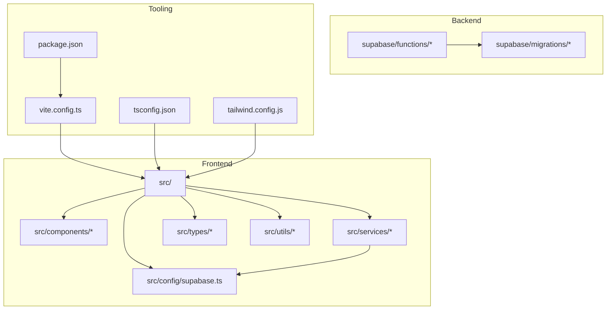
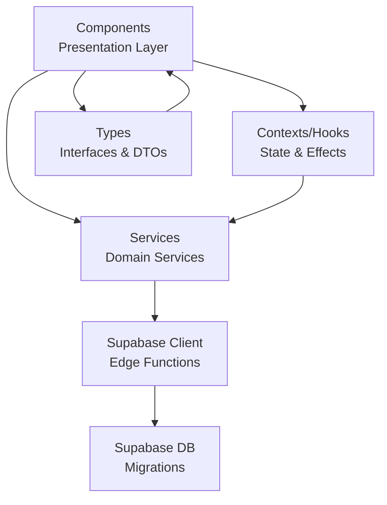

# Contributing Guidelines

<cite>
**Referenced Files in This Document**
- [README.md](file://README.md)
- [package.json](file://package.json)
- [vite.config.ts](file://vite.config.ts)
- [tsconfig.json](file://tsconfig.json)
- [tailwind.config.js](file://tailwind.config.js)
- [.gitignore](file://.gitignore)
- [DEPLOY_INSTRUCTIONS.md](file://DEPLOY_INSTRUCTIONS.md)
- [docs/ARCHITECTURE.md](file://docs/ARCHITECTURE.md)
- [CHANGELOG.md](file://CHANGELOG.md)
- [.githooks/pre-commit](file://.githooks/pre-commit)
- [scripts/setup-githooks.cjs](file://scripts/setup-githooks.cjs)
- [scripts/verify-version-changelog.cjs](file://scripts/verify-version-changelog.cjs)
- [src/components/ClientsModule.tsx](file://src/components/ClientsModule.tsx)
- [src/services/client.service.ts](file://src/services/client.service.ts)
- [src/types/client.types.ts](file://src/types/client.types.ts)
- [src/config/supabase.ts](file://src/config/supabase.ts)
- [supabase/migrations/20251228_petition_editor.sql](file://supabase/migrations/20251228_petition_editor.sql)
</cite>

## Table of Contents
1. [Introduction](#introduction)
2. [Project Structure](#project-structure)
3. [Core Components](#core-components)
4. [Architecture Overview](#architecture-overview)
5. [Development Workflow](#development-workflow)
6. [Code Standards and Conventions](#code-standards-and-conventions)
7. [Branching Strategy](#branching-strategy)
8. [Commit Message Conventions](#commit-message-conventions)
9. [Pull Request Procedures](#pull-request-procedures)
10. [Code Review Process](#code-review-process)
11. [Testing Requirements](#testing-requirements)
12. [Quality Assurance Standards](#quality-assurance-standards)
13. [Development Environment Setup](#development-environment-setup)
14. [Adding New Features](#adding-new-features)
15. [Bug Fixes and Backward Compatibility](#bug-fixes-and-backward-compatibility)
16. [Documentation Requirements](#documentation-requirements)
17. [Issue Reporting Procedures](#issue-reporting-procedures)
18. [Community Contribution Guidelines](#community-contribution-guidelines)
19. [Release Cycles and Versioning](#release-cycles-and-versioning)
20. [Maintenance Responsibilities](#maintenance-responsibilities)
21. [Troubleshooting Guide](#troubleshooting-guide)
22. [Conclusion](#conclusion)

## Introduction
This document defines how to contribute effectively to CRM Jurídico. It covers development workflow, code standards, collaboration processes, branching and commit conventions, pull request procedures, code review expectations, testing and QA requirements, environment setup, architectural principles, documentation obligations, issue reporting, templates, release cycles, versioning, and maintenance responsibilities.

## Project Structure
The project is a React 19 + TypeScript SPA built with Vite and styled with TailwindCSS. The backend leverages Supabase (PostgreSQL + Edge Functions). The repository includes:
- Frontend source under src/
- Supabase edge functions and migrations under supabase/
- Documentation under docs/
- Deployment and SPA routing under public/ and render.yaml
- Git hooks under .githooks/ and helper scripts under scripts/

**Diagram sources**
- [vite.config.ts:1-31](file://vite.config.ts#L1-L31)
- [tsconfig.json:1-33](file://tsconfig.json#L1-L33)
- [tailwind.config.js:1-28](file://tailwind.config.js#L1-L28)
- [package.json:1-79](file://package.json#L1-L79)
- [src/config/supabase.ts](file://src/config/supabase.ts)

**Section sources**
- [README.md:84-109](file://README.md#L84-L109)
- [package.json:1-79](file://package.json#L1-L79)

## Core Components
- Components: Modular React components organized by domain (layout, dashboard, UI primitives, modules).
- Services: API/service wrappers for Supabase and edge functions.
- Types: Strongly typed interfaces for domain models.
- Utilities: Shared helpers for formatting, notifications, and data transformations.
- Contexts and Hooks: Application-wide state and reusable logic.

**Section sources**
- [docs/ARCHITECTURE.md:3-63](file://docs/ARCHITECTURE.md#L3-L63)
- [src/components/ClientsModule.tsx](file://src/components/ClientsModule.tsx)
- [src/services/client.service.ts](file://src/services/client.service.ts)
- [src/types/client.types.ts](file://src/types/client.types.ts)

## Architecture Overview
The system follows a layered frontend architecture with clear separation of concerns:
- Presentation layer: React components
- Domain services: Service modules encapsulate API calls
- Data types: Strict TypeScript types
- Infrastructure: Supabase client configuration and edge functions

**Diagram sources**
- [docs/ARCHITECTURE.md:3-63](file://docs/ARCHITECTURE.md#L3-L63)
- [src/config/supabase.ts](file://src/config/supabase.ts)
- [supabase/migrations/20251228_petition_editor.sql](file://supabase/migrations/20251228_petition_editor.sql)

## Development Workflow
- Fork and branch from main
- Work in feature/fix branches
- Keep commits focused and atomic
- Run checks locally before pushing
- Open a Pull Request targeting main

**Section sources**
- [README.md:37-58](file://README.md#L37-L58)

## Code Standards and Conventions
- TypeScript strict mode enabled; use explicit types and interfaces
- Component structure: functional components with TypeScript props and exports
- Imports ordering: external libraries, internal modules, hooks/contexts, services/utils, types
- Naming: PascalCase for components, camelCase for hooks and functions, kebab-case for assets
- Styling: Tailwind utility classes; avoid inline styles
- Paths: Use @ alias for src/ resolution

**Section sources**
- [tsconfig.json:1-33](file://tsconfig.json#L1-L33)
- [docs/ARCHITECTURE.md:65-119](file://docs/ARCHITECTURE.md#L65-L119)
- [vite.config.ts:14-18](file://vite.config.ts#L14-L18)

## Branching Strategy
- main: Stable production-ready code
- feature/*: New features scoped to a single concern
- fix/*: Bug fixes
- chore/*: Maintenance tasks (lint, docs, deps)
- Use descriptive branch names and keep them short-lived

[No sources needed since this section provides general guidance]

## Commit Message Conventions
- Type: feat:, fix:, chore:, docs:, refactor:, perf:, test:
- Scope: module or component (optional)
- Subject: concise imperative description (< 80 chars)
- Body: rationale, impact, and migration notes when applicable
- Reference issues by number

Example:
- feat(client): add soft delete support
- fix(dashboard): correct client count calculation
- docs: update deployment steps for SPA routing

[No sources needed since this section provides general guidance]

## Pull Request Procedures
- Target main
- Include a clear description of the problem and solution
- Add screenshots or videos for UI changes
- Reference related issues
- Ensure CI passes and reviews approved
- Squash and merge after approval

[No sources needed since this section provides general guidance]

## Code Review Process
- Assign reviewers based on component ownership
- Expect clear explanations of trade-offs and alternatives
- Prefer smaller PRs for faster reviews
- Resolve comments promptly and add follow-up commits if needed
- Approve only when confident in correctness, maintainability, and tests

[No sources needed since this section provides general guidance]

## Testing Requirements
- Unit/integration tests for services and utilities
- Component tests for complex UI logic
- End-to-end tests for critical flows (optional)
- Verify database migrations and RLS policies when touching backend
- Ensure no regressions in existing functionality

[No sources needed since this section provides general guidance]

## Quality Assurance Standards
- Code coverage targets: aim for meaningful coverage in critical paths
- Accessibility: ensure semantic HTML and keyboard navigation
- Performance: avoid unnecessary re-renders; lazy-load heavy modules
- Security: sanitize inputs; enforce RLS; avoid exposing secrets
- Internationalization: localize strings; support RTL if needed

[No sources needed since this section provides general guidance]

## Development Environment Setup
- Install Node.js 18+
- Install dependencies: npm install
- Start dev server: npm run dev
- Configure environment variables if needed (already configured in src/config/supabase.ts)
- SPA routing requires proper service worker and server rewrites (see Deploy Instructions)

**Section sources**
- [README.md:39-58](file://README.md#L39-L58)
- [DEPLOY_INSTRUCTIONS.md:1-157](file://DEPLOY_INSTRUCTIONS.md#L1-L157)

## Adding New Features
- Create a feature branch (feature/my-feature)
- Implement minimal, focused changes
- Add or update service methods and types
- Write tests and update CHANGELOG.md with a summary bullet
- Document new UI components and props
- Verify SPA routing and caching behavior

**Section sources**
- [CHANGELOG.md:1-20](file://CHANGELOG.md#L1-L20)
- [docs/ARCHITECTURE.md:170-206](file://docs/ARCHITECTURE.md#L170-L206)

## Bug Fixes and Backward Compatibility
- Fix scope: narrow and precise
- Preserve existing APIs; add deprecations with migration notes
- Update CHANGELOG.md with fix details
- Add regression tests when applicable
- Validate against Supabase migrations and RLS policies

**Section sources**
- [CHANGELOG.md:1-20](file://CHANGELOG.md#L1-L20)

## Documentation Requirements
- Update README.md for new capabilities or setup changes
- Document new components with props and usage examples
- Update docs/ARCHITECTURE.md for architectural changes
- Keep CHANGELOG.md accurate and consistent

**Section sources**
- [docs/ARCHITECTURE.md:1-206](file://docs/ARCHITECTURE.md#L1-L206)
- [CHANGELOG.md:1-20](file://CHANGELOG.md#L1-L20)

## Issue Reporting Procedures
- Search existing issues before opening a new one
- Provide environment details (OS, browser, Node version)
- Include steps to reproduce, expected vs actual behavior
- Attach screenshots or logs when helpful
- Use templates below for consistency

**Section sources**
- [README.md:39-58](file://README.md#L39-L58)

## Community Contribution Guidelines
- Be respectful and inclusive
- Focus on constructive feedback
- Help others learn and grow
- Follow project policies and standards

[No sources needed since this section provides general guidance]

## Release Cycles and Versioning
- Versioning follows semantic versioning
- Releases are published from main after approval
- CHANGELOG.md drives release notes
- Supabase migrations are applied during deployments

**Section sources**
- [package.json:2-4](file://package.json#L2-L4)
- [CHANGELOG.md:1-20](file://CHANGELOG.md#L1-L20)

## Maintenance Responsibilities
- Keep dependencies updated
- Monitor and triage issues
- Review pull requests promptly
- Apply and document database migrations
- Maintain deployment configurations

[No sources needed since this section provides general guidance]

## Troubleshooting Guide
- SPA routing issues: verify service worker, _redirects, and render.yaml routes
- Build failures: check TypeScript strictness and Tailwind content globs
- Environment variables: ensure Supabase credentials are configured
- Git hooks: run npm prepare to set up hooks

**Section sources**
- [DEPLOY_INSTRUCTIONS.md:1-157](file://DEPLOY_INSTRUCTIONS.md#L1-L157)
- [tsconfig.json:4-28](file://tsconfig.json#L4-L28)
- [tailwind.config.js:4-7](file://tailwind.config.js#L4-L7)
- [scripts/setup-githooks.cjs:1-21](file://scripts/setup-githooks.cjs#L1-L21)
- [.githooks/pre-commit:1-3](file://.githooks/pre-commit#L1-L3)

## Conclusion
By following these guidelines, contributors can collaborate efficiently, maintain high-quality code, and deliver reliable updates to CRM Jurídico. Always prioritize clarity, safety, and consistency across frontend, backend, and infrastructure.

## Appendices

### Templates

- Bug Report Template
  - Expected behavior:
  - Actual behavior:
  - Steps to reproduce:
  - Environment:
  - Screenshots/logs:

- Feature Request Template
  - Problem:
  - Proposed solution:
  - Alternatives considered:
  - Impact and risks:

- Pull Request Description Template
  - Summary of changes:
  - Related issues:
  - Screenshots/videos:
  - Testing approach:
  - Migration notes:

[No sources needed since this section provides general guidance]