# Calendar & Deadlines

<cite>
**Referenced Files in This Document**
- [CalendarModule.tsx](file://src/components/CalendarModule.tsx)
- [DeadlinesModule.tsx](file://src/components/DeadlinesModule.tsx)
- [calendar.service.ts](file://src/services/calendar.service.ts)
- [deadline.service.ts](file://src/services/deadline.service.ts)
- [calendar.types.ts](file://src/types/calendar.types.ts)
- [deadline.types.ts](file://src/types/deadline.types.ts)
- [representative.service.ts](file://src/services/representative.service.ts)
- [profile.service.ts](file://src/services/profile.service.ts)
- [notification-scheduler/index.ts](file://supabase/functions/notification-scheduler/index.ts)
- [DeadlinesWidget.tsx](file://src/components/dashboard/DeadlinesWidget.tsx)
- [events.ts](file://src/utils/events.ts)
- [userNotification.service.ts](file://src/services/userNotification.service.ts)
- [notify-deadline-assigned/index.ts](file://supabase/functions/notify-deadline-assigned/index.ts)
- [Dashboard.tsx](file://src/components/Dashboard.tsx)
- [AgendaWidget.tsx](file://src/components/dashboard/AgendaWidget.tsx)
</cite>

## Update Summary
**Changes Made**
- Enhanced TypeScript type safety in CalendarModule component with clientId property addition to SelectedEvent interface
- Improved type definitions and deployment reliability through stronger client identification in calendar event handling
- Updated event data mapping to consistently include client identifier across all calendar event sources

## Table of Contents
1. [Introduction](#introduction)
2. [Project Structure](#project-structure)
3. [Core Components](#core-components)
4. [Architecture Overview](#architecture-overview)
5. [Detailed Component Analysis](#detailed-component-analysis)
6. [Dependency Analysis](#dependency-analysis)
7. [Performance Considerations](#performance-considerations)
8. [Troubleshooting Guide](#troubleshooting-guide)
9. [Conclusion](#conclusion)
10. [Appendices](#appendices)

## Introduction
This document explains the Calendar & Deadlines module: how the calendar integrates with deadlines, hearings, requirements, and other events; how the CalendarModule renders month/year views, handles navigation, and displays event details; how the DeadlinesModule tracks deadlines, manages reminders, and supports overdue notifications; and how the underlying services implement CRUD operations, timezone handling, and reminder scheduling. It also covers deadline categories, priorities, escalation rules, calendar synchronization, import/export capabilities, and team collaboration features.

**Updated** The CalendarModule component now includes enhanced TypeScript type safety with the addition of the clientId property to the SelectedEvent interface, improving type definitions and deployment reliability across all calendar event handling scenarios.

## Project Structure
The Calendar & Deadlines domain spans React components, TypeScript types, Supabase services, and serverless notification functions:
- CalendarModule: FullCalendar-based UI with month/week/day/list views, filtering, export, and integration with deadlines/hearings/requirements.
- DeadlinesModule: Deadline lifecycle, status tracking, reminders, comments, and reporting.
- Dashboard: Integrated calendar widget with enhanced weekly strip display showing today + 6 upcoming days.
- Services: calendar.service.ts and deadline.service.ts encapsulate Supabase queries and data normalization.
- Types: calendar.types.ts and deadline.types.ts define event and deadline schemas.
- Representative/Profile services: support team collaboration and member visibility.
- Notification scheduler: serverless function that emits reminders and emails for deadlines and events.
- Dashboard widget: quick overview of upcoming deadlines.

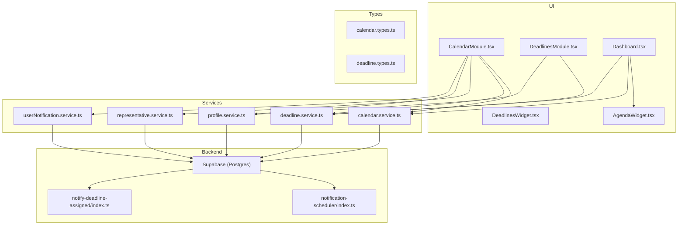

**Diagram sources**
- [CalendarModule.tsx:146-780](file://src/components/CalendarModule.tsx#L146-L780)
- [DeadlinesModule.tsx:349-800](file://src/components/DeadlinesModule.tsx#L349-L800)
- [calendar.service.ts:9-117](file://src/services/calendar.service.ts#L9-L117)
- [deadline.service.ts:11-207](file://src/services/deadline.service.ts#L11-L207)
- [representative.service.ts:15-315](file://src/services/representative.service.ts#L15-L315)
- [profile.service.ts:45-200](file://src/services/profile.service.ts#L45-L200)
- [notification-scheduler/index.ts:74-196](file://supabase/functions/notification-scheduler/index.ts#L74-L196)
- [DeadlinesWidget.tsx:23-118](file://src/components/dashboard/DeadlinesWidget.tsx#L23-L118)
- [userNotification.service.ts:1-252](file://src/services/userNotification.service.ts#L1-L252)
- [notify-deadline-assigned/index.ts:1-296](file://supabase/functions/notify-deadline-assigned/index.ts#L1-L296)
- [Dashboard.tsx:1059-1196](file://src/components/Dashboard.tsx#L1059-L1196)
- [AgendaWidget.tsx:1-116](file://src/components/dashboard/AgendaWidget.tsx#L1-L116)

**Section sources**
- [CalendarModule.tsx:146-780](file://src/components/CalendarModule.tsx#L146-L780)
- [DeadlinesModule.tsx:349-800](file://src/components/DeadlinesModule.tsx#L349-L800)
- [calendar.service.ts:9-117](file://src/services/calendar.service.ts#L9-L117)
- [deadline.service.ts:11-207](file://src/services/deadline.service.ts#L11-L207)
- [representative.service.ts:15-315](file://src/services/representative.service.ts#L15-L315)
- [profile.service.ts:45-200](file://src/services/profile.service.ts#L45-L200)
- [notification-scheduler/index.ts:74-196](file://supabase/functions/notification-scheduler/index.ts#L74-L196)
- [DeadlinesWidget.tsx:23-118](file://src/components/dashboard/DeadlinesWidget.tsx#L23-L118)
- [Dashboard.tsx:1059-1196](file://src/components/Dashboard.tsx#L1059-L1196)
- [AgendaWidget.tsx:1-116](file://src/components/dashboard/AgendaWidget.tsx#L1-L116)

## Core Components
- CalendarModule: Renders FullCalendar with multiple views, filters, and event creation/editing; integrates deadlines, hearings, requirements, and custom events; supports export to Excel/PDF and deletion logging.
- DeadlinesModule: Manages deadlines with status/priority/type, filters, bulk actions, comments, and reporting; calculates due dates and overdue states; integrates with reminder scheduler.
- Dashboard: Integrated calendar widget featuring an enhanced weekly strip that displays today in the leftmost position followed by the next six days, providing intuitive navigation and event visualization.
- CalendarService: Normalizes timestamps to local timezone, performs CRUD on calendar_events.
- DeadlineService: Filters and sorts deadlines, updates status/completion timestamps, and exposes upcoming/overdue helpers.
- Representative/Profile services: Member lookup and representative appointment linkage for calendar events.
- Notification scheduler: Periodic function that creates reminders and emails for deadlines and events.
- UserNotificationService: Handles appointment assignment notifications with contextual messaging and emoji support.

**Section sources**
- [CalendarModule.tsx:146-780](file://src/components/CalendarModule.tsx#L146-L780)
- [DeadlinesModule.tsx:349-800](file://src/components/DeadlinesModule.tsx#L349-L800)
- [calendar.service.ts:9-117](file://src/services/calendar.service.ts#L9-L117)
- [deadline.service.ts:11-207](file://src/services/deadline.service.ts#L11-L207)
- [representative.service.ts:94-166](file://src/services/representative.service.ts#L94-L166)
- [profile.service.ts:96-121](file://src/services/profile.service.ts#L96-L121)
- [notification-scheduler/index.ts:74-196](file://supabase/functions/notification-scheduler/index.ts#L74-L196)
- [userNotification.service.ts:195-230](file://src/services/userNotification.service.ts#L195-L230)
- [Dashboard.tsx:1059-1196](file://src/components/Dashboard.tsx#L1059-L1196)

## Architecture Overview
The Calendar & Deadlines system combines a React UI with Supabase-backed services and a serverless notification pipeline:
- UI components fetch data via services, which query Supabase tables.
- CalendarModule listens to real-time changes and merges calendar_events with deadlines, hearings, and requirements.
- DeadlinesModule computes buckets (overdue, soon, week, future) and supports comments and mentions.
- The notification-scheduler function periodically checks due dates and emits reminders and emails.
- **Updated** Dashboard integrates calendar functionality with an enhanced weekly strip that prioritizes today's date for improved user experience.

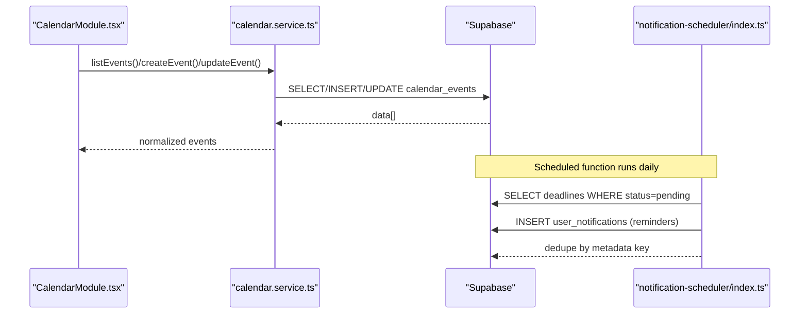

**Diagram sources**
- [CalendarModule.tsx:691-706](file://src/components/CalendarModule.tsx#L691-L706)
- [calendar.service.ts:29-113](file://src/services/calendar.service.ts#L29-L113)
- [notification-scheduler/index.ts:74-196](file://supabase/functions/notification-scheduler/index.ts#L74-L196)

## Detailed Component Analysis

### CalendarModule
- Views and navigation: monthGrid, timeGrid week/day, list; maintains calendarTitle and calendarView state; supports cronograma (schedule) view with period selection.
- Event sources: merges calendar_events with deadlines, hearings, and requirements; deduplicates hearing events; links representative appointments to calendar events.
- Filtering and permissions: per-type permission checks; viewFilters toggle; responsible filter defaults to "me" for non-admins.
- Creation/editing: NewEventForm supports title/date/time/type/description/client/responsible/private sharing; opens modal; persists via CalendarService.
- Export: Excel/PDF export for a selected period; includes visible event types.
- Deletion log: LocalStorage-based audit trail of deleted events.
- Real-time updates: Subscribes to Supabase postgres_changes for calendar_events, deadlines, and representative_appointments.
- **Mobile-responsive toolbar**: Implements a two-row design optimized for mobile devices:
  - First row: Primary navigation controls and "New" button for creating events
  - Second row (mobile only): Responsibility filters, schedule view, and action buttons for better mobile usability
- **Enhanced type safety**: SelectedEvent interface now includes clientId property for improved TypeScript type checking and deployment reliability

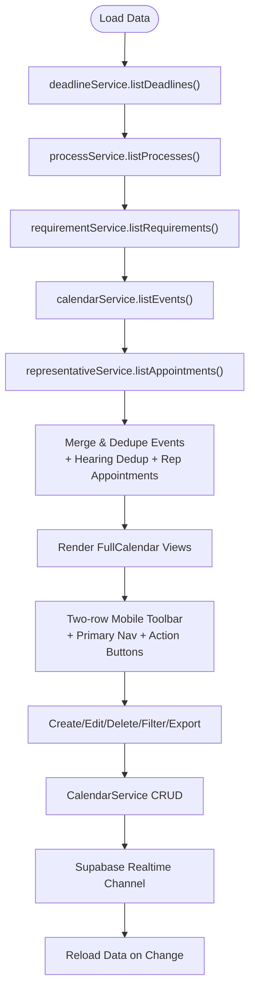

**Diagram sources**
- [CalendarModule.tsx:757-780](file://src/components/CalendarModule.tsx#L757-L780)
- [CalendarModule.tsx:782-942](file://src/components/CalendarModule.tsx#L782-L942)
- [CalendarModule.tsx:691-706](file://src/components/CalendarModule.tsx#L691-L706)
- [CalendarModule.tsx:2213-2267](file://src/components/CalendarModule.tsx#L2213-L2267)

**Section sources**
- [CalendarModule.tsx:146-780](file://src/components/CalendarModule.tsx#L146-L780)
- [CalendarModule.tsx:782-942](file://src/components/CalendarModule.tsx#L782-L942)
- [CalendarModule.tsx:944-1039](file://src/components/CalendarModule.tsx#L944-L1039)
- [CalendarModule.tsx:1041-1124](file://src/components/CalendarModule.tsx#L1041-L1124)
- [CalendarModule.tsx:2213-2267](file://src/components/CalendarModule.tsx#L2213-L2267)
- [CalendarModule.tsx:2220-2267](file://src/components/CalendarModule.tsx#L2220-L2267)

### DeadlinesModule
- Status and priority: Tracks pendente/cumprido/vencido/cancelado; supports urgente/alta/média/baixa.
- Bucketing: Computes critical/soon/week/future buckets based on days until due.
- Filters and sorting: Type, priority, responsible, status tabs, and free-text search; paginated results.
- Bulk actions: Delete, change status, change responsible.
- Comments and mentions: Optimistic UI for comments; resolves user names; notifies mentioned users and emails.
- Reporting and export: Excel/PDF export; report modal with period selection.
- Reminder scheduling: Integrates with notification-scheduler for deadline reminders and emails.

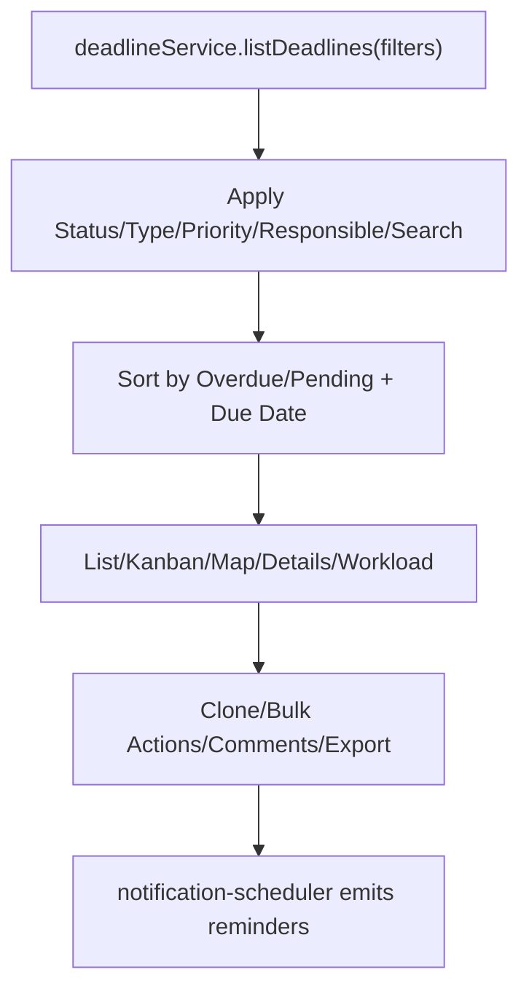

**Diagram sources**
- [DeadlinesModule.tsx:751-789](file://src/components/DeadlinesModule.tsx#L751-L789)
- [DeadlinesModule.tsx:594-750](file://src/components/DeadlinesModule.tsx#L594-L750)
- [DeadlinesModule.tsx:349-800](file://src/components/DeadlinesModule.tsx#L349-L800)
- [notification-scheduler/index.ts:74-196](file://supabase/functions/notification-scheduler/index.ts#L74-L196)

**Section sources**
- [DeadlinesModule.tsx:332-800](file://src/components/DeadlinesModule.tsx#L332-L800)
- [DeadlinesModule.tsx:594-750](file://src/components/DeadlinesModule.tsx#L594-L750)
- [DeadlinesModule.tsx:751-789](file://src/components/DeadlinesModule.tsx#L751-L789)

### Dashboard Calendar Widget
**Updated** The Dashboard component now features an enhanced calendar display system with improved weekly strip logic:

- **Today-centered weekly strip**: Displays today in the leftmost position followed by the next six days, replacing the traditional ISO week pattern
- **Enhanced date calculation**: Uses Array.from({ length: 7 }) to generate sequential dates starting from today
- **Improved event visualization**: Shows event markers with today highlighted in amber color scheme
- **Integrated widget design**: Combines weekly strip with event list in a cohesive dashboard layout
- **Responsive design**: Adapts to different screen sizes while maintaining the today-centered approach

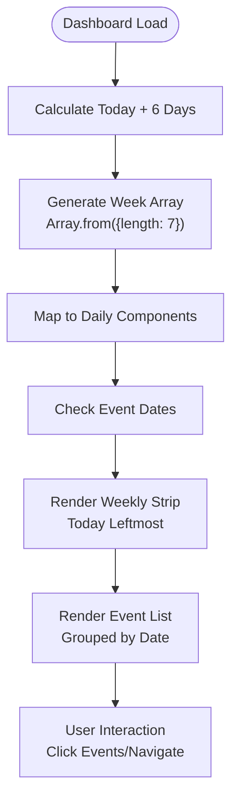

**Diagram sources**
- [Dashboard.tsx:1084-1121](file://src/components/Dashboard.tsx#L1084-L1121)
- [Dashboard.tsx:1086-1118](file://src/components/Dashboard.tsx#L1086-L1118)

**Section sources**
- [Dashboard.tsx:1059-1196](file://src/components/Dashboard.tsx#L1059-L1196)
- [Dashboard.tsx:1084-1121](file://src/components/Dashboard.tsx#L1084-L1121)
- [Dashboard.tsx:1086-1118](file://src/components/Dashboard.tsx#L1086-L1118)

### CalendarService
- Timezone handling: Converts naive local datetime strings to ISO with local offset (+/-HH:mm).
- CRUD: listEvents with optional type filters, getEventById, createEvent, updateEvent, deleteEvent.

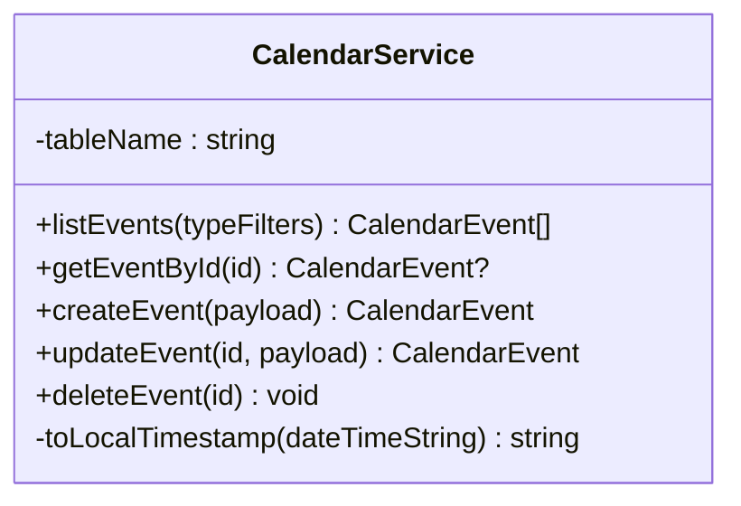

**Diagram sources**
- [calendar.service.ts:9-117](file://src/services/calendar.service.ts#L9-L117)

**Section sources**
- [calendar.service.ts:9-117](file://src/services/calendar.service.ts#L9-L117)

### DeadlineService
- Filtering: Supports status, priority, type, process_id, requirement_id, client_id, responsible_id, date range, and free-text search.
- Lifecycle: create/update/updateStatus/delete; sets completed_at on completion; upcoming/overdue helpers.

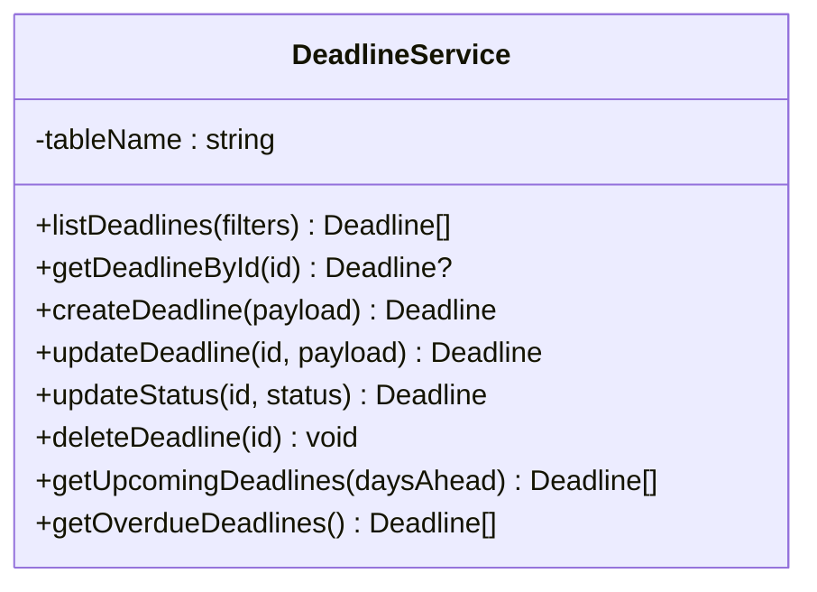

**Diagram sources**
- [deadline.service.ts:11-207](file://src/services/deadline.service.ts#L11-L207)

**Section sources**
- [deadline.service.ts:11-207](file://src/services/deadline.service.ts#L11-L207)

### Representative and Profile Services
- RepresentativeService: Lists representatives; manages representative_appointments with joins to calendar_events and representatives; supports status/payment updates and statistics.
- ProfileService: Lists members, searches, and presence helpers; used for member-based filtering and mentions.

**Section sources**
- [representative.service.ts:94-166](file://src/services/representative.service.ts#L94-L166)
- [representative.service.ts:258-311](file://src/services/representative.service.ts#L258-L311)
- [profile.service.ts:96-121](file://src/services/profile.service.ts#L96-L121)

### Enhanced Notification Logic
**Updated** The notification system now includes enhanced appointment assignment and sharing notifications with contextual messaging:

- **Contextual messaging**: Notifications include assigner names and event type information
- **Event type emojis**: Visual indicators for different event types (hearing, meeting, payment, pericia, personal, requirement, deadline)
- **Assignment notifications**: Automatic notifications when events are assigned to users or shared with them
- **Appointment reminders**: Contextual reminders with formatted dates and times

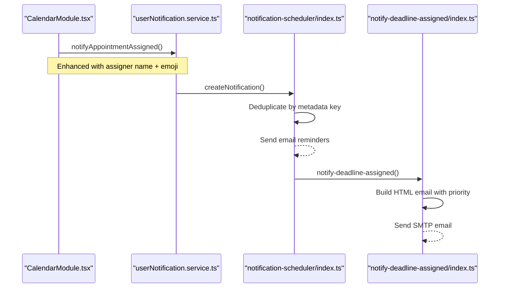

**Diagram sources**
- [CalendarModule.tsx:1340-1406](file://src/components/CalendarModule.tsx#L1340-L1406)
- [userNotification.service.ts:214-230](file://src/services/userNotification.service.ts#L214-L230)
- [notification-scheduler/index.ts:197-260](file://supabase/functions/notification-scheduler/index.ts#L197-L260)
- [notify-deadline-assigned/index.ts:216-277](file://supabase/functions/notify-deadline-assigned/index.ts#L216-L277)

**Section sources**
- [CalendarModule.tsx:1340-1406](file://src/components/CalendarModule.tsx#L1340-L1406)
- [userNotification.service.ts:214-230](file://src/services/userNotification.service.ts#L214-L230)
- [notification-scheduler/index.ts:197-260](file://supabase/functions/notification-scheduler/index.ts#L197-L260)
- [notify-deadline-assigned/index.ts:216-277](file://supabase/functions/notify-deadline-assigned/index.ts#L216-L277)

### Notification Scheduler
- Periodically checks deadlines and calendar events due within a window.
- Emits user_notifications with deduplication keys; sends email reminders to responsible users.

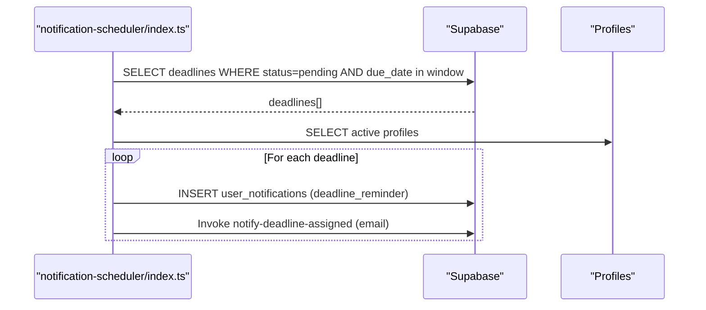

**Diagram sources**
- [notification-scheduler/index.ts:74-196](file://supabase/functions/notification-scheduler/index.ts#L74-L196)

**Section sources**
- [notification-scheduler/index.ts:74-196](file://supabase/functions/notification-scheduler/index.ts#L74-L196)

## Dependency Analysis
- CalendarModule depends on CalendarService, DeadlineService, RepresentativeService, ProfileService, and Supabase realtime channels.
- DeadlinesModule depends on DeadlineService, ProfileService, Supabase, and the notification-scheduler function.
- Dashboard integrates CalendarService and DeadlineService for the enhanced weekly strip display.
- Types define the contract between UI, services, and database.

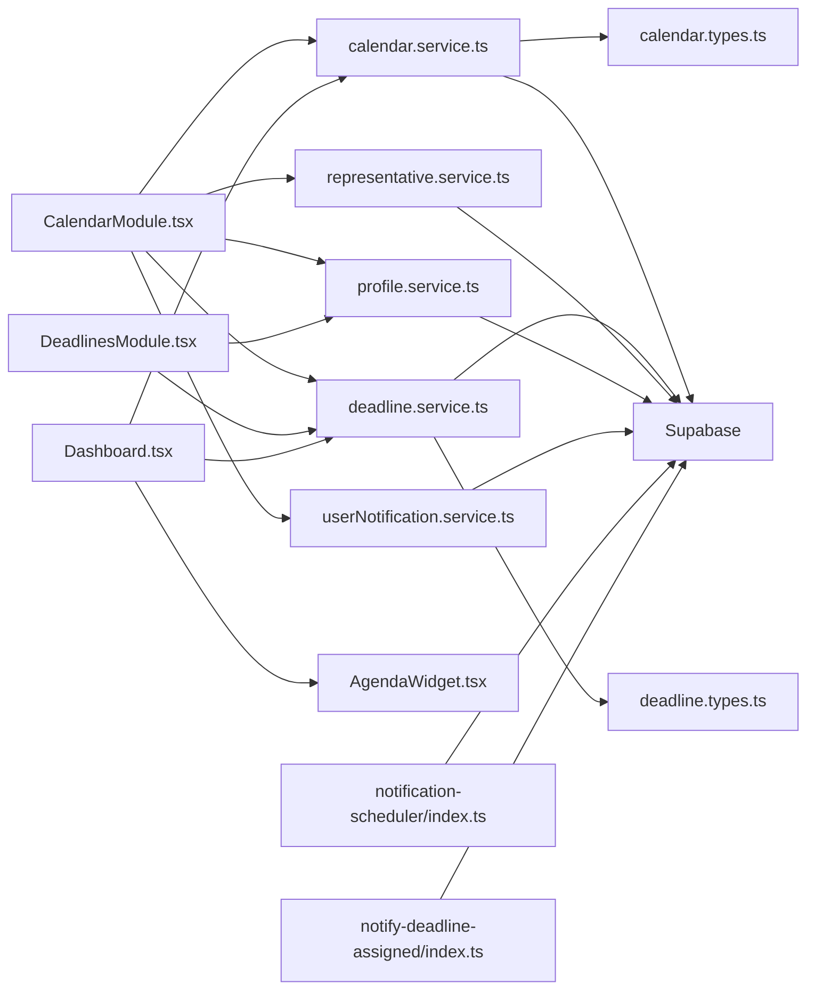

**Diagram sources**
- [CalendarModule.tsx:146-780](file://src/components/CalendarModule.tsx#L146-L780)
- [DeadlinesModule.tsx:349-800](file://src/components/DeadlinesModule.tsx#L349-L800)
- [calendar.service.ts:9-117](file://src/services/calendar.service.ts#L9-L117)
- [deadline.service.ts:11-207](file://src/services/deadline.service.ts#L11-L207)
- [representative.service.ts:15-315](file://src/services/representative.service.ts#L15-L315)
- [profile.service.ts:45-200](file://src/services/profile.service.ts#L45-L200)
- [calendar.types.ts:1-52](file://src/types/calendar.types.ts#L1-L52)
- [deadline.types.ts:1-71](file://src/types/deadline.types.ts#L1-L71)
- [notification-scheduler/index.ts:74-196](file://supabase/functions/notification-scheduler/index.ts#L74-L196)
- [userNotification.service.ts:1-252](file://src/services/userNotification.service.ts#L1-L252)
- [notify-deadline-assigned/index.ts:1-296](file://supabase/functions/notify-deadline-assigned/index.ts#L1-L296)
- [Dashboard.tsx:1059-1196](file://src/components/Dashboard.tsx#L1059-L1196)
- [AgendaWidget.tsx:1-116](file://src/components/dashboard/AgendaWidget.tsx#L1-L116)

**Section sources**
- [CalendarModule.tsx:146-780](file://src/components/CalendarModule.tsx#L146-L780)
- [DeadlinesModule.tsx:349-800](file://src/components/DeadlinesModule.tsx#L349-L800)
- [calendar.types.ts:1-52](file://src/types/calendar.types.ts#L1-L52)
- [deadline.types.ts:1-71](file://src/types/deadline.types.ts#L1-L71)

## Performance Considerations
- CalendarModule merges multiple datasets and deduplicates events; memoization and efficient filtering reduce re-renders.
- DeadlineService supports server-side filtering and pagination; UI pages results to avoid large lists.
- Notification scheduler runs periodically and uses deduplication to prevent spam.
- Timezone conversion in CalendarService ensures consistent storage and rendering across devices.
- **Mobile optimization**: Two-row toolbar reduces scrolling and improves accessibility on smaller screens.
- **Dashboard performance**: Enhanced weekly strip uses efficient date calculations and event mapping for optimal rendering.
- **Type safety improvements**: Enhanced TypeScript definitions improve compile-time error detection and deployment reliability.

## Troubleshooting Guide
- Realtime not updating: Verify Supabase channel subscription and that tables (calendar_events, deadlines, representative_appointments) are included.
- Timezone issues: Confirm CalendarService's toLocalTimestamp behavior and that client-side parsing respects local offsets.
- Reminders not firing: Check notification-scheduler logs and deadline.notify_days_before values; ensure profiles are active.
- Export failures: Validate selected period and format; ensure browser supports file-saver/pdf-lib.
- **Mobile toolbar issues**: Verify responsive breakpoints and ensure the two-row toolbar is properly configured for mobile devices.
- **Notification delivery problems**: Check userNotificationService.createNotification calls and ensure deduplication keys are properly set.
- **Dashboard calendar display issues**: Verify the weekly strip date calculation logic and ensure today is properly centered in the display.
- **Type safety errors**: Ensure all calendar event handlers properly handle the clientId property in SelectedEvent interface.

**Section sources**
- [CalendarModule.tsx:691-706](file://src/components/CalendarModule.tsx#L691-L706)
- [calendar.service.ts:12-27](file://src/services/calendar.service.ts#L12-L27)
- [notification-scheduler/index.ts:74-196](file://supabase/functions/notification-scheduler/index.ts#L74-L196)
- [Dashboard.tsx:1084-1121](file://src/components/Dashboard.tsx#L1084-L1121)

## Conclusion
The Calendar & Deadlines module provides a unified, real-time system for managing legal deadlines, hearings, requirements, and general events. It offers flexible views, robust filtering, team collaboration via representative appointments and mentions, and automated reminders. The services and types ensure consistent data handling and timezone-aware operations, while the notification scheduler keeps stakeholders informed. The recent calendar display logic improvements in the Dashboard component enhance user experience by prioritizing today's date in the weekly strip, replacing traditional ISO week patterns with a more intuitive left-to-right progression. The enhanced notification system provides more contextual and informative alerts with assigner names and event type emojis, while the mobile-responsive toolbar restructuring improves usability on smaller screens.

**Updated** The CalendarModule component now includes enhanced TypeScript type safety through the addition of the clientId property to the SelectedEvent interface, improving type definitions and deployment reliability across all calendar event handling scenarios. This enhancement ensures stronger client identification and better type checking throughout the calendar event lifecycle.

## Appendices

### Calendar Integration Details
- Event creation/editing: CalendarModule's NewEventForm maps to CalendarService.createEvent/updateEvent; supports private/shared visibility and client linkage.
- Recurring events: No explicit recurrence rule parsing is present; recurring logic would require extending DTOs and service methods.
- Calendar navigation: Maintains month/year view state and calendarTitle; supports cronograma schedule view with period selection.
- **Mobile toolbar**: Two-row design with primary navigation controls and action buttons optimized for mobile device usability.
- **Dashboard integration**: Enhanced weekly strip displays today + 6 upcoming days for improved navigation and event access.
- **Enhanced type safety**: SelectedEvent interface now includes clientId property for improved TypeScript type checking and deployment reliability.

**Section sources**
- [CalendarModule.tsx:452-473](file://src/components/CalendarModule.tsx#L452-L473)
- [CalendarModule.tsx:1041-1072](file://src/components/CalendarModule.tsx#L1041-L1072)
- [calendar.service.ts:60-104](file://src/services/calendar.service.ts#L60-L104)
- [CalendarModule.tsx:2213-2267](file://src/components/CalendarModule.tsx#L2213-L2267)
- [Dashboard.tsx:1084-1121](file://src/components/Dashboard.tsx#L1084-L1121)

### DeadlinesModule Features
- Categories and priorities: DeadlineType (processo/requerimento/geral), DeadlinePriority (baixa/média/alta/urgente).
- Escalation rules: Buckets computed by days until due; dashboard widget highlights urgency.
- Status tracking: Cumprido sets completed_at; cancelado/status filters manage visibility.

**Section sources**
- [DeadlinesModule.tsx:63-137](file://src/components/DeadlinesModule.tsx#L63-L137)
- [deadline.types.ts:1-71](file://src/types/deadline.types.ts#L1-L71)
- [DeadlinesWidget.tsx:13-21](file://src/components/dashboard/DeadlinesWidget.tsx#L13-L21)

### Calendar Service CRUD and Timezone Handling
- CRUD: listEvents/getEventById/createEvent/updateEvent/deleteEvent; list supports type filters.
- Timezone: toLocalTimestamp appends local offset to naive datetime strings.

**Section sources**
- [calendar.service.ts:29-113](file://src/services/calendar.service.ts#L29-L113)

### Deadline Service CRUD, Reminders, and Status Tracking
- CRUD: create/update/updateStatus/delete with filters and search.
- Reminders: notify_days_before triggers notification-scheduler; emails sent to responsible users.
- Status tracking: completed_at set on completion; upcoming/overdue helpers.

**Section sources**
- [deadline.service.ts:14-207](file://src/services/deadline.service.ts#L14-L207)
- [notification-scheduler/index.ts:74-196](file://supabase/functions/notification-scheduler/index.ts#L74-L196)

### Team Collaboration and Mentions
- Representative appointments: Linked to calendar events; used for scheduling and billing.
- Mentions: DeadlinesModule supports @mentions in comments; notifies mentioned users and emails.

**Section sources**
- [representative.service.ts:101-166](file://src/services/representative.service.ts#L101-L166)
- [DeadlinesModule.tsx:594-750](file://src/components/DeadlinesModule.tsx#L594-L750)

### Calendar Synchronization, Import/Export, and External Services
- Export: CalendarModule supports Excel and PDF exports for selected periods.
- Import: No explicit import functionality found in CalendarModule; could be added via spreadsheet parsing and CalendarService.createEvent.
- External calendar services: No Google Calendar or iCal sync logic detected; integration would require OAuth and event mapping.

**Section sources**
- [CalendarModule.tsx:3875-3901](file://src/components/CalendarModule.tsx#L3875-L3901)

### Enhanced Notification System
**Updated** The notification system now includes advanced contextual messaging:

- **Appointment assignment notifications**: Automatically created when events are assigned to users or shared with them
- **Contextual messaging**: Includes assigner names and formatted event details
- **Event type emojis**: Visual indicators for different event types (hearing: ⚖️, meeting: 🤝, payment: 💰, pericia: 🔬, personal: 👤, requirement: 📋, deadline: 📅)
- **Deduplication**: Prevents duplicate notifications using metadata keys
- **Email integration**: Works with notify-deadline-assigned function for comprehensive communication

**Section sources**
- [CalendarModule.tsx:1340-1406](file://src/components/CalendarModule.tsx#L1340-L1406)
- [userNotification.service.ts:214-230](file://src/services/userNotification.service.ts#L214-L230)
- [notification-scheduler/index.ts:197-260](file://supabase/functions/notification-scheduler/index.ts#L197-L260)
- [notify-deadline-assigned/index.ts:216-277](file://supabase/functions/notify-deadline-assigned/index.ts#L216-L277)

### Dashboard Calendar Widget Implementation
**Updated** The Dashboard component features an enhanced calendar display system:

- **Today-centered weekly strip**: Generates seven consecutive days starting from today using Array.from({ length: 7 })
- **Improved date calculation**: Uses setDate(today.getDate() + i) to create sequential dates
- **Enhanced visual feedback**: Today's date is highlighted in amber with special styling
- **Event density indication**: Shows event markers with different colors for today vs. other days
- **Responsive design**: Adapts to different screen sizes while maintaining the today-centered approach

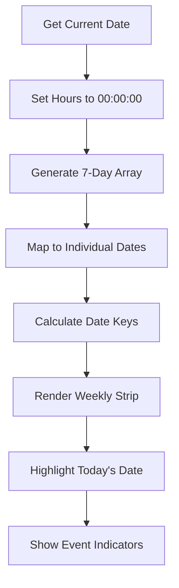

**Diagram sources**
- [Dashboard.tsx:1084-1121](file://src/components/Dashboard.tsx#L1084-L1121)
- [Dashboard.tsx:1086-1118](file://src/components/Dashboard.tsx#L1086-L1118)

**Section sources**
- [Dashboard.tsx:1059-1196](file://src/components/Dashboard.tsx#L1059-L1196)
- [Dashboard.tsx:1084-1121](file://src/components/Dashboard.tsx#L1084-L1121)
- [Dashboard.tsx:1086-1118](file://src/components/Dashboard.tsx#L1086-L1118)

### Examples and How-To
- Customize calendar views: Switch calendarView state among dayGridMonth/timeGridWeek/timeGridDay/listWeek; adjust calendarTitle for custom labels.
- Set up reminder systems: Configure deadline.notify_days_before; ensure notification-scheduler is deployed and scheduled.
- Integrate with external calendar services: Add OAuth flow, map events to CalendarService.createEvent, and handle sync conflicts.
- **Mobile optimization**: The two-row toolbar automatically adapts to mobile screens, with the second row containing responsibility filters, schedule view, and action buttons for better mobile usability.
- **Enhanced notifications**: Configure appointment assignment notifications to include contextual information with assigner names and event type emojis for improved user experience.
- **Dashboard customization**: The weekly strip automatically centers today's date and displays the next six days for intuitive navigation and event planning.
- **Type safety improvements**: Ensure all calendar event handlers properly utilize the clientId property from the SelectedEvent interface for enhanced type checking and deployment reliability.