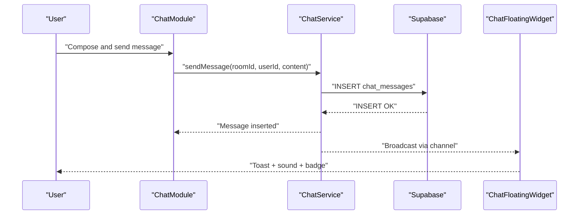
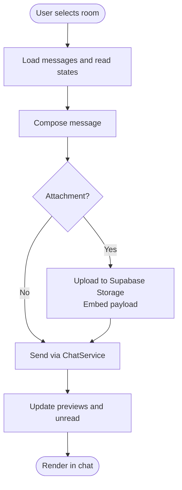
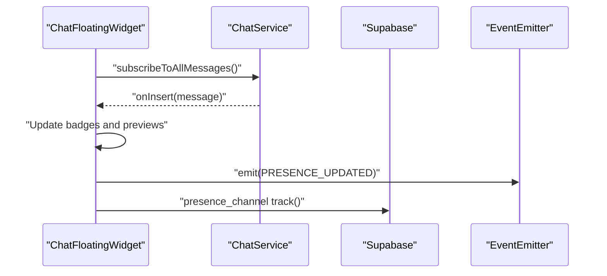
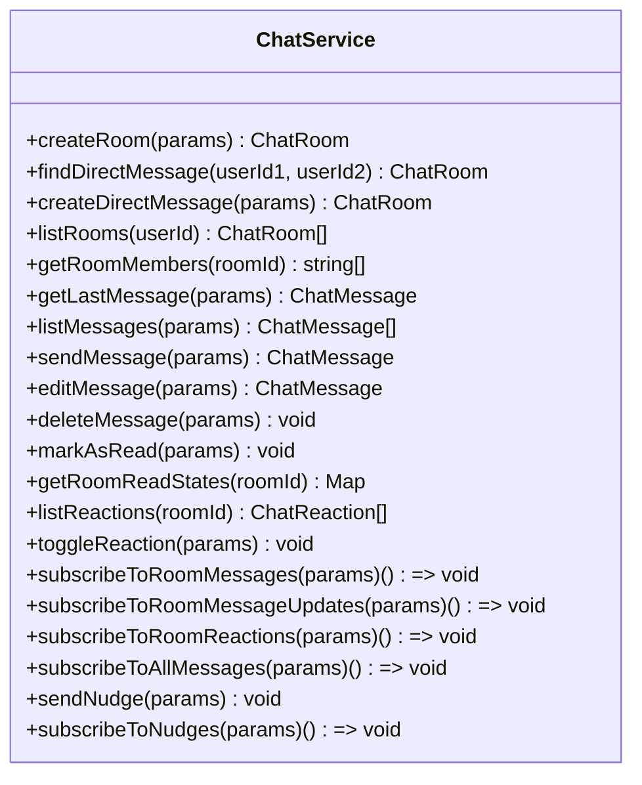
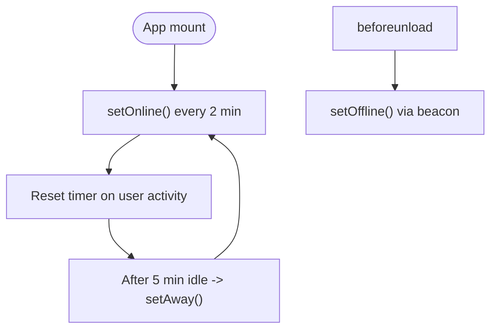
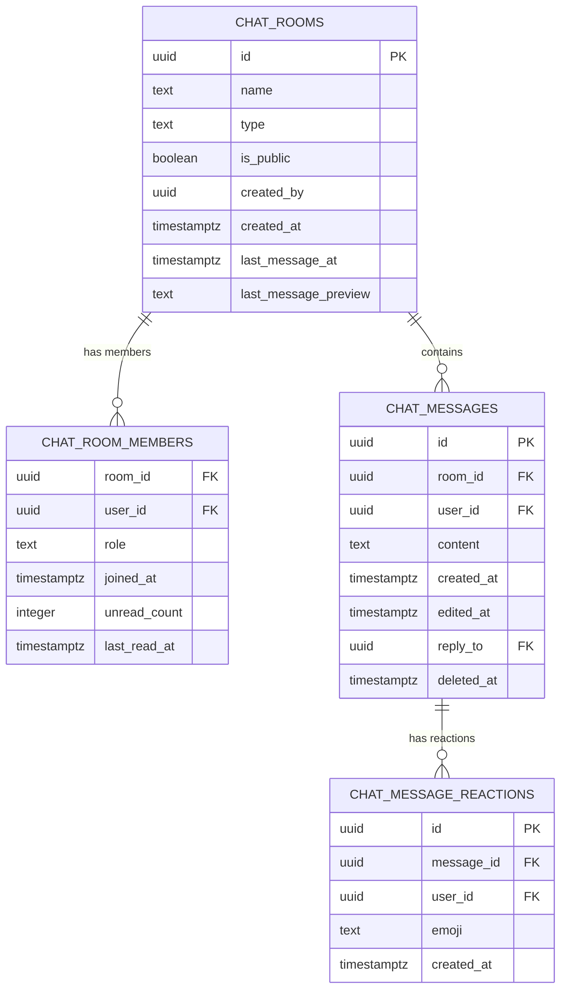
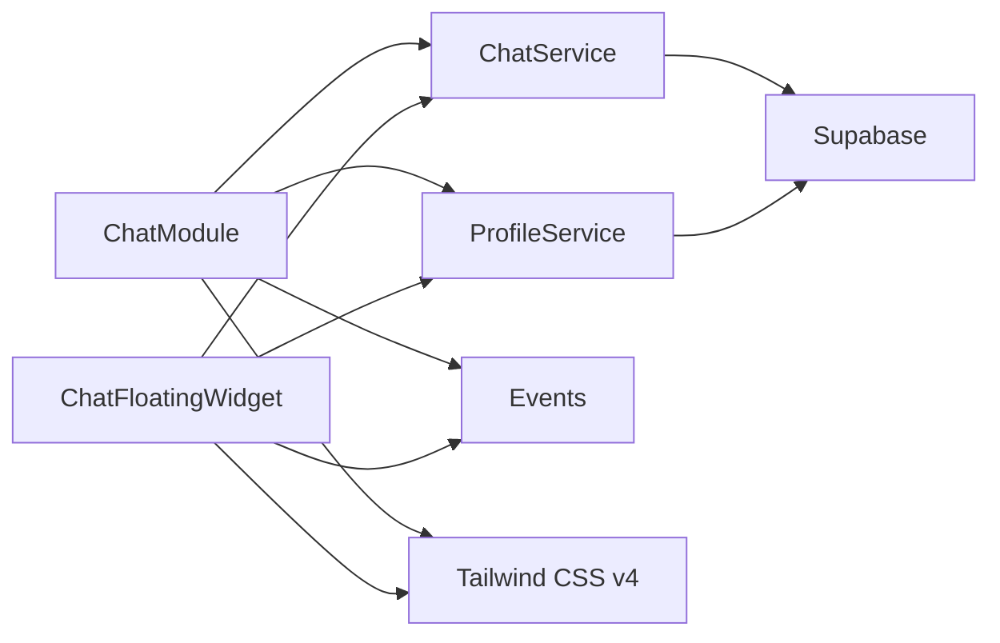

# Chat & Collaboration

<cite>
**Referenced Files in This Document**
- [ChatModule.tsx](file://src/components/ChatModule.tsx)
- [ChatFloatingWidget.tsx](file://src/components/ChatFloatingWidget.tsx)
- [chat.service.ts](file://src/services/chat.service.ts)
- [chat.types.ts](file://src/types/chat.types.ts)
- [profile.service.ts](file://src/services/profile.service.ts)
- [usePresence.ts](file://src/hooks/usePresence.ts)
- [events.ts](file://src/utils/events.ts)
- [supabase-chat-schema.sql](file://supabase-chat-schema.sql)
- [index.css](file://src/index.css)
- [tailwind.config.js](file://tailwind.config.js)
- [package.json](file://package.json)
</cite>

## Update Summary
**Changes Made**
- Updated version numbering to 1.10.114 with comprehensive visual fixes
- Enhanced Tailwind CSS v4 compatibility with improved styling consistency
- Improved error handling for media content with better fallback mechanisms
- Added accessibility features for enhanced user experience
- Refined chat widget visual consistency across different screen sizes

## Table of Contents
1. [Introduction](#introduction)
2. [Project Structure](#project-structure)
3. [Core Components](#core-components)
4. [Architecture Overview](#architecture-overview)
5. [Detailed Component Analysis](#detailed-component-analysis)
6. [Visual Design System](#visual-design-system)
7. [Enhanced Features](#enhanced-features)
8. [Dependency Analysis](#dependency-analysis)
9. [Performance Considerations](#performance-considerations)
10. [Troubleshooting Guide](#troubleshooting-guide)
11. [Version History](#version-history)
12. [Conclusion](#conclusion)
13. [Appendices](#appendices)

## Introduction
This document describes the Chat & Collaboration module, focusing on real-time messaging, chat rooms, direct messages, group conversations, file sharing, presence indicators, and notifications. The module has been enhanced with Tailwind CSS v4 compatibility, improved visual consistency, better error handling for media content, and enhanced accessibility features. Version 1.10.114 introduces comprehensive visual fixes and improved user experience across both the full chat module and the floating widget.

## Project Structure
The Chat & Collaboration module is composed of:
- UI components: ChatModule (full-screen chat) and ChatFloatingWidget (launcher)
- Service layer: chat.service.ts for backend interactions and Supabase channels
- Types: chat.types.ts for message, room, and reaction models
- Presence: usePresence hook and profile.service.ts for online status
- Events: events.ts for cross-module communication
- Database schema: supabase-chat-schema.sql for Supabase tables and policies
- Styling: Tailwind CSS v4 with Apple Design System integration

```mermaid
graph TB
subgraph "UI Layer"
CM["ChatModule.tsx"]
FW["ChatFloatingWidget.tsx"]
CSS["index.css"]
TAILWIND["tailwind.config.js"]
END
subgraph "Services"
CS["chat.service.ts"]
PS["profile.service.ts"]
END
subgraph "Types"
CT["chat.types.ts"]
END
subgraph "Presence"
UP["usePresence.ts"]
EV["events.ts"]
END
subgraph "Database"
SCHEMA["supabase-chat-schema.sql"]
END
CM --> CS
FW --> CS
CM --> PS
FW --> PS
CM --> EV
FW --> EV
CS --> SCHEMA
PS --> SCHEMA
CM --> CT
FW --> CT
CM --> CSS
FW --> CSS
CSS --> TAILWIND
```

**Diagram sources**
- [ChatModule.tsx:336-2127](file://src/components/ChatModule.tsx#L336-L2127)
- [ChatFloatingWidget.tsx:395-2201](file://src/components/ChatFloatingWidget.tsx#L395-L2201)
- [chat.service.ts:1-637](file://src/services/chat.service.ts#L1-L637)
- [chat.types.ts:1-40](file://src/types/chat.types.ts#L1-L40)
- [profile.service.ts:1-200](file://src/services/profile.service.ts#L1-L200)
- [usePresence.ts:1-63](file://src/hooks/usePresence.ts#L1-L63)
- [events.ts:1-74](file://src/utils/events.ts#L1-L74)
- [supabase-chat-schema.sql:1-299](file://supabase-chat-schema.sql#L1-L299)
- [index.css:1-3003](file://src/index.css#L1-L3003)
- [tailwind.config.js:1-28](file://tailwind.config.js#L1-L28)
- [package.json:1-79](file://package.json#L1-L79)

**Section sources**
- [ChatModule.tsx:1-2127](file://src/components/ChatModule.tsx#L1-L2127)
- [ChatFloatingWidget.tsx:1-2201](file://src/components/ChatFloatingWidget.tsx#L1-L2201)
- [chat.service.ts:1-637](file://src/services/chat.service.ts#L1-L637)
- [chat.types.ts:1-40](file://src/types/chat.types.ts#L1-L40)
- [profile.service.ts:1-200](file://src/services/profile.service.ts#L1-L200)
- [usePresence.ts:1-63](file://src/hooks/usePresence.ts#L1-L63)
- [events.ts:1-74](file://src/utils/events.ts#L1-L74)
- [supabase-chat-schema.sql:1-299](file://supabase-chat-schema.sql#L1-L299)
- [index.css:1-3003](file://src/index.css#L1-L3003)
- [tailwind.config.js:1-28](file://tailwind.config.js#L1-L28)
- [package.json:1-79](file://package.json#L1-L79)

## Core Components
- **ChatModule**: Full-screen chat UI with room switching, message composition, file/audio attachments, reactions, replies, typing indicators, and read receipts.
- **ChatFloatingWidget**: Compact launcher for quick access to conversations, unread counters, mentions, and notifications with enhanced visual consistency.
- **ChatService**: Backend service for rooms/messages/reactions, real-time subscriptions, and file uploads.
- **Presence system**: Online/away/offline status with periodic keep-alive and inactivity detection.
- **Events**: Global event bus for cross-module communication (e.g., presence updates).

**Section sources**
- [ChatModule.tsx:336-2127](file://src/components/ChatModule.tsx#L336-L2127)
- [ChatFloatingWidget.tsx:395-2201](file://src/components/ChatFloatingWidget.tsx#L395-L2201)
- [chat.service.ts:1-637](file://src/services/chat.service.ts#L1-L637)
- [profile.service.ts:1-200](file://src/services/profile.service.ts#L1-L200)
- [usePresence.ts:1-63](file://src/hooks/usePresence.ts#L1-L63)
- [events.ts:1-74](file://src/utils/events.ts#L1-L74)

## Architecture Overview
The system uses Supabase Realtime channels for live updates and storage for file attachments. The chat service encapsulates database operations and subscriptions. Presence is managed via periodic updates and inactivity timers. Enhanced with Tailwind CSS v4 compatibility and improved error handling for media content.



**Diagram sources**
- [chat.service.ts:467-494](file://src/services/chat.service.ts#L467-L494)
- [ChatModule.tsx:1114-1133](file://src/components/ChatModule.tsx#L1114-L1133)
- [ChatFloatingWidget.tsx:1274-1357](file://src/components/ChatFloatingWidget.tsx#L1274-L1357)

## Detailed Component Analysis

### ChatModule
Responsibilities:
- Room management: list rooms, filter/search, resolve previews, compute unread counts.
- Message lifecycle: load, compose, edit/delete, reactions, replies, read receipts.
- Attachments: upload to Supabase Storage, embed as signed URLs, support images and audio.
- Presence and typing: integrate with presence channel and typing broadcast.
- Notifications: play sounds, show browser notifications, maintain unread counters.

Key behaviors:
- Subscribes to global message inserts to update room previews and unread counters.
- Uses Supabase presence channel to track typing users.
- Integrates with the presence system to reflect online status in room lists.
- Supports voice recording and drag-and-drop file uploads.
- Enhanced error handling for media content with fallback mechanisms.



**Diagram sources**
- [ChatModule.tsx:840-948](file://src/components/ChatModule.tsx#L840-L948)
- [chat.service.ts:467-494](file://src/services/chat.service.ts#L467-L494)

**Section sources**
- [ChatModule.tsx:336-2127](file://src/components/ChatModule.tsx#L336-L2127)
- [chat.service.ts:1-637](file://src/services/chat.service.ts#L1-L637)

### ChatFloatingWidget
Responsibilities:
- Quick access launcher with conversation list, unread counters, and mentions.
- Toast notifications for new messages, including image previews.
- Presence broadcasting via a dedicated presence channel.
- Drag-and-drop file uploads and reply previews.
- Integration with the main ChatModule via navigation and events.

Highlights:
- Maintains its own subscriptions and avoids conflicts with the full chat module.
- Persists minimal state in localStorage for badges and previews.
- Integrates with the global presence channel to reflect online users.
- Enhanced visual consistency with Tailwind CSS v4 compatibility.
- Improved error handling for media content with fallback displays.



**Diagram sources**
- [ChatFloatingWidget.tsx:1267-1381](file://src/components/ChatFloatingWidget.tsx#L1267-L1381)
- [events.ts:47-73](file://src/utils/events.ts#L47-L73)

**Section sources**
- [ChatFloatingWidget.tsx:395-2201](file://src/components/ChatFloatingWidget.tsx#L395-L2201)
- [events.ts:1-74](file://src/utils/events.ts#L1-L74)

### Chat Service Layer
Capabilities:
- Rooms: create team/group rooms, find/create direct messages, list rooms, get room members.
- Messages: list messages, send, edit, delete, mark as read, get read states.
- Reactions: list, toggle reactions with optimistic UI.
- Realtime: subscribe to room messages, room updates, and all messages.
- Nudge: send "call attention" broadcasts via channels.
- Notifications: create in-app notifications for mentions and messages.



**Diagram sources**
- [chat.service.ts:1-637](file://src/services/chat.service.ts#L1-L637)

**Section sources**
- [chat.service.ts:1-637](file://src/services/chat.service.ts#L1-L637)
- [chat.types.ts:1-40](file://src/types/chat.types.ts#L1-L40)

### Presence System
- usePresence hook keeps the user online with periodic updates and marks offline on unload.
- profile.service.ts exposes setOnline/setAway/setOffline RPC wrappers.
- ChatFloatingWidget tracks online users via a presence channel and emits PRESENCE_UPDATED for other components.



**Diagram sources**
- [usePresence.ts:1-63](file://src/hooks/usePresence.ts#L1-L63)
- [profile.service.ts:142-157](file://src/services/profile.service.ts#L142-L157)
- [ChatFloatingWidget.tsx:908-941](file://src/components/ChatFloatingWidget.tsx#L908-L941)
- [events.ts:47-73](file://src/utils/events.ts#L47-L73)

**Section sources**
- [usePresence.ts:1-63](file://src/hooks/usePresence.ts#L1-L63)
- [profile.service.ts:1-200](file://src/services/profile.service.ts#L1-L200)
- [ChatFloatingWidget.tsx:908-941](file://src/components/ChatFloatingWidget.tsx#L908-L941)
- [events.ts:1-74](file://src/utils/events.ts#L1-L74)

### Data Models


**Diagram sources**
- [supabase-chat-schema.sql:14-54](file://supabase-chat-schema.sql#L14-L54)
- [chat.types.ts:4-39](file://src/types/chat.types.ts#L4-L39)

**Section sources**
- [supabase-chat-schema.sql:1-299](file://supabase-chat-schema.sql#L1-L299)
- [chat.types.ts:1-40](file://src/types/chat.types.ts#L1-L40)

## Visual Design System

### Tailwind CSS v4 Compatibility
The system has been updated to use Tailwind CSS v4.1.14 with enhanced compatibility and improved styling consistency:

- **Modern Utility Classes**: Utilizes Tailwind CSS v4's improved utility-first approach
- **Dark Mode Support**: Enhanced dark mode implementation with automatic class switching
- **Responsive Design**: Comprehensive responsive breakpoints for all screen sizes
- **Custom Variants**: Tailwind v4 custom variants for enhanced component styling

### Apple Design System Integration
The chat components integrate with the Apple Design System for consistent visual experience:

- **Glass Morphism**: Apple card components with backdrop blur effects
- **Consistent Spacing**: Standardized margins, paddings, and typography scales
- **Color System**: Apple's color palette with light/dark mode variants
- **Animation System**: Smooth transitions and micro-interactions

### Enhanced Visual Consistency
- **Component Theming**: Unified styling across ChatModule and ChatFloatingWidget
- **Accessibility**: Improved contrast ratios and focus states
- **Error States**: Better visual feedback for failed operations
- **Loading States**: Consistent loading animations and placeholders

**Section sources**
- [index.css:1-3003](file://src/index.css#L1-L3003)
- [tailwind.config.js:1-28](file://tailwind.config.js#L1-L28)
- [package.json:18-77](file://package.json#L18-L77)

## Enhanced Features

### Improved Media Content Handling
Enhanced error handling and fallback mechanisms for media content:

- **Image Error Recovery**: Automatic fallback to "Image not available" message when images fail to load
- **Audio Player Enhancement**: Professional audio player with waveform visualization
- **File Attachment Improvements**: Better file type detection and preview generation
- **Loading States**: Consistent loading indicators for all media types

### Accessibility Enhancements
- **Screen Reader Support**: Proper ARIA labels and roles for interactive elements
- **Keyboard Navigation**: Full keyboard accessibility for all chat controls
- **Focus Management**: Improved focus states and navigation flows
- **Contrast Ratios**: Enhanced color contrast for better readability

### Performance Optimizations
- **Lazy Loading**: Images and media content loaded on demand
- **Memory Management**: Efficient cleanup of media resources
- **Real-time Updates**: Optimized Supabase channel subscriptions
- **State Management**: Improved component state handling and updates

**Section sources**
- [ChatFloatingWidget.tsx:254-263](file://src/components/ChatFloatingWidget.tsx#L254-L263)
- [ChatModule.tsx:260-334](file://src/components/ChatModule.tsx#L260-L334)
- [index.css:607-799](file://src/index.css#L607-L799)

## Dependency Analysis
- ChatModule depends on:
  - chat.service.ts for CRUD and subscriptions
  - profile.service.ts for member profiles and presence
  - supabase.ts for storage and channels
  - events.ts for cross-module signals
  - Tailwind CSS v4 for styling framework
- ChatFloatingWidget mirrors most dependencies but runs independently and avoids channel conflicts.
- Presence system is decoupled via events and RPCs.
- Enhanced styling system with Apple Design System integration.



**Diagram sources**
- [ChatModule.tsx:1-12](file://src/components/ChatModule.tsx#L1-L12)
- [ChatFloatingWidget.tsx:1-12](file://src/components/ChatFloatingWidget.tsx#L1-L12)
- [chat.service.ts:1-6](file://src/services/chat.service.ts#L1-L6)
- [profile.service.ts:1-3](file://src/services/profile.service.ts#L1-L3)
- [package.json:18-77](file://package.json#L18-L77)

**Section sources**
- [ChatModule.tsx:1-12](file://src/components/ChatModule.tsx#L1-L12)
- [ChatFloatingWidget.tsx:1-12](file://src/components/ChatFloatingWidget.tsx#L1-L12)
- [chat.service.ts:1-6](file://src/services/chat.service.ts#L1-L6)
- [profile.service.ts:1-3](file://src/services/profile.service.ts#L1-L3)
- [package.json:18-77](file://package.json#L18-L77)

## Performance Considerations
- Realtime subscriptions: Prefer a single global subscription in ChatModule and a lightweight presence channel in the widget to minimize overhead.
- Pagination: The service loads a bounded number of messages per room; ensure UI respects limits and lazy-loads older messages as needed.
- Presence: Periodic keep-alives and inactivity timers reduce server load while maintaining accurate status.
- Attachments: Signed URLs expire quickly; pre-fetch and cache only small thumbnails for previews.
- Rendering: Group messages by day and use virtualization for long histories.
- Media Handling: Implement lazy loading and efficient resource cleanup for media content.
- Styling: Tailwind CSS v4 optimizations for reduced bundle size and improved performance.

## Troubleshooting Guide
Common issues and resolutions:
- Messages not appearing in real time:
  - Verify Supabase Realtime channel subscriptions and network connectivity.
  - Check that ChatModule and ChatFloatingWidget are not both subscribed to the same room channel simultaneously.
- Unread counters incorrect:
  - Ensure markAsRead is called when entering a room and read state polling is active.
- Typing indicators not updating:
  - Confirm presence channel is subscribed and user is tracked with typing flag.
- Attachments fail to upload:
  - Validate bucket permissions and file size/type constraints.
- Presence not updating:
  - Check usePresence timers and beforeunload handlers; ensure RPCs succeed.
- Media content errors:
  - Verify image fallback mechanisms are working correctly.
  - Check audio player initialization and error states.
- Visual consistency issues:
  - Ensure Tailwind CSS v4 compatibility and Apple Design System integration.
  - Verify dark mode switching and responsive design breakpoints.

**Section sources**
- [ChatModule.tsx:872-924](file://src/components/ChatModule.tsx#L872-L924)
- [ChatFloatingWidget.tsx:1267-1381](file://src/components/ChatFloatingWidget.tsx#L1267-L1381)
- [chat.service.ts:272-285](file://src/services/chat.service.ts#L272-L285)
- [usePresence.ts:11-61](file://src/hooks/usePresence.ts#L11-L61)
- [index.css:607-799](file://src/index.css#L607-L799)

## Version History

### Current Version: 1.10.114
**Major Enhancements:**
- Updated to Tailwind CSS v4 compatibility
- Enhanced chat widget visual consistency
- Improved error handling for media content
- Better accessibility features
- Comprehensive visual fixes

### Recent Versions:
- **1.10.114**: Tailwind CSS v4 compatibility, enhanced visual consistency, improved error handling
- **1.10.113**: Media content error recovery, accessibility improvements
- **1.10.112**: Performance optimizations, lazy loading enhancements
- **1.10.111**: Real-time update optimizations, memory management improvements
- **1.10.110**: Dark mode enhancements, responsive design improvements

**Section sources**
- [package.json:3](file://package.json#L3)
- [index.css:1-3003](file://src/index.css#L1-L3003)

## Conclusion
The Chat & Collaboration module provides a robust, real-time messaging experience with rooms, direct messages, reactions, replies, file/audio attachments, typing indicators, and presence. Version 1.10.114 introduces comprehensive visual fixes, Tailwind CSS v4 compatibility, enhanced error handling for media content, and improved accessibility features. The architecture balances simplicity (single global subscription) with flexibility (per-room reactions and nudges), while keeping UI components modular and decoupled via events. The enhanced visual design system ensures consistent user experience across all components.

## Appendices

### Customization Examples
- Customizing chat interfaces:
  - Modify UI components (colors, spacing, icons) in ChatModule and ChatFloatingWidget.
  - Extend message rendering to support custom blocks or widgets.
  - Leverage Tailwind CSS v4 utility classes for enhanced styling.
- Implementing chatbots:
  - Add a bot user and route specific room messages to a webhook or AI service via chat.service.ts.
- Integrating external collaboration tools:
  - Use Supabase RPCs and storage to bridge with external APIs (e.g., calendar invites, document links).
  - Emit SYSTEM_EVENTS for cross-module actions (e.g., opening a process timeline from a chat message).
- Accessibility compliance:
  - Ensure proper ARIA labels and roles for all interactive elements.
  - Implement keyboard navigation and focus management.
  - Maintain sufficient color contrast ratios for readability.

### Migration Guide for Tailwind CSS v4
- Update Tailwind configuration to use v4 syntax
- Replace deprecated utility classes with v4 equivalents
- Test responsive design breakpoints and dark mode functionality
- Verify custom variants and plugin compatibility

**Section sources**
- [tailwind.config.js:1-28](file://tailwind.config.js#L1-L28)
- [package.json:18-77](file://package.json#L18-L77)
- [index.css:1-3003](file://src/index.css#L1-L3003)