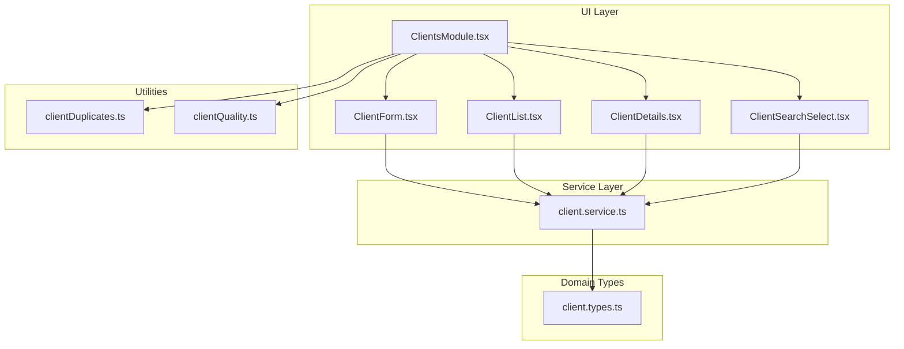
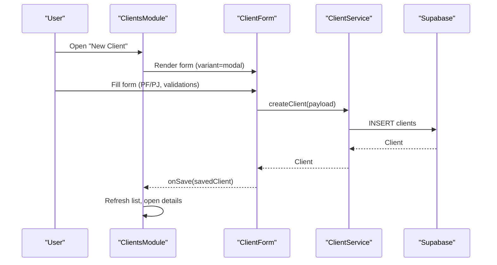
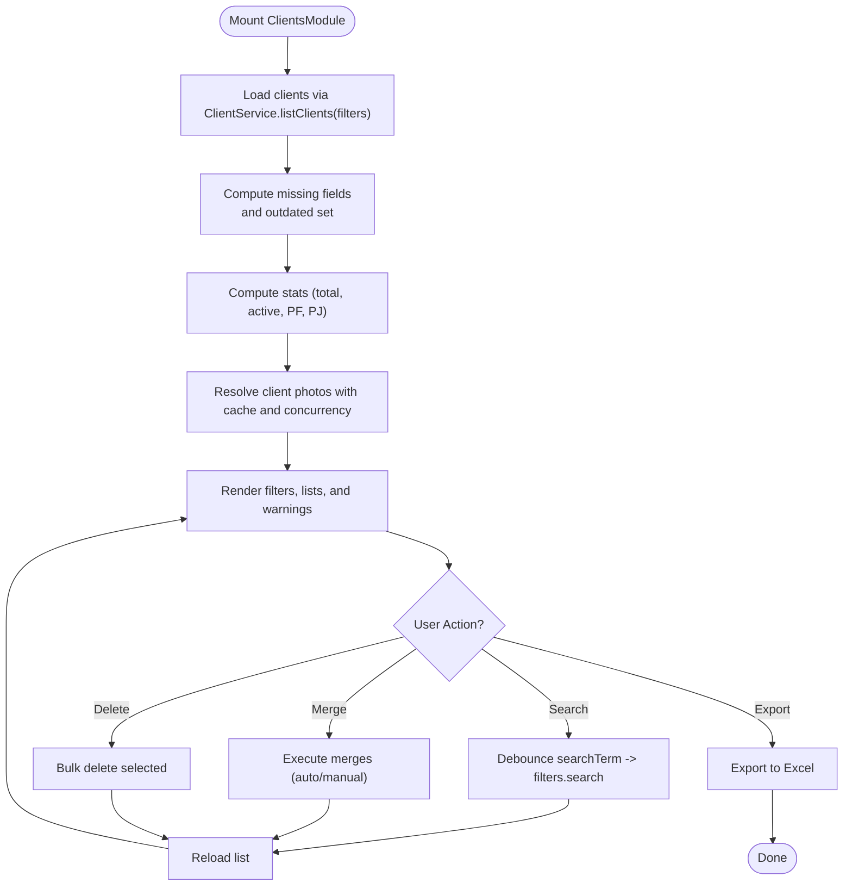
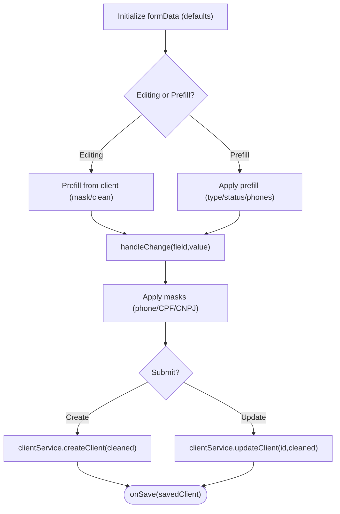
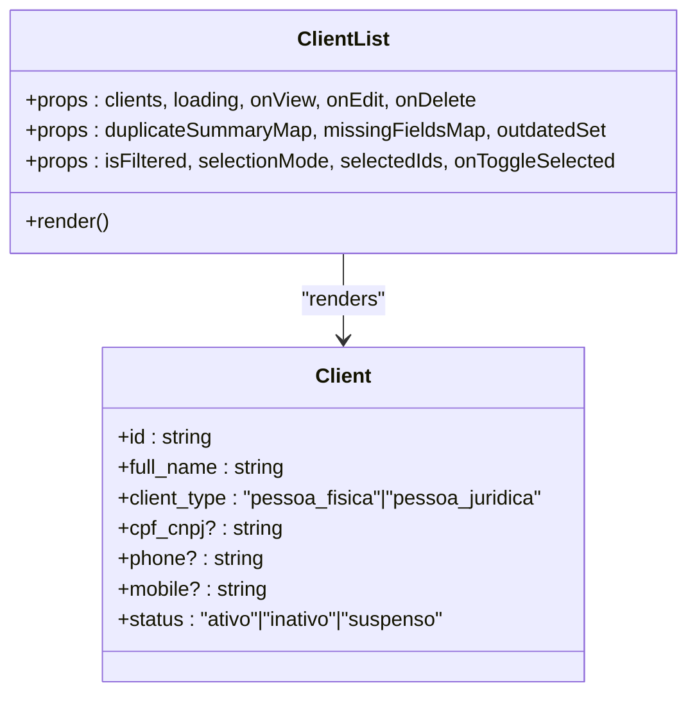
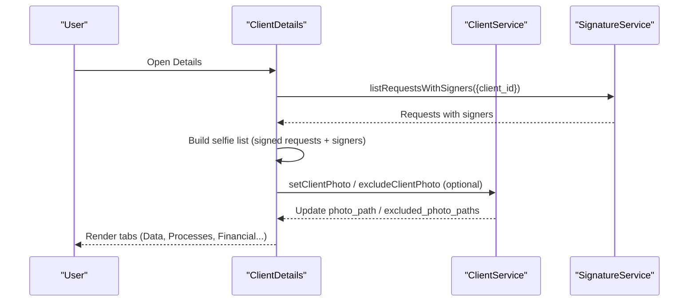
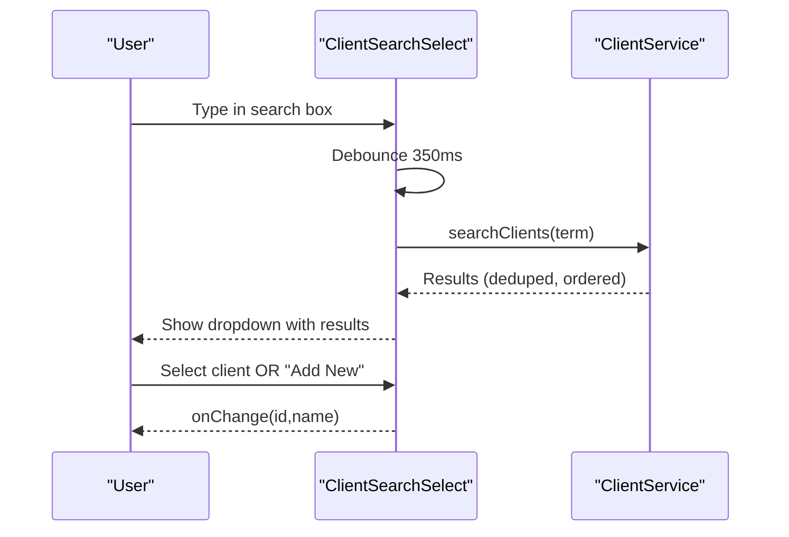
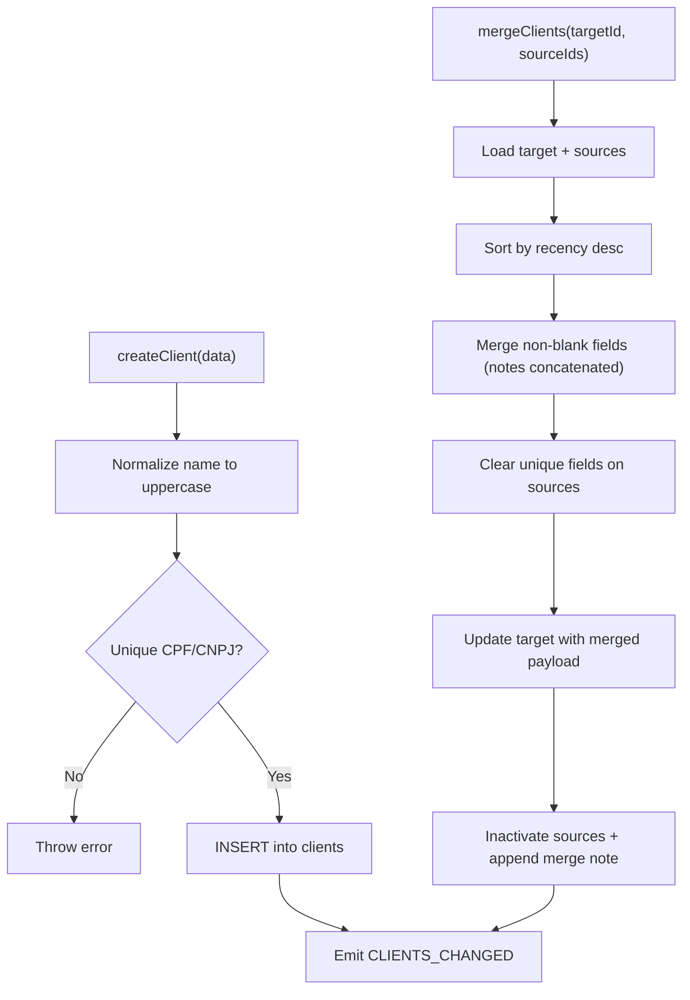
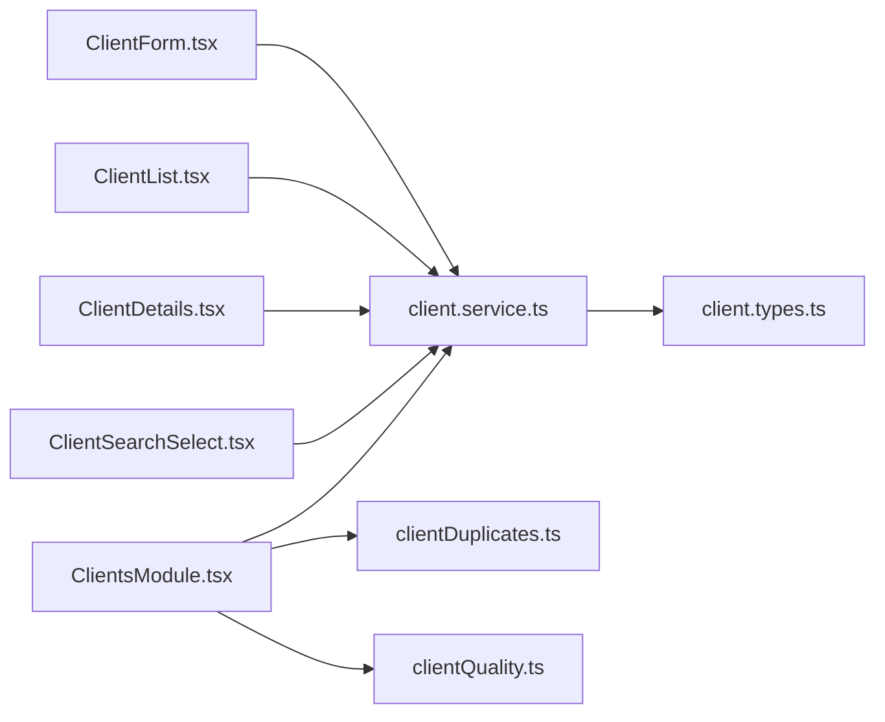

# Clients Management

<cite>
**Referenced Files in This Document**
- [ClientsModule.tsx](file://src/components/ClientsModule.tsx)
- [ClientForm.tsx](file://src/components/ClientForm.tsx)
- [ClientList.tsx](file://src/components/ClientList.tsx)
- [ClientDetails.tsx](file://src/components/ClientDetails.tsx)
- [ClientSearchSelect.tsx](file://src/components/ClientSearchSelect.tsx)
- [client.service.ts](file://src/services/client.service.ts)
- [client.types.ts](file://src/types/client.types.ts)
- [clientDuplicates.ts](file://src/utils/clientDuplicates.ts)
- [clientQuality.ts](file://src/utils/clientQuality.ts)
</cite>

## Table of Contents
1. [Introduction](#introduction)
2. [Project Structure](#project-structure)
3. [Core Components](#core-components)
4. [Architecture Overview](#architecture-overview)
5. [Detailed Component Analysis](#detailed-component-analysis)
6. [Dependency Analysis](#dependency-analysis)
7. [Performance Considerations](#performance-considerations)
8. [Troubleshooting Guide](#troubleshooting-guide)
9. [Conclusion](#conclusion)
10. [Appendices](#appendices)

## Introduction
This document describes the Clients Management module, covering the full client lifecycle: creation, editing, searching, and deletion. It documents the ClientForm component (validation rules, client types PF/PJ, and form state), the ClientList implementation (filtering, sorting, and pagination), the ClientDetails view (tabbed interface, client history, and related processes), the ClientSearchSelect component for client selection in forms, and the client service layer (CRUD, search, duplicate detection). It also explains client status management, quality scoring, and photo capture integration. Finally, it provides practical guidance for extending client fields, customizing validation rules, and integrating with external client databases.

## Project Structure
The Clients Management module is composed of:
- A container module orchestrating state, filters, search, and modals
- UI components for listing, editing, viewing, and selecting clients
- A service layer implementing CRUD, search, duplicates, and photo management
- Utility modules for quality scoring and duplicate grouping
- Strongly typed client domain models

**Diagram sources**
- [ClientsModule.tsx:1-1451](file://src/components/ClientsModule.tsx#L1-1451)
- [ClientList.tsx:1-432](file://src/components/ClientList.tsx#L1-432)
- [ClientForm.tsx:1-515](file://src/components/ClientForm.tsx#L1-515)
- [ClientDetails.tsx:1-2362](file://src/components/ClientDetails.tsx#L1-2362)
- [ClientSearchSelect.tsx:1-321](file://src/components/ClientSearchSelect.tsx#L1-321)
- [client.service.ts:1-604](file://src/services/client.service.ts#L1-604)
- [client.types.ts:1-88](file://src/types/client.types.ts#L1-88)
- [clientDuplicates.ts:1-195](file://src/utils/clientDuplicates.ts#L1-195)
- [clientQuality.ts:1-30](file://src/utils/clientQuality.ts#L1-30)

**Section sources**
- [ClientsModule.tsx:1-1451](file://src/components/ClientsModule.tsx#L1-1451)
- [ClientList.tsx:1-432](file://src/components/ClientList.tsx#L1-432)
- [ClientForm.tsx:1-515](file://src/components/ClientForm.tsx#L1-515)
- [ClientDetails.tsx:1-2362](file://src/components/ClientDetails.tsx#L1-2362)
- [ClientSearchSelect.tsx:1-321](file://src/components/ClientSearchSelect.tsx#L1-321)
- [client.service.ts:1-604](file://src/services/client.service.ts#L1-604)
- [client.types.ts:1-88](file://src/types/client.types.ts#L1-88)
- [clientDuplicates.ts:1-195](file://src/utils/clientDuplicates.ts#L1-195)
- [clientQuality.ts:1-30](file://src/utils/clientQuality.ts#L1-30)

## Core Components
- ClientsModule: Orchestrates client listing, filtering, search, bulk actions, photo resolution, duplicate detection, and modal orchestration (create/edit/details/manual merge).
- ClientForm: Handles client creation/editing with PF/PJ type switching, masking, normalization, and saving via the service layer.
- ClientList: Renders client cards/tiles with status badges, missing/outdated indicators, and action buttons.
- ClientDetails: Tabbed view for client data, processes, financials, deadlines, requirements, documents, and history; integrates selfie gallery and photo management.
- ClientSearchSelect: Autocomplete client selector with optional creation flow and modal form integration.
- ClientService: Implements CRUD, search, counting, merging, photo pinning/exclusion, and emits change events.

**Section sources**
- [ClientsModule.tsx:1-1451](file://src/components/ClientsModule.tsx#L1-1451)
- [ClientForm.tsx:1-515](file://src/components/ClientForm.tsx#L1-515)
- [ClientList.tsx:1-432](file://src/components/ClientList.tsx#L1-432)
- [ClientDetails.tsx:1-2362](file://src/components/ClientDetails.tsx#L1-2362)
- [ClientSearchSelect.tsx:1-321](file://src/components/ClientSearchSelect.tsx#L1-321)
- [client.service.ts:1-604](file://src/services/client.service.ts#L1-604)

## Architecture Overview
The module follows a layered architecture:
- UI components manage presentation and user interactions
- Service layer encapsulates data access and business logic
- Utilities provide domain-specific computations (quality, duplicates)
- Types define the contract for client data and operations

**Diagram sources**
- [ClientsModule.tsx:548-705](file://src/components/ClientsModule.tsx#L548-705)
- [ClientForm.tsx:232-283](file://src/components/ClientForm.tsx#L232-283)
- [client.service.ts:317-357](file://src/services/client.service.ts#L317-357)

## Detailed Component Analysis

### ClientsModule
- Responsibilities:
  - Manage filters, search, sorting, and visibility toggles
  - Load clients, compute stats, and derive missing fields/outdated sets
  - Resolve client photos with concurrency and caching
  - Handle bulk actions (merge, delete), manual merge, and navigation
  - Orchestrate modals for create/edit/details
- Key behaviors:
  - Debounced search term propagation to filters
  - Duplicate detection via grouping and summary mapping
  - Quality indicators (incomplete/outdated) with quick filter toggles
  - Photo resolution pipeline with pinned/fallback strategies and TTL-based cache
  - Bulk selection and actions with confirmation dialogs

**Diagram sources**
- [ClientsModule.tsx:250-299](file://src/components/ClientsModule.tsx#L250-299)
- [ClientsModule.tsx:359-397](file://src/components/ClientsModule.tsx#L359-397)
- [ClientsModule.tsx:407-447](file://src/components/ClientsModule.tsx#L407-447)
- [ClientsModule.tsx:507-528](file://src/components/ClientsModule.tsx#L507-528)
- [ClientsModule.tsx:577-654](file://src/components/ClientsModule.tsx#L577-654)

**Section sources**
- [ClientsModule.tsx:1-1451](file://src/components/ClientsModule.tsx#L1-1451)
- [clientDuplicates.ts:63-179](file://src/utils/clientDuplicates.ts#L63-179)
- [clientQuality.ts:15-29](file://src/utils/clientQuality.ts#L15-29)

### ClientForm
- Client types:
  - PF (pessoa_fisica): Full name, CPF, RG, birth date, nationality, marital status, profession
  - PJ (pessoa_juridica): Full name, CNPJ, email, phones
- Validation and normalization:
  - Masks for phone, CPF, CNPJ
  - Name normalization to uppercase
  - Cleanup of optional fields (remove empty values)
  - Unique CPF/CNPJ validation on create/update
- State management:
  - Controlled form state with derived masks and defaults
  - Prefill support for edit and external prefill
  - Loading states and error handling with alerts

**Diagram sources**
- [ClientForm.tsx:66-140](file://src/components/ClientForm.tsx#L66-140)
- [ClientForm.tsx:198-230](file://src/components/ClientForm.tsx#L198-230)
- [ClientForm.tsx:232-283](file://src/components/ClientForm.tsx#L232-283)
- [client.service.ts:317-406](file://src/services/client.service.ts#L317-406)

**Section sources**
- [ClientForm.tsx:1-515](file://src/components/ClientForm.tsx#L1-515)
- [client.service.ts:317-406](file://src/services/client.service.ts#L317-406)

### ClientList
- Rendering:
  - Mobile card layout with selection checkboxes and action buttons
  - Desktop table with selection, client identity, type, CPF/CNPJ, contact, status, actions
- Indicators:
  - Duplicate badges with reasons and counts
  - Missing fields and outdated badges
- Interactions:
  - View/Edit/Delete callbacks
  - Selection mode with checkbox toggles

**Diagram sources**
- [ClientList.tsx:69-83](file://src/components/ClientList.tsx#L69-83)
- [client.types.ts:9-52](file://src/types/client.types.ts#L9-52)

**Section sources**
- [ClientList.tsx:1-432](file://src/components/ClientList.tsx#L1-432)
- [client.types.ts:1-88](file://src/types/client.types.ts#L1-88)

### ClientDetails
- Tabs:
  - Data, Processes, Financial, Deadlines, Requirements, Documents, Overview (timeline/history)
- Features:
  - Identity card with photo (selfies from signature requests), status, metadata, KPIs
  - Auto-import suggestions from signature data (email/phone/CPF)
  - Selfie gallery modal with pin/exclude actions
  - Export client sheet to PDF/print
  - Quick actions to create processes, requirements, deadlines, petitions, and calendar events

**Diagram sources**
- [ClientDetails.tsx:394-503](file://src/components/ClientDetails.tsx#L394-503)
- [ClientDetails.tsx:1349-1480](file://src/components/ClientDetails.tsx#L1349-1480)
- [client.service.ts:467-535](file://src/services/client.service.ts#L467-535)

**Section sources**
- [ClientDetails.tsx:1-2362](file://src/components/ClientDetails.tsx#L1-2362)
- [client.service.ts:467-535](file://src/services/client.service.ts#L467-535)

### ClientSearchSelect
- Behavior:
  - Debounced search with 350ms delay
  - Results dedupe and prioritization by completeness
  - Optional "Add New Client" action with prefilled name
  - Portal-based dropdown positioned relative to anchor
- Integration:
  - Opens ClientForm modal for new client creation
  - Calls onChange with selected client id and name

**Diagram sources**
- [ClientSearchSelect.tsx:55-87](file://src/components/ClientSearchSelect.tsx#L55-87)
- [ClientSearchSelect.tsx:89-106](file://src/components/ClientSearchSelect.tsx#L89-106)
- [client.service.ts:537-599](file://src/services/client.service.ts#L537-599)

**Section sources**
- [ClientSearchSelect.tsx:1-321](file://src/components/ClientSearchSelect.tsx#L1-321)
- [client.service.ts:537-599](file://src/services/client.service.ts#L537-599)

### Client Service Layer
- CRUD:
  - createClient: validates uniqueness, normalizes, persists, emits change
  - updateClient: validates uniqueness, persists, emits change
  - deleteClient: deletes, emits change
- Search and filtering:
  - listClients: supports status/type/search/sort_order with accent-insensitive matching
  - searchClients: client-side dedupe and ordering by match startswith and completeness
  - countClients: filtered counts
- Duplicates and merging:
  - mergeClients: recency-first merge, clears unique fields on sources, inactivates sources, emits change
- Photos:
  - setClientPhoto: pins a selfie as profile photo
  - excludeClientPhoto: hides a selfie from profile while preserving proof
  - clearClientPhotoCache: invalidates shared cache

**Diagram sources**
- [client.service.ts:317-406](file://src/services/client.service.ts#L317-406)
- [client.service.ts:177-312](file://src/services/client.service.ts#L177-312)
- [client.service.ts:467-535](file://src/services/client.service.ts#L467-535)

**Section sources**
- [client.service.ts:1-604](file://src/services/client.service.ts#L1-604)

### Client Types and Domain Model
- ClientType: pessoa_fisica | pessoa_juridica
- ClientStatus: ativo | inativo | suspenso
- Client fields include personal data, contact, address, notes, status, photo_path, excluded_photo_paths, timestamps, and audit fields
- DTOs: CreateClientDTO and UpdateClientDTO mirror Client with optional id for updates

**Section sources**
- [client.types.ts:1-88](file://src/types/client.types.ts#L1-88)

### Duplicate Detection and Quality Scoring
- Duplicate detection:
  - Groups clients by CPF equality, email equality, name+phone, or name alone
  - Uses union-find to cluster duplicates and computes reasons
  - Picks primary by completeness, status, and recency
- Quality scoring:
  - Missing fields computed from required fields
  - Outdated threshold configurable (180 days)

**Section sources**
- [clientDuplicates.ts:63-179](file://src/utils/clientDuplicates.ts#L63-179)
- [clientDuplicates.ts:46-61](file://src/utils/clientDuplicates.ts#L46-61)
- [clientQuality.ts:5-29](file://src/utils/clientQuality.ts#L5-29)

## Dependency Analysis
- UI depends on:
  - Services for persistence and search
  - Types for shape and validation
  - Utilities for quality and duplicates
- Services depend on:
  - Supabase client for database operations
  - Events for cross-component notifications
- No circular dependencies observed among the analyzed modules.

**Diagram sources**
- [ClientsModule.tsx:1-1451](file://src/components/ClientsModule.tsx#L1-1451)
- [ClientForm.tsx:1-515](file://src/components/ClientForm.tsx#L1-515)
- [ClientList.tsx:1-432](file://src/components/ClientList.tsx#L1-432)
- [ClientDetails.tsx:1-2362](file://src/components/ClientDetails.tsx#L1-2362)
- [ClientSearchSelect.tsx:1-321](file://src/components/ClientSearchSelect.tsx#L1-321)
- [client.service.ts:1-604](file://src/services/client.service.ts#L1-604)
- [client.types.ts:1-88](file://src/types/client.types.ts#L1-88)
- [clientDuplicates.ts:1-195](file://src/utils/clientDuplicates.ts#L1-195)
- [clientQuality.ts:1-30](file://src/utils/clientQuality.ts#L1-30)

**Section sources**
- [ClientsModule.tsx:1-1451](file://src/components/ClientsModule.tsx#L1-1451)
- [client.service.ts:1-604](file://src/services/client.service.ts#L1-604)

## Performance Considerations
- Photo resolution:
  - Two-phase resolution (pinned fast-path, fallback slow-path) with concurrency batching
  - Local storage cache with TTL to avoid repeated network calls
- Search:
  - Debounced input with 350–400ms delay to reduce network calls
  - Client-side filtering with accent-insensitive normalization
- Rendering:
  - Memoized duplicate summaries and outdated sets
  - Lazy loading of financial installments on tab switch
- Pagination:
  - Current list renders all visible clients; consider virtualization or server-side pagination for large datasets

[No sources needed since this section provides general guidance]

## Troubleshooting Guide
- Duplicate merge errors:
  - Ensure target exists and sources are distinct and non-empty
  - Review merged notes appended to sources
- Photo issues:
  - Use selfie picker to pin or exclude photos; clearing cache forces re-resolution
- Validation failures:
  - CPF/CNPJ uniqueness errors during create/update
  - Missing required fields for quality scoring
- Search yields no results:
  - Verify accent-insensitive normalization and minimum 2-character search term

**Section sources**
- [client.service.ts:177-312](file://src/services/client.service.ts#L177-312)
- [client.service.ts:467-535](file://src/services/client.service.ts#L467-535)
- [clientQuality.ts:15-29](file://src/utils/clientQuality.ts#L15-29)

## Conclusion
The Clients Management module provides a robust, user-friendly system for managing client records. It balances usability (masks, auto-import, selfie gallery) with reliability (uniqueness checks, duplicate detection, photo caching). The service layer centralizes business logic and integrates tightly with the UI components, enabling scalable enhancements such as extended fields, custom validation rules, and external database integration.

[No sources needed since this section summarizes without analyzing specific files]

## Appendices

### Extending Client Fields
- Add fields to CreateClientDTO and Client types
- Update ClientForm to render and mask new fields
- Update list/table rendering in ClientList
- Adjust search and filtering logic in ClientService if applicable
- Update duplicate detection and quality scoring if new fields are required

**Section sources**
- [client.types.ts:54-87](file://src/types/client.types.ts#L54-87)
- [ClientForm.tsx:66-87](file://src/components/ClientForm.tsx#L66-87)
- [ClientList.tsx:85-96](file://src/components/ClientList.tsx#L85-96)
- [client.service.ts:43-95](file://src/services/client.service.ts#L43-95)

### Customizing Validation Rules
- Modify ClientForm validation in handleChange and submit flow
- Extend uniqueness checks in create/update methods
- Add custom masks or normalization in ClientForm

**Section sources**
- [ClientForm.tsx:198-283](file://src/components/ClientForm.tsx#L198-283)
- [client.service.ts:317-406](file://src/services/client.service.ts#L317-406)

### Integrating with External Client Databases
- Replace Supabase client with external adapter in ClientService
- Maintain the same interface for list/search/count/create/update/delete/merge/photos
- Preserve events and caching semantics for UI consistency

**Section sources**
- [client.service.ts:1-604](file://src/services/client.service.ts#L1-604)