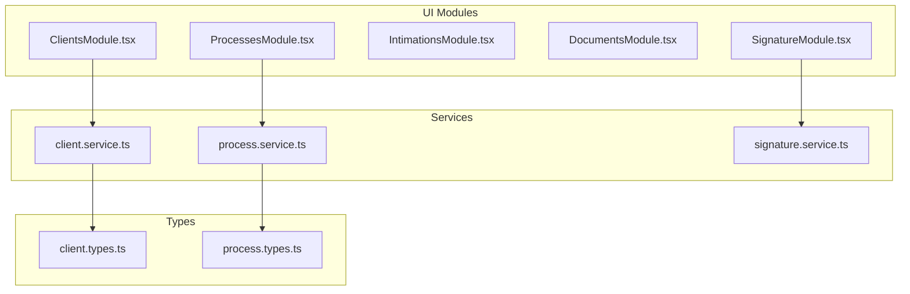
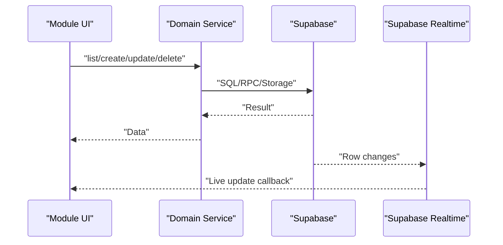
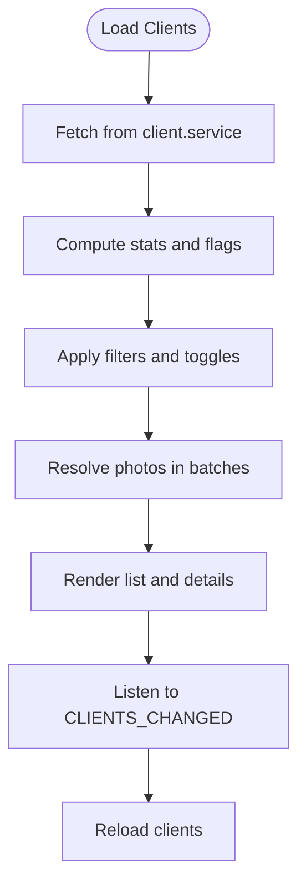
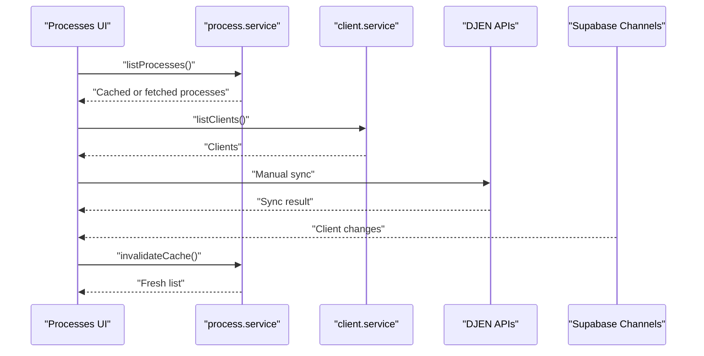
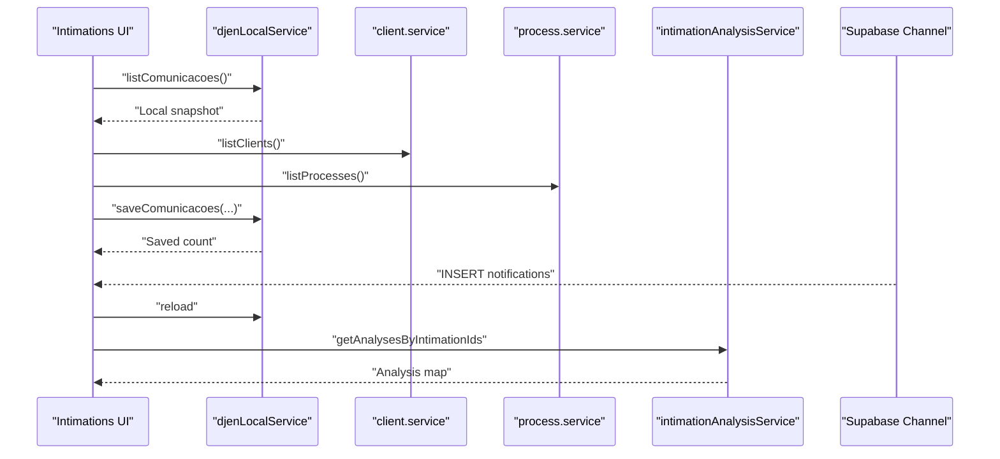
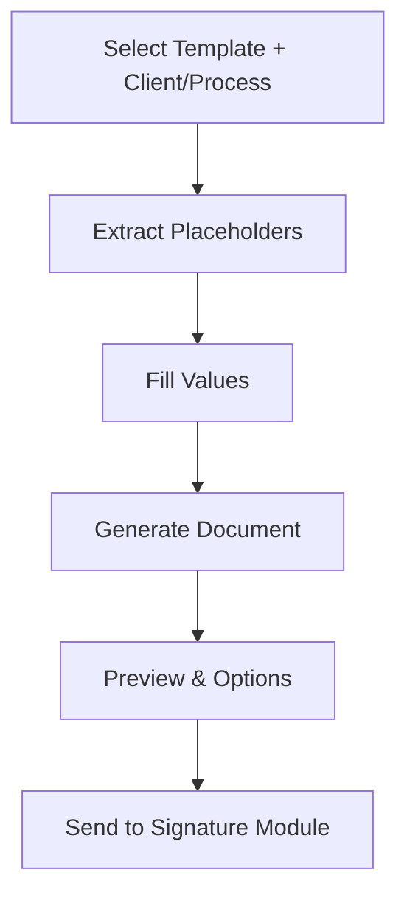
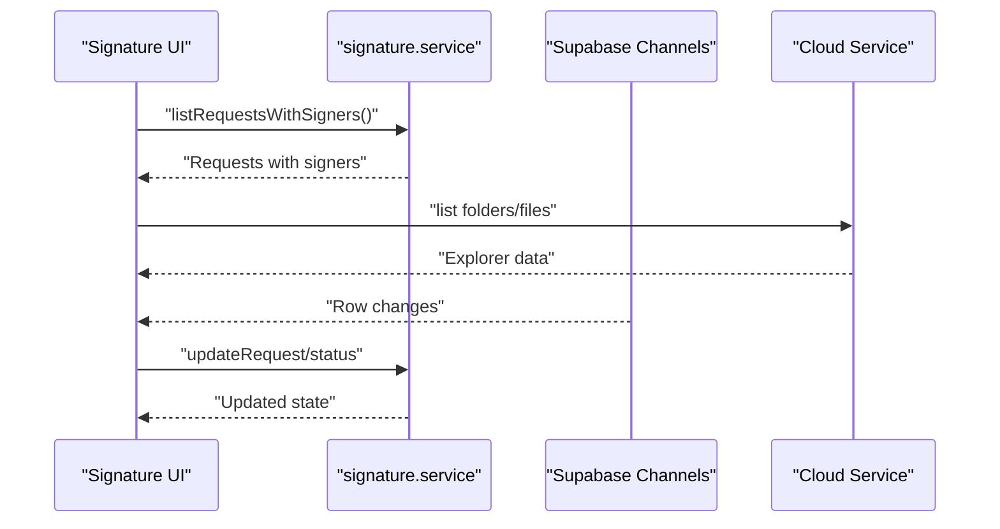
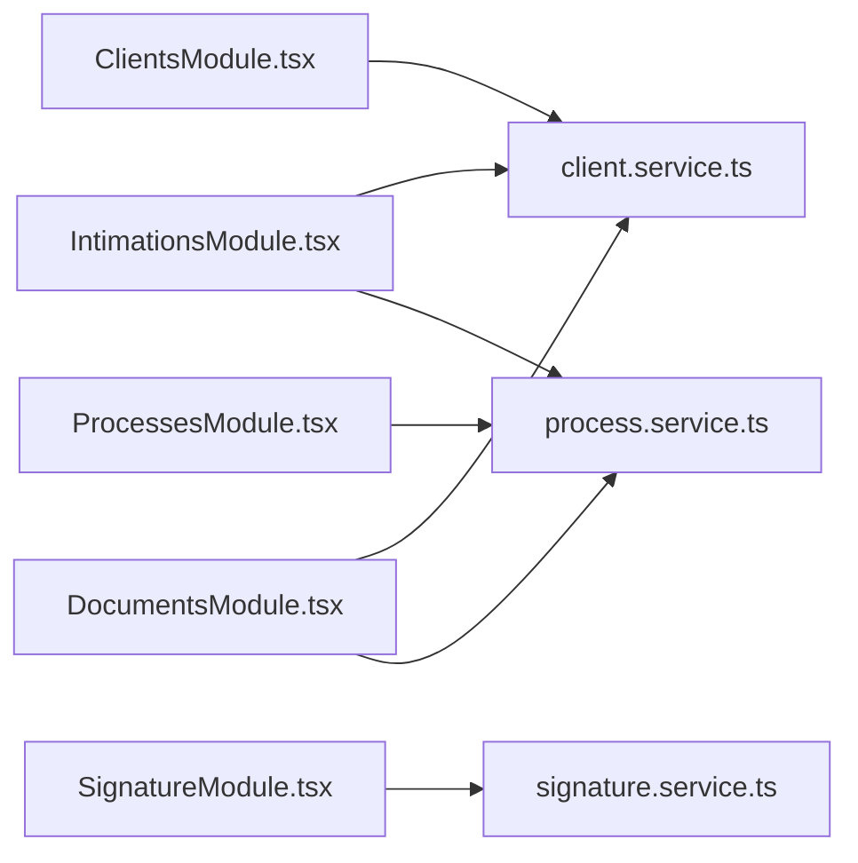

# Core Modules

<cite>
**Referenced Files in This Document**
- [ClientsModule.tsx](file://src/components/ClientsModule.tsx)
- [ProcessesModule.tsx](file://src/components/ProcessesModule.tsx)
- [IntimationsModule.tsx](file://src/components/IntimationsModule.tsx)
- [DocumentsModule.tsx](file://src/components/DocumentsModule.tsx)
- [SignatureModule.tsx](file://src/components/SignatureModule.tsx)
- [client.service.ts](file://src/services/client.service.ts)
- [process.service.ts](file://src/services/process.service.ts)
- [signature.service.ts](file://src/services/signature.service.ts)
- [client.types.ts](file://src/types/client.types.ts)
- [process.types.ts](file://src/types/process.types.ts)
</cite>

## Table of Contents
1. [Introduction](#introduction)
2. [Project Structure](#project-structure)
3. [Core Components](#core-components)
4. [Architecture Overview](#architecture-overview)
5. [Detailed Component Analysis](#detailed-component-analysis)
6. [Dependency Analysis](#dependency-analysis)
7. [Performance Considerations](#performance-considerations)
8. [Troubleshooting Guide](#troubleshooting-guide)
9. [Conclusion](#conclusion)

## Introduction
This document describes the CRM Jurídico core modules focused on Clients, Processes, Intimations, Documents, and Signature management. It explains the modular architecture, component relationships, data flows, navigation patterns, and integration points. It also covers state management, caching, real-time updates, and guidance for extending modules consistently.

## Project Structure
The core modules are implemented as React components under src/components, backed by service classes in src/services and typed interfaces in src/types. Each module encapsulates its own UI, state, and integrations while sharing common patterns:
- Services abstract Supabase queries and remote functions
- Types define domain contracts for data exchange
- Shared utilities and contexts support cross-module concerns (events, auth, navigation)

**Diagram sources**
- [ClientsModule.tsx:1-800](file://src/components/ClientsModule.tsx#L1-L800)
- [ProcessesModule.tsx:1-800](file://src/components/ProcessesModule.tsx#L1-L800)
- [IntimationsModule.tsx:1-800](file://src/components/IntimationsModule.tsx#L1-L800)
- [DocumentsModule.tsx:1-800](file://src/components/DocumentsModule.tsx#L1-L800)
- [SignatureModule.tsx:1-800](file://src/components/SignatureModule.tsx#L1-L800)
- [client.service.ts:1-604](file://src/services/client.service.ts#L1-L604)
- [process.service.ts:1-192](file://src/services/process.service.ts#L1-L192)
- [signature.service.ts:1-800](file://src/services/signature.service.ts#L1-L800)
- [client.types.ts:1-88](file://src/types/client.types.ts#L1-L88)
- [process.types.ts:1-85](file://src/types/process.types.ts#L1-L85)

**Section sources**
- [ClientsModule.tsx:1-800](file://src/components/ClientsModule.tsx#L1-L800)
- [ProcessesModule.tsx:1-800](file://src/components/ProcessesModule.tsx#L1-L800)
- [IntimationsModule.tsx:1-800](file://src/components/IntimationsModule.tsx#L1-L800)
- [DocumentsModule.tsx:1-800](file://src/components/DocumentsModule.tsx#L1-L800)
- [SignatureModule.tsx:1-800](file://src/components/SignatureModule.tsx#L1-L800)
- [client.service.ts:1-604](file://src/services/client.service.ts#L1-L604)
- [process.service.ts:1-192](file://src/services/process.service.ts#L1-L192)
- [signature.service.ts:1-800](file://src/services/signature.service.ts#L1-L800)
- [client.types.ts:1-88](file://src/types/client.types.ts#L1-L88)
- [process.types.ts:1-85](file://src/types/process.types.ts#L1-L85)

## Core Components
- ClientsModule: Manages client lifecycle, quality checks, duplicates detection, photo caching, bulk actions, and relations loading. Integrates with client.service and emits system events.
- ProcessesModule: Maintains process records, status tracking, timeline parsing, DJEN sync, deadlines, and members lookup. Uses process.service and integrates with multiple services.
- IntimationsModule: Handles DJEN communication, local snapshot loading, auto-linking to clients/processes, AI analysis orchestration, and real-time updates via Supabase channels.
- DocumentsModule: Provides template management, placeholder extraction, document generation, preview, and integration with signature workflows.
- SignatureModule: Implements end-to-end digital signature workflows, request management, signer handling, PDF/docx preview, cloud sync, and real-time updates.

**Section sources**
- [ClientsModule.tsx:1-800](file://src/components/ClientsModule.tsx#L1-L800)
- [ProcessesModule.tsx:1-800](file://src/components/ProcessesModule.tsx#L1-L800)
- [IntimationsModule.tsx:1-800](file://src/components/IntimationsModule.tsx#L1-L800)
- [DocumentsModule.tsx:1-800](file://src/components/DocumentsModule.tsx#L1-L800)
- [SignatureModule.tsx:1-800](file://src/components/SignatureModule.tsx#L1-L800)

## Architecture Overview
The modules follow a layered architecture:
- Presentation layer: React components with internal state and UI orchestration
- Domain services: Encapsulate data access and business logic
- Data contracts: Strongly typed interfaces for domain entities
- Real-time integration: Supabase channels for live updates
- Cross-cutting utilities: Events, search, formatting, and selection state

**Diagram sources**
- [client.service.ts:1-604](file://src/services/client.service.ts#L1-L604)
- [process.service.ts:1-192](file://src/services/process.service.ts#L1-L192)
- [signature.service.ts:1-800](file://src/services/signature.service.ts#L1-L800)
- [ClientsModule.tsx:300-310](file://src/components/ClientsModule.tsx#L300-L310)
- [ProcessesModule.tsx:662-665](file://src/components/ProcessesModule.tsx#L662-L665)
- [SignatureModule.tsx:524-571](file://src/components/SignatureModule.tsx#L524-L571)

## Detailed Component Analysis

### ClientsModule
Responsibilities:
- Client listing, filtering, sorting, and search
- Quality metrics (incomplete/outdated) and banner controls
- Duplicate detection and merging
- Photo resolution with local cache and concurrency batching
- Bulk operations (merge, delete)
- Relations loading (processes, requirements) and navigation callbacks

Key patterns:
- Event-driven refresh via SYSTEM_EVENTS.CLIENTS_CHANGED
- Local cache for client photos with TTL and miss caching
- Parallel resolution of pinned vs fallback photo sources
- Memoization of duplicate groups and visibility sets

**Diagram sources**
- [ClientsModule.tsx:250-295](file://src/components/ClientsModule.tsx#L250-L295)
- [ClientsModule.tsx:80-183](file://src/components/ClientsModule.tsx#L80-L183)
- [ClientsModule.tsx:300-310](file://src/components/ClientsModule.tsx#L300-L310)

**Section sources**
- [ClientsModule.tsx:1-800](file://src/components/ClientsModule.tsx#L1-L800)
- [client.service.ts:1-604](file://src/services/client.service.ts#L1-L604)
- [client.types.ts:1-88](file://src/types/client.types.ts#L1-L88)

### ProcessesModule
Responsibilities:
- Process listing with status filtering and search
- Members and clients lookup
- Timeline parsing and analysis
- DJEN sync orchestration and status reporting
- Archived processes with pending deadlines alert
- Kanban/grid view modes and persistence

Key patterns:
- Process cache with TTL and filter-aware invalidation
- Real-time listening for clients to keep lists fresh
- Manual DJEN sync with progress and logs
- Status computation derived from related entities

**Diagram sources**
- [ProcessesModule.tsx:541-556](file://src/components/ProcessesModule.tsx#L541-L556)
- [ProcessesModule.tsx:662-691](file://src/components/ProcessesModule.tsx#L662-L691)
- [ProcessesModule.tsx:617-635](file://src/components/ProcessesModule.tsx#L617-L635)
- [process.service.ts:25-40](file://src/services/process.service.ts#L25-L40)

**Section sources**
- [ProcessesModule.tsx:1-800](file://src/components/ProcessesModule.tsx#L1-L800)
- [process.service.ts:1-192](file://src/services/process.service.ts#L1-L192)
- [process.types.ts:1-85](file://src/types/process.types.ts#L1-L85)

### IntimationsModule
Responsibilities:
- Local snapshot loading for fast UI
- DJEN synchronization (manual and cron-backed)
- Auto-linking to clients/processes based on names and numbers
- AI analysis orchestration and saved analysis retrieval
- Real-time updates via Supabase channels
- Export capabilities (CSV/Excel/PDF)
- Clearing old records and bulk actions

Key patterns:
- Snapshot preload to avoid blank states
- Auto-linking with deduplication and normalization
- Realtime flush debouncing to batch updates
- Saved analysis hydration from database

**Diagram sources**
- [IntimationsModule.tsx:257-281](file://src/components/IntimationsModule.tsx#L257-L281)
- [IntimationsModule.tsx:456-532](file://src/components/IntimationsModule.tsx#L456-L532)
- [IntimationsModule.tsx:534-587](file://src/components/IntimationsModule.tsx#L534-L587)
- [IntimationsModule.tsx:408-454](file://src/components/IntimationsModule.tsx#L408-L454)

**Section sources**
- [IntimationsModule.tsx:1-800](file://src/components/IntimationsModule.tsx#L1-L800)

### DocumentsModule
Responsibilities:
- Template management (upload, edit, preview)
- Placeholder extraction from DOCX/HTML
- Document generation with client/process data
- Preview rendering (PDF, DOCX, image)
- Integration with signature workflows
- Custom fields and template forms

Key patterns:
- Placeholder normalization and extraction
- Template files summary aggregation
- Client/process search with debounced handlers
- Form configuration per template with custom fields

**Diagram sources**
- [DocumentsModule.tsx:647-707](file://src/components/DocumentsModule.tsx#L647-L707)
- [DocumentsModule.tsx:756-800](file://src/components/DocumentsModule.tsx#L756-L800)

**Section sources**
- [DocumentsModule.tsx:1-800](file://src/components/DocumentsModule.tsx#L1-L800)

### SignatureModule
Responsibilities:
- Full signature workflow: request creation, signers, positioning, settings
- Preview multiple documents (PDF, DOCX, images)
- Cloud sync status and explorer
- Real-time updates and silent refresh
- Public signing bundle and OTP flows
- Audit logs and signer management

Key patterns:
- Wizard-like step progression
- Viewer document management with caching
- Realtime subscriptions for signature_requests, generated_documents, signature_signers
- Silent refresh to keep data fresh without reload

**Diagram sources**
- [SignatureModule.tsx:415-522](file://src/components/SignatureModule.tsx#L415-L522)
- [SignatureModule.tsx:524-571](file://src/components/SignatureModule.tsx#L524-L571)
- [signature.service.ts:115-150](file://src/services/signature.service.ts#L115-L150)

**Section sources**
- [SignatureModule.tsx:1-800](file://src/components/SignatureModule.tsx#L1-L800)
- [signature.service.ts:1-800](file://src/services/signature.service.ts#L1-L800)

## Dependency Analysis
- ClientsModule depends on client.service and emits CLIENTS_CHANGED events to trigger reloads in other modules.
- ProcessesModule depends on process.service, client.service, and integrates with DJEN services and deadline services.
- IntimationsModule depends on djenLocalService, client.service, process.service, and intimationAnalysisService; listens to Supabase channels.
- DocumentsModule depends on documentTemplate.service and integrates with signature.service for linking.
- SignatureModule depends on signature.service, cloud.service, and uses Supabase channels for real-time updates.

**Diagram sources**
- [ClientsModule.tsx:1-800](file://src/components/ClientsModule.tsx#L1-L800)
- [ProcessesModule.tsx:1-800](file://src/components/ProcessesModule.tsx#L1-L800)
- [IntimationsModule.tsx:1-800](file://src/components/IntimationsModule.tsx#L1-L800)
- [DocumentsModule.tsx:1-800](file://src/components/DocumentsModule.tsx#L1-L800)
- [SignatureModule.tsx:1-800](file://src/components/SignatureModule.tsx#L1-L800)
- [client.service.ts:1-604](file://src/services/client.service.ts#L1-L604)
- [process.service.ts:1-192](file://src/services/process.service.ts#L1-L192)
- [signature.service.ts:1-800](file://src/services/signature.service.ts#L1-L800)

**Section sources**
- [ClientsModule.tsx:1-800](file://src/components/ClientsModule.tsx#L1-L800)
- [ProcessesModule.tsx:1-800](file://src/components/ProcessesModule.tsx#L1-L800)
- [IntimationsModule.tsx:1-800](file://src/components/IntimationsModule.tsx#L1-L800)
- [DocumentsModule.tsx:1-800](file://src/components/DocumentsModule.tsx#L1-L800)
- [SignatureModule.tsx:1-800](file://src/components/SignatureModule.tsx#L1-L800)
- [client.service.ts:1-604](file://src/services/client.service.ts#L1-L604)
- [process.service.ts:1-192](file://src/services/process.service.ts#L1-L192)
- [signature.service.ts:1-800](file://src/services/signature.service.ts#L1-L800)

## Performance Considerations
- ClientsModule photo resolution uses concurrent batches and local TTL caching to minimize network overhead and repeated fetches.
- ProcessesModule caches process lists with filter-aware invalidation to reduce database load.
- IntimationsModule preloads a local snapshot to avoid blank UI and debounces realtime flushes to batch updates.
- DocumentsModule extracts placeholders efficiently and supports preview caching for DOCX blobs.
- SignatureModule uses silent refresh and real-time subscriptions to keep data fresh without constant polling.

[No sources needed since this section provides general guidance]

## Troubleshooting Guide
Common issues and resolutions:
- Clients changed not reflected: Ensure SYSTEM_EVENTS.CLIENTS_CHANGED listeners are active and cache invalidation occurs after mutations.
- Processes not updating after client changes: Verify client change listener triggers process cache invalidation.
- Intimations not appearing: Confirm DJEN sync ran and local snapshot was loaded; check realtime channel subscription.
- Signature previews failing: Validate signed URL generation and blob caching; ensure viewer document state is consistent.
- Template generation errors: Check placeholder normalization and client/process availability; confirm template files are accessible.

**Section sources**
- [ClientsModule.tsx:300-310](file://src/components/ClientsModule.tsx#L300-L310)
- [ProcessesModule.tsx:662-691](file://src/components/ProcessesModule.tsx#L662-L691)
- [IntimationsModule.tsx:534-587](file://src/components/IntimationsModule.tsx#L534-L587)
- [SignatureModule.tsx:656-731](file://src/components/SignatureModule.tsx#L656-L731)
- [DocumentsModule.tsx:756-800](file://src/components/DocumentsModule.tsx#L756-L800)

## Conclusion
The CRM Jurídico core modules implement a cohesive, layered architecture with strong separation of concerns. Services encapsulate data access, types define contracts, and modules coordinate UI state and integrations. Real-time updates, caching, and event-driven refreshes provide responsive experiences. Extending modules should adhere to existing patterns: use services for data access, leverage events for cross-module coordination, implement real-time subscriptions where appropriate, and maintain consistent state management and navigation flows.