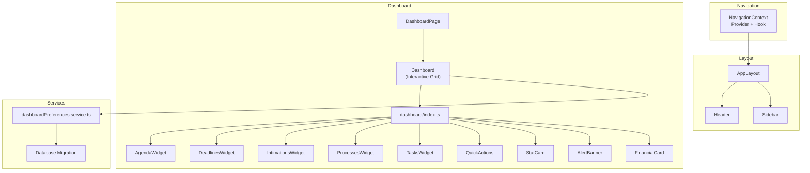
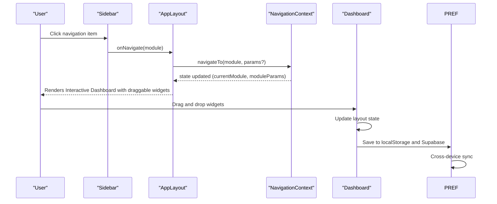
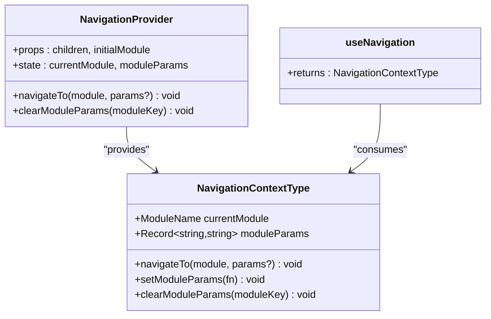
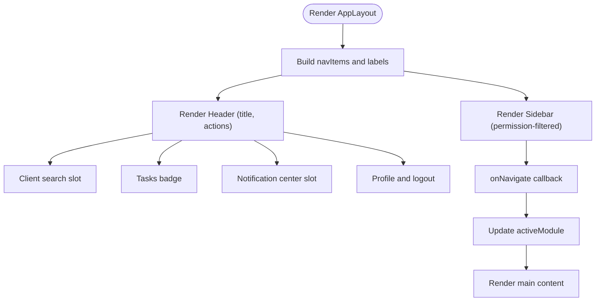
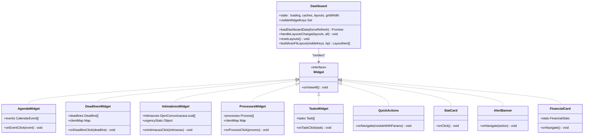
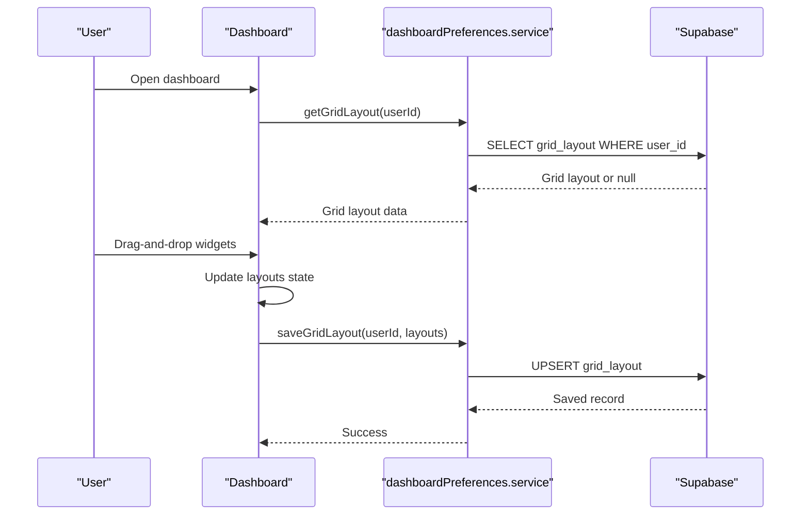
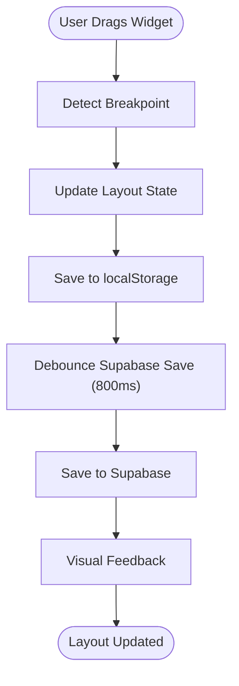
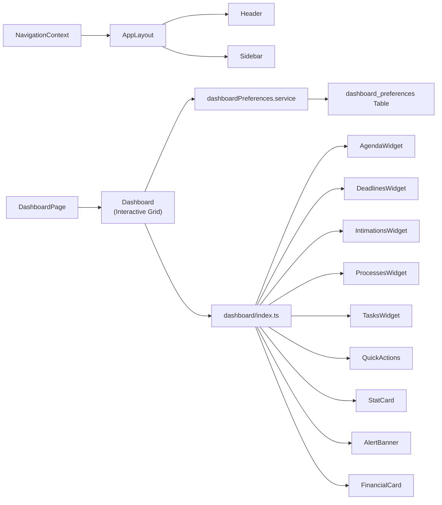

# Dashboard & Navigation

<cite>
**Referenced Files in This Document**
- [NavigationContext.tsx](file://src/contexts/NavigationContext.tsx)
- [AppLayout.tsx](file://src/components/layout/AppLayout.tsx)
- [Header.tsx](file://src/components/layout/Header.tsx)
- [Sidebar.tsx](file://src/components/layout/Sidebar.tsx)
- [Dashboard.tsx](file://src/components/Dashboard.tsx)
- [DashboardPage.tsx](file://src/components/DashboardPage.tsx)
- [dashboard/index.ts](file://src/components/dashboard/index.ts)
- [AgendaWidget.tsx](file://src/components/dashboard/AgendaWidget.tsx)
- [AlertBanner.tsx](file://src/components/dashboard/AlertBanner.tsx)
- [DeadlinesWidget.tsx](file://src/components/dashboard/DeadlinesWidget.tsx)
- [IntimationsWidget.tsx](file://src/components/dashboard/IntimationsWidget.tsx)
- [ProcessesWidget.tsx](file://src/components/dashboard/ProcessesWidget.tsx)
- [QuickActions.tsx](file://src/components/dashboard/QuickActions.tsx)
- [StatCard.tsx](file://src/components/dashboard/StatCard.tsx)
- [TasksWidget.tsx](file://src/components/dashboard/TasksWidget.tsx)
- [FinancialCard.tsx](file://src/components/dashboard/FinancialCard.tsx)
- [dashboardPreferences.service.ts](file://src/services/dashboardPreferences.service.ts)
- [20250109_dashboard_preferences.sql](file://supabase/migrations/20250109_dashboard_preferences.sql)
</cite>

## Update Summary
**Changes Made**
- Updated Dashboard component to implement fully interactive, draggable, and resizable grid system
- Added responsive breakpoints with 12/6/4/2 column layouts for different screen sizes
- Integrated automatic layout fitting algorithm with visual feedback during drag-and-drop
- Enhanced persistence layer with localStorage and Supabase integration for cross-device synchronization
- Added mobile optimizations and improved responsive design considerations
- Updated widget system documentation to reflect new interactive capabilities

## Table of Contents
1. [Introduction](#introduction)
2. [Project Structure](#project-structure)
3. [Core Components](#core-components)
4. [Architecture Overview](#architecture-overview)
5. [Detailed Component Analysis](#detailed-component-analysis)
6. [Interactive Grid System](#interactive-grid-system)
7. [Responsive Design Implementation](#responsive-design-implementation)
8. [Persistence and Synchronization](#persistence-and-synchronization)
9. [Dependency Analysis](#dependency-analysis)
10. [Performance Considerations](#performance-considerations)
11. [Troubleshooting Guide](#troubleshooting-guide)
12. [Conclusion](#conclusion)
13. [Appendices](#appendices)

## Introduction
This document explains the Dashboard and Navigation system of the CRM application. The dashboard has been transformed from a static layout to a fully interactive, draggable, and resizable grid system with responsive breakpoints. It covers the navigation state management via a dedicated provider, the responsive layout built around a sidebar and header, and the dashboard's widget-driven architecture with real-time drag-and-drop functionality. It also documents user preference persistence for dashboard preferences, module access control, and practical guidance for customization and extension.

## Project Structure
The Dashboard and Navigation system spans several modules:
- Navigation state management: a React context provider and hook
- Layout system: a responsive AppLayout with a collapsible sidebar and a flexible header
- Dashboard page: an interactive grid-based dashboard composed of draggable widgets
- Widget library: reusable dashboard components for data presentation and navigation
- Preferences service: persistence of user dashboard preferences with cross-device synchronization

**Diagram sources**
- [NavigationContext.tsx:1-94](file://src/contexts/NavigationContext.tsx#L1-L94)
- [AppLayout.tsx:118-352](file://src/components/layout/AppLayout.tsx#L118-L352)
- [Header.tsx:46-134](file://src/components/layout/Header.tsx#L46-L134)
- [Sidebar.tsx:75-139](file://src/components/layout/Sidebar.tsx#L75-L139)
- [DashboardPage.tsx:1-4](file://src/components/DashboardPage.tsx#L1-L4)
- [Dashboard.tsx:291-800](file://src/components/Dashboard.tsx#L291-L800)
- [dashboard/index.ts:1-11](file://src/components/dashboard/index.ts#L1-L11)
- [dashboardPreferences.service.ts:1-148](file://src/services/dashboardPreferences.service.ts#L1-L148)
- [20250109_dashboard_preferences.sql:1-56](file://supabase/migrations/20250109_dashboard_preferences.sql#L1-L56)

**Section sources**
- [NavigationContext.tsx:1-94](file://src/contexts/NavigationContext.tsx#L1-L94)
- [AppLayout.tsx:118-352](file://src/components/layout/AppLayout.tsx#L118-L352)
- [Header.tsx:46-134](file://src/components/layout/Header.tsx#L46-L134)
- [Sidebar.tsx:75-139](file://src/components/layout/Sidebar.tsx#L75-L139)
- [DashboardPage.tsx:1-4](file://src/components/DashboardPage.tsx#L1-L4)
- [Dashboard.tsx:291-800](file://src/components/Dashboard.tsx#L291-L800)
- [dashboard/index.ts:1-11](file://src/components/dashboard/index.ts#L1-L11)
- [dashboardPreferences.service.ts:1-148](file://src/services/dashboardPreferences.service.ts#L1-L148)

## Core Components
- NavigationContext: centralizes navigation state and exposes a navigateTo function with module parameters storage and clearing.
- AppLayout: a responsive shell with a fixed sidebar (collapsible on mobile), a sticky header, and a main content area.
- Header: renders the active module title/description, client search slot, tasks badge, notification center slot, and profile/logout controls.
- Sidebar: a compact vertical navigation drawer with permission-aware visibility and a profile action.
- Dashboard: orchestrates data fetching, caching, interactive layout persistence, and renders a draggable/resizable grid of widgets with quick actions and alerts.
- Widget library: a collection of specialized widgets (AgendaWidget, DeadlinesWidget, IntimationsWidget, ProcessesWidget, TasksWidget, QuickActions, StatCard, AlertBanner, FinancialCard) exported via a single index barrel.

**Section sources**
- [NavigationContext.tsx:32-93](file://src/contexts/NavigationContext.tsx#L32-L93)
- [AppLayout.tsx:118-352](file://src/components/layout/AppLayout.tsx#L118-L352)
- [Header.tsx:46-134](file://src/components/layout/Header.tsx#L46-L134)
- [Sidebar.tsx:75-139](file://src/components/layout/Sidebar.tsx#L75-L139)
- [Dashboard.tsx:291-800](file://src/components/Dashboard.tsx#L291-L800)
- [dashboard/index.ts:1-11](file://src/components/dashboard/index.ts#L1-L11)

## Architecture Overview
The system follows a layered pattern:
- Navigation layer: NavigationContext manages current module and parameters.
- Layout layer: AppLayout composes Header and Sidebar, and hosts the active module content.
- Dashboard layer: Dashboard aggregates data, applies permissions, and renders interactive widgets in a responsive grid.
- Persistence layer: dashboardPreferences.service persists user preferences for dashboard layout and widgets with cross-device synchronization.

**Diagram sources**
- [Sidebar.tsx:114](file://src/components/layout/Sidebar.tsx#L114)
- [AppLayout.tsx:139-142](file://src/components/layout/AppLayout.tsx#L139-L142)
- [NavigationContext.tsx:54-62](file://src/contexts/NavigationContext.tsx#L54-L62)
- [Dashboard.tsx:392-426](file://src/components/Dashboard.tsx#L392-L426)
- [dashboardPreferences.service.ts:65-90](file://src/services/dashboardPreferences.service.ts#L65-L90)

## Detailed Component Analysis

### NavigationContext Provider
- Purpose: Centralizes navigation state and exposes navigateTo with optional params, plus helpers to manage module params and clear them.
- Types: ModuleName union of supported modules; moduleParams is a map keyed by module with JSON-encoded values.
- Behavior: Updates currentModule and stores params scoped to the target module; provides a clearModuleParams utility.

**Diagram sources**
- [NavigationContext.tsx:32-93](file://src/contexts/NavigationContext.tsx#L32-L93)

**Section sources**
- [NavigationContext.tsx:32-93](file://src/contexts/NavigationContext.tsx#L32-L93)

### AppLayout, Header, and Sidebar
- AppLayout:
  - Defines navItems and moduleLabels for titles and descriptions.
  - Provides a NavButton component and a responsive sidebar with a mobile backdrop.
  - Exposes slots for client search, notification center, and profile actions.
  - Manages mobile sidebar state and active module highlighting.
- Header:
  - Displays active module title and description.
  - Provides a tasks badge and profile/logout controls.
  - Accepts children for search and notification center.
- Sidebar:
  - Filters visible items based on permissions and admin status.
  - Renders a vertical navigation bar with icons and labels.
  - Includes a profile action button.

**Diagram sources**
- [AppLayout.tsx:69-96](file://src/components/layout/AppLayout.tsx#L69-L96)
- [AppLayout.tsx:118-352](file://src/components/layout/AppLayout.tsx#L118-L352)
- [Header.tsx:46-134](file://src/components/layout/Header.tsx#L46-L134)
- [Sidebar.tsx:75-139](file://src/components/layout/Sidebar.tsx#L75-L139)

**Section sources**
- [AppLayout.tsx:69-96](file://src/components/layout/AppLayout.tsx#L69-L96)
- [AppLayout.tsx:118-352](file://src/components/layout/AppLayout.tsx#L118-L352)
- [Header.tsx:46-134](file://src/components/layout/Header.tsx#L46-L134)
- [Sidebar.tsx:75-139](file://src/components/layout/Sidebar.tsx#L75-L139)

### Dashboard and Widget System
- Dashboard orchestrates:
  - Data fetching and caching with timeouts and local storage cache.
  - Permissions-aware visibility of widgets.
  - **NEW**: Interactive grid layout with draggable/resizable widgets and responsive breakpoints.
  - Real-time refresh triggers via system events.
  - Quick actions and alert banners.
- Widgets:
  - AgendaWidget: Upcoming calendar and hearing events with gradient styling.
  - DeadlinesWidget: Pending deadlines with urgency indicators and color-coded badges.
  - IntimationsWidget: Unread DJEN communications with urgency stats and recent indicators.
  - ProcessesWidget: Awaiting processes with client association and scrollable list.
  - TasksWidget: Pending tasks sorted by priority and creation date with priority colors.
  - QuickActions: Permission-aware shortcuts to create records with color-coded buttons.
  - StatCard: Metric cards with click handlers and color themes.
  - AlertBanner: Prominent alerts with navigation targets and gradient backgrounds.
  - **NEW**: FinancialCard: Monthly financial statistics with currency formatting and navigation.

**Diagram sources**
- [Dashboard.tsx:291-800](file://src/components/Dashboard.tsx#L291-L800)
- [AgendaWidget.tsx:26-117](file://src/components/dashboard/AgendaWidget.tsx#L26-L117)
- [DeadlinesWidget.tsx:23-118](file://src/components/dashboard/DeadlinesWidget.tsx#L23-L118)
- [IntimationsWidget.tsx:14-120](file://src/components/dashboard/IntimationsWidget.tsx#L14-L120)
- [ProcessesWidget.tsx:15-92](file://src/components/dashboard/ProcessesWidget.tsx#L15-L92)
- [TasksWidget.tsx:24-104](file://src/components/dashboard/TasksWidget.tsx#L24-L104)
- [QuickActions.tsx:62-96](file://src/components/dashboard/QuickActions.tsx#L62-L96)
- [StatCard.tsx:38-66](file://src/components/dashboard/StatCard.tsx#L38-L66)
- [AlertBanner.tsx:15-41](file://src/components/dashboard/AlertBanner.tsx#L15-L41)
- [FinancialCard.tsx:26-112](file://src/components/dashboard/FinancialCard.tsx#L26-L112)

**Section sources**
- [Dashboard.tsx:291-800](file://src/components/Dashboard.tsx#L291-L800)
- [dashboard/index.ts:1-11](file://src/components/dashboard/index.ts#L1-L11)
- [AgendaWidget.tsx:26-117](file://src/components/dashboard/AgendaWidget.tsx#L26-L117)
- [DeadlinesWidget.tsx:23-118](file://src/components/dashboard/DeadlinesWidget.tsx#L23-L118)
- [IntimationsWidget.tsx:14-120](file://src/components/dashboard/IntimationsWidget.tsx#L14-L120)
- [ProcessesWidget.tsx:15-92](file://src/components/dashboard/ProcessesWidget.tsx#L15-L92)
- [TasksWidget.tsx:24-104](file://src/components/dashboard/TasksWidget.tsx#L24-L104)
- [QuickActions.tsx:62-96](file://src/components/dashboard/QuickActions.tsx#L62-L96)
- [StatCard.tsx:38-66](file://src/components/dashboard/StatCard.tsx#L38-L66)
- [AlertBanner.tsx:15-41](file://src/components/dashboard/AlertBanner.tsx#L15-L41)
- [FinancialCard.tsx:26-112](file://src/components/dashboard/FinancialCard.tsx#L26-L112)

### User Preference Management and Access Control
- User preferences:
  - dashboardPreferences.service persists per-user preferences for dashboard widgets and grid layouts.
  - Supports retrieval, upsert, and partial updates for left/right widget lists and grid layouts.
  - **NEW**: Integrates with Supabase for cross-device synchronization with localStorage fallback.
- Access control:
  - Sidebar filters navigation items based on permissions and admin status.
  - Dashboard computes visible widgets using canView checks and financial availability.

**Diagram sources**
- [Dashboard.tsx:368-390](file://src/components/Dashboard.tsx#L368-L390)
- [Sidebar.tsx:84-92](file://src/components/layout/Sidebar.tsx#L84-L92)
- [dashboardPreferences.service.ts:65-110](file://src/services/dashboardPreferences.service.ts#L65-L110)

**Section sources**
- [dashboardPreferences.service.ts:1-148](file://src/services/dashboardPreferences.service.ts#L1-L148)
- [Sidebar.tsx:84-92](file://src/components/layout/Sidebar.tsx#L84-L92)
- [Dashboard.tsx:368-426](file://src/components/Dashboard.tsx#L368-L426)

## Interactive Grid System
The dashboard now features a fully interactive grid system powered by react-grid-layout:

### Grid Layout Architecture
- **Responsive Breakpoints**: lg (12 cols), md (12 cols), sm (6 cols), xs (4 cols), xxs (2 cols)
- **Automatic Layout Fitting**: Intelligent algorithm that redistributes widgets based on screen size
- **Drag-and-Drop Functionality**: Visual feedback with placeholder highlighting and resize handles
- **Persistent Storage**: Dual-layer persistence with localStorage and Supabase synchronization

### Layout Management
- **Default Layouts**: Predefined positions for all widgets across breakpoints
- **Auto-Fit Algorithm**: Dynamically distributes widgets to fill available space
- **Minimum Size Constraints**: Prevents widgets from becoming too small (minW: 2, minH: 3)
- **Mobile Optimization**: Stacked layout for smaller screens with full-width widgets

**Diagram sources**
- [Dashboard.tsx:392-426](file://src/components/Dashboard.tsx#L392-L426)
- [Dashboard.tsx:435-445](file://src/components/Dashboard.tsx#L435-L445)

**Section sources**
- [Dashboard.tsx:117-253](file://src/components/Dashboard.tsx#L117-L253)
- [Dashboard.tsx:392-426](file://src/components/Dashboard.tsx#L392-L426)
- [Dashboard.tsx:435-445](file://src/components/Dashboard.tsx#L435-L445)

## Responsive Design Implementation
The dashboard implements a sophisticated responsive design system:

### Breakpoint Strategy
- **lg (≥ 1100px)**: 12-column layout with complex widget arrangements
- **md (768-1099px)**: 12-column layout optimized for tablets
- **sm (480-767px)**: 6-column stacked layout for mobile devices
- **xs (< 480px)**: 4-column stacked layout for small screens
- **xxs (< 320px)**: 2-column stacked layout for very small devices

### Auto-Fit Algorithm
The system automatically redistributes widgets based on breakpoint and available space:
- **Desktop**: Optimized grid distribution with varying widget widths
- **Mobile**: Full-width stacked layout for better touch interaction
- **Tablet**: Balanced distribution between landscape and portrait modes

### Visual Enhancements
- **Drag Feedback**: Animated placeholder highlighting with dashed borders
- **Resize Handles**: Subtle opacity changes on hover for better UX
- **Smooth Transitions**: CSS transforms for fluid widget movement
- **Touch Optimization**: Larger hit areas and improved touch targets

**Section sources**
- [Dashboard.tsx:142-196](file://src/components/Dashboard.tsx#L142-L196)
- [Dashboard.tsx:198-253](file://src/components/Dashboard.tsx#L198-L253)
- [Dashboard.tsx:303-323](file://src/components/Dashboard.tsx#L303-L323)

## Persistence and Synchronization
The dashboard implements a robust persistence layer for seamless cross-device synchronization:

### Multi-Layer Storage Strategy
- **localStorage**: Primary client-side storage for immediate access and offline support
- **Supabase**: Remote storage for cross-device synchronization and backup
- **Fallback Logic**: Automatic fallback from remote to local storage when needed

### Synchronization Flow
1. **Initial Load**: Load from Supabase if available, otherwise use localStorage defaults
2. **Real-time Updates**: Debounced saves to Supabase (800ms delay) to prevent flooding
3. **Cross-Device Sync**: Layout changes propagate instantly across devices
4. **Conflict Resolution**: Remote data takes precedence over local when present

### Data Structure
The dashboardPreferences table supports:
- **grid_layout**: Complete responsive grid configuration
- **left_widgets/right_widgets**: Legacy widget arrangement (still supported)
- **Timestamp Tracking**: Automatic updated_at timestamps for conflict resolution

**Section sources**
- [dashboardPreferences.service.ts:14-148](file://src/services/dashboardPreferences.service.ts#L14-L148)
- [20250109_dashboard_preferences.sql:1-56](file://supabase/migrations/20250109_dashboard_preferences.sql#L1-L56)
- [Dashboard.tsx:368-426](file://src/components/Dashboard.tsx#L368-L426)

## Dependency Analysis
- NavigationContext depends on React context APIs and provides a typed contract for navigation.
- AppLayout depends on NavigationContext for state and on UI components for branding and icons.
- Dashboard depends on multiple services for data, uses permissions, and exports a widget index.
- Sidebar depends on permissions and admin flags to filter navigation items.
- Preferences service depends on Supabase client for persistence with localStorage fallback.

**Diagram sources**
- [NavigationContext.tsx:1-94](file://src/contexts/NavigationContext.tsx#L1-L94)
- [AppLayout.tsx:118-352](file://src/components/layout/AppLayout.tsx#L118-L352)
- [Header.tsx:46-134](file://src/components/layout/Header.tsx#L46-L134)
- [Sidebar.tsx:75-139](file://src/components/layout/Sidebar.tsx#L75-L139)
- [DashboardPage.tsx:1-4](file://src/components/DashboardPage.tsx#L1-L4)
- [Dashboard.tsx:291-800](file://src/components/Dashboard.tsx#L291-L800)
- [dashboard/index.ts:1-11](file://src/components/dashboard/index.ts#L1-L11)
- [dashboardPreferences.service.ts:1-148](file://src/services/dashboardPreferences.service.ts#L1-L148)

**Section sources**
- [NavigationContext.tsx:1-94](file://src/contexts/NavigationContext.tsx#L1-L94)
- [AppLayout.tsx:118-352](file://src/components/layout/AppLayout.tsx#L118-L352)
- [Dashboard.tsx:291-800](file://src/components/Dashboard.tsx#L291-L800)
- [dashboardPreferences.service.ts:1-148](file://src/services/dashboardPreferences.service.ts#L1-L148)

## Performance Considerations
- Dashboard data caching:
  - Local storage cache with versioning and TTL reduces server load and improves perceived performance.
  - Safe fetch wrapper enforces timeouts and falls back gracefully.
- **NEW**: Grid performance optimization:
  - Debounced Supabase saves prevent excessive API calls during drag-and-drop.
  - Auto-fit algorithm minimizes layout recalculation overhead.
  - CSS transforms provide hardware-accelerated widget animations.
- Permissions:
  - Early filtering in Sidebar and Dashboard avoids unnecessary computations and DOM nodes.
- **NEW**: Memory management:
  - Cleanup timers prevent memory leaks from debounced operations.
  - Efficient layout merging reduces state update costs.

## Troubleshooting Guide
- Navigation does not change module:
  - Ensure the component is wrapped by NavigationProvider and using useNavigation.
  - Verify navigateTo is called with a valid ModuleName and that moduleParams are cleared if needed.
- Sidebar items missing:
  - Confirm canView and isAdmin flags passed to Sidebar resolve as expected.
  - Check that moduleKey matches the intended permission scope.
- Dashboard not updating:
  - Trigger a refresh via the refresh mechanism or listen to system events.
  - Clear local cache keys if stale data is suspected.
- **NEW**: Grid layout issues:
  - Check browser localStorage quota and clear corrupted layout data if needed.
  - Verify Supabase connectivity for cross-device sync functionality.
  - Ensure proper cleanup of timers when components unmount.
- **NEW**: Drag-and-drop not working:
  - Verify react-grid-layout dependencies are properly installed.
  - Check for CSS conflicts that might interfere with drag handles.
  - Ensure proper event handling for touch devices.

**Section sources**
- [NavigationContext.tsx:54-62](file://src/contexts/NavigationContext.tsx#L54-L62)
- [Sidebar.tsx:84-92](file://src/components/layout/Sidebar.tsx#L84-L92)
- [Dashboard.tsx:447-625](file://src/components/Dashboard.tsx#L447-L625)
- [dashboardPreferences.service.ts:65-110](file://src/services/dashboardPreferences.service.ts#L65-L110)

## Conclusion
The Dashboard and Navigation system has evolved into a sophisticated, interactive platform combining robust navigation, responsive layout, and a modular widget architecture. The new grid system provides users with complete control over their dashboard layout while maintaining responsive design principles. NavigationContext centralizes state, AppLayout provides a consistent shell, and the interactive Dashboard delivers a customizable, permission-aware, and performance-conscious experience with cross-device synchronization capabilities.

## Appendices

### Customizing Widgets
- Add a new widget:
  - Create a new component under src/components/dashboard/ and export it from dashboard/index.ts.
  - Include it in the visible widget keys computation in Dashboard.
  - **NEW**: Update the WIDGET_HEIGHT mapping with appropriate dimensions for your widget.
  - Update the responsive layout defaults if needed for optimal desktop/mobile display.
- Modify widget behavior:
  - Adjust data fetching and sorting inside Dashboard.
  - Update permissions checks to control visibility.
  - **NEW**: Ensure widget implements proper click handlers for navigation integration.

**Section sources**
- [dashboard/index.ts:1-11](file://src/components/dashboard/index.ts#L1-L11)
- [Dashboard.tsx:127-136](file://src/components/Dashboard.tsx#L127-L136)
- [Dashboard.tsx:690-712](file://src/components/Dashboard.tsx#L690-L712)

### Adding New Navigation Items
- Extend navigation:
  - Add a new NavItem in AppLayout and Sidebar.
  - Update moduleLabels for titles/descriptions.
  - Ensure canView/admin checks allow access where appropriate.

**Section sources**
- [AppLayout.tsx:69-96](file://src/components/layout/AppLayout.tsx#L69-L96)
- [Sidebar.tsx:39-55](file://src/components/layout/Sidebar.tsx#L39-L55)

### Implementing Responsive Layouts
- Use the existing responsive grid:
  - **NEW**: Update DEFAULT_LAYOUTS breakpoints to fit new widgets across all screen sizes.
  - **NEW**: Test auto-fit algorithm with various widget combinations and screen ratios.
  - Persist layouts to localStorage and restore on mount with proper fallback logic.
- Optimize mobile:
  - Prefer stacked layouts for small screens with full-width widgets.
  - Keep touch-friendly targets and readable typography.
  - **NEW**: Test drag-and-drop functionality on touch devices with proper feedback.

**Section sources**
- [Dashboard.tsx:198-253](file://src/components/Dashboard.tsx#L198-L253)
- [Dashboard.tsx:142-196](file://src/components/Dashboard.tsx#L142-L196)

### Cross-Device Synchronization Setup
- **NEW**: Database requirements:
  - Ensure dashboard_preferences table exists with proper RLS policies.
  - Verify unique constraint on user_id for conflict resolution.
  - Test Supabase connection and authentication for seamless sync.
- **NEW**: Client-side implementation:
  - Verify localStorage fallback when Supabase is unavailable.
  - Test debounced save mechanism to prevent API flooding.
  - Monitor layout synchronization across multiple browser sessions.

**Section sources**
- [20250109_dashboard_preferences.sql:1-56](file://supabase/migrations/20250109_dashboard_preferences.sql#L1-L56)
- [dashboardPreferences.service.ts:14-148](file://src/services/dashboardPreferences.service.ts#L14-L148)
- [Dashboard.tsx:368-426](file://src/components/Dashboard.tsx#L368-L426)