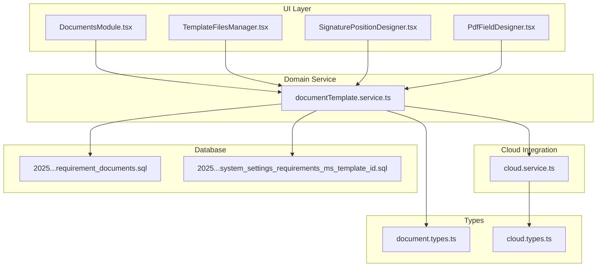
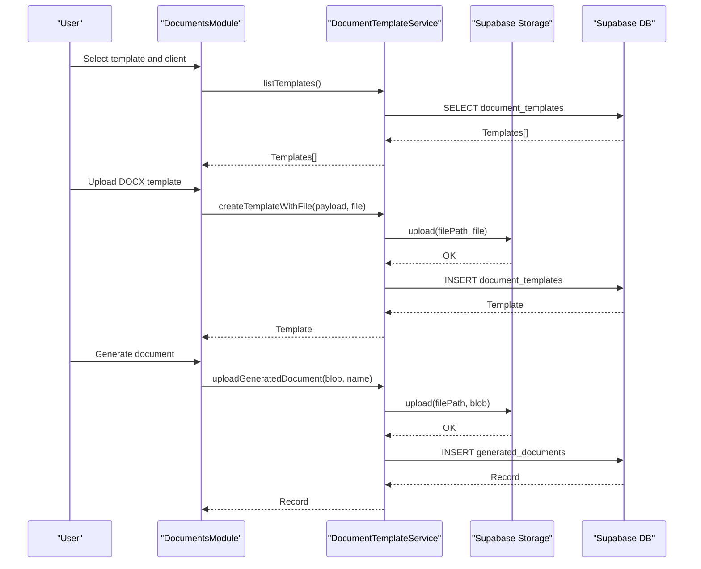
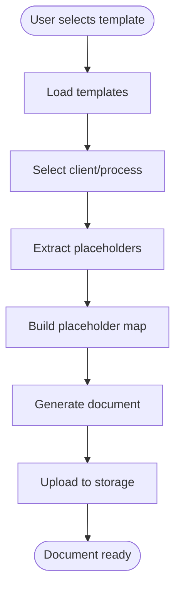
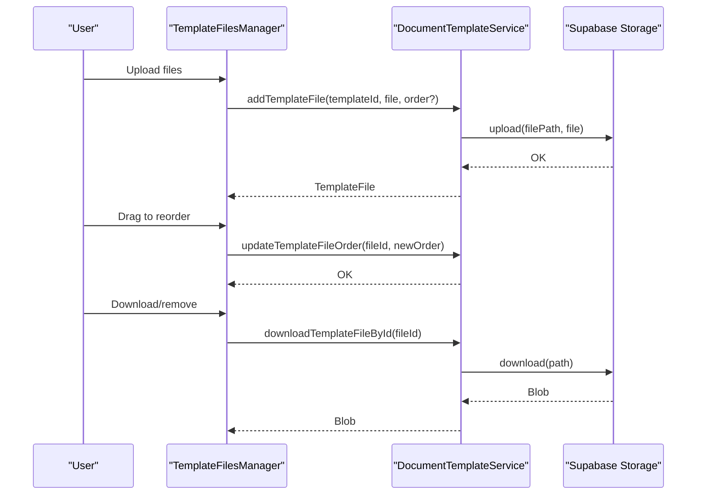
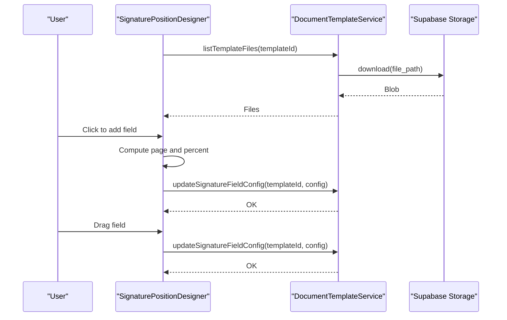
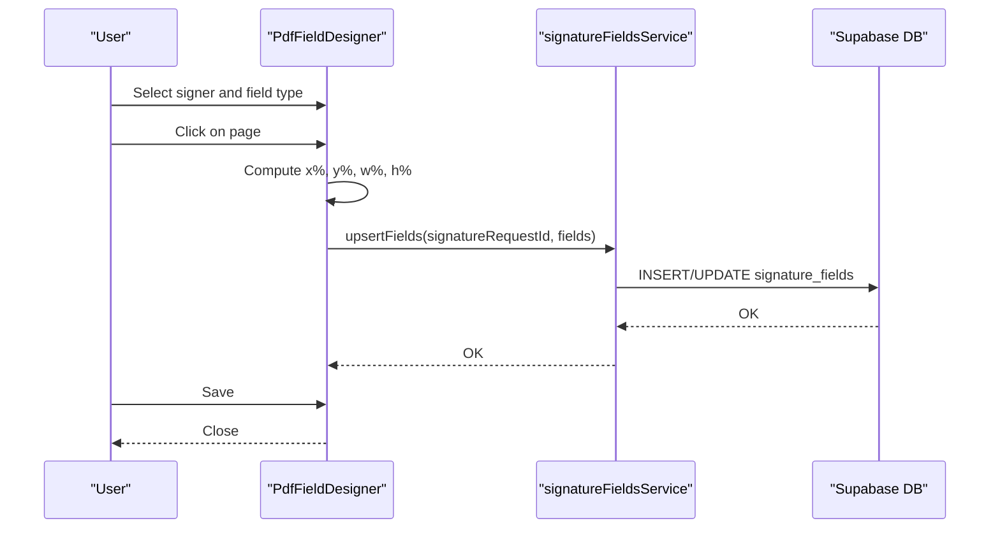
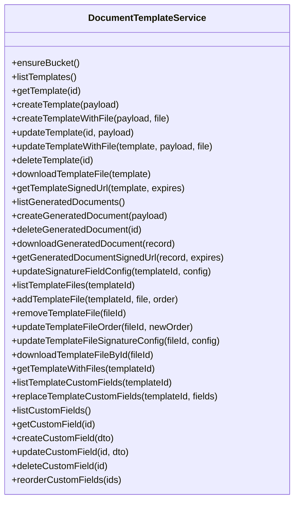
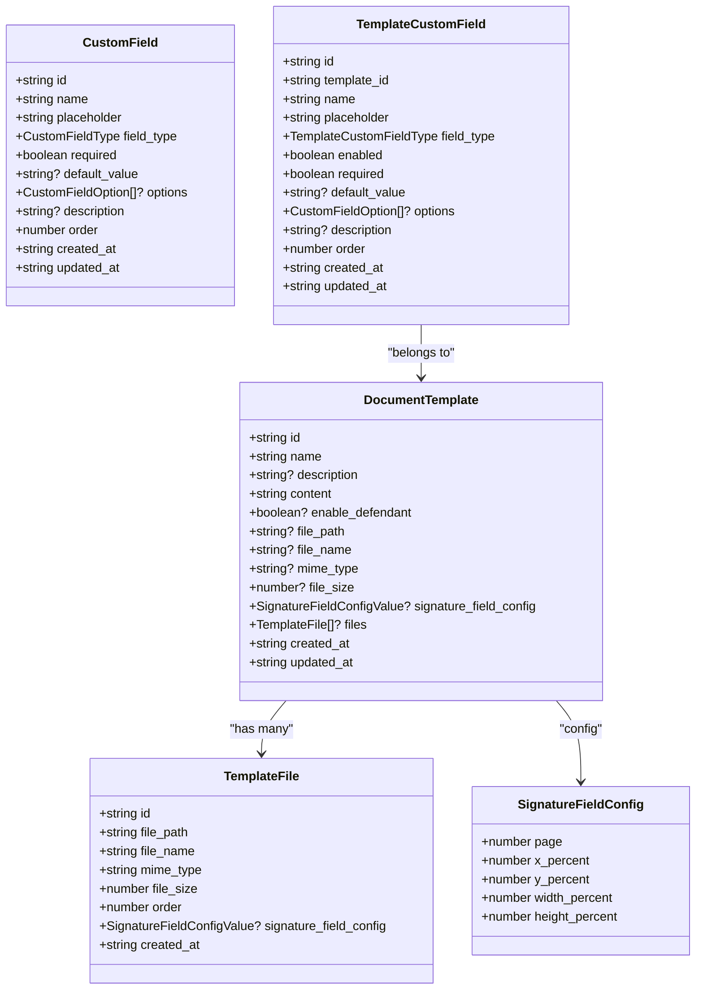
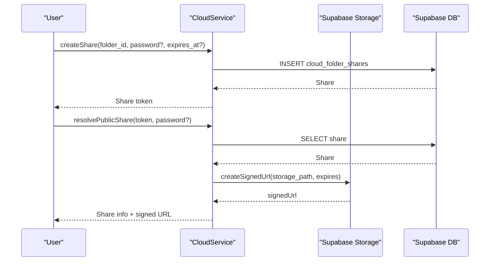
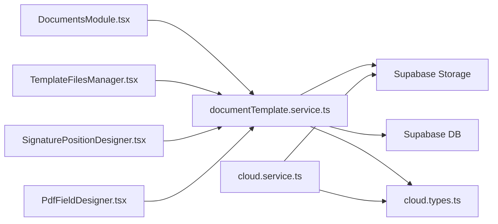

# Documents & Templates

<cite>
**Referenced Files in This Document**
- [DocumentsModule.tsx](file://src/components/DocumentsModule.tsx)
- [TemplateFilesManager.tsx](file://src/components/TemplateFilesManager.tsx)
- [PdfFieldDesigner.tsx](file://src/components/PdfFieldDesigner.tsx)
- [SignaturePositionDesigner.tsx](file://src/components/SignaturePositionDesigner.tsx)
- [documentTemplate.service.ts](file://src/services/documentTemplate.service.ts)
- [document.types.ts](file://src/types/document.types.ts)
- [cloud.service.ts](file://src/services/cloud.service.ts)
- [cloud.types.ts](file://src/types/cloud.types.ts)
- [20251222193000_requirement_documents.sql](file://supabase/migrations/20251222193000_requirement_documents.sql)
- [20251222194500_system_settings_requirements_ms_template_id.sql](file://supabase/migrations/20251222194500_system_settings_requirements_ms_template_id.sql)
</cite>

## Table of Contents
1. [Introduction](#introduction)
2. [Project Structure](#project-structure)
3. [Core Components](#core-components)
4. [Architecture Overview](#architecture-overview)
5. [Detailed Component Analysis](#detailed-component-analysis)
6. [Dependency Analysis](#dependency-analysis)
7. [Performance Considerations](#performance-considerations)
8. [Troubleshooting Guide](#troubleshooting-guide)
9. [Conclusion](#conclusion)
10. [Appendices](#appendices)

## Introduction
This document explains the Documents & Templates module: how documents are uploaded, stored, versioned, and shared; how templates are created and managed; how dynamic fields are designed for PDFs and Word documents; and how the system integrates with the cloud service for storage policies, access controls, and collaboration. It also covers document types, metadata management, and export functionality, with practical examples for building custom templates, designing document fields, and implementing document workflows.

## Project Structure
The Documents & Templates module spans UI components, a domain service, and supporting types and database migrations:
- UI components orchestrate user actions for templates, files, signatures, and field placement.
- The DocumentTemplateService encapsulates CRUD, storage, and metadata operations for templates and generated documents.
- Types define document templates, files, signature configurations, and custom fields.
- Cloud service and types support broader storage and sharing capabilities.
- Database migrations define schema for requirement-related documents and system settings.

**Diagram sources**
- [DocumentsModule.tsx:1-3173](file://src/components/DocumentsModule.tsx#L1-L3173)
- [TemplateFilesManager.tsx:1-333](file://src/components/TemplateFilesManager.tsx#L1-L333)
- [SignaturePositionDesigner.tsx:1-571](file://src/components/SignaturePositionDesigner.tsx#L1-L571)
- [PdfFieldDesigner.tsx:1-644](file://src/components/PdfFieldDesigner.tsx#L1-L644)
- [documentTemplate.service.ts:1-612](file://src/services/documentTemplate.service.ts#L1-L612)
- [document.types.ts:1-146](file://src/types/document.types.ts#L1-L146)
- [cloud.service.ts:1-819](file://src/services/cloud.service.ts#L1-L819)
- [cloud.types.ts:1-107](file://src/types/cloud.types.ts#L1-L107)
- [20251222193000_requirement_documents.sql:1-40](file://supabase/migrations/20251222193000_requirement_documents.sql#L1-L40)
- [20251222194500_system_settings_requirements_ms_template_id.sql:1-16](file://supabase/migrations/20251222194500_system_settings_requirements_ms_template_id.sql#L1-L16)

**Section sources**
- [DocumentsModule.tsx:1-3173](file://src/components/DocumentsModule.tsx#L1-L3173)
- [documentTemplate.service.ts:1-612](file://src/services/documentTemplate.service.ts#L1-L612)
- [document.types.ts:1-146](file://src/types/document.types.ts#L1-L146)
- [cloud.service.ts:1-819](file://src/services/cloud.service.ts#L1-L819)
- [cloud.types.ts:1-107](file://src/types/cloud.types.ts#L1-L107)
- [20251222193000_requirement_documents.sql:1-40](file://supabase/migrations/20251222193000_requirement_documents.sql#L1-L40)
- [20251222194500_system_settings_requirements_ms_template_id.sql:1-16](file://supabase/migrations/20251222194500_system_settings_requirements_ms_template_id.sql#L1-L16)

## Core Components
- DocumentsModule orchestrates template selection, client and process association, placeholder extraction, and document generation. It supports uploading templates from DOC/DOCX, previewing, and generating final documents with client data and extra placeholders.
- TemplateFilesManager manages multiple files per template: upload, download, ordering, and signature configuration linkage.
- SignaturePositionDesigner enables placing signature fields in Word documents by rendering DOCX previews and allowing drag-and-drop positioning.
- PdfFieldDesigner enables placing signature fields in PDFs with per-signer field types and saving positions.
- DocumentTemplateService provides CRUD for templates, storage operations, signature field configuration, and generated document history.
- Types define templates, files, signature configs, custom fields, and generated documents.
- Cloud service and types support cloud storage, sharing, and activity logging.

**Section sources**
- [DocumentsModule.tsx:1-3173](file://src/components/DocumentsModule.tsx#L1-L3173)
- [TemplateFilesManager.tsx:1-333](file://src/components/TemplateFilesManager.tsx#L1-L333)
- [SignaturePositionDesigner.tsx:1-571](file://src/components/SignaturePositionDesigner.tsx#L1-L571)
- [PdfFieldDesigner.tsx:1-644](file://src/components/PdfFieldDesigner.tsx#L1-L644)
- [documentTemplate.service.ts:1-612](file://src/services/documentTemplate.service.ts#L1-L612)
- [document.types.ts:1-146](file://src/types/document.types.ts#L1-L146)
- [cloud.service.ts:1-819](file://src/services/cloud.service.ts#L1-L819)
- [cloud.types.ts:1-107](file://src/types/cloud.types.ts#L1-L107)

## Architecture Overview
The module follows a layered architecture:
- UI components trigger actions and present state.
- Services encapsulate business logic and data access.
- Supabase storage and database back the persistence layer.
- Types unify contracts across layers.

**Diagram sources**
- [DocumentsModule.tsx:1-3173](file://src/components/DocumentsModule.tsx#L1-L3173)
- [documentTemplate.service.ts:1-612](file://src/services/documentTemplate.service.ts#L1-L612)

## Detailed Component Analysis

### DocumentsModule
Responsibilities:
- Template listing and filtering.
- Client and process search with debounced queries.
- Placeholder extraction from DOCX and text content.
- Building placeholder maps from client data and extra fields.
- Generating documents (DOCX/PDF) and managing previews.
- Managing template metadata (name, description, enable_defendant).
- Integrating with template files manager and signature position designer.

Key behaviors:
- Extracts placeholders from DOCX XML and text content, excluding signature placeholders.
- Builds a normalized placeholder map with diacritic normalization and uppercasing variants.
- Supports extra placeholders beyond built-in client fields.
- Generates DOCX/PDF via external libraries and saves to storage via the service.

**Diagram sources**
- [DocumentsModule.tsx:1-3173](file://src/components/DocumentsModule.tsx#L1-L3173)

**Section sources**
- [DocumentsModule.tsx:1-3173](file://src/components/DocumentsModule.tsx#L1-L3173)

### TemplateFilesManager
Responsibilities:
- Manage multiple files per template (attachments).
- Upload DOCX files with validation.
- Download, reorder, and remove files.
- Trigger template updates after file changes.

Key behaviors:
- Validates .doc/.docx uploads.
- Persists file metadata and orders.
- Updates template summary and triggers parent updates.

**Diagram sources**
- [TemplateFilesManager.tsx:1-333](file://src/components/TemplateFilesManager.tsx#L1-L333)
- [documentTemplate.service.ts:311-448](file://src/services/documentTemplate.service.ts#L311-L448)

**Section sources**
- [TemplateFilesManager.tsx:1-333](file://src/components/TemplateFilesManager.tsx#L1-L333)
- [documentTemplate.service.ts:311-448](file://src/services/documentTemplate.service.ts#L311-L448)

### SignaturePositionDesigner (Word)
Responsibilities:
- Render DOCX preview and overlay signature fields.
- Add, drag, and remove signature fields per page.
- Persist field configurations per template or per file.
- Support multiple documents (main + attachments).

Key behaviors:
- Uses docx-preview to render pages and compute page counts.
- Converts clicks to A4-relative percentages.
- Auto-saves field positions locally and persists via service.

**Diagram sources**
- [SignaturePositionDesigner.tsx:1-571](file://src/components/SignaturePositionDesigner.tsx#L1-L571)
- [documentTemplate.service.ts:293-307](file://src/services/documentTemplate.service.ts#L293-L307)

**Section sources**
- [SignaturePositionDesigner.tsx:1-571](file://src/components/SignaturePositionDesigner.tsx#L1-L571)
- [documentTemplate.service.ts:293-307](file://src/services/documentTemplate.service.ts#L293-L307)

### PdfFieldDesigner (PDF)
Responsibilities:
- Place signature fields in PDFs with per-signer types (signature, initials, name, CPF, date).
- Visualize fields with colors and badges.
- Save field definitions per signature request.

Key behaviors:
- Renders PDF pages and overlays draggable fields.
- Computes positions in percentage relative to page.
- Upserts field definitions for a signature request.

**Diagram sources**
- [PdfFieldDesigner.tsx:1-644](file://src/components/PdfFieldDesigner.tsx#L1-L644)

**Section sources**
- [PdfFieldDesigner.tsx:1-644](file://src/components/PdfFieldDesigner.tsx#L1-L644)

### DocumentTemplateService
Responsibilities:
- CRUD for templates and generated documents.
- Storage operations for templates and generated documents.
- Signature field configuration management for templates and files.
- Template custom fields management (global and per-template).
- Template files management (list, add, remove, order, signature config).

Key behaviors:
- Ensures storage buckets exist and enforces limits and MIME types.
- Provides signed URLs for secure access.
- Manages rollback on failures during file uploads.
- Supports legacy single-file templates and new multi-file templates.

**Diagram sources**
- [documentTemplate.service.ts:1-612](file://src/services/documentTemplate.service.ts#L1-L612)

**Section sources**
- [documentTemplate.service.ts:1-612](file://src/services/documentTemplate.service.ts#L1-L612)

### Types
Defines the contracts for templates, files, signature configurations, custom fields, and generated documents.

**Diagram sources**
- [document.types.ts:1-146](file://src/types/document.types.ts#L1-L146)

**Section sources**
- [document.types.ts:1-146](file://src/types/document.types.ts#L1-L146)

### Cloud Service Integration
The cloud service complements document storage with folders, files, sharing, and activity logs. While the Documents & Templates module primarily uses the DocumentTemplateService for storage, the cloud service provides:
- Folder and file management with archival and trash lifecycle.
- Sharing with password protection and expiration.
- Signed URLs for secure access.
- Activity logging for auditability.

**Diagram sources**
- [cloud.service.ts:636-783](file://src/services/cloud.service.ts#L636-L783)
- [cloud.types.ts:76-107](file://src/types/cloud.types.ts#L76-L107)

**Section sources**
- [cloud.service.ts:1-819](file://src/services/cloud.service.ts#L1-L819)
- [cloud.types.ts:1-107](file://src/types/cloud.types.ts#L1-L107)

## Dependency Analysis
- UI components depend on the DocumentTemplateService for data operations.
- TemplateFilesManager depends on list/add/remove/update operations from the service.
- SignaturePositionDesigner depends on listTemplateFiles and updateSignatureFieldConfig.
- PdfFieldDesigner depends on signature fields service for PDF field placement.
- DocumentTemplateService depends on Supabase storage and database.
- Cloud service complements storage and sharing.

**Diagram sources**
- [DocumentsModule.tsx:1-3173](file://src/components/DocumentsModule.tsx#L1-L3173)
- [TemplateFilesManager.tsx:1-333](file://src/components/TemplateFilesManager.tsx#L1-L333)
- [SignaturePositionDesigner.tsx:1-571](file://src/components/SignaturePositionDesigner.tsx#L1-L571)
- [PdfFieldDesigner.tsx:1-644](file://src/components/PdfFieldDesigner.tsx#L1-L644)
- [documentTemplate.service.ts:1-612](file://src/services/documentTemplate.service.ts#L1-L612)
- [cloud.service.ts:1-819](file://src/services/cloud.service.ts#L1-L819)
- [cloud.types.ts:1-107](file://src/types/cloud.types.ts#L1-L107)

**Section sources**
- [DocumentsModule.tsx:1-3173](file://src/components/DocumentsModule.tsx#L1-L3173)
- [documentTemplate.service.ts:1-612](file://src/services/documentTemplate.service.ts#L1-L612)
- [cloud.service.ts:1-819](file://src/services/cloud.service.ts#L1-L819)

## Performance Considerations
- Debounced search for clients and processes reduces unnecessary backend calls.
- Batch operations for template file uploads and reordering minimize network overhead.
- Auto-save in SignaturePositionDesigner reduces manual save steps and improves UX.
- Using signed URLs avoids exposing raw storage paths and reduces server bandwidth.
- Limiting DOCX/ZIP parsing to necessary XML sections reduces memory usage.

## Troubleshooting Guide
Common issues and resolutions:
- Template upload fails: Verify file type (.doc/.docx), size limits, and storage bucket configuration. The service rolls back on failure.
- Missing file_path: Ensure the template has an associated file; otherwise, operations requiring file access will fail.
- Signature field not saved: Confirm the active document tab and that auto-save completes; check service responses.
- Cloud share invalid/expired: Validate token, password, and expiration; regenerate share if needed.
- Placeholder mismatch: Normalize keys and ensure placeholders match expected casing and diacritics.

**Section sources**
- [documentTemplate.service.ts:101-140](file://src/services/documentTemplate.service.ts#L101-L140)
- [documentTemplate.service.ts:293-307](file://src/services/documentTemplate.service.ts#L293-L307)
- [cloud.service.ts:747-783](file://src/services/cloud.service.ts#L747-L783)

## Conclusion
The Documents & Templates module provides a robust foundation for managing templates, files, and signatures across Word and PDF formats, with secure storage, flexible metadata, and cloud integration. The UI components offer intuitive workflows for creating, organizing, and generating documents, while the service ensures reliability, rollback safety, and scalability.

## Appendices

### Examples

- Creating a custom template from a DOCX:
  - Use the upload modal to select a DOCX file.
  - The service uploads to storage and inserts a template record.
  - Reference [DocumentsModule.tsx:727-754](file://src/components/DocumentsModule.tsx#L727-L754) and [documentTemplate.service.ts:101-140](file://src/services/documentTemplate.service.ts#L101-L140).

- Designing document fields:
  - Use SignaturePositionDesigner for Word templates or PdfFieldDesigner for PDFs.
  - Place fields per page and signer; auto-save persists configurations.
  - References: [SignaturePositionDesigner.tsx:236-399](file://src/components/SignaturePositionDesigner.tsx#L236-L399), [PdfFieldDesigner.tsx:227-251](file://src/components/PdfFieldDesigner.tsx#L227-L251).

- Implementing document workflows:
  - Select a template, choose a client/process, and generate documents.
  - Use extra placeholders for jurisdiction-specific fields.
  - References: [DocumentsModule.tsx:647-707](file://src/components/DocumentsModule.tsx#L647-L707), [DocumentsModule.tsx:756-800](file://src/components/DocumentsModule.tsx#L756-L800).

- Managing multiple template files:
  - Use TemplateFilesManager to add, reorder, and configure signature fields per file.
  - References: [TemplateFilesManager.tsx:29-158](file://src/components/TemplateFilesManager.tsx#L29-L158), [documentTemplate.service.ts:311-448](file://src/services/documentTemplate.service.ts#L311-L448).

- Cloud sharing and access controls:
  - Create shares with optional passwords and expiration; resolve public links securely.
  - References: [cloud.service.ts:636-783](file://src/services/cloud.service.ts#L636-L783), [cloud.types.ts:76-107](file://src/types/cloud.types.ts#L76-L107).

- Requirement-related documents and system settings:
  - Schema for requirement documents and system settings for MS templates.
  - References: [20251222193000_requirement_documents.sql:1-40](file://supabase/migrations/20251222193000_requirement_documents.sql#L1-L40), [20251222194500_system_settings_requirements_ms_template_id.sql:1-16](file://supabase/migrations/20251222194500_system_settings_requirements_ms_template_id.sql#L1-L16).