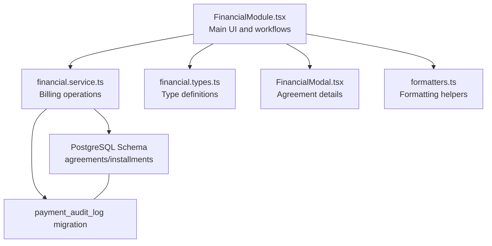
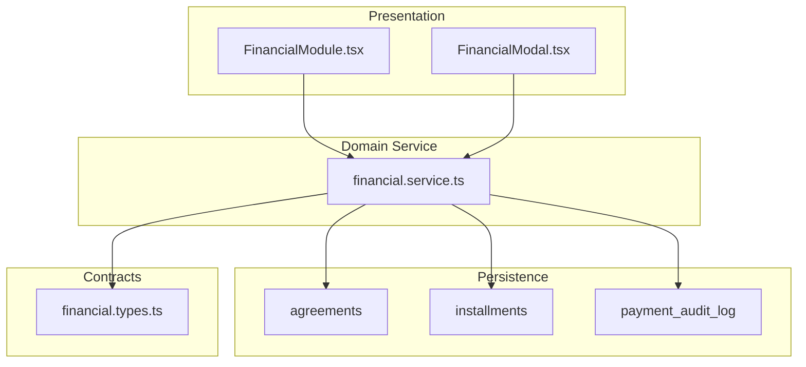
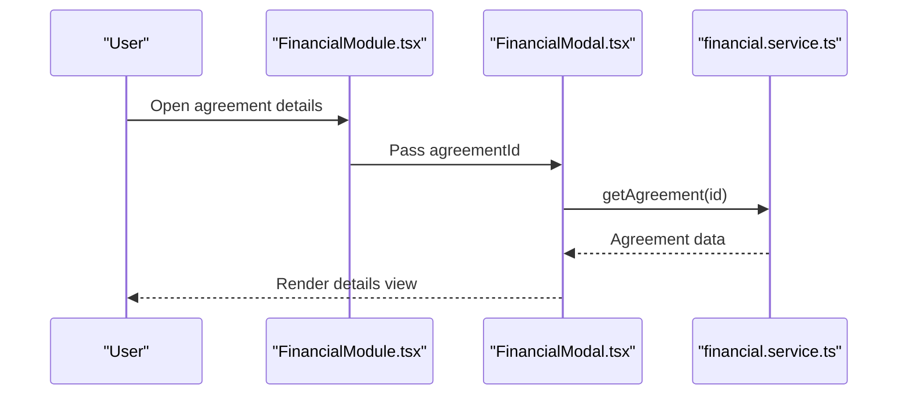
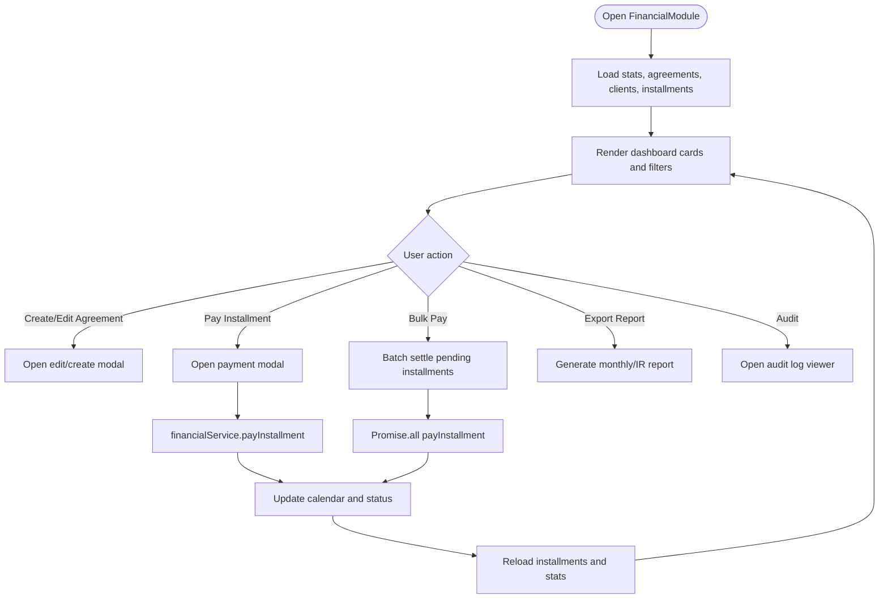
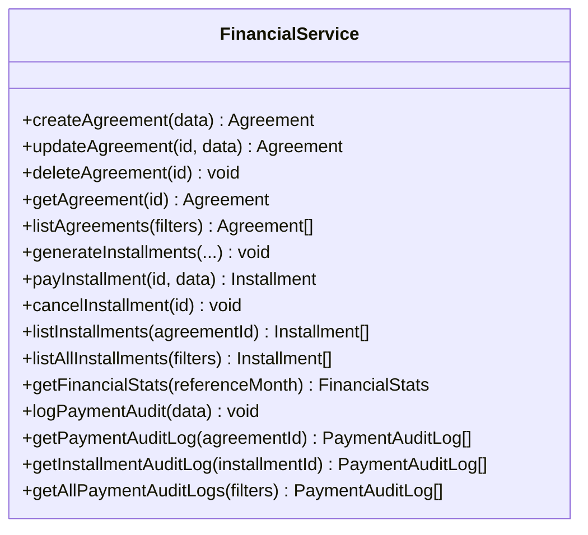
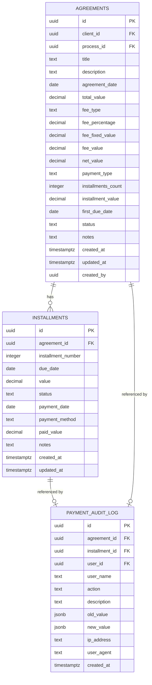
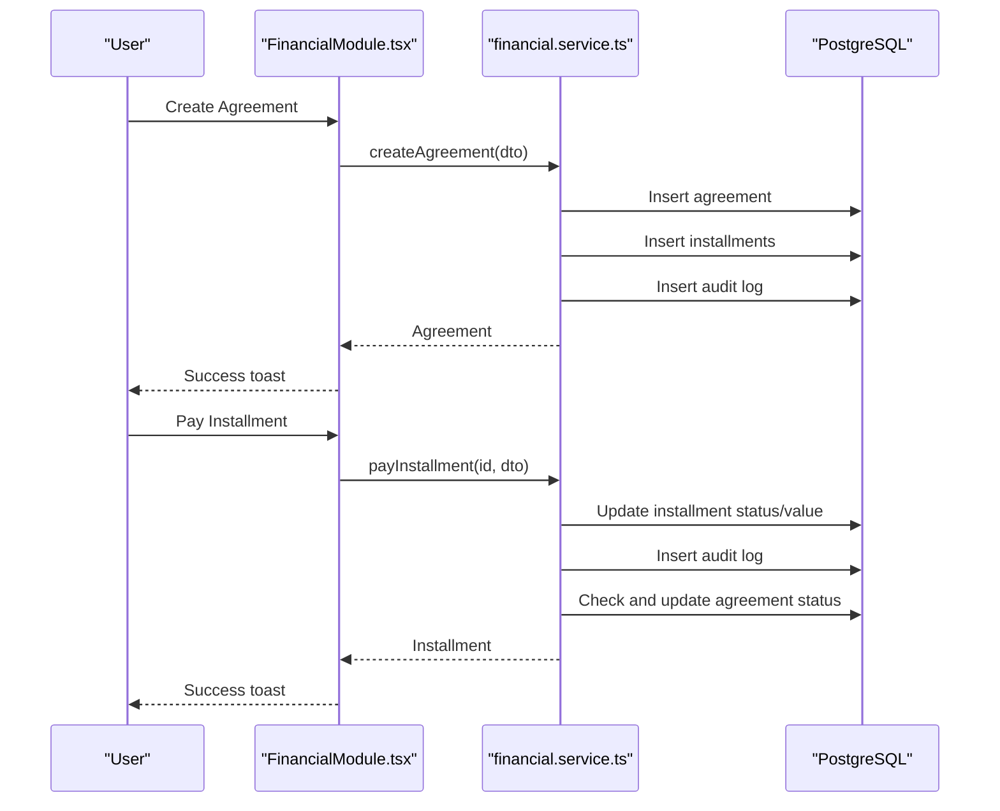
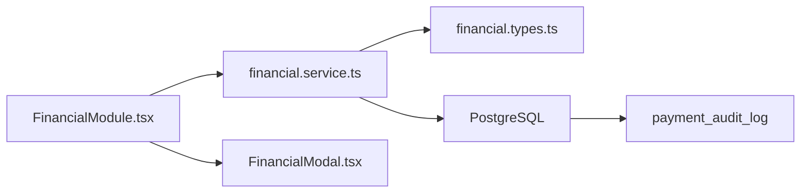

# Financial Management

<cite>
**Referenced Files in This Document**
- [FinancialModule.tsx](file://src/components/FinancialModule.tsx)
- [FinancialModal.tsx](file://src/components/FinancialModal.tsx)
- [financial.service.ts](file://src/services/financial.service.ts)
- [financial.types.ts](file://src/types/financial.types.ts)
- [create_financial_tables.sql](file://sql/create_financial_tables.sql)
- [20250610_payment_audit_log.sql](file://supabase/migrations/20250610_payment_audit_log.sql)
- [formatters.ts](file://src/utils/formatters.ts)
</cite>

## Table of Contents
1. [Introduction](#introduction)
2. [Project Structure](#project-structure)
3. [Core Components](#core-components)
4. [Architecture Overview](#architecture-overview)
5. [Detailed Component Analysis](#detailed-component-analysis)
6. [Dependency Analysis](#dependency-analysis)
7. [Performance Considerations](#performance-considerations)
8. [Troubleshooting Guide](#troubleshooting-guide)
9. [Conclusion](#conclusion)
10. [Appendices](#appendices)

## Introduction
This document explains the Financial Management module of the CRM, covering the billing system (invoice creation via agreements and installments), payment tracking, financial reporting, and auditing. It documents the FinancialModal component for viewing agreement details, the FinancialModule for managing billing workflows, the financial service layer for billing operations and analytics, and the database schema supporting financial records. It also outlines categories, payment methods, tax-related calculations, reporting features, billing cycles, overdue management, and integration points with the calendar module.

## Project Structure
The Financial Management module is composed of:
- UI components: FinancialModule (main dashboard and workflows), FinancialModal (agreement details)
- Service layer: financial.service.ts (billing operations, payments, analytics, audit logging)
- Types: financial.types.ts (Agreement, Installment, PaymentAuditLog, and DTOs)
- Database: SQL schema and migration for agreements, installments, and payment audit log
- Utilities: formatters.ts (currency/date formatting helpers)

**Diagram sources**
- [FinancialModule.tsx](file://src/components/FinancialModule.tsx)
- [FinancialModal.tsx](file://src/components/FinancialModal.tsx)
- [financial.service.ts](file://src/services/financial.service.ts)
- [financial.types.ts](file://src/types/financial.types.ts)
- [create_financial_tables.sql](file://sql/create_financial_tables.sql)
- [20250610_payment_audit_log.sql](file://supabase/migrations/20250610_payment_audit_log.sql)
- [formatters.ts](file://src/utils/formatters.ts)

**Section sources**
- [FinancialModule.tsx](file://src/components/FinancialModule.tsx)
- [FinancialModal.tsx](file://src/components/FinancialModal.tsx)
- [financial.service.ts](file://src/services/financial.service.ts)
- [financial.types.ts](file://src/types/financial.types.ts)
- [create_financial_tables.sql](file://sql/create_financial_tables.sql)
- [20250610_payment_audit_log.sql](file://supabase/migrations/20250610_payment_audit_log.sql)
- [formatters.ts](file://src/utils/formatters.ts)

## Core Components
- FinancialModule: Full-featured financial dashboard with agreement listing, payment entry, bulk settlement, monthly reporting, IRPF reporting, audit log viewer, and calendar integration.
- FinancialModal: Lightweight modal to view agreement details (client, totals, installments, dates, status).
- financial.service: Backend service orchestrating billing operations (create/update/delete agreements, generate installments, register payments, compute analytics, and audit logging).
- Types: Strongly typed domain models for agreements, installments, payment audit actions, and financial statistics.
- Database schema: Relational model for agreements and installments with indices and RLS policies; audit log table with policies and triggers.

**Section sources**
- [FinancialModule.tsx](file://src/components/FinancialModule.tsx)
- [FinancialModal.tsx](file://src/components/FinancialModal.tsx)
- [financial.service.ts](file://src/services/financial.service.ts)
- [financial.types.ts](file://src/types/financial.types.ts)
- [create_financial_tables.sql](file://sql/create_financial_tables.sql)
- [20250610_payment_audit_log.sql](file://supabase/migrations/20250610_payment_audit_log.sql)

## Architecture Overview
The Financial Management module follows a layered architecture:
- Presentation layer: React components (FinancialModule, FinancialModal)
- Domain service layer: financial.service encapsulates business logic
- Persistence layer: Supabase/PostgreSQL with typed queries
- Data contracts: TypeScript types define domain entities and DTOs
- Audit trail: Dedicated payment audit log table with RLS policies

**Diagram sources**
- [FinancialModule.tsx](file://src/components/FinancialModule.tsx)
- [FinancialModal.tsx](file://src/components/FinancialModal.tsx)
- [financial.service.ts](file://src/services/financial.service.ts)
- [financial.types.ts](file://src/types/financial.types.ts)
- [create_financial_tables.sql](file://sql/create_financial_tables.sql)
- [20250610_payment_audit_log.sql](file://supabase/migrations/20250610_payment_audit_log.sql)

## Detailed Component Analysis

### FinancialModal Component
Purpose: Display a compact view of an agreement’s details including client, totals, installments, dates, and status.

Key behaviors:
- Loads agreement via financialService.getAgreement
- Formats currency and dates for Brazilian locale
- Renders status badges with semantic colors
- Provides a close action

**Diagram sources**
- [FinancialModal.tsx](file://src/components/FinancialModal.tsx)
- [financial.service.ts](file://src/services/financial.service.ts)

**Section sources**
- [FinancialModal.tsx](file://src/components/FinancialModal.tsx)

### FinancialModule Component
Purpose: End-to-end financial management with agreement lifecycle, payment entry, bulk settlement, reporting, and audit.

Key capabilities:
- Agreement lifecycle
  - Create agreements (upfront or installments), edit, delete
  - Automatic installment generation based on total value, count, and due date
  - Enforces constraints (e.g., cannot modify installments after any payment)
- Payment processing
  - Single payment entry per installment with method, date, and notes
  - Bulk payment settlement for pending installments
  - Updates agreement status to “concluded” when all installments are paid
- Reporting
  - Monthly financial summary cards (A Receber, Recebido, Pendente, Vencidas)
  - Exportable monthly report (payments and pending installments)
  - Annual IRPF report with charts, filters, and client breakdown
- Audit and compliance
  - Payment audit log with action, user, timestamps, and JSON diffs
  - Filters by month, action, user, and date range
- Integrations
  - Calendar events for payment deadlines and overdue notices
  - Receipt generation (PDF) for single installments and full agreements

**Diagram sources**
- [FinancialModule.tsx](file://src/components/FinancialModule.tsx)
- [financial.service.ts](file://src/services/financial.service.ts)

**Section sources**
- [FinancialModule.tsx](file://src/components/FinancialModule.tsx)

### Financial Service Layer
Responsibilities:
- Agreement management
  - Create/update/delete agreements
  - Compute fee_value, net_value, and installment_value
  - Regenerate installments when allowed
- Installment management
  - Generate installments (fixed or custom)
  - Update statuses (pending, paid, overdue, canceled)
  - Check and update agreement status upon payment
- Payment processing
  - Register payments with method, date, and notes
  - Compute proportional fee distribution per payment
- Analytics
  - Monthly financial stats (fees, received, pending, overdue)
  - Paid/pending counts per month
- Audit logging
  - Log all payment and agreement changes with user context
  - Support filtering and retrieval of audit logs

**Diagram sources**
- [financial.service.ts](file://src/services/financial.service.ts)

**Section sources**
- [financial.service.ts](file://src/services/financial.service.ts)

### Data Model and Schema
Entities and relationships:
- Agreement: client linkage, title/description, total/fee/net values, payment type, installments count, first due date, status, notes, timestamps, created_by
- Installment: agreement linkage, installment_number, due_date, value, status, payment_date/method/paid_value, notes, timestamps
- PaymentAuditLog: references agreement and optionally installment, stores action, user info, IP/user agent, JSON diffs

**Diagram sources**
- [create_financial_tables.sql](file://sql/create_financial_tables.sql)
- [20250610_payment_audit_log.sql](file://supabase/migrations/20250610_payment_audit_log.sql)

**Section sources**
- [create_financial_tables.sql](file://sql/create_financial_tables.sql)
- [20250610_payment_audit_log.sql](file://supabase/migrations/20250610_payment_audit_log.sql)

### Types and Contracts
- Agreement: core contract for billing agreements with fee computation and payment scheduling
- Installment: individual billing line items with payment metadata
- PaymentAuditLog: audit trail entries with action categorization
- FinancialStats: aggregated metrics for reporting
- DTOs: CreateAgreementDTO, UpdateAgreementDTO, PayInstallmentDTO

**Section sources**
- [financial.types.ts](file://src/types/financial.types.ts)

### Payment Methods and Categories
Supported payment methods:
- Dinheiro (Cash)
- Pix
- Transferência (Bank Transfer)
- Cheque (Check)
- Cartão de Crédito (Credit Card)
- Cartão de Débito (Debit Card)

Categories:
- Fee types: percentage or fixed
- Payment types: upfront or installments
- Statuses: pending, paid, overdue, canceled
- Agreement statuses: pending, active, completed, canceled

**Section sources**
- [financial.types.ts](file://src/types/financial.types.ts)
- [financial.service.ts](file://src/services/financial.service.ts)

### Billing Operations and Workflows
- Create agreement
  - Choose client, title, total value, fee type (percentage/fixed), payment type (upfront/installments), installments count, first due date, optional custom installments
  - Service computes fee_value, net_value, and installment_value; creates installments; logs audit
- Edit agreement
  - Allowed only if no installments are paid; recalculates values and regenerates installments when applicable
- Delete agreement
  - Deletes related installments and the agreement itself
- Payment entry
  - Select installment, enter payment date, method, paid value, notes; service updates status and logs audit
- Bulk payment
  - Settle all pending installments for an agreement at once
- Overdue management
  - Installments automatically marked as overdue if past due date and status remains pending
  - Calendar integration adds deadline reminders and overdue notices

**Diagram sources**
- [FinancialModule.tsx](file://src/components/FinancialModule.tsx)
- [financial.service.ts](file://src/services/financial.service.ts)

**Section sources**
- [FinancialModule.tsx](file://src/components/FinancialModule.tsx)
- [financial.service.ts](file://src/services/financial.service.ts)

### Financial Reporting
- Monthly report
  - Payments and pending installments for a given month
  - Exported as printable HTML/PDF
- IRPF annual report
  - Charts: monthly distribution, payment method composition, top 5 clients
  - Tables: monthly detail, client summary, quarterly overview
  - Interactive filters by payment method
  - Totals computed from paid_value with fee ratio applied
- Financial stats cards
  - Monthly fees, received, pending, overdue, and overdue installments

**Section sources**
- [FinancialModule.tsx](file://src/components/FinancialModule.tsx)

### Financial Audit Logging
- Actions logged: payment_registered, payment_cancelled, payment_edited, installment_created, installment_cancelled, agreement_created, agreement_edited, agreement_cancelled
- Fields captured: user context, IP/user agent, JSON diffs (old/new values)
- Retrieval: by agreement, by installment, or global with filters

**Section sources**
- [financial.service.ts](file://src/services/financial.service.ts)
- [20250610_payment_audit_log.sql](file://supabase/migrations/20250610_payment_audit_log.sql)

### Expense Tracking and Accounting Integration
- Not implemented in the current codebase
- Recommendations:
  - Extend Agreement/Installment with expense fields
  - Add dedicated expense entity with category, vendor, date, amount
  - Integrate with external accounting systems via webhooks or batch exports
  - Add reconciliation workflow linking payments to expenses

[No sources needed since this section provides general guidance]

### Examples and Customization
- Customizing billing workflows
  - Use custom_installments during creation/edit to define irregular schedules
  - Switch payment_type to upfront or installments and adjust installments_count
- Implementing payment plans
  - Define first_due_date and installments_count; optionally override with custom_installments
  - Use bulk payment to settle arrearages
- Generating financial reports
  - Use monthly report for cash flow tracking
  - Use IRPF report for tax preparation with interactive filters

**Section sources**
- [FinancialModule.tsx](file://src/components/FinancialModule.tsx)
- [financial.service.ts](file://src/services/financial.service.ts)

## Dependency Analysis
- UI depends on financial.service for all data operations
- financial.service depends on Supabase client and PostgreSQL schema
- Types define contracts between UI and service
- Audit log is a cross-cutting concern used by service operations

**Diagram sources**
- [FinancialModule.tsx](file://src/components/FinancialModule.tsx)
- [FinancialModal.tsx](file://src/components/FinancialModal.tsx)
- [financial.service.ts](file://src/services/financial.service.ts)
- [financial.types.ts](file://src/types/financial.types.ts)
- [create_financial_tables.sql](file://sql/create_financial_tables.sql)
- [20250610_payment_audit_log.sql](file://supabase/migrations/20250610_payment_audit_log.sql)

**Section sources**
- [FinancialModule.tsx](file://src/components/FinancialModule.tsx)
- [FinancialModal.tsx](file://src/components/FinancialModal.tsx)
- [financial.service.ts](file://src/services/financial.service.ts)
- [financial.types.ts](file://src/types/financial.types.ts)
- [create_financial_tables.sql](file://sql/create_financial_tables.sql)
- [20250610_payment_audit_log.sql](file://supabase/migrations/20250610_payment_audit_log.sql)

## Performance Considerations
- Indexes on agreements and installments support frequent queries by status, due_date, and payment_date
- RLS policies enable row-level filtering; ensure appropriate policies for performance
- Monthly analytics aggregation uses in-app computations; consider materialized views or scheduled jobs for heavy loads
- Audit log queries should leverage indexed columns (agreement_id, created_at)

[No sources needed since this section provides general guidance]

## Troubleshooting Guide
Common issues and resolutions:
- Payment cannot be edited or deleted
  - Check audit log for payment_edited/payment_cancelled actions
  - Verify service logs for errors
- Overdue installments not updating
  - Confirm listAllInstallments runs overdue updates and that today’s date is correct
- Reports show inconsistent totals
  - Ensure paid_value is used for actual receipts; verify fee ratios applied per payment
- Calendar synchronization fails
  - Review service logs for calendar errors; note that failures are silenced to avoid blocking payment registration

**Section sources**
- [financial.service.ts](file://src/services/financial.service.ts)
- [FinancialModule.tsx](file://src/components/FinancialModule.tsx)

## Conclusion
The Financial Management module provides a robust, auditable, and user-friendly system for managing billing agreements, installments, payments, and financial reporting. It integrates seamlessly with calendar events and supports detailed analytics and compliance through audit logging. Extensions for expense tracking and accounting integration are straightforward and can be implemented incrementally.

## Appendices

### Formatting Utilities
- Currency formatting for Brazilian Real
- Date/time formatting helpers used across the module

**Section sources**
- [formatters.ts](file://src/utils/formatters.ts)