# Intimations Module

<cite>
**Referenced Files in This Document**
- [IntimationsModule.tsx](file://src/components/IntimationsModule.tsx)
- [useDjenSync.ts](file://src/hooks/useDjenSync.ts)
- [djenSyncStatus.service.ts](file://src/services/djenSyncStatus.service.ts)
- [intimationAnalysis.service.ts](file://src/services/intimationAnalysis.service.ts)
- [djen.service.ts](file://src/services/djen.service.ts)
- [djenLocal.service.ts](file://src/services/djenLocal.service.ts)
- [processDjenSync.service.ts](file://src/services/processDjenSync.service.ts)
- [djen.types.ts](file://src/types/djen.types.ts)
- [intimation.types.ts](file://src/types/intimation.types.ts)
- [ai.types.ts](file://src/types/ai.types.ts)
- [syncHistory.ts](file://src/utils/syncHistory.ts)
- [exportIntimations.ts](file://src/utils/exportIntimations.ts)
- [run-djen-sync/index.ts](file://supabase/functions/run-djen-sync/index.ts)
- [analyze-intimations/index.ts](file://supabase/functions/analyze-intimations/index.ts)
- [deadline.service.ts](file://src/services/deadline.service.ts)
- [userNotification.service.ts](file://src/services/userNotification.service.ts)
- [user-notification.types.ts](file://src/types/user-notification.types.ts)
- [DeadlinesModule.tsx](file://src/components/DeadlinesModule.tsx)
- [DocsChangesPage.tsx](file://src/components/DocsChangesPage.tsx)
- [notify-deadline-assigned/index.ts](file://supabase/functions/notify-deadline-assigned/index.ts)
- [notification-scheduler/index.ts](file://supabase/functions/notification-scheduler/index.ts)
- [index.css](file://src/index.css)
- [tailwind.config.js](file://tailwind.config.js)
- [package.json](file://package.json)
</cite>

## Update Summary
**Changes Made**
- Updated to version 1.10.111 with 'Café Intimação Limpa' codename
- Comprehensive design overhaul: removal of statistics bar and urgency alert banner
- Unified color scheme: slate + amber theme throughout the interface
- Redesigned grouped view with enhanced interactive elements
- Enhanced visual hierarchy and typography improvements
- Improved mobile responsiveness and touch targets
- Streamlined navigation with simplified status indicators

## Table of Contents
1. [Introduction](#introduction)
2. [Project Structure](#project-structure)
3. [Core Components](#core-components)
4. [Architecture Overview](#architecture-overview)
5. [Detailed Component Analysis](#detailed-component-analysis)
6. [Visual Redesign and Technical Improvements](#visual-redesign-and-technical-improvements)
7. [Dependency Analysis](#dependency-analysis)
8. [Performance Considerations](#performance-considerations)
9. [Troubleshooting Guide](#troubleshooting-guide)
10. [Conclusion](#conclusion)
11. [Appendices](#appendices)

## Introduction
The Intimations Module integrates with the Diário de Justiça Eletrônico Nacional (DJEN) to automatically synchronize judicial communications, link them to clients and processes, and provide AI-powered analysis and notifications. It offers a comprehensive interface for filtering, searching, bulk actions, and exporting intimation records, alongside robust monitoring of sync progress and history. The module has undergone a comprehensive design overhaul (version 1.10.111) focusing on enhanced readability, unified slate + amber color scheme, and streamlined user interface elements.

## Project Structure
The module spans frontend React components, services, hooks, utilities, and Supabase Edge Functions that orchestrate automatic synchronization and AI analysis.

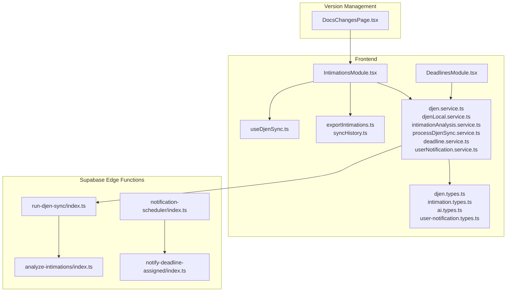

**Diagram sources**
- [IntimationsModule.tsx:142-3616](file://src/components/IntimationsModule.tsx#L142-L3616)
- [useDjenSync.ts:8-41](file://src/hooks/useDjenSync.ts#L8-L41)
- [djen.service.ts:8-262](file://src/services/djen.service.ts#L8-L262)
- [djenLocal.service.ts:11-747](file://src/services/djenLocal.service.ts#L11-L747)
- [intimationAnalysis.service.ts:23-191](file://src/services/intimationAnalysis.service.ts#L23-L191)
- [processDjenSync.service.ts:6-233](file://src/services/processDjenSync.service.ts#L6-L233)
- [djen.types.ts:1-154](file://src/types/djen.types.ts#L1-L154)
- [intimation.types.ts:1-31](file://src/types/intimation.types.ts#L1-L31)
- [ai.types.ts:1-45](file://src/types/ai.types.ts#L1-L45)
- [exportIntimations.ts:1-277](file://src/utils/exportIntimations.ts#L1-L277)
- [syncHistory.ts:1-77](file://src/utils/syncHistory.ts#L1-L77)
- [run-djen-sync/index.ts:1-639](file://supabase/functions/run-djen-sync/index.ts#L1-L639)
- [analyze-intimations/index.ts:1-375](file://supabase/functions/analyze-intimations/index.ts#L1-L375)
- [deadline.service.ts:1-200](file://src/services/deadline.service.ts#L1-L200)
- [userNotification.service.ts:173-251](file://src/services/userNotification.service.ts#L173-L251)
- [user-notification.types.ts:1-52](file://src/types/user-notification.types.ts#L1-L52)
- [DeadlinesModule.tsx:2707-2730](file://src/components/DeadlinesModule.tsx#L2707-L2730)
- [DocsChangesPage.tsx:50-55](file://src/components/DocsChangesPage.tsx#L50-L55)
- [notify-deadline-assigned/index.ts:216-296](file://supabase/functions/notify-deadline-assigned/index.ts#L216-L296)
- [notification-scheduler/index.ts:79-179](file://supabase/functions/notification-scheduler/index.ts#L79-L179)

**Section sources**
- [IntimationsModule.tsx:142-3616](file://src/components/IntimationsModule.tsx#L142-L3616)
- [djen.service.ts:8-262](file://src/services/djen.service.ts#L8-L262)
- [djenLocal.service.ts:11-747](file://src/services/djenLocal.service.ts#L11-L747)
- [run-djen-sync/index.ts:1-639](file://supabase/functions/run-djen-sync/index.ts#L1-L639)

## Core Components
- IntimationsModule: Main UI component managing state, filters, search, grouping, selection, and actions; orchestrating sync and real-time updates.
- useDjenSync: Polling hook for periodic process-level DJEN sync.
- DjenSyncStatusService: Backend service to track sync runs and statuses.
- IntimationAnalysisService: CRUD for AI analysis of intimation content.
- DjenService/DjenLocalService: DJEN API integration and local persistence.
- ProcessDjenSyncService: Process-level sync and metadata enrichment.
- DeadlineService: Manages deadline creation with enhanced data consistency.
- UserNotificationService: Handles rich contextual notifications for deadlines and appointments.
- Edge Functions: run-djen-sync, analyze-intimations, notify-deadline-assigned, and notification-scheduler for automated ingestion, AI analysis, and notification delivery.
- Utilities: export and sync history helpers.

**Section sources**
- [IntimationsModule.tsx:142-3616](file://src/components/IntimationsModule.tsx#L142-L3616)
- [useDjenSync.ts:8-41](file://src/hooks/useDjenSync.ts#L8-L41)
- [djenSyncStatus.service.ts:19-99](file://src/services/djenSyncStatus.service.ts#L19-L99)
- [intimationAnalysis.service.ts:23-191](file://src/services/intimationAnalysis.service.ts#L23-L191)
- [djen.service.ts:8-262](file://src/services/djen.service.ts#L8-L262)
- [djenLocal.service.ts:11-747](file://src/services/djenLocal.service.ts#L11-L747)
- [processDjenSync.service.ts:6-233](file://src/services/processDjenSync.service.ts#L6-L233)
- [deadline.service.ts:87-106](file://src/services/deadline.service.ts#L87-L106)
- [userNotification.service.ts:197-248](file://src/services/userNotification.service.ts#L197-L248)
- [run-djen-sync/index.ts:1-639](file://supabase/functions/run-djen-sync/index.ts#L1-L639)
- [analyze-intimations/index.ts:1-375](file://supabase/functions/analyze-intimations/index.ts#L1-L375)

## Architecture Overview
The system follows a hybrid architecture:
- Frontend polls and reacts to Supabase realtime channels for new intimation inserts.
- Supabase Edge Functions perform scheduled ingestion and AI analysis.
- Local services manage deduplication, linking, and cleanup.
- AI analysis is persisted and surfaced in the UI.
- Enhanced notification system delivers rich contextual information for deadlines and appointments.

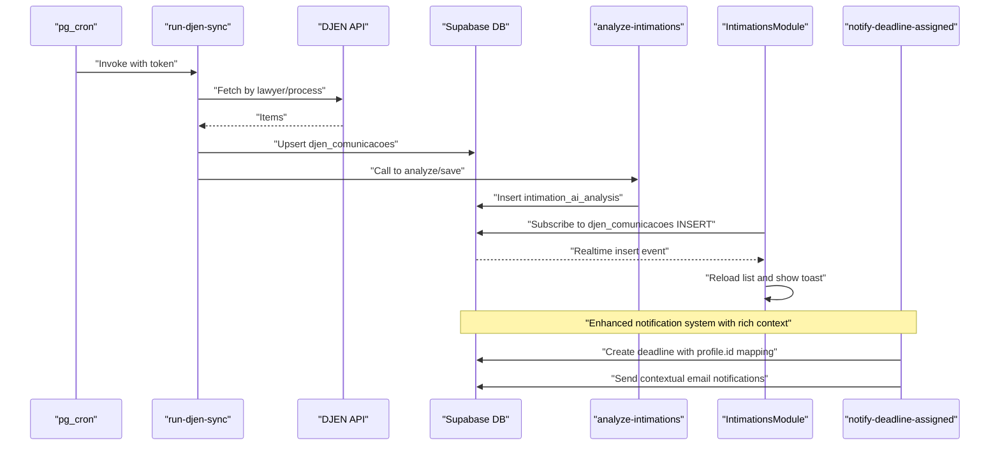

**Diagram sources**
- [run-djen-sync/index.ts:146-332](file://supabase/functions/run-djen-sync/index.ts#L146-L332)
- [analyze-intimations/index.ts:225-366](file://supabase/functions/analyze-intimations/index.ts#L225-L366)
- [IntimationsModule.tsx:556-609](file://src/components/IntimationsModule.tsx#L556-L609)
- [notify-deadline-assigned/index.ts:216-296](file://supabase/functions/notify-deadline-assigned/index.ts#L216-L296)

## Detailed Component Analysis

### IntimationsModule Component
Responsibilities:
- State management for intimation list, clients, processes, members, and AI analysis.
- Filtering, search, grouping, and selection modes.
- Manual and automatic sync orchestration with DJEN.
- Realtime updates via Supabase channels.
- Bulk actions (mark read, unlink client/process, delete selected/read).
- Export to CSV/Excel/PDF.
- Sync history monitoring and status display.

Key behaviors:
- Preloads a local snapshot to avoid blank screen.
- Performs auto-linking by process number and party names.
- Loads saved AI analyses per intimation.
- Triggers manual sync and cleans old records.
- Monitors sync logs and displays last sync time.
- Enhanced deadline creation with proper profile.id mapping.
- **Updated** Implements HTML entity decoding for proper content rendering.

**Section sources**
- [IntimationsModule.tsx:142-3616](file://src/components/IntimationsModule.tsx#L142-L3616)

### useDjenSync Hook (Polling Mechanism)
- Runs every 1 hour after an initial 5-second delay.
- Invokes processDjenSyncService.syncPendingProcesses().
- Handles errors and logs outcomes.

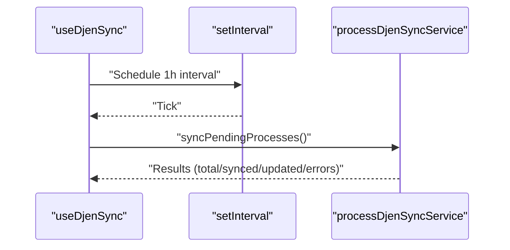

**Diagram sources**
- [useDjenSync.ts:8-41](file://src/hooks/useDjenSync.ts#L8-L41)
- [processDjenSync.service.ts:119-178](file://src/services/processDjenSync.service.ts#L119-L178)

**Section sources**
- [useDjenSync.ts:8-41](file://src/hooks/useDjenSync.ts#L8-L41)
- [processDjenSync.service.ts:119-178](file://src/services/processDjenSync.service.ts#L119-L178)

### DjenSyncStatusService (Monitoring Sync Progress and History)
- Provides listRecent(limit) to fetch latest sync logs.
- Supports logSync(...) and updateSync(...) for lifecycle tracking.
- Used by IntimationsModule to display recent sync status.

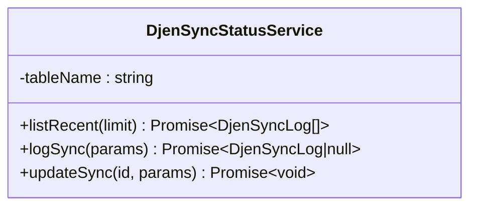

**Diagram sources**
- [djenSyncStatus.service.ts:19-99](file://src/services/djenSyncStatus.service.ts#L19-L99)

**Section sources**
- [djenSyncStatus.service.ts:19-99](file://src/services/djenSyncStatus.service.ts#L19-L99)
- [IntimationsModule.tsx:225-235](file://src/components/IntimationsModule.tsx#L225-L235)

### Intimation Analysis Service (AI-powered Content Processing and Classification)
- Persists AI analysis with urgency, deadlines, summary, and suggested actions.
- Converts between DB storage and app-facing IntimationAnalysis type.
- Supports batch retrieval by intimation IDs.

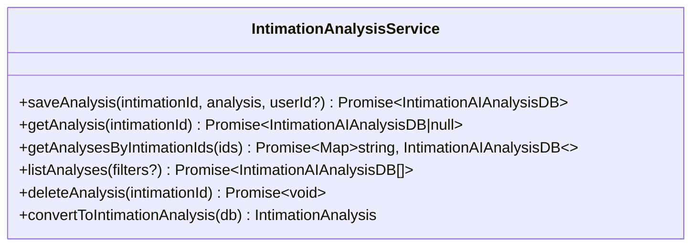

**Diagram sources**
- [intimationAnalysis.service.ts:23-191](file://src/services/intimationAnalysis.service.ts#L23-L191)
- [ai.types.ts:3-18](file://src/types/ai.types.ts#L3-L18)

**Section sources**
- [intimationAnalysis.service.ts:23-191](file://src/services/intimationAnalysis.service.ts#L23-L191)
- [ai.types.ts:3-18](file://src/types/ai.types.ts#L3-L18)

### Enhanced Deadline Creation and Notification System
The deadline creation system now ensures data consistency by properly mapping responsible_id from auth user_id to profile.id.

- DeadlineService.createDeadline() handles proper profile.id mapping for responsible_id field.
- UserNotificationService.createNotification() supports rich metadata for contextual notifications.
- Enhanced notification system includes detailed deadline information with urgency indicators.
- Email notifications include comprehensive context with client information, process details, and priority levels.

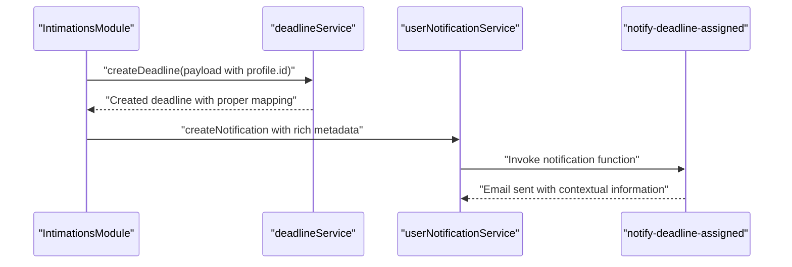

**Diagram sources**
- [IntimationsModule.tsx:3071-3088](file://src/components/IntimationsModule.tsx#L3071-L3088)
- [deadline.service.ts:87-106](file://src/services/deadline.service.ts#L87-L106)
- [userNotification.service.ts:197-248](file://src/services/userNotification.service.ts#L197-L248)
- [notify-deadline-assigned/index.ts:216-296](file://supabase/functions/notify-deadline-assigned/index.ts#L216-L296)

**Section sources**
- [deadline.service.ts:87-106](file://src/services/deadline.service.ts#L87-L106)
- [userNotification.service.ts:197-248](file://src/services/userNotification.service.ts#L197-L248)
- [IntimationsModule.tsx:3071-3088](file://src/components/IntimationsModule.tsx#L3071-L3088)

### DJEN Integration and Automatic Synchronization
- DjenService: Queries DJEN API with pagination and rate-limiting safeguards.
- DjenLocalService: Upserts intimation records, auto-links by process and party, propagates links across same-process records, and cleans old entries.
- Edge Function run-djen-sync: Scheduled ingestion, saves to DB, triggers AI analysis, and updates process metadata.
- Edge Function analyze-intimations: Calls LLMs (Groq/OpenAI) to classify urgency, extract deadlines, and create user notifications.

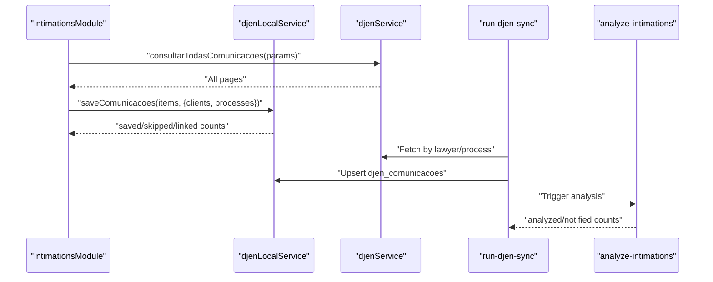

**Diagram sources**
- [djen.service.ts:108-162](file://src/services/djen.service.ts#L108-L162)
- [djenLocal.service.ts:125-460](file://src/services/djenLocal.service.ts#L125-L460)
- [run-djen-sync/index.ts:146-332](file://supabase/functions/run-djen-sync/index.ts#L146-L332)
- [analyze-intimations/index.ts:225-366](file://supabase/functions/analyze-intimations/index.ts#L225-L366)

**Section sources**
- [djen.service.ts:108-162](file://src/services/djen.service.ts#L108-L162)
- [djenLocal.service.ts:125-460](file://src/services/djenLocal.service.ts#L125-L460)
- [run-djen-sync/index.ts:146-332](file://supabase/functions/run-djen-sync/index.ts#L146-L332)
- [analyze-intimations/index.ts:225-366](file://supabase/functions/analyze-intimations/index.ts#L225-L366)

### Intimation Types, Analysis Results, and Process Linking
- DjenComunicacaoLocal: Local representation of DJEN communication with client/process linkage and flags.
- IntimationAnalysis: Frontend type for AI analysis results.
- Process tracking and linking: Auto-link by normalized process number and party names; propagate links across same-process records.

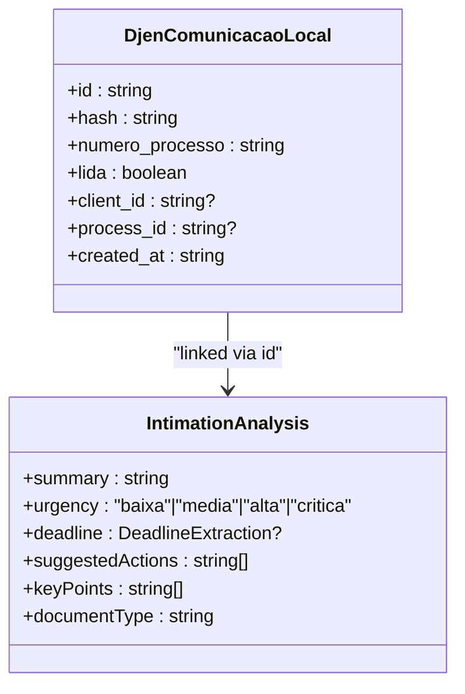

**Diagram sources**
- [djen.types.ts:84-122](file://src/types/djen.types.ts#L84-L122)
- [ai.types.ts:3-18](file://src/types/ai.types.ts#L3-L18)

**Section sources**
- [djen.types.ts:84-122](file://src/types/djen.types.ts#L84-L122)
- [ai.types.ts:3-18](file://src/types/ai.types.ts#L3-L18)
- [djenLocal.service.ts:313-460](file://src/services/djenLocal.service.ts#L313-L460)

### Sync History Tracking, Error Reporting, and Manual Controls
- Sync logs: Stored in djen_sync_history; IntimationsModule lists recent entries.
- Manual sync: Button triggers performSync with manual mode and optional cleanup.
- Error handling: Centralized try/catch blocks, toasts, and logging; realtime guardrails prevent loops.

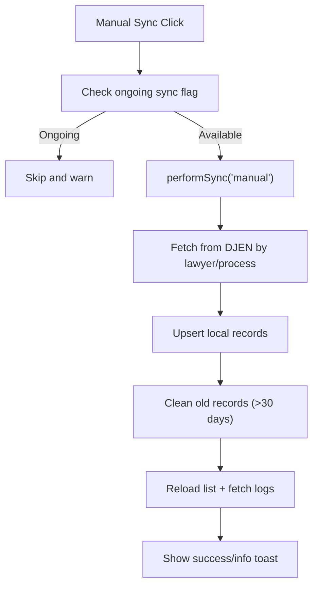

**Diagram sources**
- [IntimationsModule.tsx:616-743](file://src/components/IntimationsModule.tsx#L616-L743)
- [djenSyncStatus.service.ts:22-35](file://src/services/djenSyncStatus.service.ts#L22-L35)

**Section sources**
- [IntimationsModule.tsx:616-743](file://src/components/IntimationsModule.tsx#L616-L743)
- [djenSyncStatus.service.ts:22-35](file://src/services/djenSyncStatus.service.ts#L22-L35)

### Enhanced Notification System
The notification system now provides rich contextual information with detailed metadata for deadlines and appointments.

- UserNotificationService.createNotification() supports comprehensive metadata including priority, type, days until due, and related entity IDs.
- notify-deadline-assigned Edge Function sends contextual emails with client information, process details, and priority levels.
- notification-scheduler Function provides deduplicated reminder notifications with proper profile.id resolution.
- Rich notification categories include deadline_assigned, appointment_assigned, deadline_reminder, and appointment_reminder.

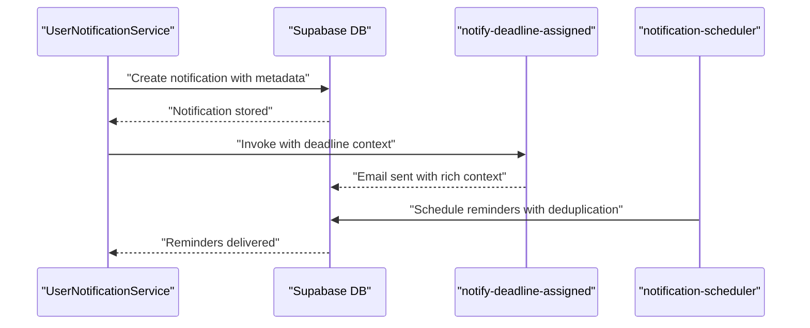

**Diagram sources**
- [userNotification.service.ts:197-248](file://src/services/userNotification.service.ts#L197-L248)
- [notify-deadline-assigned/index.ts:216-296](file://supabase/functions/notify-deadline-assigned/index.ts#L216-L296)
- [notification-scheduler/index.ts:79-179](file://supabase/functions/notification-scheduler/index.ts#L79-L179)

**Section sources**
- [userNotification.service.ts:197-248](file://src/services/userNotification.service.ts#L197-L248)
- [notify-deadline-assigned/index.ts:216-296](file://supabase/functions/notify-deadline-assigned/index.ts#L216-L296)
- [notification-scheduler/index.ts:79-179](file://supabase/functions/notification-scheduler/index.ts#L79-L179)

### Examples and Best Practices
- Configuring sync intervals:
  - Automatic process sync: useDjenSync runs every 1 hour; adjust interval by editing the hook's interval constant.
  - Manual sync: Trigger via the UI; optionally enable cleanup of old records.
- Customizing analysis rules:
  - AI analysis is performed by analyze-intimations; configure prompts and thresholds in the Edge Function.
  - Urgency thresholds and deadline extraction logic are defined in the function.
- Handling sync failures:
  - Inspect djen_sync_history for error_message and timestamps.
  - Retry manual sync; review rate limits and DJEN availability.
  - Monitor realtime channel behavior and toast notifications.
- Managing deadline assignments:
  - Ensure proper profile.id mapping when creating deadlines through the IntimationsModule.
  - Use rich notification metadata for better contextual information delivery.
  - Configure notification scheduler for automated reminder delivery.

## Visual Redesign and Technical Improvements

### Comprehensive Design Overhaul (Version 1.10.111)
**Major Update**: The Intimations Module has undergone a complete visual redesign with version 1.10.111 'Café Intimação Limpa'.

#### Key Design Changes:
- **Removed Statistics Bar**: Eliminated the prominent statistics bar for cleaner interface
- **Eliminated Urgency Alert Banner**: Removed the separate urgency alert banner for streamlined UX
- **Unified Color Scheme**: Implemented consistent slate + amber theme throughout the application
- **Redesigned Grouped View**: Enhanced grouped interface with improved interactive elements
- **Streamlined Navigation**: Simplified status indicators and reduced visual clutter

#### Visual Enhancements:
- **Typography Improvements**: Better font hierarchy and spacing for enhanced readability
- **Mobile Optimization**: Improved touch targets and responsive design
- **Interactive Elements**: Enhanced hover states and transition effects
- **Color Consistency**: Unified amber accents with slate backgrounds for professional appearance

**Section sources**
- [package.json:3](file://package.json#L3)
- [IntimationsModule.tsx:2013-2303](file://src/components/IntimationsModule.tsx#L2013-L2303)
- [index.css:1846-1887](file://src/index.css#L1846-L1887)

### HTML Entity Decoding Implementation
**New Feature**: Implemented comprehensive HTML entity decoding to properly render special characters in intimation content.

- **Function**: `htmlToText()` converts HTML entities (&aacute;, &nbsp;, &atilde;) to readable text before display
- **Usage**: Applied throughout content rendering, AI analysis summaries, and grouped view displays
- **Impact**: Eliminates garbled characters and improves readability of official court documents

**Section sources**
- [IntimationsModule.tsx:85](file://src/components/IntimationsModule.tsx#L85)
- [IntimationsModule.tsx:379](file://src/components/IntimationsModule.tsx#L379)
- [IntimationsModule.tsx:1519](file://src/components/IntimationsModule.tsx#L1519)
- [IntimationsModule.tsx:2168](file://src/components/IntimationsModule.tsx#L2168)
- [IntimationsModule.tsx:2420](file://src/components/IntimationsModule.tsx#L2420)

### Redesigned Grouped View Without Badges
**UI Enhancement**: Streamlined grouped view interface focusing on content clarity and professional presentation.

- **Removed**: Badge-based status indicators and colored tags
- **Retained**: Essential information display with improved typography
- **Enhanced**: Better spacing and visual hierarchy for unread/new indicators
- **Professional**: Clean design with amber theme accents

**Section sources**
- [IntimationsModule.tsx:2017-2054](file://src/components/IntimationsModule.tsx#L2017-L2054)
- [IntimationsModule.tsx:2032-2053](file://src/components/IntimationsModule.tsx#L2032-L2053)

### Unified Slate + Amber Color Scheme
**Design System**: Implemented consistent color palette throughout the interface.

- **Primary Colors**: Slate backgrounds (#f8fafc, #f1f5f9) with amber accents (#f59e0b, #fbbf24)
- **Consistency**: Applied uniformly across cards, buttons, and interactive elements
- **Professional Look**: Clean, modern aesthetic suitable for legal documentation
- **Accessibility**: Improved contrast ratios and visual hierarchy

**Section sources**
- [index.css:1846-1887](file://src/index.css#L1846-L1887)
- [IntimationsModule.tsx:2017-2054](file://src/components/IntimationsModule.tsx#L2017-L2054)

### Enhanced Interactive Elements
**UI Improvement**: Redesigned interactive components with better feedback and usability.

- **Hover States**: Smooth transitions and visual feedback for all clickable elements
- **Touch Targets**: Minimum 44px touch targets for mobile usability
- **Focus States**: Clear keyboard navigation indicators
- **Animations**: Subtle micro-interactions for enhanced user experience

**Section sources**
- [IntimationsModule.tsx:2064-2068](file://src/components/IntimationsModule.tsx#L2064-L2068)
- [IntimationsModule.tsx:2314-2321](file://src/components/IntimationsModule.tsx#L2314-L2321)

### Improved Mobile Responsiveness
**Responsive Enhancement**: Comprehensive mobile optimization for better touch interaction.

- **Touch Targets**: 44px minimum size for all interactive elements
- **Layout**: Responsive grid system adapts to different screen sizes
- **Navigation**: Simplified mobile controls with clear visual hierarchy
- **Performance**: Optimized rendering for mobile devices

**Section sources**
- [IntimationsModule.tsx:150-152](file://src/components/IntimationsModule.tsx#L150-L152)
- [IntimationsModule.tsx:2000-2012](file://src/components/IntimationsModule.tsx#L2000-L2012)

### Version History
**Updated** Version 1.10.111 introduces comprehensive design overhaul and enhanced user experience.

- Version 1.10.111: 'Café Intimação Limpa'
  - Complete design overhaul with unified slate + amber color scheme
  - Removal of statistics bar and urgency alert banner
  - Redesigned grouped view with enhanced interactive elements
  - Improved mobile responsiveness and touch targets
  - Streamlined navigation and reduced visual clutter

- Version 1.10.107: 'HTML Entity Decoding Support'
  - Implemented comprehensive HTML entity decoding function
  - Fixed garbled character display in intimation content
  - Enhanced content readability across all views

- Version 1.10.108: 'UI Streamlining'
  - Removed highlighting mechanisms for AI passages
  - Eliminated badge-based status indicators
  - Simplified grouped view interface

- Version 1.10.109: 'Professional Redesign'
  - Complete header redesign with amber theme
  - Introduced pill-shaped navigation tabs
  - Enhanced card design with amber accents
  - Improved typography and spacing

**Section sources**
- [DocsChangesPage.tsx:867](file://src/components/DocsChangesPage.tsx#L867)
- [package.json:3](file://package.json#L3)

## Dependency Analysis
High-level dependencies:
- IntimationsModule depends on djenLocalService, djenService, intimationAnalysisService, djenSyncStatusService, deadlineService, and Supabase realtime.
- useDjenSync depends on processDjenSyncService.
- Edge Functions depend on Supabase client and external LLM APIs.
- Enhanced notification system depends on userNotificationService and dedicated Edge Functions.

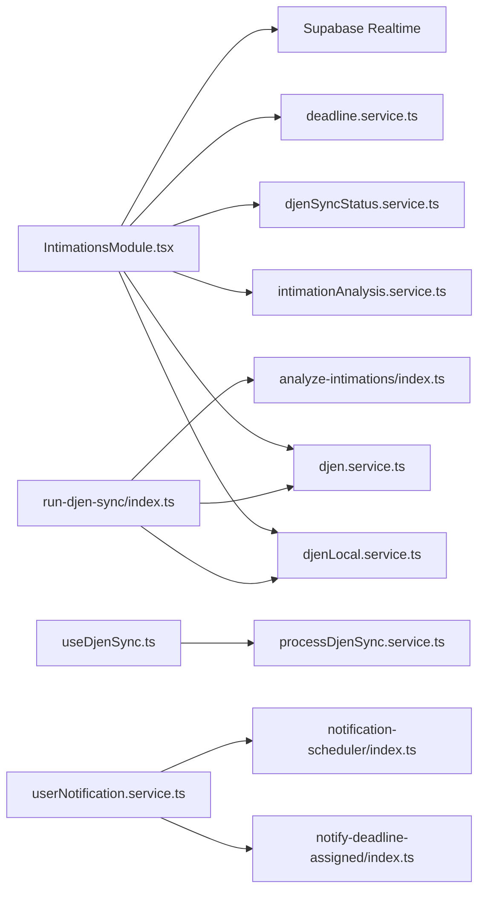

**Diagram sources**
- [IntimationsModule.tsx:32-47](file://src/components/IntimationsModule.tsx#L32-L47)
- [useDjenSync.ts:2](file://src/hooks/useDjenSync.ts#L2)
- [processDjenSync.service.ts:1](file://src/services/processDjenSync.service.ts#L1)
- [run-djen-sync/index.ts:45-48](file://supabase/functions/run-djen-sync/index.ts#L45-L48)
- [analyze-intimations/index.ts:1-9](file://supabase/functions/analyze-intimations/index.ts#L1-L9)
- [deadline.service.ts:1-200](file://src/services/deadline.service.ts#L1-L200)
- [userNotification.service.ts:173-251](file://src/services/userNotification.service.ts#L173-L251)

**Section sources**
- [IntimationsModule.tsx:32-47](file://src/components/IntimationsModule.tsx#L32-L47)
- [useDjenSync.ts:2](file://src/hooks/useDjenSync.ts#L2)
- [processDjenSync.service.ts:1](file://src/services/processDjenSync.service.ts#L1)
- [run-djen-sync/index.ts:45-48](file://supabase/functions/run-djen-sync/index.ts#L45-L48)
- [analyze-intimations/index.ts:1-9](file://supabase/functions/analyze-intimations/index.ts#L1-L9)

## Performance Considerations
- Pagination and rate limiting: DJEN queries enforce rate limits; the system adds delays between requests.
- Realtime batching: Supabase INSERTs are coalesced to reduce reload frequency.
- Local deduplication: Saves by hash to avoid duplicates.
- Cleanup: Old records cleaned periodically to maintain manageable dataset sizes.
- AI analysis throttling: Edge Functions limit concurrent calls and include timeouts.
- **Updated** Enhanced data consistency: Proper profile.id mapping reduces data integrity issues and improves query performance.
- **Updated** Notification optimization: Deduplication mechanisms prevent excessive notification delivery and reduce database load.
- **Updated** HTML entity decoding performance: Optimized parsing prevents rendering bottlenecks while ensuring proper character display.
- **Updated** Design optimization: Simplified interface reduces DOM complexity and improves rendering performance.

## Troubleshooting Guide
Common issues and resolutions:
- No new intimações after sync:
  - Verify pg_cron schedule and run-djen-sync token verification.
  - Check djen_sync_history for error_message and run_started_at/run_finished_at.
- Manual sync fails:
  - Review toast messages and console logs for API errors.
  - Confirm DJEN availability and rate limits.
- AI analysis not appearing:
  - Ensure OPENAI/GROQ keys are configured in Supabase secrets.
  - Check analyze-intimations logs and retry.
- Realtime not updating:
  - Confirm Supabase channel subscription and realtime flush timer logic.
  - Verify network connectivity and browser permissions.
- **Updated** HTML entity decoding issues:
  - Verify htmlToText function is properly imported and called.
  - Check for malformed HTML entities in source data.
  - Review browser compatibility for entity decoding.
- **Updated** UI rendering problems:
  - Verify slate + amber color scheme CSS classes are properly applied.
  - Check for conflicting style overrides in grouped view.
  - Ensure interactive element styles are loaded correctly.
- **Updated** Design consistency issues:
  - Verify unified color scheme implementation across all components.
  - Check mobile responsiveness on different device sizes.
  - Review touch target sizes for accessibility compliance.
- **Updated** Performance issues:
  - Monitor rendering performance on mobile devices.
  - Check for unnecessary re-renders in grouped view.
  - Verify optimized loading states and empty states.

**Section sources**
- [run-djen-sync/index.ts:334-347](file://supabase/functions/run-djen-sync/index.ts#L334-L347)
- [analyze-intimations/index.ts:225-374](file://supabase/functions/analyze-intimations/index.ts#L225-L374)
- [IntimationsModule.tsx:556-609](file://src/components/IntimationsModule.tsx#L556-L609)

## Conclusion
The Intimations Module provides a robust, automated pipeline for ingesting DJEN communications, linking them to clients and processes, enriching with AI insights, and surfacing actionable information through a responsive UI. Its architecture leverages Supabase Edge Functions for scalable scheduling and analysis, while the frontend ensures a smooth user experience with filtering, search, and export capabilities. The recent comprehensive design overhaul (version 1.10.111) focuses on enhanced readability, unified slate + amber color scheme, streamlined interface elements, and improved mobile responsiveness, while maintaining the module's reliability and user-friendliness.

## Appendices

### Appendix A: Data Models Overview
```mermaid
erDiagram
DJEN_COMMUNICACOES {
uuid id PK
int djen_id
string hash UK
string numero_processo
boolean lida
uuid client_id FK
uuid process_id FK
datetime data_disponibilizacao
boolean ativo
datetime created_at
datetime updated_at
}
INTIMATION_AI_ANALYSIS {
uuid id PK
uuid intimation_id FK
string summary
enum urgency
int deadline_days
date deadline_due_date
datetime analyzed_at
string model_used
datetime created_at
datetime updated_at
}
DJEN_ADVOCATES {
uuid id PK
uuid comunicacao_id FK
string nome
string numero_oab
string uf_oab
}
DJEN_DESTINATARIOS {
uuid id PK
uuid comunicacao_id FK
string nome
string polo
}
DJEN_COMMUNICACOES ||--o{ DJEN_ADVOCATES : "has"
DJEN_COMMUNICACOES ||--o{ DJEN_DESTINATARIOS : "has"
DJEN_COMMUNICACOES ||--o{ INTIMATION_AI_ANALYSIS : "analyzed"
```

**Diagram sources**
- [djen.types.ts:28-49](file://src/types/djen.types.ts#L28-L49)
- [djen.types.ts:84-122](file://src/types/djen.types.ts#L84-L122)
- [intimationAnalysis.service.ts:4-21](file://src/services/intimationAnalysis.service.ts#L4-L21)

### Appendix B: Export Formats
- CSV: Includes date, tribunal, process, type, organ, status, urgency, deadline, and summary.
- Excel: HTML table with urgency-styled cells and totals.
- PDF: Printable report with statistics and urgency breakdown.

**Section sources**
- [exportIntimations.ts:11-141](file://src/utils/exportIntimations.ts#L11-L141)
- [exportIntimations.ts:146-277](file://src/utils/exportIntimations.ts#L146-L277)

### Appendix C: Version History
**Updated** Version 1.10.111 introduces comprehensive design overhaul and enhanced user experience.

- Version 1.10.111: 'Café Intimação Limpa'
  - Complete design overhaul with unified slate + amber color scheme
  - Removal of statistics bar and urgency alert banner
  - Redesigned grouped view with enhanced interactive elements
  - Improved mobile responsiveness and touch targets
  - Streamlined navigation and reduced visual clutter

- Version 1.10.107: 'HTML Entity Decoding Support'
  - Implemented comprehensive HTML entity decoding function
  - Enhanced content readability across all views
  - Fixed garbled character display in official documents

- Version 1.10.108: 'UI Streamlining'
  - Removed highlighting mechanisms for AI passages
  - Eliminated badge-based status indicators
  - Simplified grouped view interface
  - Improved content presentation clarity

- Version 1.10.109: 'Professional Redesign'
  - Complete header redesign with amber theme
  - Introduced pill-shaped navigation tabs
  - Enhanced card design with amber borders
  - Improved typography and spacing throughout
  - Professional styling for better user experience

**Section sources**
- [DocsChangesPage.tsx:867](file://src/components/DocsChangesPage.tsx#L867)
- [package.json:3](file://package.json#L3)

### Appendix D: CSS Framework Integration
The module leverages Tailwind CSS with custom amber theme integration for consistent styling across components.

**Section sources**
- [index.css:1-800](file://src/index.css#L1-L800)
- [tailwind.config.js:1-28](file://tailwind.config.js#L1-L28)