# Intimations Module

<cite>
**Referenced Files in This Document**
- [IntimationsModule.tsx](file://INTIMACOES_UPDATE_FILES/IntimationsModule.tsx)
- [useDjenSync.ts](file://src/hooks/useDjenSync.ts)
- [djenSyncStatus.service.ts](file://src/services/djenSyncStatus.service.ts)
- [intimationAnalysis.service.ts](file://src/services/intimationAnalysis.service.ts)
- [djen.service.ts](file://src/services/djen.service.ts)
- [djenLocal.service.ts](file://src/services/djenLocal.service.ts)
- [processDjenSync.service.ts](file://src/services/processDjenSync.service.ts)
- [djen.types.ts](file://src/types/djen.types.ts)
- [intimation.types.ts](file://src/types/intimation.types.ts)
- [ai.types.ts](file://src/types/ai.types.ts)
- [syncHistory.ts](file://src/utils/syncHistory.ts)
- [exportIntimations.ts](file://src/utils/exportIntimations.ts)
- [run-djen-sync/index.ts](file://supabase/functions/run-djen-sync/index.ts)
- [analyze-intimations/index.ts](file://supabase/functions/analyze-intimations/index.ts)
</cite>

## Table of Contents
1. [Introduction](#introduction)
2. [Project Structure](#project-structure)
3. [Core Components](#core-components)
4. [Architecture Overview](#architecture-overview)
5. [Detailed Component Analysis](#detailed-component-analysis)
6. [Dependency Analysis](#dependency-analysis)
7. [Performance Considerations](#performance-considerations)
8. [Troubleshooting Guide](#troubleshooting-guide)
9. [Conclusion](#conclusion)
10. [Appendices](#appendices)

## Introduction
The Intimations Module integrates with the Diário de Justiça Eletrônico Nacional (DJEN) to automatically synchronize judicial communications, link them to clients and processes, and provide AI-powered analysis and notifications. It offers a comprehensive interface for filtering, searching, bulk actions, and exporting intimation records, alongside robust monitoring of sync progress and history.

## Project Structure
The module spans frontend React components, services, hooks, utilities, and Supabase Edge Functions that orchestrate automatic synchronization and AI analysis.

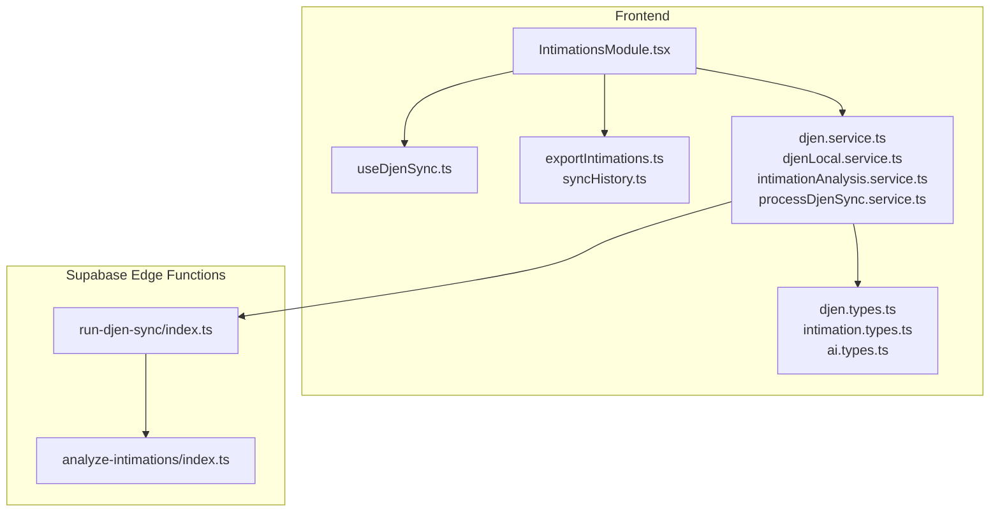

**Diagram sources**
- [IntimationsModule.tsx:127-775](file://INTIMACOES_UPDATE_FILES/IntimationsModule.tsx#L127-L775)
- [useDjenSync.ts:8-41](file://src/hooks/useDjenSync.ts#L8-L41)
- [djen.service.ts:8-262](file://src/services/djen.service.ts#L8-L262)
- [djenLocal.service.ts:11-747](file://src/services/djenLocal.service.ts#L11-L747)
- [intimationAnalysis.service.ts:23-191](file://src/services/intimationAnalysis.service.ts#L23-L191)
- [processDjenSync.service.ts:6-233](file://src/services/processDjenSync.service.ts#L6-L233)
- [djen.types.ts:1-154](file://src/types/djen.types.ts#L1-L154)
- [intimation.types.ts:1-31](file://src/types/intimation.types.ts#L1-L31)
- [ai.types.ts:1-45](file://src/types/ai.types.ts#L1-L45)
- [exportIntimations.ts:1-277](file://src/utils/exportIntimations.ts#L1-L277)
- [syncHistory.ts:1-77](file://src/utils/syncHistory.ts#L1-L77)
- [run-djen-sync/index.ts:1-639](file://supabase/functions/run-djen-sync/index.ts#L1-L639)
- [analyze-intimations/index.ts:1-375](file://supabase/functions/analyze-intimations/index.ts#L1-L375)

**Section sources**
- [IntimationsModule.tsx:127-775](file://INTIMACOES_UPDATE_FILES/IntimationsModule.tsx#L127-L775)
- [djen.service.ts:8-262](file://src/services/djen.service.ts#L8-L262)
- [djenLocal.service.ts:11-747](file://src/services/djenLocal.service.ts#L11-L747)
- [run-djen-sync/index.ts:1-639](file://supabase/functions/run-djen-sync/index.ts#L1-L639)

## Core Components
- IntimationsModule: Main UI component managing state, filters, search, grouping, selection, and actions; orchestrating sync and real-time updates.
- useDjenSync: Polling hook for periodic process-level DJEN sync.
- DjenSyncStatusService: Backend service to track sync runs and statuses.
- IntimationAnalysisService: CRUD for AI analysis of intimation content.
- DjenService/DjenLocalService: DJEN API integration and local persistence.
- ProcessDjenSyncService: Process-level sync and metadata enrichment.
- Edge Functions: run-djen-sync and analyze-intimations for automated ingestion and AI analysis.
- Utilities: export and sync history helpers.

**Section sources**
- [IntimationsModule.tsx:127-775](file://INTIMACOES_UPDATE_FILES/IntimationsModule.tsx#L127-L775)
- [useDjenSync.ts:8-41](file://src/hooks/useDjenSync.ts#L8-L41)
- [djenSyncStatus.service.ts:19-99](file://src/services/djenSyncStatus.service.ts#L19-L99)
- [intimationAnalysis.service.ts:23-191](file://src/services/intimationAnalysis.service.ts#L23-L191)
- [djen.service.ts:8-262](file://src/services/djen.service.ts#L8-L262)
- [djenLocal.service.ts:11-747](file://src/services/djenLocal.service.ts#L11-L747)
- [processDjenSync.service.ts:6-233](file://src/services/processDjenSync.service.ts#L6-L233)
- [run-djen-sync/index.ts:1-639](file://supabase/functions/run-djen-sync/index.ts#L1-L639)
- [analyze-intimations/index.ts:1-375](file://supabase/functions/analyze-intimations/index.ts#L1-L375)

## Architecture Overview
The system follows a hybrid architecture:
- Frontend polls and reacts to Supabase realtime channels for new intimation inserts.
- Supabase Edge Functions perform scheduled ingestion and AI analysis.
- Local services manage deduplication, linking, and cleanup.
- AI analysis is persisted and surfaced in the UI.

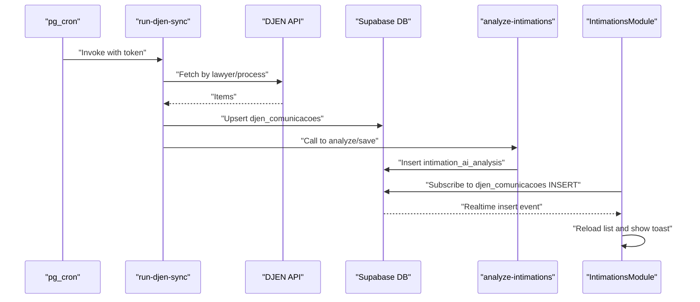

**Diagram sources**
- [run-djen-sync/index.ts:146-332](file://supabase/functions/run-djen-sync/index.ts#L146-L332)
- [analyze-intimations/index.ts:225-366](file://supabase/functions/analyze-intimations/index.ts#L225-L366)
- [IntimationsModule.tsx:556-609](file://INTIMACOES_UPDATE_FILES/IntimationsModule.tsx#L556-L609)

## Detailed Component Analysis

### IntimationsModule Component
Responsibilities:
- State management for intimation list, clients, processes, members, and AI analysis.
- Filtering, search, grouping, and selection modes.
- Manual and automatic sync orchestration with DJEN.
- Realtime updates via Supabase channels.
- Bulk actions (mark read, unlink client/process, delete selected/read).
- Export to CSV/Excel/PDF.
- Sync history monitoring and status display.

Key behaviors:
- Preloads a local snapshot to avoid blank screen.
- Performs auto-linking by process number and party names.
- Loads saved AI analyses per intimation.
- Triggers manual sync and cleans old records.
- Monitors sync logs and displays last sync time.

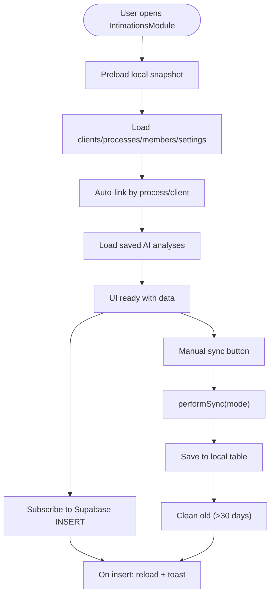

**Diagram sources**
- [IntimationsModule.tsx:237-548](file://INTIMACOES_UPDATE_FILES/IntimationsModule.tsx#L237-L548)
- [IntimationsModule.tsx:616-743](file://INTIMACOES_UPDATE_FILES/IntimationsModule.tsx#L616-L743)
- [IntimationsModule.tsx:556-609](file://INTIMACOES_UPDATE_FILES/IntimationsModule.tsx#L556-L609)

**Section sources**
- [IntimationsModule.tsx:127-775](file://INTIMACOES_UPDATE_FILES/IntimationsModule.tsx#L127-L775)

### useDjenSync Hook (Polling Mechanism)
- Runs every 1 hour after an initial 5-second delay.
- Invokes processDjenSyncService.syncPendingProcesses().
- Handles errors and logs outcomes.

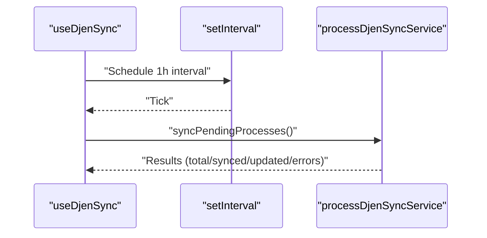

**Diagram sources**
- [useDjenSync.ts:8-41](file://src/hooks/useDjenSync.ts#L8-L41)
- [processDjenSync.service.ts:119-178](file://src/services/processDjenSync.service.ts#L119-L178)

**Section sources**
- [useDjenSync.ts:8-41](file://src/hooks/useDjenSync.ts#L8-L41)
- [processDjenSync.service.ts:119-178](file://src/services/processDjenSync.service.ts#L119-L178)

### DjenSyncStatusService (Monitoring Sync Progress and History)
- Provides listRecent(limit) to fetch latest sync logs.
- Supports logSync(...) and updateSync(...) for lifecycle tracking.
- Used by IntimationsModule to display recent sync status.

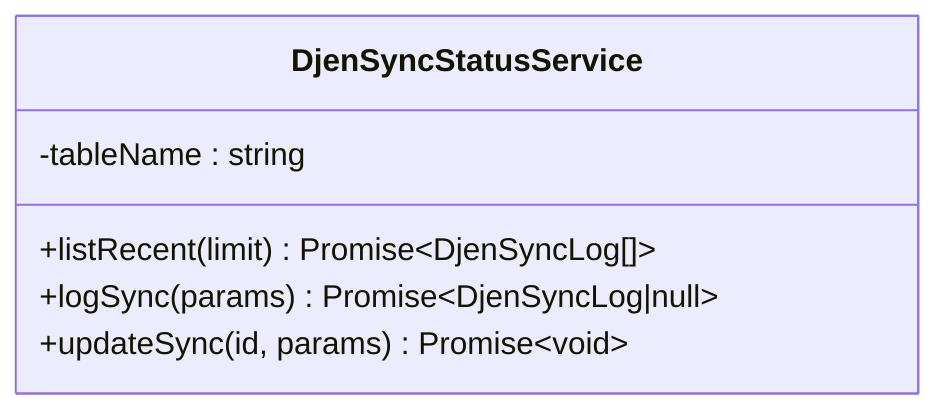

**Diagram sources**
- [djenSyncStatus.service.ts:19-99](file://src/services/djenSyncStatus.service.ts#L19-L99)

**Section sources**
- [djenSyncStatus.service.ts:19-99](file://src/services/djenSyncStatus.service.ts#L19-L99)
- [IntimationsModule.tsx:225-235](file://INTIMACOES_UPDATE_FILES/IntimationsModule.tsx#L225-L235)

### Intimation Analysis Service (AI-powered Content Processing and Classification)
- Persists AI analysis with urgency, deadlines, summary, and suggested actions.
- Converts between DB storage and app-facing IntimationAnalysis type.
- Supports batch retrieval by intimation IDs.

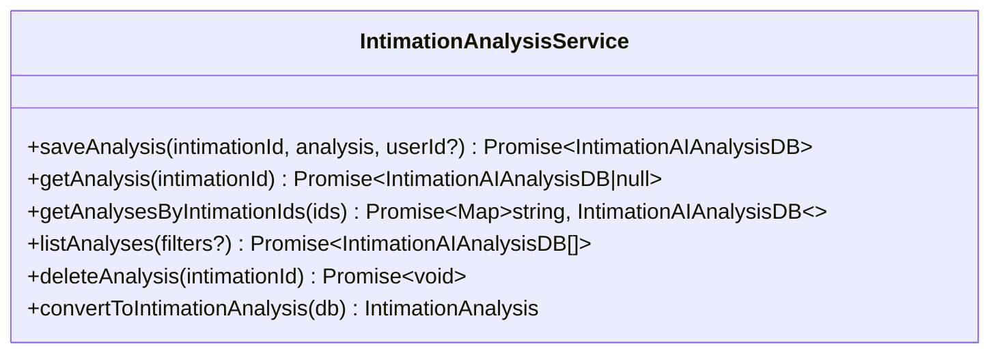

**Diagram sources**
- [intimationAnalysis.service.ts:23-191](file://src/services/intimationAnalysis.service.ts#L23-L191)
- [ai.types.ts:3-18](file://src/types/ai.types.ts#L3-L18)

**Section sources**
- [intimationAnalysis.service.ts:23-191](file://src/services/intimationAnalysis.service.ts#L23-L191)
- [ai.types.ts:3-18](file://src/types/ai.types.ts#L3-L18)

### DJEN Integration and Automatic Synchronization
- DjenService: Queries DJEN API with pagination and rate-limiting safeguards.
- DjenLocalService: Upserts intimation records, auto-links by process and party, propagates links across same-process records, and cleans old entries.
- Edge Function run-djen-sync: Scheduled ingestion, saves to DB, triggers AI analysis, and updates process metadata.
- Edge Function analyze-intimations: Calls LLMs (Groq/OpenAI) to classify urgency, extract deadlines, and create user notifications.

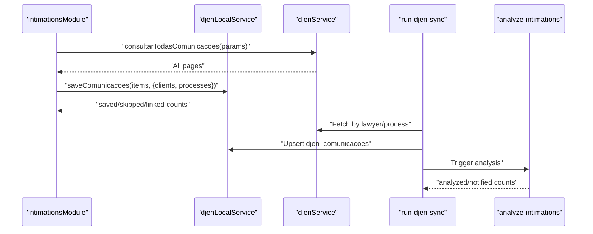

**Diagram sources**
- [djen.service.ts:108-162](file://src/services/djen.service.ts#L108-L162)
- [djenLocal.service.ts:125-460](file://src/services/djenLocal.service.ts#L125-L460)
- [run-djen-sync/index.ts:146-332](file://supabase/functions/run-djen-sync/index.ts#L146-L332)
- [analyze-intimations/index.ts:225-366](file://supabase/functions/analyze-intimations/index.ts#L225-L366)

**Section sources**
- [djen.service.ts:108-162](file://src/services/djen.service.ts#L108-L162)
- [djenLocal.service.ts:125-460](file://src/services/djenLocal.service.ts#L125-L460)
- [run-djen-sync/index.ts:146-332](file://supabase/functions/run-djen-sync/index.ts#L146-L332)
- [analyze-intimations/index.ts:225-366](file://supabase/functions/analyze-intimations/index.ts#L225-L366)

### Intimation Types, Analysis Results, and Process Linking
- DjenComunicacaoLocal: Local representation of DJEN communication with client/process linkage and flags.
- IntimationAnalysis: Frontend type for AI analysis results.
- Process tracking and linking: Auto-link by normalized process number and party names; propagate links across same-process records.

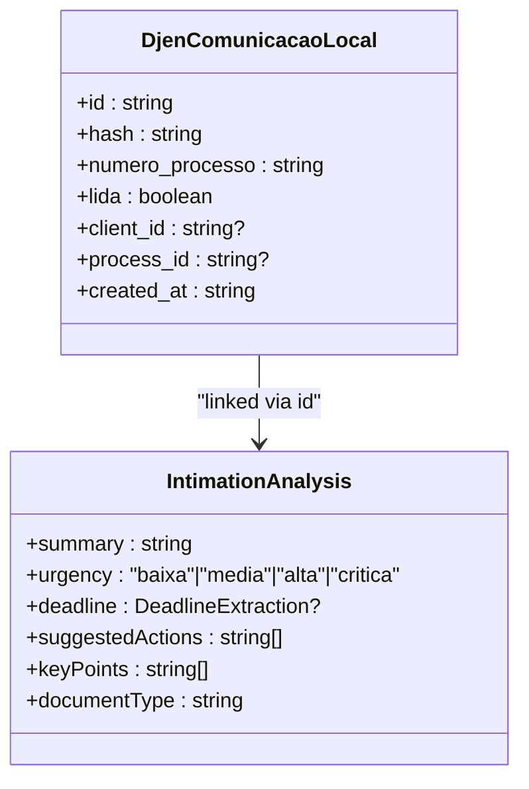

**Diagram sources**
- [djen.types.ts:84-122](file://src/types/djen.types.ts#L84-L122)
- [ai.types.ts:3-18](file://src/types/ai.types.ts#L3-L18)

**Section sources**
- [djen.types.ts:84-122](file://src/types/djen.types.ts#L84-L122)
- [ai.types.ts:3-18](file://src/types/ai.types.ts#L3-L18)
- [djenLocal.service.ts:313-460](file://src/services/djenLocal.service.ts#L313-L460)

### Sync History Tracking, Error Reporting, and Manual Controls
- Sync logs: Stored in djen_sync_history; IntimationsModule lists recent entries.
- Manual sync: Button triggers performSync with manual mode and optional cleanup.
- Error handling: Centralized try/catch blocks, toasts, and logging; realtime guardrails prevent loops.

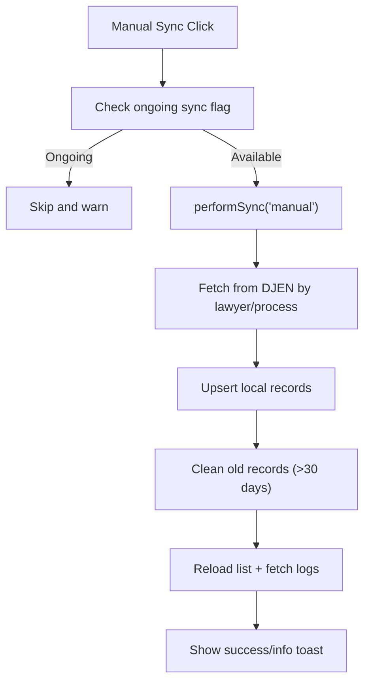

**Diagram sources**
- [IntimationsModule.tsx:616-743](file://INTIMACOES_UPDATE_FILES/IntimationsModule.tsx#L616-L743)
- [djenSyncStatus.service.ts:22-35](file://src/services/djenSyncStatus.service.ts#L22-L35)

**Section sources**
- [IntimationsModule.tsx:616-743](file://INTIMACOES_UPDATE_FILES/IntimationsModule.tsx#L616-L743)
- [djenSyncStatus.service.ts:22-35](file://src/services/djenSyncStatus.service.ts#L22-L35)

### Examples and Best Practices
- Configuring sync intervals:
  - Automatic process sync: useDjenSync runs every 1 hour; adjust interval by editing the hook’s interval constant.
  - Manual sync: Trigger via the UI; optionally enable cleanup of old records.
- Customizing analysis rules:
  - AI analysis is performed by analyze-intimations; configure prompts and thresholds in the Edge Function.
  - Urgency thresholds and deadline extraction logic are defined in the function.
- Handling sync failures:
  - Inspect djen_sync_history for error_message and timestamps.
  - Retry manual sync; review rate limits and DJEN availability.
  - Monitor realtime channel behavior and toast notifications.

[No sources needed since this section provides general guidance]

## Dependency Analysis
High-level dependencies:
- IntimationsModule depends on djenLocalService, djenService, intimationAnalysisService, djenSyncStatusService, and Supabase realtime.
- useDjenSync depends on processDjenSyncService.
- Edge Functions depend on Supabase client and external LLM APIs.

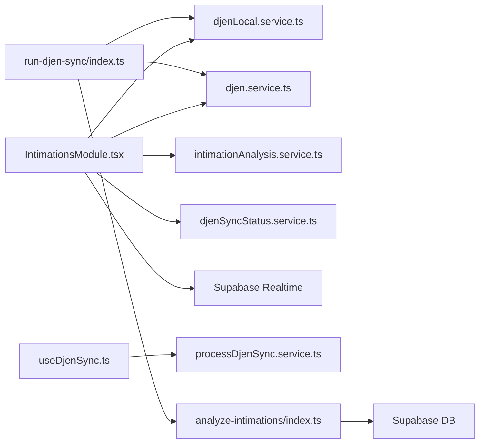

**Diagram sources**
- [IntimationsModule.tsx:32-47](file://INTIMACOES_UPDATE_FILES/IntimationsModule.tsx#L32-L47)
- [useDjenSync.ts:2](file://src/hooks/useDjenSync.ts#L2)
- [processDjenSync.service.ts:1](file://src/services/processDjenSync.service.ts#L1)
- [run-djen-sync/index.ts:45-48](file://supabase/functions/run-djen-sync/index.ts#L45-L48)
- [analyze-intimations/index.ts:1-9](file://supabase/functions/analyze-intimations/index.ts#L1-L9)

**Section sources**
- [IntimationsModule.tsx:32-47](file://INTIMACOES_UPDATE_FILES/IntimationsModule.tsx#L32-L47)
- [useDjenSync.ts:2](file://src/hooks/useDjenSync.ts#L2)
- [processDjenSync.service.ts:1](file://src/services/processDjenSync.service.ts#L1)
- [run-djen-sync/index.ts:45-48](file://supabase/functions/run-djen-sync/index.ts#L45-L48)
- [analyze-intimations/index.ts:1-9](file://supabase/functions/analyze-intimations/index.ts#L1-L9)

## Performance Considerations
- Pagination and rate limiting: DJEN queries enforce rate limits; the system adds delays between requests.
- Realtime batching: Supabase INSERTs are coalesced to reduce reload frequency.
- Local deduplication: Saves by hash to avoid duplicates.
- Cleanup: Old records cleaned periodically to maintain manageable dataset sizes.
- AI analysis throttling: Edge Functions limit concurrent calls and include timeouts.

[No sources needed since this section provides general guidance]

## Troubleshooting Guide
Common issues and resolutions:
- No new intimações after sync:
  - Verify pg_cron schedule and run-djen-sync token verification.
  - Check djen_sync_history for error_message and run_started_at/run_finished_at.
- Manual sync fails:
  - Review toast messages and console logs for API errors.
  - Confirm DJEN availability and rate limits.
- AI analysis not appearing:
  - Ensure OPENAI/GROQ keys are configured in Supabase secrets.
  - Check analyze-intimations logs and retry.
- Realtime not updating:
  - Confirm Supabase channel subscription and realtime flush timer logic.
  - Verify network connectivity and browser permissions.

**Section sources**
- [run-djen-sync/index.ts:334-347](file://supabase/functions/run-djen-sync/index.ts#L334-L347)
- [analyze-intimations/index.ts:225-374](file://supabase/functions/analyze-intimations/index.ts#L225-L374)
- [IntimationsModule.tsx:556-609](file://INTIMACOES_UPDATE_FILES/IntimationsModule.tsx#L556-L609)

## Conclusion
The Intimations Module provides a robust, automated pipeline for ingesting DJEN communications, linking them to clients and processes, enriching with AI insights, and surfacing actionable information through a responsive UI. Its architecture leverages Supabase Edge Functions for scalable scheduling and analysis, while the frontend ensures a smooth user experience with filtering, search, and export capabilities.

[No sources needed since this section summarizes without analyzing specific files]

## Appendices

### Appendix A: Data Models Overview
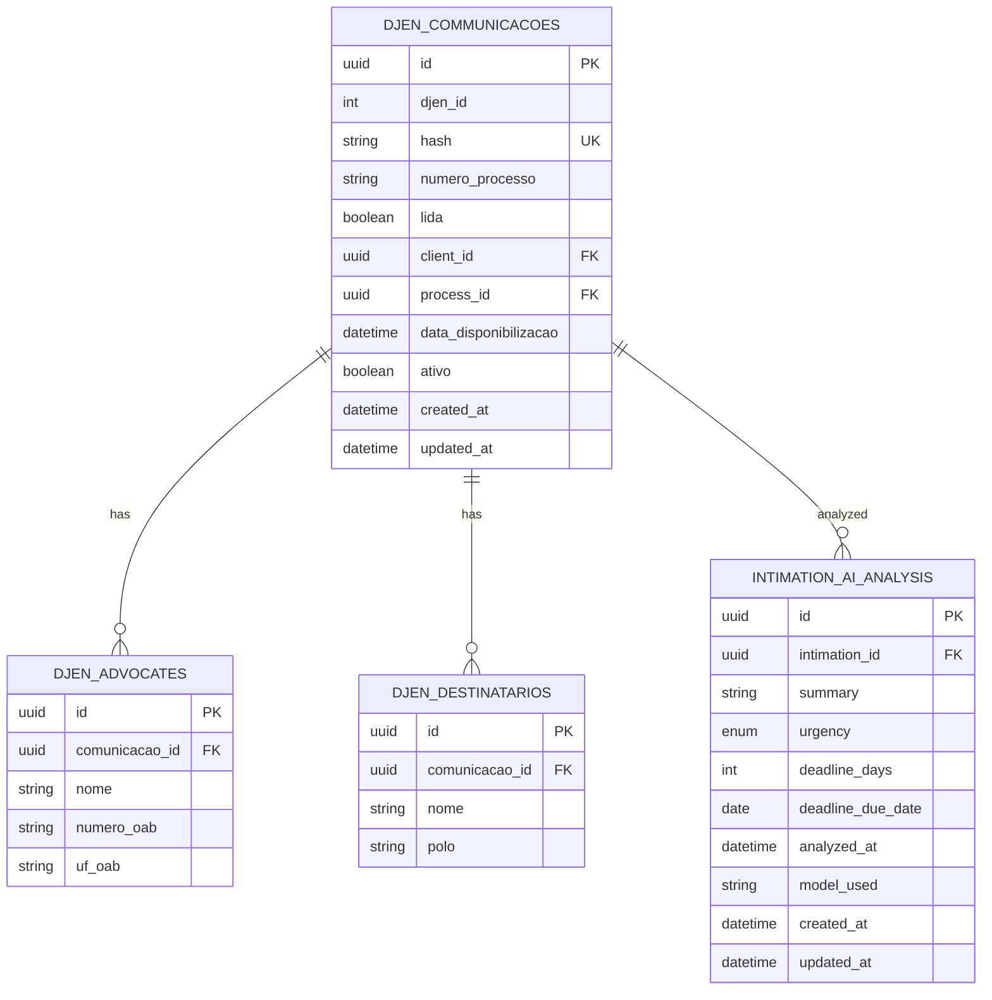

**Diagram sources**
- [djen.types.ts:28-49](file://src/types/djen.types.ts#L28-L49)
- [djen.types.ts:84-122](file://src/types/djen.types.ts#L84-L122)
- [intimationAnalysis.service.ts:4-21](file://src/services/intimationAnalysis.service.ts#L4-L21)

### Appendix B: Export Formats
- CSV: Includes date, tribunal, process, type, organ, status, urgency, deadline, and summary.
- Excel: HTML table with urgency-styled cells and totals.
- PDF: Printable report with statistics and urgency breakdown.

**Section sources**
- [exportIntimations.ts:11-141](file://src/utils/exportIntimations.ts#L11-L141)
- [exportIntimations.ts:146-277](file://src/utils/exportIntimations.ts#L146-L277)