# Notifications System

<cite>
**Referenced Files in This Document**
- [NotificationsModule.tsx](file://src/components/NotificationsModule.tsx)
- [NotificationsModuleNew.tsx](file://src/components/NotificationsModuleNew.tsx)
- [NotificationCenter.tsx](file://src/components/NotificationCenter.tsx)
- [NotificationCenterNew.tsx](file://src/components/NotificationCenterNew.tsx)
- [NotificationPanel.tsx](file://src/components/NotificationPanel.tsx)
- [NotificationBell.tsx](file://src/components/NotificationBell.tsx)
- [NotificationPermissionBanner.tsx](file://src/components/NotificationPermissionBanner.tsx)
- [pushNotifications.ts](file://src/utils/pushNotifications.ts)
- [notificationSound.ts](file://src/utils/notificationSound.ts)
- [useNotifications.ts](file://src/hooks/useNotifications.ts)
- [notification.service.ts](file://src/services/notification.service.ts)
- [userNotification.service.ts](file://src/services/userNotification.service.ts)
- [notification.types.ts](file://src/types/notification.types.ts)
- [user-notification.types.ts](file://src/types/user-notification.types.ts)
- [notification-scheduler/index.ts](file://supabase/functions/notification-scheduler/index.ts)
</cite>

## Update Summary
**Changes Made**
- Updated notification scheduler logic to fix critical bug where deadlines were incorrectly assigned using profile.id instead of auth user_id
- Enhanced notification messages with contextual information including event types with corresponding emojis, assigner names, and specific entity IDs for direct navigation
- Improved notification distribution to send reminders only to designated responsible parties rather than broadcasting to all active users

## Table of Contents
1. [Introduction](#introduction)
2. [Project Structure](#project-structure)
3. [Core Components](#core-components)
4. [Architecture Overview](#architecture-overview)
5. [Detailed Component Analysis](#detailed-component-analysis)
6. [Dependency Analysis](#dependency-analysis)
7. [Performance Considerations](#performance-considerations)
8. [Troubleshooting Guide](#troubleshooting-guide)
9. [Conclusion](#conclusion)

## Introduction
This document provides comprehensive documentation for the Notifications System in the CRM application. It explains the notification architecture covering push notifications, in-app notifications, and browser alerts. It documents the NotificationsModuleNew component with notification center, filtering, and bulk actions. It details the NotificationCenter and NotificationCenterNew components for notification management and user preferences. It covers the NotificationPanel for notification display and user interaction. It explains the NotificationBell component for quick access and notification count display. It documents the push notifications utility with browser permission handling, notification scheduling, and sound effects. It also covers the notification service layer with CRUD operations, user preferences, and delivery tracking. Finally, it outlines notification types, priority levels, and delivery channels, and provides examples for customizing notification triggers, implementing notification templates, and managing notification preferences.

## Project Structure
The Notifications System is composed of several React components, utility services, and TypeScript types that work together to deliver a unified notification experience across the application.

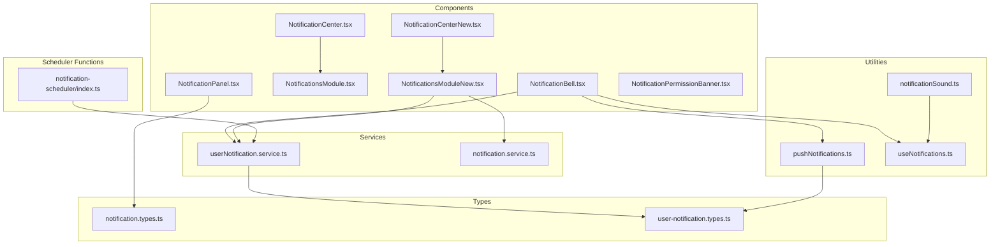

**Diagram sources**
- [NotificationBell.tsx:1-951](file://src/components/NotificationBell.tsx#L1-L951)
- [NotificationCenter.tsx:1-596](file://src/components/NotificationCenter.tsx#L1-L596)
- [NotificationCenterNew.tsx:1-417](file://src/components/NotificationCenterNew.tsx#L1-L417)
- [NotificationsModule.tsx:1-540](file://src/components/NotificationsModule.tsx#L1-L540)
- [NotificationsModuleNew.tsx:1-720](file://src/components/NotificationsModuleNew.tsx#L1-L720)
- [NotificationPanel.tsx:1-211](file://src/components/NotificationPanel.tsx#L1-L211)
- [NotificationPermissionBanner.tsx:1-98](file://src/components/NotificationPermissionBanner.tsx#L1-L98)
- [pushNotifications.ts:1-213](file://src/utils/pushNotifications.ts#L1-L213)
- [notificationSound.ts:1-139](file://src/utils/notificationSound.ts#L1-L139)
- [useNotifications.ts:1-166](file://src/hooks/useNotifications.ts#L1-L166)
- [notification.service.ts:1-115](file://src/services/notification.service.ts#L1-L115)
- [userNotification.service.ts:1-252](file://src/services/userNotification.service.ts#L1-L252)
- [notification.types.ts:1-19](file://src/types/notification.types.ts#L1-L19)
- [user-notification.types.ts:1-52](file://src/types/user-notification.types.ts#L1-L52)
- [notification-scheduler/index.ts:1-454](file://supabase/functions/notification-scheduler/index.ts#L1-L454)

**Section sources**
- [NotificationBell.tsx:1-951](file://src/components/NotificationBell.tsx#L1-L951)
- [NotificationCenter.tsx:1-596](file://src/components/NotificationCenter.tsx#L1-L596)
- [NotificationCenterNew.tsx:1-417](file://src/components/NotificationCenterNew.tsx#L1-L417)
- [NotificationsModule.tsx:1-540](file://src/components/NotificationsModule.tsx#L1-L540)
- [NotificationsModuleNew.tsx:1-720](file://src/components/NotificationsModuleNew.tsx#L1-L720)
- [NotificationPanel.tsx:1-211](file://src/components/NotificationPanel.tsx#L1-L211)
- [NotificationPermissionBanner.tsx:1-98](file://src/components/NotificationPermissionBanner.tsx#L1-L98)
- [pushNotifications.ts:1-213](file://src/utils/pushNotifications.ts#L1-L213)
- [notificationSound.ts:1-139](file://src/utils/notificationSound.ts#L1-L139)
- [useNotifications.ts:1-166](file://src/hooks/useNotifications.ts#L1-L166)
- [notification.service.ts:1-115](file://src/services/notification.service.ts#L1-L115)
- [userNotification.service.ts:1-252](file://src/services/userNotification.service.ts#L1-L252)
- [notification.types.ts:1-19](file://src/types/notification.types.ts#L1-L19)
- [user-notification.types.ts:1-52](file://src/types/user-notification.types.ts#L1-L52)
- [notification-scheduler/index.ts:1-454](file://supabase/functions/notification-scheduler/index.ts#L1-L454)

## Core Components
This section documents the primary notification components and their responsibilities.

- **NotificationsModuleNew**: A comprehensive notification center that aggregates notifications from multiple sources (intimations, deadlines, appointments, signatures, user notifications, financial installments). It supports advanced filtering, pagination, bulk actions, and navigation to relevant modules.
- **NotificationCenter**: A compact dropdown that displays recent notifications grouped by type, with quick actions and navigation to the full notification center.
- **NotificationCenterNew**: An enhanced version of the notification center with improved filtering, compact mode for mobile, and better UX for unread notifications.
- **NotificationPanel**: A slide-out panel for displaying and managing notifications with category-based styling, read/unread indicators, and bulk actions.
- **NotificationBell**: A bell-shaped component that serves as the primary entry point for notifications, supporting real-time updates, browser notifications, sound effects, and preference management.
- **NotificationPermissionBanner**: A contextual banner that prompts users to enable browser notifications and manage sound preferences.

**Section sources**
- [NotificationsModuleNew.tsx:1-720](file://src/components/NotificationsModuleNew.tsx#L1-L720)
- [NotificationCenter.tsx:1-596](file://src/components/NotificationCenter.tsx#L1-L596)
- [NotificationCenterNew.tsx:1-417](file://src/components/NotificationCenterNew.tsx#L1-L417)
- [NotificationPanel.tsx:1-211](file://src/components/NotificationPanel.tsx#L1-L211)
- [NotificationBell.tsx:1-951](file://src/components/NotificationBell.tsx#L1-L951)
- [NotificationPermissionBanner.tsx:1-98](file://src/components/NotificationPermissionBanner.tsx#L1-L98)

## Architecture Overview
The notification architecture integrates multiple layers:
- **Presentation Layer**: React components that render notifications and provide user interactions.
- **Service Layer**: TypeScript services that handle CRUD operations for user notifications and local notifications.
- **Utility Layer**: Utilities for push notifications, sound effects, and hook-based notification management.
- **Data Types**: Strongly typed interfaces for notification categories and user notification records.
- **Scheduler Layer**: Serverless functions that handle automated notification generation and distribution.

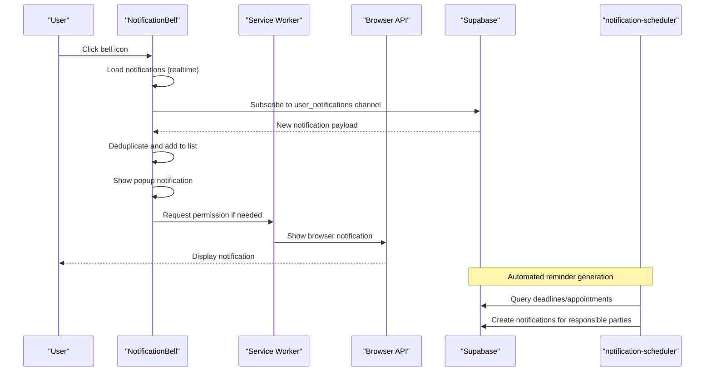

**Diagram sources**
- [NotificationBell.tsx:520-592](file://src/components/NotificationBell.tsx#L520-L592)
- [pushNotifications.ts:42-55](file://src/utils/pushNotifications.ts#L42-L55)
- [userNotification.service.ts:26-45](file://src/services/userNotification.service.ts#L26-L45)
- [notification-scheduler/index.ts:74-195](file://supabase/functions/notification-scheduler/index.ts#L74-L195)

**Section sources**
- [NotificationBell.tsx:520-592](file://src/components/NotificationBell.tsx#L520-L592)
- [pushNotifications.ts:42-55](file://src/utils/pushNotifications.ts#L42-L55)
- [userNotification.service.ts:26-45](file://src/services/userNotification.service.ts#L26-L45)
- [notification-scheduler/index.ts:74-195](file://supabase/functions/notification-scheduler/index.ts#L74-L195)

## Detailed Component Analysis

### NotificationsModuleNew Component
The NotificationsModuleNew component is the central hub for managing notifications from multiple sources. It aggregates data from various services and presents a unified, filterable, and paginated list.

Key features:
- Multi-source aggregation: Intimations, deadlines, appointments, signatures, user notifications, financial installments.
- Advanced filtering: By type, unread/read status, and search term.
- Pagination: Efficient rendering of large notification lists.
- Bulk actions: Mark all as read, clear read notifications.
- Navigation: Direct links to relevant modules based on notification type.

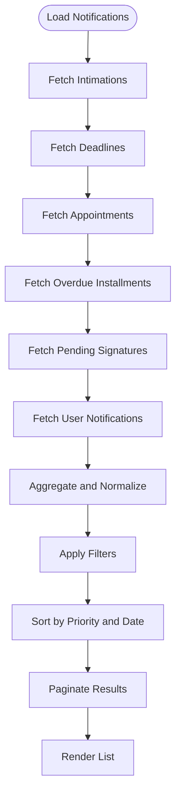

**Diagram sources**
- [NotificationsModuleNew.tsx:95-144](file://src/components/NotificationsModuleNew.tsx#L95-L144)
- [NotificationsModuleNew.tsx:157-271](file://src/components/NotificationsModuleNew.tsx#L157-L271)

**Section sources**
- [NotificationsModuleNew.tsx:1-720](file://src/components/NotificationsModuleNew.tsx#L1-L720)

### NotificationCenter and NotificationCenterNew
These components provide quick access to recent notifications with simplified controls:
- NotificationCenter: Groups notifications by type, shows unread counts, and allows marking as read.
- NotificationCenterNew: Enhanced with filtering tabs, compact mode, and improved readability.

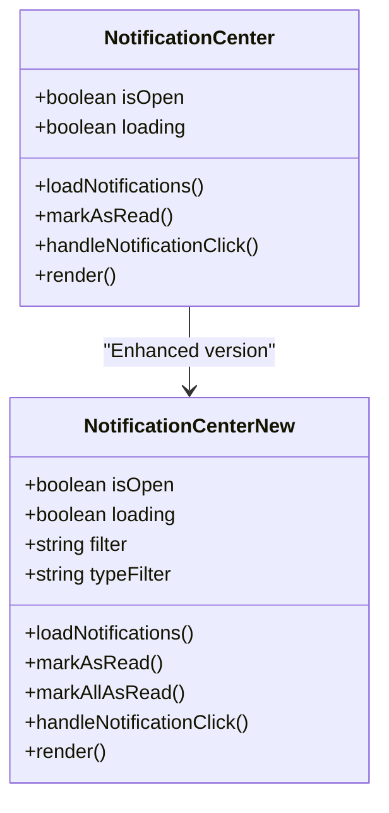

**Diagram sources**
- [NotificationCenter.tsx:39-116](file://src/components/NotificationCenter.tsx#L39-L116)
- [NotificationCenterNew.tsx:25-78](file://src/components/NotificationCenterNew.tsx#L25-L78)

**Section sources**
- [NotificationCenter.tsx:1-596](file://src/components/NotificationCenter.tsx#L1-L596)
- [NotificationCenterNew.tsx:1-417](file://src/components/NotificationCenterNew.tsx#L1-L417)

### NotificationPanel
The NotificationPanel provides a slide-out interface for viewing and managing notifications with category-based styling and bulk actions.

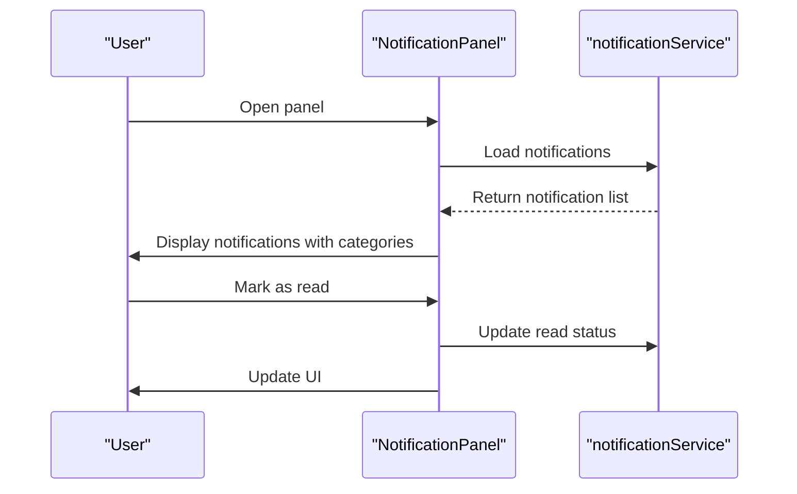

**Diagram sources**
- [NotificationPanel.tsx:74-82](file://src/components/NotificationPanel.tsx#L74-L82)
- [notification.service.ts:76-114](file://src/services/notification.service.ts#L76-L114)

**Section sources**
- [NotificationPanel.tsx:1-211](file://src/components/NotificationPanel.tsx#L1-L211)
- [notification.service.ts:1-115](file://src/services/notification.service.ts#L1-L115)

### NotificationBell
The NotificationBell component serves as the primary notification entry point, integrating real-time updates, browser notifications, sound effects, and user preferences.

Key capabilities:
- Real-time subscription to user notifications via Supabase.
- Browser notification support with permission handling.
- Sound effects using Web Audio API.
- Preference management for sound and visibility.
- Popup notifications with auto-dismiss and countdown.

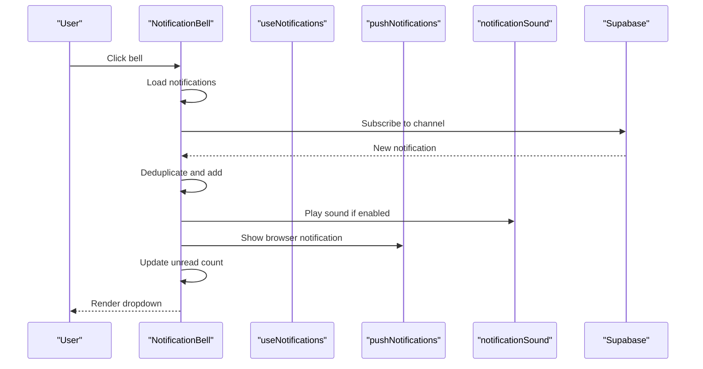

**Diagram sources**
- [NotificationBell.tsx:520-592](file://src/components/NotificationBell.tsx#L520-L592)
- [useNotifications.ts:11-45](file://src/hooks/useNotifications.ts#L11-L45)
- [pushNotifications.ts:83-127](file://src/utils/pushNotifications.ts#L83-L127)
- [notificationSound.ts:89-105](file://src/utils/notificationSound.ts#L89-L105)

**Section sources**
- [NotificationBell.tsx:1-951](file://src/components/NotificationBell.tsx#L1-L951)
- [useNotifications.ts:1-166](file://src/hooks/useNotifications.ts#L1-L166)
- [pushNotifications.ts:1-213](file://src/utils/pushNotifications.ts#L1-L213)
- [notificationSound.ts:1-139](file://src/utils/notificationSound.ts#L1-L139)

### NotificationPermissionBanner
The NotificationPermissionBanner prompts users to enable browser notifications and manage sound preferences, ensuring compliance with browser policies.

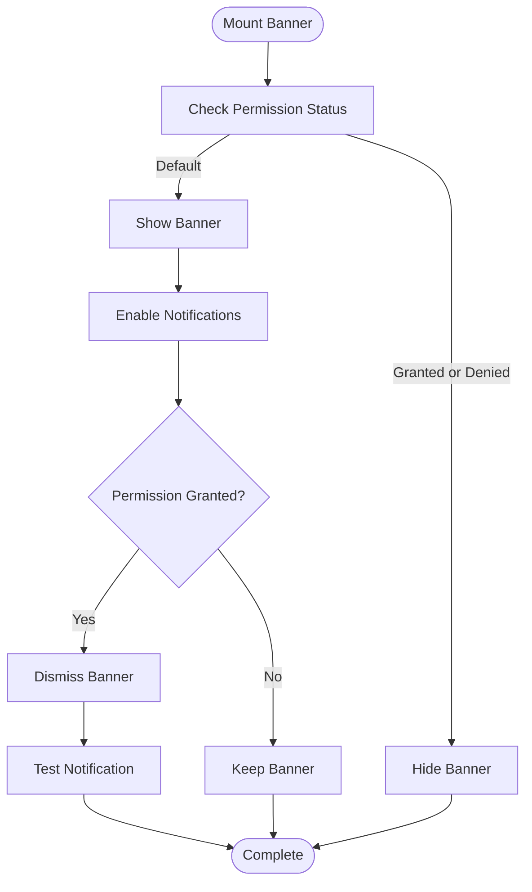

**Diagram sources**
- [NotificationPermissionBanner.tsx:5-33](file://src/components/NotificationPermissionBanner.tsx#L5-L33)

**Section sources**
- [NotificationPermissionBanner.tsx:1-98](file://src/components/NotificationPermissionBanner.tsx#L1-L98)

### Push Notifications Utility
The pushNotifications utility manages browser push notifications, including permission handling, service worker registration, and notification display.

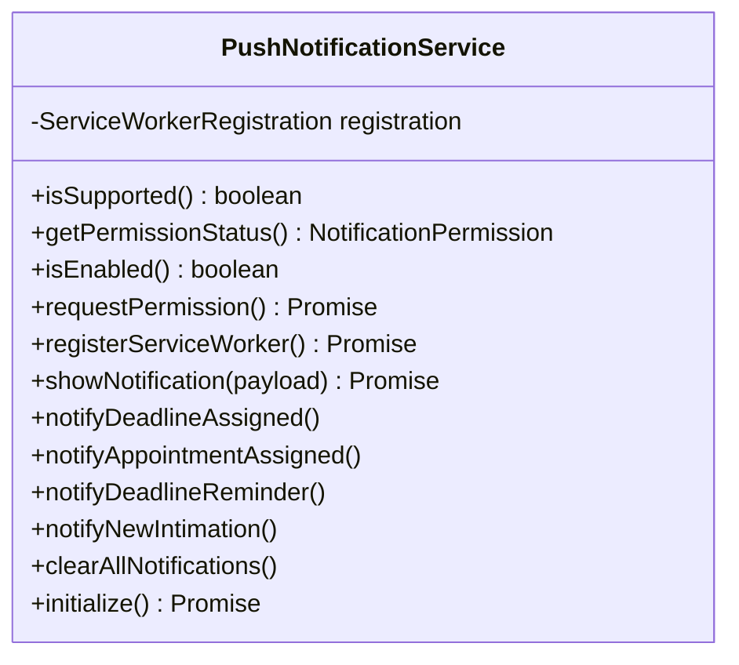

**Diagram sources**
- [pushNotifications.ts:14-212](file://src/utils/pushNotifications.ts#L14-L212)

**Section sources**
- [pushNotifications.ts:1-213](file://src/utils/pushNotifications.ts#L1-L213)

### Notification Sound Effects
The notificationSound utility provides configurable sound effects for different notification types using Web Audio API.

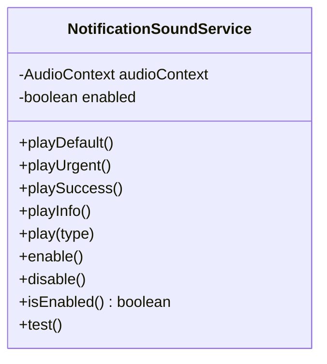

**Diagram sources**
- [notificationSound.ts:5-138](file://src/utils/notificationSound.ts#L5-L138)

**Section sources**
- [notificationSound.ts:1-139](file://src/utils/notificationSound.ts#L1-L139)

### Notification Services
The notification services layer handles CRUD operations for notifications and integrates with Supabase for real-time updates.

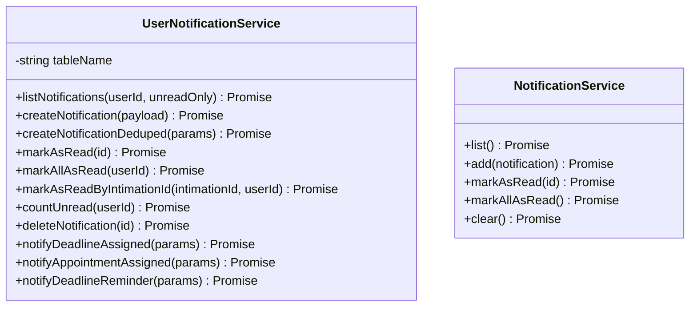

**Diagram sources**
- [userNotification.service.ts:4-249](file://src/services/userNotification.service.ts#L4-L249)
- [notification.service.ts:76-114](file://src/services/notification.service.ts#L76-L114)

**Section sources**
- [userNotification.service.ts:1-252](file://src/services/userNotification.service.ts#L1-L252)
- [notification.service.ts:1-115](file://src/services/notification.service.ts#L1-L115)

### Notification Types and Priority Levels
The system defines notification categories and priority levels to control display and behavior.

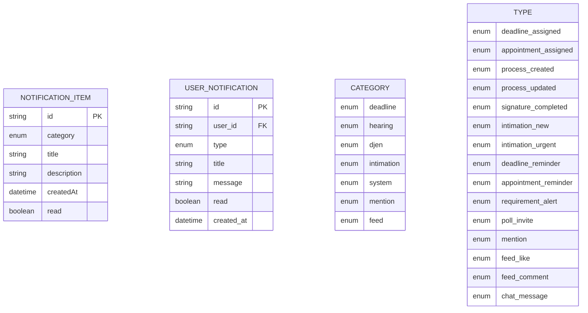

**Diagram sources**
- [notification.types.ts:1-19](file://src/types/notification.types.ts#L1-L19)
- [user-notification.types.ts:1-52](file://src/types/user-notification.types.ts#L1-L52)

**Section sources**
- [notification.types.ts:1-19](file://src/types/notification.types.ts#L1-L19)
- [user-notification.types.ts:1-52](file://src/types/user-notification.types.ts#L1-L52)

### Notification Scheduler Function
The notification-scheduler function handles automated notification generation and distribution, with critical improvements for proper user assignment and contextual messaging.

**Updated** Fixed critical bug where deadlines were incorrectly assigned using profile.id instead of auth user_id, and enhanced notification messages with contextual information.

Key improvements:
- **Proper User Assignment**: Resolves responsible party using profile-to-user ID mapping instead of direct profile ID assignment
- **Contextual Messaging**: Enhanced messages now include event types with corresponding emojis, assigner names, and specific entity IDs for direct navigation
- **Targeted Distribution**: Reminders are sent only to designated responsible parties rather than broadcasting to all active users
- **Improved Deduplication**: Enhanced deduplication logic with permanent dedupe keys for metadata-based filtering

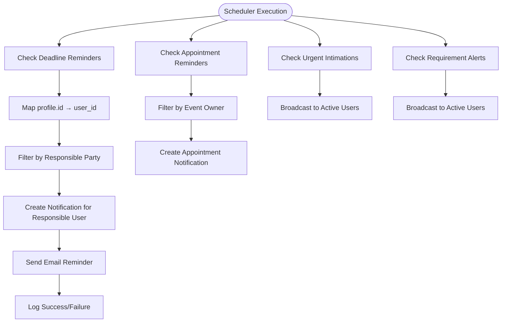

**Diagram sources**
- [notification-scheduler/index.ts:74-195](file://supabase/functions/notification-scheduler/index.ts#L74-L195)
- [notification-scheduler/index.ts:197-260](file://supabase/functions/notification-scheduler/index.ts#L197-L260)
- [notification-scheduler/index.ts:262-312](file://supabase/functions/notification-scheduler/index.ts#L262-L312)
- [notification-scheduler/index.ts:314-385](file://supabase/functions/notification-scheduler/index.ts#L314-L385)

**Section sources**
- [notification-scheduler/index.ts:1-454](file://supabase/functions/notification-scheduler/index.ts#L1-L454)

## Dependency Analysis
The notification system exhibits clear separation of concerns with well-defined dependencies between components, services, and utilities.

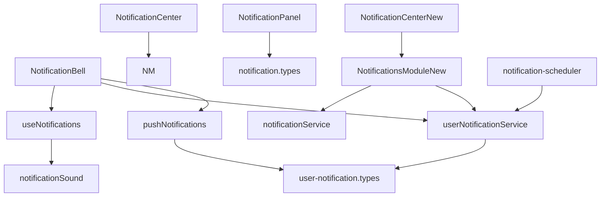

**Diagram sources**
- [NotificationBell.tsx:20-25](file://src/components/NotificationBell.tsx#L20-L25)
- [NotificationsModuleNew.tsx:24-36](file://src/components/NotificationsModuleNew.tsx#L24-L36)
- [NotificationCenter.tsx:16-18](file://src/components/NotificationCenter.tsx#L16-L18)
- [NotificationCenterNew.tsx:3-8](file://src/components/NotificationCenterNew.tsx#L3-L8)
- [NotificationPanel.tsx](file://src/components/NotificationPanel.tsx#L3)
- [pushNotifications.ts:1-213](file://src/utils/pushNotifications.ts#L1-L213)
- [notificationSound.ts:1-139](file://src/utils/notificationSound.ts#L1-L139)
- [useNotifications.ts:1-166](file://src/hooks/useNotifications.ts#L1-L166)
- [notification.service.ts:1-115](file://src/services/notification.service.ts#L1-L115)
- [userNotification.service.ts:1-252](file://src/services/userNotification.service.ts#L1-L252)
- [notification.types.ts:1-19](file://src/types/notification.types.ts#L1-L19)
- [user-notification.types.ts:1-52](file://src/types/user-notification.types.ts#L1-L52)
- [notification-scheduler/index.ts:1-454](file://supabase/functions/notification-scheduler/index.ts#L1-L454)

**Section sources**
- [NotificationBell.tsx:1-951](file://src/components/NotificationBell.tsx#L1-L951)
- [NotificationsModuleNew.tsx:1-720](file://src/components/NotificationsModuleNew.tsx#L1-L720)
- [NotificationCenter.tsx:1-596](file://src/components/NotificationCenter.tsx#L1-L596)
- [NotificationCenterNew.tsx:1-417](file://src/components/NotificationCenterNew.tsx#L1-L417)
- [NotificationPanel.tsx:1-211](file://src/components/NotificationPanel.tsx#L1-L211)
- [pushNotifications.ts:1-213](file://src/utils/pushNotifications.ts#L1-L213)
- [notificationSound.ts:1-139](file://src/utils/notificationSound.ts#L1-L139)
- [useNotifications.ts:1-166](file://src/hooks/useNotifications.ts#L1-L166)
- [notification.service.ts:1-115](file://src/services/notification.service.ts#L1-L115)
- [userNotification.service.ts:1-252](file://src/services/userNotification.service.ts#L1-L252)
- [notification.types.ts:1-19](file://src/types/notification.types.ts#L1-L19)
- [user-notification.types.ts:1-52](file://src/types/user-notification.types.ts#L1-L52)
- [notification-scheduler/index.ts:1-454](file://supabase/functions/notification-scheduler/index.ts#L1-L454)

## Performance Considerations
- **Real-time Updates**: The system uses Supabase real-time subscriptions to keep notifications fresh. Consider batching updates and debouncing frequent changes to reduce unnecessary re-renders.
- **Pagination**: NotificationsModuleNew implements pagination to handle large lists efficiently. Ensure pagination sizes are optimized for typical use cases.
- **Deduplication**: NotificationBell includes deduplication logic to prevent duplicate notifications from appearing. This reduces UI clutter and improves performance.
- **Sound Effects**: Web Audio API is used for sound effects. Be mindful of memory usage and avoid excessive concurrent audio instances.
- **Service Worker Registration**: Push notification initialization registers a service worker. Ensure proper caching and update strategies to minimize bandwidth usage.
- **Scheduler Optimization**: The notification scheduler now uses targeted distribution to designated responsible parties, reducing unnecessary notifications and improving system efficiency.

## Troubleshooting Guide
Common issues and resolutions:
- **Browser Notifications Disabled**: Use NotificationPermissionBanner to prompt users to enable notifications. Check browser settings if notifications still don't appear.
- **Sound Effects Not Playing**: Verify audio context initialization and user gesture requirements. Test notification sounds using the test function.
- **Real-time Updates Not Working**: Check Supabase connection and channel subscription. Verify user authentication and permissions.
- **Notification Deduplication Issues**: Review dedupe keys and timestamps to ensure proper identification of duplicate notifications.
- **Performance Problems**: Monitor component re-renders and consider implementing virtualization for large notification lists.
- **Missing Notifications**: Verify that the notification scheduler is properly mapping profile IDs to user IDs and sending notifications only to designated responsible parties.

**Section sources**
- [NotificationPermissionBanner.tsx:1-98](file://src/components/NotificationPermissionBanner.tsx#L1-L98)
- [NotificationBell.tsx:520-592](file://src/components/NotificationBell.tsx#L520-L592)
- [notificationSound.ts:19-24](file://src/utils/notificationSound.ts#L19-L24)
- [notification-scheduler/index.ts:95-124](file://supabase/functions/notification-scheduler/index.ts#L95-L124)

## Conclusion
The Notifications System provides a robust, extensible framework for delivering timely and relevant information to users across multiple channels. Its modular architecture supports easy customization and enhancement while maintaining performance and reliability. The recent improvements to the notification scheduler ensure proper user assignment and targeted notification delivery, while enhanced contextual messaging provides users with richer information and direct navigation capabilities. The combination of in-app notifications, browser alerts, and sound effects ensures users stay informed regardless of their interaction pattern with the application.