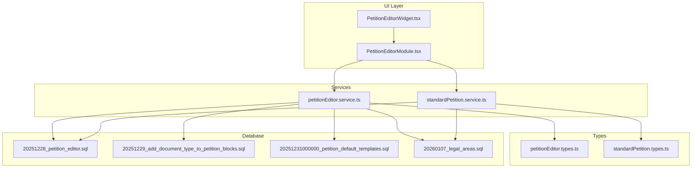
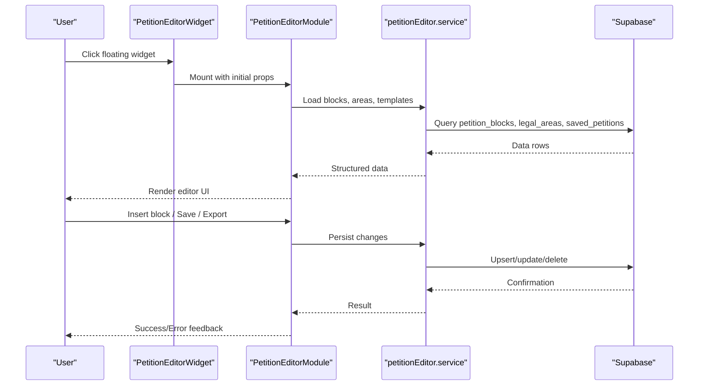
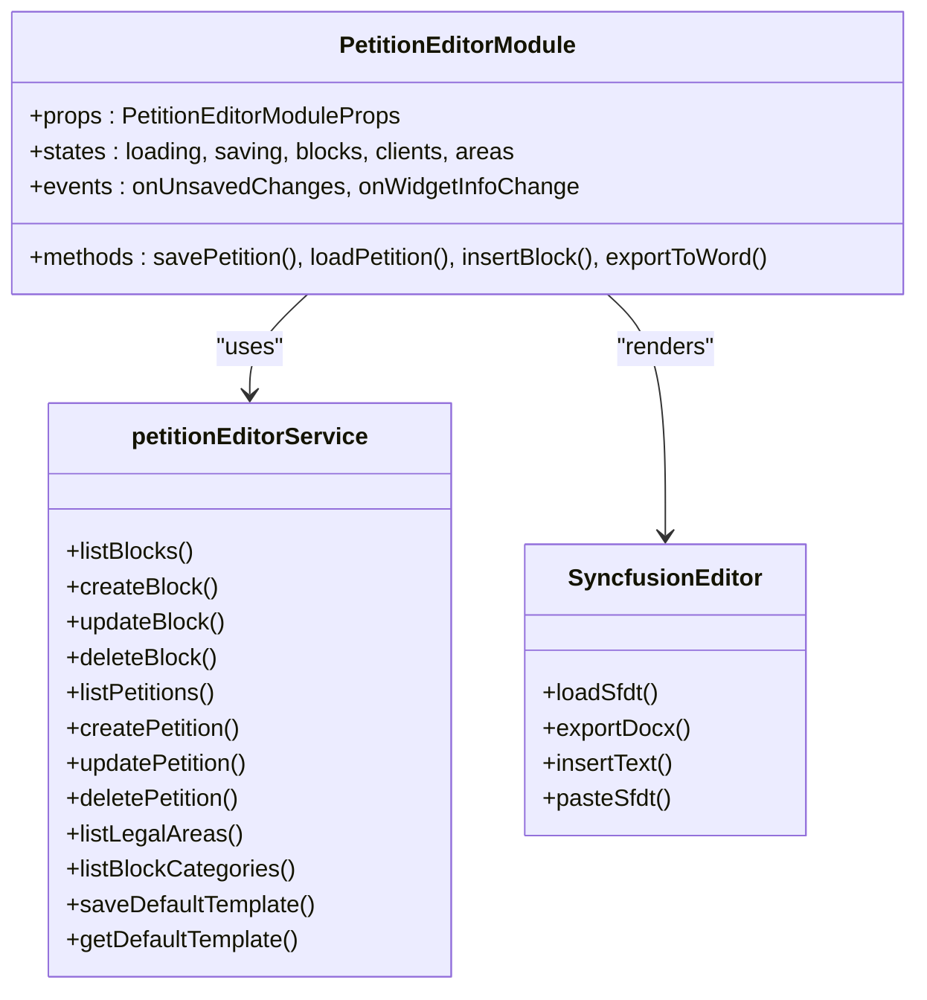
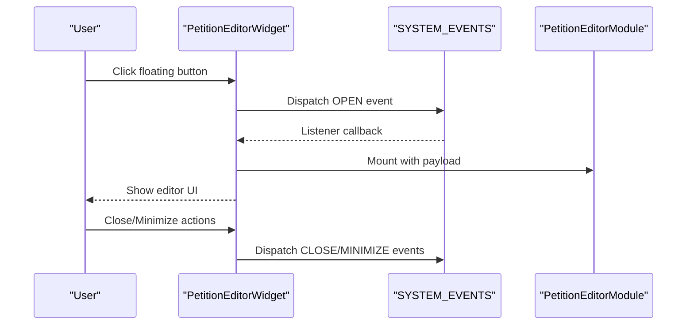
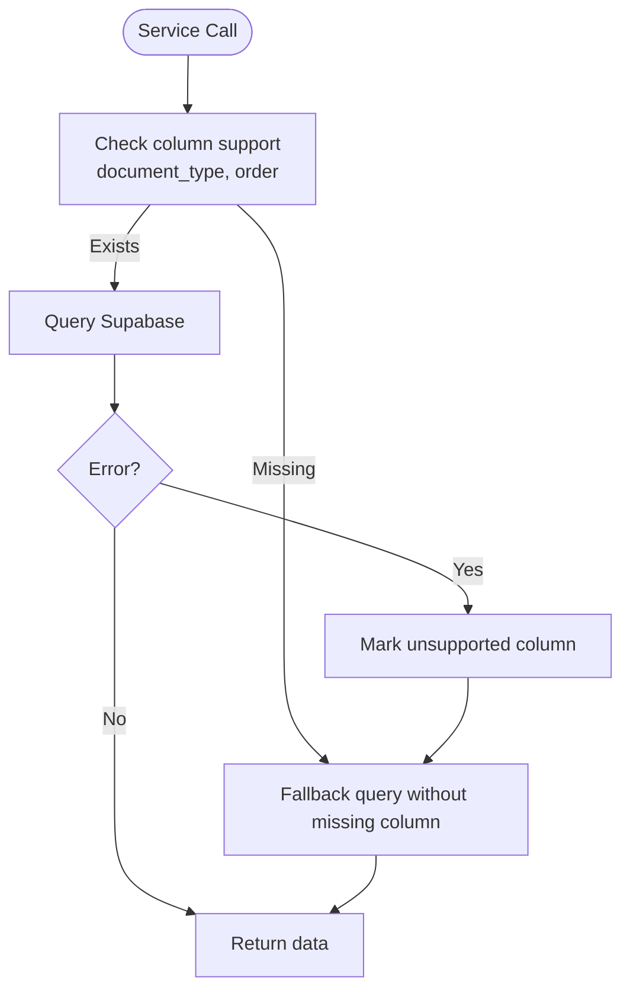
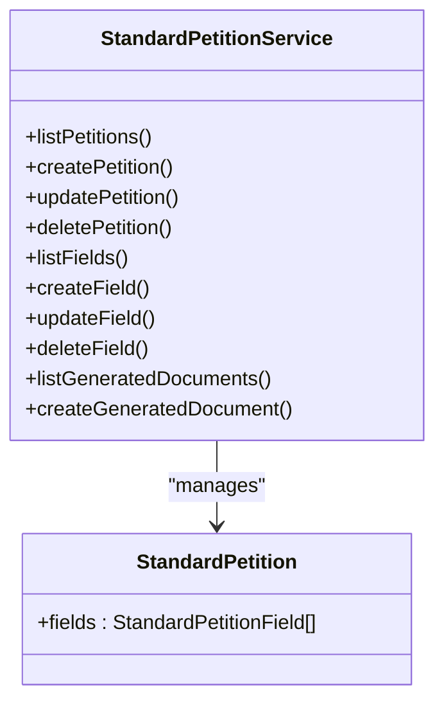
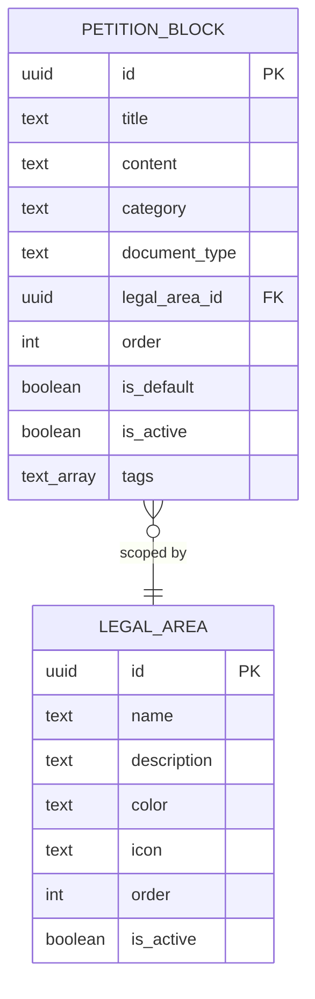
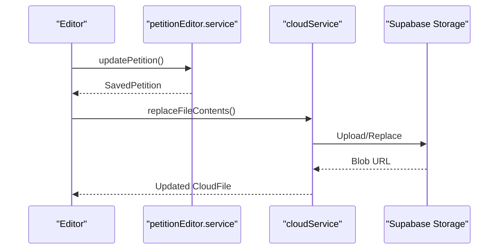
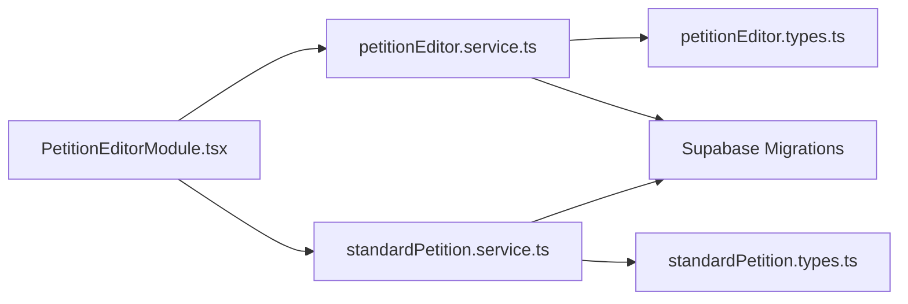

# Petition Editor

<cite>
**Referenced Files in This Document**
- [PetitionEditorModule.tsx](file://src/components/PetitionEditorModule.tsx)
- [PetitionEditorWidget.tsx](file://src/components/PetitionEditorWidget.tsx)
- [petitionEditor.service.ts](file://src/services/petitionEditor.service.ts)
- [standardPetition.service.ts](file://src/services/standardPetition.service.ts)
- [petitionEditor.types.ts](file://src/types/petitionEditor.types.ts)
- [standardPetition.types.ts](file://src/types/standardPetition.types.ts)
- [20251228_petition_editor.sql](file://supabase/migrations/20251228_petition_editor.sql)
- [20251229_add_document_type_to_petition_blocks.sql](file://supabase/migrations/20251229_add_document_type_to_petition_blocks.sql)
- [20251231000000_petition_default_templates.sql](file://supabase/migrations/20251231000000_petition_default_templates.sql)
- [20260107_legal_areas.sql](file://supabase/migrations/20260107_legal_areas.sql)
</cite>

## Table of Contents
1. [Introduction](#introduction)
2. [Project Structure](#project-structure)
3. [Core Components](#core-components)
4. [Architecture Overview](#architecture-overview)
5. [Detailed Component Analysis](#detailed-component-analysis)
6. [Dependency Analysis](#dependency-analysis)
7. [Performance Considerations](#performance-considerations)
8. [Troubleshooting Guide](#troubleshooting-guide)
9. [Conclusion](#conclusion)
10. [Appendices](#appendices)

## Introduction
The Petition Editor module is a comprehensive legal document authoring system built around a block-based template engine, custom fields, and integrated publication workflows. It enables legal practitioners to compose structured legal pleadings with reusable content blocks, manage document lifecycle (draft, save, export), and integrate with cloud storage for seamless collaboration. The system supports multiple legal areas (e.g., Labor, Civil, Criminal, Social Security) and document types (petition, contestation, impugnation, appeal), with robust search, AI-assisted editing, and real-time synchronization.

## Project Structure
The module comprises:
- UI components: PetitionEditorModule (main editor) and PetitionEditorWidget (floating quick-access panel)
- Services: petitionEditor.service (core CRUD and orchestration) and standardPetition.service (predefined templates)
- Types: Strongly typed domain models for blocks, templates, and fields
- Database: Supabase-backed migrations defining schema, indexes, and policies

**Diagram sources**
- [PetitionEditorModule.tsx:1-120](file://src/components/PetitionEditorModule.tsx#L1-L120)
- [PetitionEditorWidget.tsx:1-60](file://src/components/PetitionEditorWidget.tsx#L1-L60)
- [petitionEditor.service.ts:1-40](file://src/services/petitionEditor.service.ts#L1-L40)
- [standardPetition.service.ts:1-25](file://src/services/standardPetition.service.ts#L1-L25)
- [petitionEditor.types.ts:1-40](file://src/types/petitionEditor.types.ts#L1-L40)
- [standardPetition.types.ts:1-25](file://src/types/standardPetition.types.ts#L1-L25)
- [20251228_petition_editor.sql:1-40](file://supabase/migrations/20251228_petition_editor.sql#L1-L40)
- [20251229_add_document_type_to_petition_blocks.sql:1-20](file://supabase/migrations/20251229_add_document_type_to_petition_blocks.sql#L1-L20)
- [20251231000000_petition_default_templates.sql:1-25](file://supabase/migrations/20251231000000_petition_default_templates.sql#L1-L25)
- [20260107_legal_areas.sql:1-25](file://supabase/migrations/20260107_legal_areas.sql#L1-L25)

**Section sources**
- [PetitionEditorModule.tsx:1-120](file://src/components/PetitionEditorModule.tsx#L1-L120)
- [PetitionEditorWidget.tsx:1-60](file://src/components/PetitionEditorWidget.tsx#L1-L60)
- [petitionEditor.service.ts:1-40](file://src/services/petitionEditor.service.ts#L1-L40)
- [standardPetition.service.ts:1-25](file://src/services/standardPetition.service.ts#L1-L25)
- [petitionEditor.types.ts:1-40](file://src/types/petitionEditor.types.ts#L1-L40)
- [standardPetition.types.ts:1-25](file://src/types/standardPetition.types.ts#L1-L25)
- [20251228_petition_editor.sql:1-40](file://supabase/migrations/20251228_petition_editor.sql#L1-L40)
- [20251229_add_document_type_to_petition_blocks.sql:1-20](file://supabase/migrations/20251229_add_document_type_to_petition_blocks.sql#L1-L20)
- [20251231000000_petition_default_templates.sql:1-25](file://supabase/migrations/20251231000000_petition_default_templates.sql#L1-L25)
- [20260107_legal_areas.sql:1-25](file://supabase/migrations/20260107_legal_areas.sql#L1-L25)

## Core Components
- PetitionEditorModule: Full-featured editor with block insertion, AI editing, export, and cloud integration. Manages document state, auto-save, and real-time updates.
- PetitionEditorWidget: Floating launcher that persists state and allows quick access to the editor from anywhere in the app.
- petitionEditor.service: Backend orchestration for blocks, saved petitions, legal areas, categories, and default templates.
- standardPetition.service: Management of predefined templates, custom fields, and generated document history.

**Section sources**
- [PetitionEditorModule.tsx:548-780](file://src/components/PetitionEditorModule.tsx#L548-L780)
- [PetitionEditorWidget.tsx:21-95](file://src/components/PetitionEditorWidget.tsx#L21-L95)
- [petitionEditor.service.ts:23-70](file://src/services/petitionEditor.service.ts#L23-L70)
- [standardPetition.service.ts:15-40](file://src/services/standardPetition.service.ts#L15-L40)

## Architecture Overview
The system follows a layered architecture:
- UI layer: React components with Syncfusion editor integration
- Service layer: TypeScript services encapsulating Supabase operations
- Data layer: Supabase tables with RLS policies and triggers
- Type safety: Strict TypeScript types define contracts across layers

**Diagram sources**
- [PetitionEditorWidget.tsx:133-170](file://src/components/PetitionEditorWidget.tsx#L133-L170)
- [PetitionEditorModule.tsx:2636-2640](file://src/components/PetitionEditorModule.tsx#L2636-L2640)
- [petitionEditor.service.ts:90-135](file://src/services/petitionEditor.service.ts#L90-L135)

## Detailed Component Analysis

### PetitionEditorModule
The main editor component orchestrates:
- Editor lifecycle: initialization, import, export, and cleanup
- Block management: creation, update, deletion, and insertion into the document
- AI-assisted editing: contextual suggestions and formatting improvements
- Publication workflows: saving to cloud, exporting DOCX, and linking to cloud files
- Real-time collaboration: Supabase channels for live updates
- Auto-save and offline handling: intelligent persistence and user feedback

Key capabilities:
- Block-based composition with SFDT content
- Legal area and document type scoping
- Category-based organization and filtering
- Default template import/export with user preference storage
- Client placeholders and qualification generation
- AI-powered text refinement with contextual block hints

**Diagram sources**
- [PetitionEditorModule.tsx:548-780](file://src/components/PetitionEditorModule.tsx#L548-L780)
- [petitionEditor.service.ts:23-135](file://src/services/petitionEditor.service.ts#L23-L135)
- [petitionEditor.types.ts:98-151](file://src/types/petitionEditor.types.ts#L98-L151)

**Section sources**
- [PetitionEditorModule.tsx:780-1012](file://src/components/PetitionEditorModule.tsx#L780-L1012)
- [PetitionEditorModule.tsx:2059-2276](file://src/components/PetitionEditorModule.tsx#L2059-L2276)
- [PetitionEditorModule.tsx:2373-2447](file://src/components/PetitionEditorModule.tsx#L2373-L2447)
- [PetitionEditorModule.tsx:2463-2532](file://src/components/PetitionEditorModule.tsx#L2463-L2532)
- [PetitionEditorModule.tsx:2791-2958](file://src/components/PetitionEditorModule.tsx#L2791-L2958)

### PetitionEditorWidget
Provides quick access to the editor:
- Global floating launcher with persistent state
- Event-driven open/close/minimize/maximize controls
- Unsaved changes indicator
- Integration with system-wide events

**Diagram sources**
- [PetitionEditorWidget.tsx:133-170](file://src/components/PetitionEditorWidget.tsx#L133-L170)
- [PetitionEditorWidget.tsx:184-242](file://src/components/PetitionEditorWidget.tsx#L184-L242)

**Section sources**
- [PetitionEditorWidget.tsx:46-116](file://src/components/PetitionEditorWidget.tsx#L46-L116)
- [PetitionEditorWidget.tsx:133-170](file://src/components/PetitionEditorWidget.tsx#L133-L170)
- [PetitionEditorWidget.tsx:184-242](file://src/components/PetitionEditorWidget.tsx#L184-L242)

### Petition Editor Service Layer
Core backend operations:
- Blocks: CRUD, ordering, default toggling, category scoping
- Saved Petitions: CRUD with optimistic updates and real-time refresh
- Legal Areas: CRUD with ordering and soft deletion
- Categories: Upsert with activation/deactivation
- Templates: User default template storage with DB and localStorage fallback

**Diagram sources**
- [petitionEditor.service.ts:35-61](file://src/services/petitionEditor.service.ts#L35-L61)
- [petitionEditor.service.ts:190-240](file://src/services/petitionEditor.service.ts#L190-L240)

**Section sources**
- [petitionEditor.service.ts:88-153](file://src/services/petitionEditor.service.ts#L88-L153)
- [petitionEditor.service.ts:188-317](file://src/services/petitionEditor.service.ts#L188-L317)
- [petitionEditor.service.ts:532-619](file://src/services/petitionEditor.service.ts#L532-L619)
- [petitionEditor.service.ts:677-778](file://src/services/petitionEditor.service.ts#L677-L778)

### Standard Petition Service
Manages predefined templates and custom fields:
- Templates: CRUD with file upload/download to Supabase Storage
- Fields: CRUD with ordering and validation
- History: Track generated documents with metadata

**Diagram sources**
- [standardPetition.service.ts:15-340](file://src/services/standardPetition.service.ts#L15-L340)
- [standardPetition.types.ts:56-103](file://src/types/standardPetition.types.ts#L56-L103)

**Section sources**
- [standardPetition.service.ts:38-206](file://src/services/standardPetition.service.ts#L38-L206)
- [standardPetition.service.ts:224-307](file://src/services/standardPetition.service.ts#L224-L307)
- [standardPetition.service.ts:309-336](file://src/services/standardPetition.service.ts#L309-L336)

### Petition Block System
Structured content model supporting:
- Categories: Header, Initial Qualifications, Facts, Law, Claims, Citation, Closing, Others
- Ordering: Stable ordering with fallbacks when columns are missing
- Conditional fields: Legal area scoping and document type filtering
- Tagging: Automatic and manual tags for search and discovery

**Diagram sources**
- [petitionEditor.types.ts:98-135](file://src/types/petitionEditor.types.ts#L98-L135)
- [petitionEditor.types.ts:8-19](file://src/types/petitionEditor.types.ts#L8-L19)
- [20251228_petition_editor.sql:5-18](file://supabase/migrations/20251228_petition_editor.sql#L5-L18)
- [20260107_legal_areas.sql:5-16](file://supabase/migrations/20260107_legal_areas.sql#L5-L16)

**Section sources**
- [petitionEditor.types.ts:176-188](file://src/types/petitionEditor.types.ts#L176-L188)
- [petitionEditor.service.ts:319-341](file://src/services/petitionEditor.service.ts#L319-L341)
- [petitionEditor.service.ts:782-800](file://src/services/petitionEditor.service.ts#L782-L800)

### Publication Workflows and Versioning
- Real-time updates: Supabase channels for saved petitions
- Cloud integration: Replace cloud file contents with exported DOCX
- Versioning: Timestamped updates with optimistic UI refresh
- Approval processes: Not implemented in code; can be layered on top using RLS and custom fields

**Diagram sources**
- [petitionEditor.service.ts:575-590](file://src/services/petitionEditor.service.ts#L575-L590)
- [PetitionEditorModule.tsx:2126-2131](file://src/components/PetitionEditorModule.tsx#L2126-L2131)

**Section sources**
- [PetitionEditorModule.tsx:901-944](file://src/components/PetitionEditorModule.tsx#L901-L944)
- [PetitionEditorModule.tsx:2126-2131](file://src/components/PetitionEditorModule.tsx#L2126-L2131)

## Dependency Analysis
- UI depends on services for all data operations
- Services depend on Supabase for persistence and RLS
- Types define contracts across boundaries
- Migrations define schema evolution and constraints

**Diagram sources**
- [PetitionEditorModule.tsx:54-72](file://src/components/PetitionEditorModule.tsx#L54-L72)
- [petitionEditor.service.ts:4-21](file://src/services/petitionEditor.service.ts#L4-L21)
- [standardPetition.service.ts:1-11](file://src/services/standardPetition.service.ts#L1-L11)
- [petitionEditor.types.ts:1-22](file://src/types/petitionEditor.types.ts#L1-L22)
- [standardPetition.types.ts:1-11](file://src/types/standardPetition.types.ts#L1-L11)

**Section sources**
- [petitionEditor.service.ts:23-45](file://src/services/petitionEditor.service.ts#L23-L45)
- [standardPetition.service.ts:15-37](file://src/services/standardPetition.service.ts#L15-L37)

## Performance Considerations
- Debounced search and filtering to reduce re-renders
- Lazy loading of heavy components (widget)
- Optimistic UI updates with deferred server reconciliation
- Efficient SFDT parsing and preview rendering
- Column-aware queries with fallbacks for schema evolution

## Troubleshooting Guide
Common issues and resolutions:
- Missing columns: Service detects missing columns (document_type, order) and falls back to compatible queries
- Offline mode: Editor prevents edits and displays connection errors
- Timeout on default template: Falls back to localStorage if DB timeout occurs
- Autosave conflicts: Uses flags to prevent concurrent saves during import/load

**Section sources**
- [petitionEditor.service.ts:35-61](file://src/services/petitionEditor.service.ts#L35-L61)
- [petitionEditorModule.tsx:827-853](file://src/components/PetitionEditorModule.tsx#L827-L853)
- [petitionEditorModule.tsx:2889-2924](file://src/components/PetitionEditorModule.tsx#L2889-L2924)

## Conclusion
The Petition Editor module provides a robust, extensible foundation for legal document authoring. Its block-based architecture, strong typing, and service-layer abstraction enable rapid development of custom templates and workflows. The integration of AI assistance, cloud storage, and real-time collaboration positions it as a modern legal tech solution ready for production use.

## Appendices

### Creating Custom Petition Templates
Steps:
1. Define legal area and document type scoping
2. Create reusable blocks with appropriate categories
3. Assign blocks to standard types for targeted workflows
4. Configure categories and ordering for optimal UX
5. Test import/export and AI editing flows

**Section sources**
- [petitionEditor.service.ts:105-153](file://src/services/petitionEditor.service.ts#L105-L153)
- [petitionEditor.service.ts:295-317](file://src/services/petitionEditor.service.ts#L295-L317)
- [petitionEditorModule.tsx:1333-1405](file://src/components/PetitionEditorModule.tsx#L1333-L1405)

### Implementing Legal Area Specific Blocks
Guidelines:
- Use legal_area_id to scope blocks to specific practice areas
- Leverage categories for consistent structure across areas
- Maintain separate default templates per area
- Utilize block categories for navigation and filtering

**Section sources**
- [petitionEditor.types.ts:104-111](file://src/types/petitionEditor.types.ts#L104-L111)
- [petitionEditor.service.ts:782-800](file://src/services/petitionEditor.service.ts#L782-L800)
- [20260107_legal_areas.sql:49-83](file://supabase/migrations/20260107_legal_areas.sql#L49-L83)

### Managing Publication Workflows
Recommendations:
- Use Supabase channels for real-time updates
- Integrate cloud storage for version control and audit trails
- Implement custom fields for approval metadata
- Add RLS policies to enforce access control

**Section sources**
- [PetitionEditorModule.tsx:901-944](file://src/components/PetitionEditorModule.tsx#L901-L944)
- [petitionEditor.service.ts:575-590](file://src/services/petitionEditor.service.ts#L575-L590)
- [20251228_petition_editor.sql:64-101](file://supabase/migrations/20251228_petition_editor.sql#L64-L101)