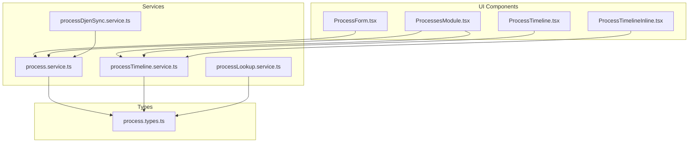
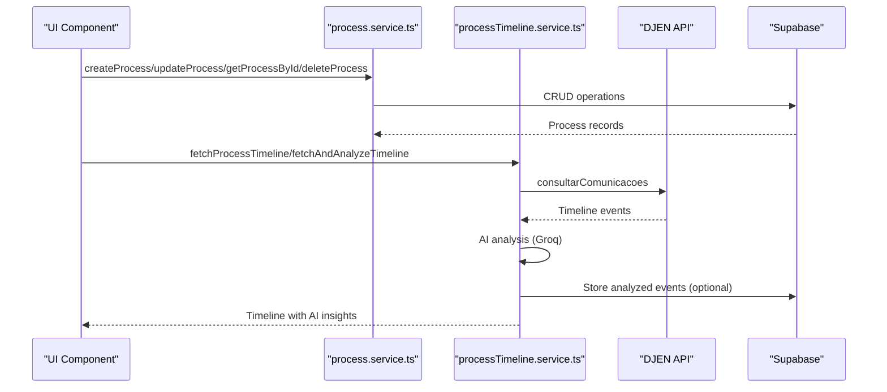
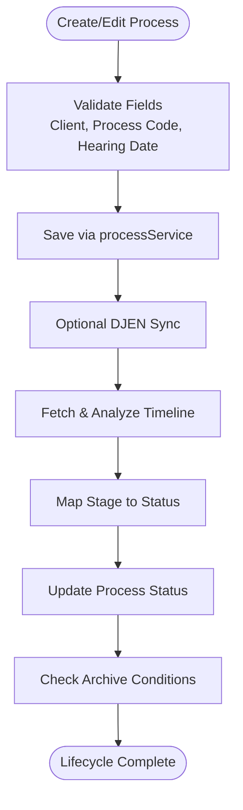
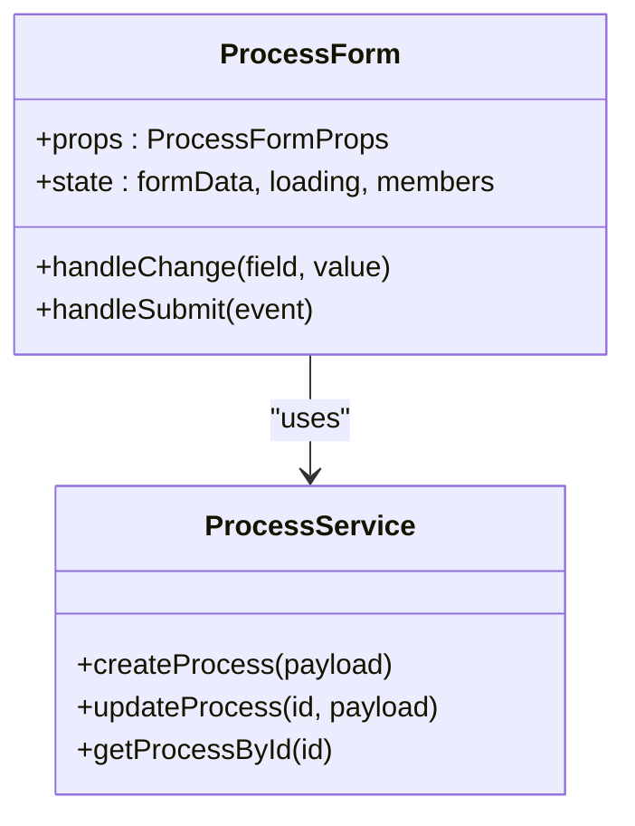
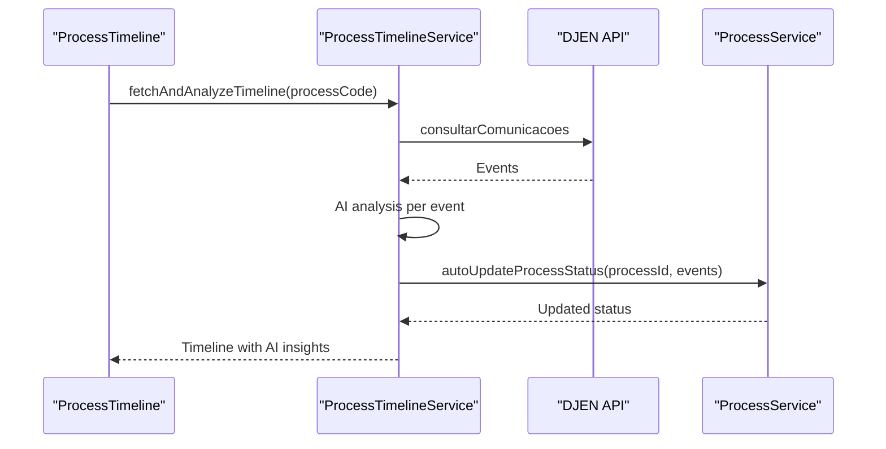
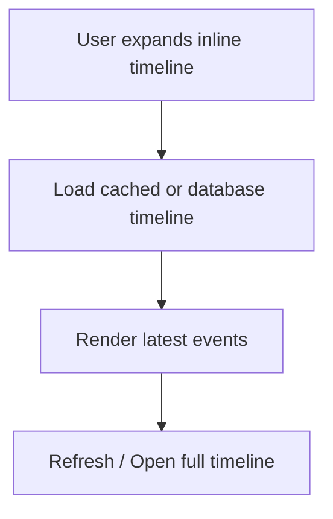
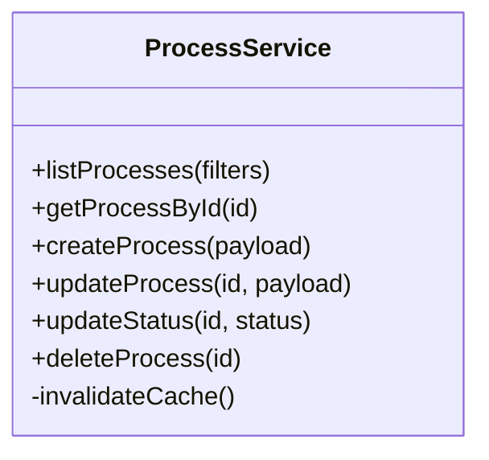
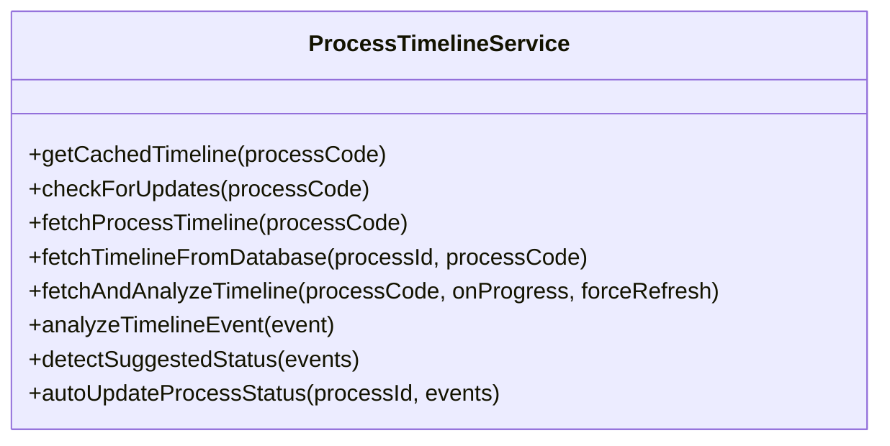
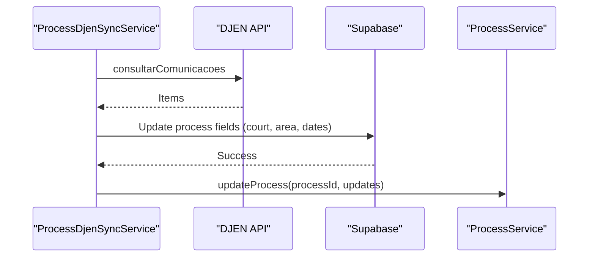
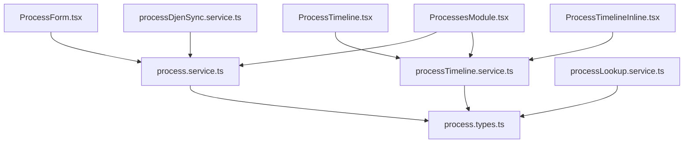

# Processes Management

<cite>
**Referenced Files in This Document**
- [ProcessForm.tsx](file://src/components/ProcessForm.tsx)
- [ProcessTimeline.tsx](file://src/components/ProcessTimeline.tsx)
- [ProcessTimelineInline.tsx](file://src/components/ProcessTimelineInline.tsx)
- [ProcessesModule.tsx](file://src/components/ProcessesModule.tsx)
- [process.service.ts](file://src/services/process.service.ts)
- [processTimeline.service.ts](file://src/services/processTimeline.service.ts)
- [processDjenSync.service.ts](file://src/services/processDjenSync.service.ts)
- [processLookup.service.ts](file://src/services/processLookup.service.ts)
- [process.types.ts](file://src/types/process.types.ts)
</cite>

## Table of Contents
1. [Introduction](#introduction)
2. [Project Structure](#project-structure)
3. [Core Components](#core-components)
4. [Architecture Overview](#architecture-overview)
5. [Detailed Component Analysis](#detailed-component-analysis)
6. [Dependency Analysis](#dependency-analysis)
7. [Performance Considerations](#performance-considerations)
8. [Troubleshooting Guide](#troubleshooting-guide)
9. [Conclusion](#conclusion)

## Introduction
This document provides comprehensive documentation for the Processes Management module. It explains the complete process lifecycle from creation to closure, covering the ProcessForm component, ProcessTimeline implementation, ProcessTimelineInline component, and the underlying service layer. It also documents status tracking, deadline management, legal area categorization, process duplication, archiving, and audit trail functionality. Finally, it includes practical examples for customizing process fields, adding new status types, and integrating with external case databases.

## Project Structure
The Processes Management module is organized around three primary UI components and a robust service layer:
- ProcessForm: Handles creation and editing of processes with validation and client integration.
- ProcessTimeline: Full-screen timeline viewer with AI-powered analysis, filtering, and status synchronization.
- ProcessTimelineInline: Embedded timeline widget for dashboards and quick views.
- Services: Process service (CRUD), ProcessTimeline service (DJEN integration and AI analysis), ProcessDjenSync service (background synchronization), and ProcessLookup service (case database integration).

**Diagram sources**
- [ProcessForm.tsx:15-328](file://src/components/ProcessForm.tsx#L15-328)
- [ProcessTimeline.tsx:332-800](file://src/components/ProcessTimeline.tsx#L332-800)
- [ProcessTimelineInline.tsx:122-364](file://src/components/ProcessTimelineInline.tsx#L122-364)
- [ProcessesModule.tsx:1-800](file://src/components/ProcessesModule.tsx#L1-800)
- [process.service.ts:20-192](file://src/services/process.service.ts#L20-192)
- [processTimeline.service.ts:40-815](file://src/services/processTimeline.service.ts#L40-815)
- [processDjenSync.service.ts:6-233](file://src/services/processDjenSync.service.ts#L6-233)
- [processLookup.service.ts:50-88](file://src/services/processLookup.service.ts#L50-88)
- [process.types.ts:1-85](file://src/types/process.types.ts#L1-85)

**Section sources**
- [ProcessForm.tsx:15-328](file://src/components/ProcessForm.tsx#L15-L328)
- [ProcessTimeline.tsx:332-800](file://src/components/ProcessTimeline.tsx#L332-L800)
- [ProcessTimelineInline.tsx:122-364](file://src/components/ProcessTimelineInline.tsx#L122-L364)
- [ProcessesModule.tsx:1-800](file://src/components/ProcessesModule.tsx#L1-L800)
- [process.service.ts:20-192](file://src/services/process.service.ts#L20-L192)
- [processTimeline.service.ts:40-815](file://src/services/processTimeline.service.ts#L40-L815)
- [processDjenSync.service.ts:6-233](file://src/services/processDjenSync.service.ts#L6-L233)
- [processLookup.service.ts:50-88](file://src/services/processLookup.service.ts#L50-L88)
- [process.types.ts:1-85](file://src/types/process.types.ts#L1-L85)

## Core Components
This section covers the main building blocks of the Processes Management module.

### ProcessForm Component
The ProcessForm component manages the creation and editing of processes with:
- Case information: client selection, process code, and court details.
- Process details: legal area (practice area), status, distribution date, responsible lawyer, hearing scheduling, and notes.
- Validation rules: mandatory client selection, optional process code depending on status, and future-dated hearing validation.
- Integration: uses processService for CRUD operations and ClientSearchSelect for client lookup.

Key behaviors:
- Prefill support for quick creation.
- Auto-distribution date extraction from process code when missing.
- DJEN lookup integration for court and practice area inference.
- Notes serialization with nested replies and author attribution.

**Section sources**
- [ProcessForm.tsx:15-328](file://src/components/ProcessForm.tsx#L15-L328)
- [process.types.ts:28-75](file://src/types/process.types.ts#L28-L75)

### ProcessTimeline Component
The ProcessTimeline component provides a comprehensive timeline view with:
- Intelligent stage detection based on event analysis.
- Filtering by event type and degree of appeal.
- Search across titles and descriptions.
- AI-powered analysis with urgency classification and action-required flags.
- Automatic status synchronization with the process record.
- Embedded refresh and progress indicators.

Highlights:
- Stage-to-status mapping ensures the displayed stage aligns with the process status.
- Cache-first loading with background update checks.
- Rich event summaries with urgency badges and actionable insights.

**Section sources**
- [ProcessTimeline.tsx:332-800](file://src/components/ProcessTimeline.tsx#L332-L800)
- [processTimeline.service.ts:661-811](file://src/services/processTimeline.service.ts#L661-L811)

### ProcessTimelineInline Component
The ProcessTimelineInline component offers an embedded timeline for dashboards:
- Collapsible view with expand/collapse controls.
- Latest events display with urgency badges.
- Quick refresh and open-full-timeline navigation.
- Local caching for instant rendering while background updates occur.

**Section sources**
- [ProcessTimelineInline.tsx:122-364](file://src/components/ProcessTimelineInline.tsx#L122-L364)
- [processTimeline.service.ts:131-138](file://src/services/processTimeline.service.ts#L131-L138)

### ProcessesModule (Dashboard and Management)
The ProcessesModule orchestrates the broader processes management experience:
- Kanban-style status grouping with drag-and-drop support.
- Bulk operations: export to Excel, DJEN sync, and status updates.
- Integrated timeline viewing and inline timeline widgets.
- Notes threading with replies and author attribution.
- Archival monitoring: alerts for archived processes with pending deadlines.

**Section sources**
- [ProcessesModule.tsx:1-800](file://src/components/ProcessesModule.tsx#L1-L800)
- [ProcessesModule.tsx:800-1599](file://src/components/ProcessesModule.tsx#L800-L1599)
- [ProcessesModule.tsx:1600-2399](file://src/components/ProcessesModule.tsx#L1600-L2399)

## Architecture Overview
The Processes Management module follows a layered architecture:
- UI Layer: React components (ProcessForm, ProcessTimeline, ProcessTimelineInline, ProcessesModule).
- Service Layer: Process service (CRUD), ProcessTimeline service (DJEN + AI), ProcessDjenSync service (background sync), ProcessLookup service (external case integration).
- Data Types: Strongly typed process models and DTOs.
- External Integrations: DJEN for public notices, Supabase for storage, Groq for AI analysis.

**Diagram sources**
- [process.service.ts:113-188](file://src/services/process.service.ts#L113-L188)
- [processTimeline.service.ts:189-237](file://src/services/processTimeline.service.ts#L189-L237)
- [processTimeline.service.ts:399-482](file://src/services/processTimeline.service.ts#L399-L482)

**Section sources**
- [process.service.ts:20-192](file://src/services/process.service.ts#L20-L192)
- [processTimeline.service.ts:40-815](file://src/services/processTimeline.service.ts#L40-L815)

## Detailed Component Analysis

### Process Lifecycle: Creation, Editing, Status Tracking, Closure
The lifecycle spans several stages:
- Creation: New process entry via ProcessForm, with optional DJEN lookup and auto-distribution date extraction.
- Editing: Updates through ProcessForm, including notes threading and status changes.
- Status Tracking: Real-time status updates synchronized with timeline analysis.
- Closure: Archiving and monitoring of pending deadlines for archived processes.

**Diagram sources**
- [ProcessForm.tsx:87-115](file://src/components/ProcessForm.tsx#L87-L115)
- [process.service.ts:113-154](file://src/services/process.service.ts#L113-L154)
- [processTimeline.service.ts:661-811](file://src/services/processTimeline.service.ts#L661-L811)
- [ProcessesModule.tsx:558-603](file://src/components/ProcessesModule.tsx#L558-L603)

**Section sources**
- [ProcessForm.tsx:87-115](file://src/components/ProcessForm.tsx#L87-L115)
- [process.service.ts:113-154](file://src/services/process.service.ts#L113-L154)
- [processTimeline.service.ts:661-811](file://src/services/processTimeline.service.ts#L661-L811)
- [ProcessesModule.tsx:558-603](file://src/components/ProcessesModule.tsx#L558-L603)

### ProcessForm Component Deep Dive
- State management: Tracks form data, loading states, and team members.
- Validation: Client required, process code required except for "Aguardando Confecção", hearing date must not be in the past.
- Submission flow: Creates or updates process, handles notes serialization, and triggers DJEN sync when applicable.
- Integration: Uses ClientSearchSelect for client lookup and integrates with calendar service for hearings.

**Diagram sources**
- [ProcessForm.tsx:15-328](file://src/components/ProcessForm.tsx#L15-L328)
- [process.service.ts:113-154](file://src/services/process.service.ts#L113-L154)

**Section sources**
- [ProcessForm.tsx:15-328](file://src/components/ProcessForm.tsx#L15-L328)
- [process.service.ts:113-154](file://src/services/process.service.ts#L113-L154)

### ProcessTimeline Implementation
- Intelligent stage detection: Uses event analysis to determine current stage and map to process status.
- Filtering and search: Type-based filters, degree-of-appeal filters, and normalized text search.
- AI analysis: Urgency classification and action-required flags with progress feedback.
- Status synchronization: Automatically updates process status based on timeline analysis.

**Diagram sources**
- [ProcessTimeline.tsx:355-431](file://src/components/ProcessTimeline.tsx#L355-L431)
- [processTimeline.service.ts:399-482](file://src/services/processTimeline.service.ts#L399-L482)
- [processTimeline.service.ts:788-811](file://src/services/processTimeline.service.ts#L788-L811)

**Section sources**
- [ProcessTimeline.tsx:355-431](file://src/components/ProcessTimeline.tsx#L355-L431)
- [processTimeline.service.ts:399-482](file://src/services/processTimeline.service.ts#L399-L482)
- [processTimeline.service.ts:788-811](file://src/services/processTimeline.service.ts#L788-L811)

### ProcessTimelineInline Component
- Collapsible embedded timeline for dashboards.
- Local cache usage for instant rendering.
- Refresh and navigation to full timeline.

**Diagram sources**
- [ProcessTimelineInline.tsx:122-364](file://src/components/ProcessTimelineInline.tsx#L122-L364)
- [processTimeline.service.ts:131-138](file://src/services/processTimeline.service.ts#L131-L138)

**Section sources**
- [ProcessTimelineInline.tsx:122-364](file://src/components/ProcessTimelineInline.tsx#L122-L364)
- [processTimeline.service.ts:131-138](file://src/services/processTimeline.service.ts#L131-L138)

### Process Service Layer
- CRUD operations: create, update, delete, list with filters and caching.
- Status updates: dedicated endpoint to update process status.
- Cache invalidation: automatic cache clearing after mutations.

**Diagram sources**
- [process.service.ts:20-192](file://src/services/process.service.ts#L20-L192)

**Section sources**
- [process.service.ts:20-192](file://src/services/process.service.ts#L20-L192)

### Timeline Service Layer
- DJEN integration: Fetches communications and converts to timeline events.
- AI analysis: Groq-powered analysis with caching to avoid repeated processing.
- Cache management: Local storage cache with analyzed-hash tracking.
- Background updates: Detects new publications and refreshes timeline accordingly.

**Diagram sources**
- [processTimeline.service.ts:40-815](file://src/services/processTimeline.service.ts#L40-L815)

**Section sources**
- [processTimeline.service.ts:40-815](file://src/services/processTimeline.service.ts#L40-L815)

### DJEN Sync and Lookup Services
- ProcessDjenSyncService: Synchronizes processes with DJEN, extracts court, practice area, and distribution date, and marks sync status.
- ProcessLookupService: Extracts practice area, court, and distribution date from published documents using keyword matching and content parsing.

**Diagram sources**
- [processDjenSync.service.ts:12-114](file://src/services/processDjenSync.service.ts#L12-L114)
- [process.service.ts:156-173](file://src/services/process.service.ts#L156-L173)

**Section sources**
- [processDjenSync.service.ts:12-114](file://src/services/processDjenSync.service.ts#L12-L114)
- [processLookup.service.ts:50-88](file://src/services/processLookup.service.ts#L50-L88)
- [process.service.ts:156-173](file://src/services/process.service.ts#L156-L173)

## Dependency Analysis
The module exhibits clear separation of concerns:
- UI components depend on services for data operations.
- Services encapsulate external integrations (DJEN, Supabase, Groq).
- Types define contracts for data structures and status enums.

**Diagram sources**
- [ProcessForm.tsx:1-10](file://src/components/ProcessForm.tsx#L1-L10)
- [ProcessTimeline.tsx:1-36](file://src/components/ProcessTimeline.tsx#L1-L36)
- [ProcessTimelineInline.tsx:1-20](file://src/components/ProcessTimelineInline.tsx#L1-L20)
- [ProcessesModule.tsx:29-47](file://src/components/ProcessesModule.tsx#L29-L47)
- [process.service.ts:1-10](file://src/services/process.service.ts#L1-L10)
- [processTimeline.service.ts:1-6](file://src/services/processTimeline.service.ts#L1-L6)
- [processDjenSync.service.ts:1-5](file://src/services/processDjenSync.service.ts#L1-L5)
- [processLookup.service.ts:1-3](file://src/services/processLookup.service.ts#L1-L3)
- [process.types.ts:1-10](file://src/types/process.types.ts#L1-L10)

**Section sources**
- [ProcessForm.tsx:1-10](file://src/components/ProcessForm.tsx#L1-L10)
- [ProcessTimeline.tsx:1-36](file://src/components/ProcessTimeline.tsx#L1-L36)
- [ProcessTimelineInline.tsx:1-20](file://src/components/ProcessTimelineInline.tsx#L1-L20)
- [ProcessesModule.tsx:29-47](file://src/components/ProcessesModule.tsx#L29-L47)
- [process.service.ts:1-10](file://src/services/process.service.ts#L1-L10)
- [processTimeline.service.ts:1-6](file://src/services/processTimeline.service.ts#L1-L6)
- [processDjenSync.service.ts:1-5](file://src/services/processDjenSync.service.ts#L1-L5)
- [processLookup.service.ts:1-3](file://src/services/processLookup.service.ts#L1-L3)
- [process.types.ts:1-10](file://src/types/process.types.ts#L1-L10)

## Performance Considerations
- Caching: Process list caching with expiration, timeline cache with analyzed-hash tracking, and inline timeline cache for instant rendering.
- Batch operations: DJEN sync limits requests to prevent overload.
- Lazy loading: Timeline loads cached data immediately, then refreshes in the background if updates are detected.
- AI throttling: Controlled rate for Groq API calls during timeline analysis.

[No sources needed since this section provides general guidance]

## Troubleshooting Guide
Common issues and resolutions:
- Timeline loading failures: The timeline component falls back to DJEN API if local database fetch fails. Check network connectivity and DJEN availability.
- Status not updating: Ensure the timeline analysis completes and that the suggested status differs from the current status. The service automatically updates the process status.
- DJEN sync errors: Verify process code format and year extraction logic. Confirm DJEN API availability and rate limits.
- Notes serialization issues: The system normalizes and deduplicates notes to handle legacy formats and double-serialization artifacts.

**Section sources**
- [ProcessTimeline.tsx:406-427](file://src/components/ProcessTimeline.tsx#L406-L427)
- [processTimeline.service.ts:788-811](file://src/services/processTimeline.service.ts#L788-L811)
- [processDjenSync.service.ts:106-113](file://src/services/processDjenSync.service.ts#L106-L113)
- [ProcessesModule.tsx:190-202](file://src/components/ProcessesModule.tsx#L190-L202)

## Conclusion
The Processes Management module provides a robust, scalable solution for managing legal processes with integrated timeline analysis, DJEN synchronization, and AI-powered insights. Its layered architecture ensures maintainability, while caching and background processing deliver responsive user experiences. The included examples demonstrate how to customize fields, extend statuses, and integrate external case databases.