# Signature Management

<cite>
**Referenced Files in This Document**
- [SignatureCanvas.tsx](file://src/components/SignatureCanvas.tsx)
- [SignatureReport.tsx](file://src/components/SignatureReport.tsx)
- [SignatureModule.tsx](file://src/components/SignatureModule.tsx)
- [SignaturePositionDesigner.tsx](file://src/components/SignaturePositionDesigner.tsx)
- [signature.service.ts](file://src/services/signature.service.ts)
- [pdfSignature.service.ts](file://src/services/pdfSignature.service.ts)
- [signatureExplorer.service.ts](file://src/services/signatureExplorer.service.ts)
- [signatureFields.service.ts](file://src/services/signatureFields.service.ts)
- [signature.types.ts](file://src/types/signature.types.ts)
- [signatureExplorer.types.ts](file://src/types/signatureExplorer.types.ts)
</cite>

## Table of Contents
1. [Introduction](#introduction)
2. [Project Structure](#project-structure)
3. [Core Components](#core-components)
4. [Architecture Overview](#architecture-overview)
5. [Detailed Component Analysis](#detailed-component-analysis)
6. [Dependency Analysis](#dependency-analysis)
7. [Performance Considerations](#performance-considerations)
8. [Troubleshooting Guide](#troubleshooting-guide)
9. [Conclusion](#conclusion)
10. [Appendices](#appendices)

## Introduction
This document describes the Signature Management module, a comprehensive digital signature solution built with React and TypeScript. It covers the end-to-end workflow: capturing signatures, authenticating signers, embedding signatures into PDFs, generating verification certificates, tracking audit trails, and organizing documents. It also documents the service layer for CRUD operations, field management, and document association, along with the signature explorer for folder organization and batch operations.

## Project Structure
The module spans UI components, services, and types:
- UI components: SignatureCanvas, SignatureReport, SignaturePositionDesigner, SignatureModule
- Services: signature service, PDF signature service, signature fields service, signature explorer service
- Types: signature types and explorer types

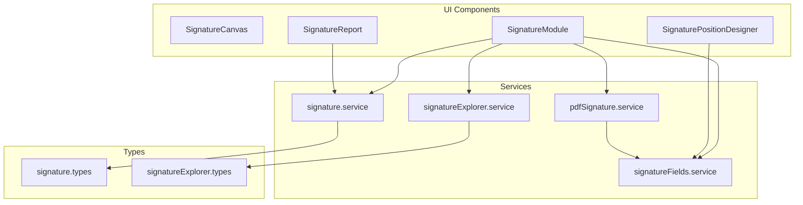

**Diagram sources**
- [SignatureModule.tsx:168-800](file://src/components/SignatureModule.tsx#L168-L800)
- [signature.service.ts:18-1116](file://src/services/signature.service.ts#L18-L1116)
- [pdfSignature.service.ts:23-2178](file://src/services/pdfSignature.service.ts#L23-L2178)
- [signatureFields.service.ts:4-50](file://src/services/signatureFields.service.ts#L4-L50)
- [signatureExplorer.service.ts:11-119](file://src/services/signatureExplorer.service.ts#L11-L119)
- [signature.types.ts:1-180](file://src/types/signature.types.ts#L1-L180)
- [signatureExplorer.types.ts:1-44](file://src/types/signatureExplorer.types.ts#L1-L44)

**Section sources**
- [SignatureModule.tsx:168-800](file://src/components/SignatureModule.tsx#L168-L800)
- [signature.service.ts:18-1116](file://src/services/signature.service.ts#L18-L1116)
- [pdfSignature.service.ts:23-2178](file://src/services/pdfSignature.service.ts#L23-L2178)
- [signatureFields.service.ts:4-50](file://src/services/signatureFields.service.ts#L4-L50)
- [signatureExplorer.service.ts:11-119](file://src/services/signatureExplorer.service.ts#L11-L119)
- [signature.types.ts:1-180](file://src/types/signature.types.ts#L1-L180)
- [signatureExplorer.types.ts:1-44](file://src/types/signatureExplorer.types.ts#L1-L44)

## Core Components
- SignatureCanvas: Touch-enabled drawing canvas for capturing handwritten signatures with responsive sizing, drawing state, and PNG export.
- SignatureReport: Printable certificate displaying signer details, authentication factors, QR verification, and integrity hash.
- SignaturePositionDesigner: Visual editor for placing signature fields across PDF/DOCX pages.
- SignatureModule: Full-featured orchestration UI for creating signature requests, managing signers, positioning fields, and generating signed PDFs.

Key capabilities:
- Drawing and export to PNG
- Real-time signature capture with facial capture integration
- PDF signature embedding and verification certificate generation
- Audit logging and real-time notifications
- Explorer for organizing signature requests and generated documents

**Section sources**
- [SignatureCanvas.tsx:15-235](file://src/components/SignatureCanvas.tsx#L15-L235)
- [SignatureReport.tsx:49-400](file://src/components/SignatureReport.tsx#L49-L400)
- [SignaturePositionDesigner.tsx:51-571](file://src/components/SignaturePositionDesigner.tsx#L51-L571)
- [SignatureModule.tsx:168-800](file://src/components/SignatureModule.tsx#L168-L800)

## Architecture Overview
The system integrates UI components with backend services and Supabase for storage and real-time updates. The flow includes:
- UI captures signature and optional facial image
- Backend uploads images to storage and updates signer record
- PDF service embeds signature images into PDFs and appends verification/report pages
- Audit logs track all actions; real-time channels keep lists synchronized

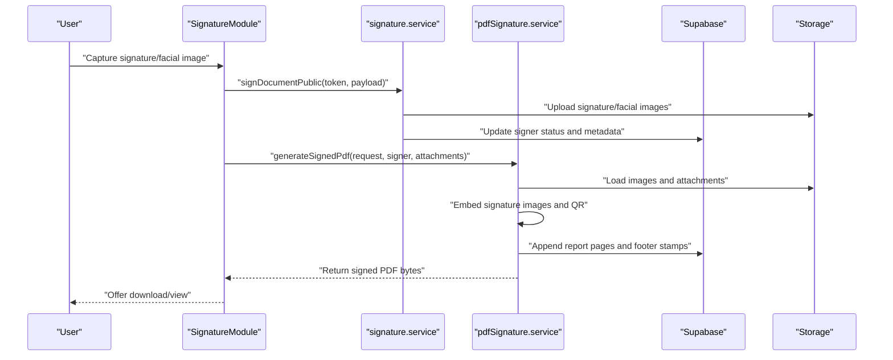

**Diagram sources**
- [signature.service.ts:643-766](file://src/services/signature.service.ts#L643-L766)
- [pdfSignature.service.ts:1096-1249](file://src/services/pdfSignature.service.ts#L1096-L1249)
- [SignatureModule.tsx:168-800](file://src/components/SignatureModule.tsx#L168-L800)

## Detailed Component Analysis

### SignatureCanvas Component
Purpose: Capture handwritten signatures with a responsive canvas, support touch/mouse, and export to PNG for embedding.

Highlights:
- Responsive sizing with dynamic width/height and device pixel ratio handling
- Drawing state tracking (start/draw/stop), last point caching, and signature presence flag
- Export to PNG via canvas.toDataURL for downstream embedding
- Clear canvas and disabled states for UX control

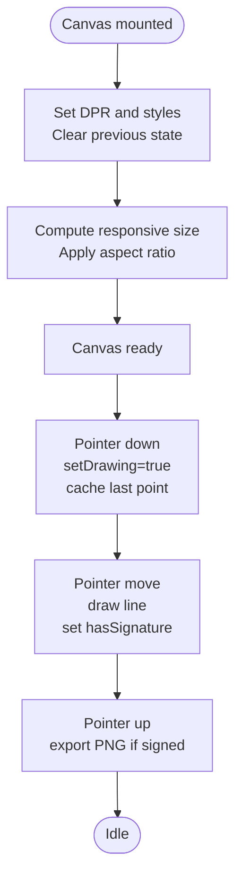

**Diagram sources**
- [SignatureCanvas.tsx:45-164](file://src/components/SignatureCanvas.tsx#L45-L164)

**Section sources**
- [SignatureCanvas.tsx:15-235](file://src/components/SignatureCanvas.tsx#L15-L235)

### SignatureReport Component
Purpose: Generate a printable, shareable certificate containing signer identity, authentication factors, QR verification code, and integrity hash.

Highlights:
- Loads signed images and QR code from Supabase storage
- Parses user agent and geolocation for device info
- Builds multi-section report with signature images and biometric selfie
- Provides print-friendly layout and download option

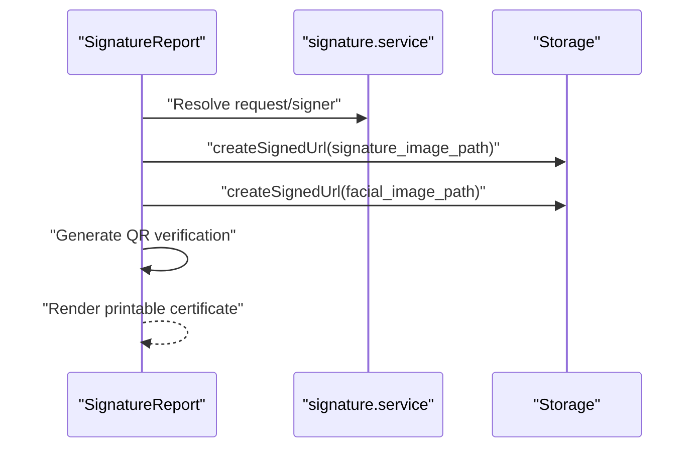

**Diagram sources**
- [SignatureReport.tsx:59-78](file://src/components/SignatureReport.tsx#L59-L78)

**Section sources**
- [SignatureReport.tsx:49-400](file://src/components/SignatureReport.tsx#L49-L400)

### SignaturePositionDesigner Component
Purpose: Visually position signature fields across PDF/DOCX documents using percentage-based coordinates.

Highlights:
- Renders DOCX previews with page boundaries
- Adds/removes draggable signature fields with page-aware positioning
- Supports multiple documents (main + attachments)
- Auto-saves field configurations to templates

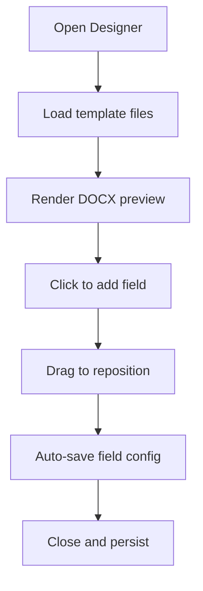

**Diagram sources**
- [SignaturePositionDesigner.tsx:85-307](file://src/components/SignaturePositionDesigner.tsx#L85-L307)

**Section sources**
- [SignaturePositionDesigner.tsx:51-571](file://src/components/SignaturePositionDesigner.tsx#L51-L571)

### SignatureModule Component
Purpose: End-to-end orchestration for signature requests, including document selection, signer management, field placement, and signed PDF generation.

Highlights:
- Wizard-driven workflow: list → upload → signers → position → settings → success
- Real-time loading with Supabase realtime channels
- Integrates SignatureCanvas, SignaturePositionDesigner, and SignatureReport
- Generates signed PDFs and optionally saves to storage with integrity hash

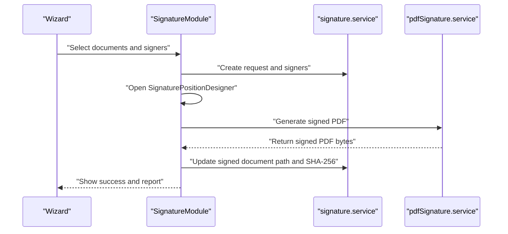

**Diagram sources**
- [SignatureModule.tsx:168-800](file://src/components/SignatureModule.tsx#L168-L800)
- [signature.service.ts:233-282](file://src/services/signature.service.ts#L233-L282)
- [pdfSignature.service.ts:1096-1249](file://src/services/pdfSignature.service.ts#L1096-L1249)

**Section sources**
- [SignatureModule.tsx:168-800](file://src/components/SignatureModule.tsx#L168-L800)

### Signature Service Layer
Responsibilities:
- Manage signature requests and signers (CRUD, status transitions)
- Authentication via OTP/email/google and public token generation
- Upload and manage signature-related assets
- Generate verification hashes and public/private URLs
- Audit logging and statistics

Key operations:
- Create request with multiple signers
- Update signer metadata and signed document path
- Public signing via edge function
- Verify signatures by hash or SHA-256
- Archive/cancel/delete requests with optional file deletion

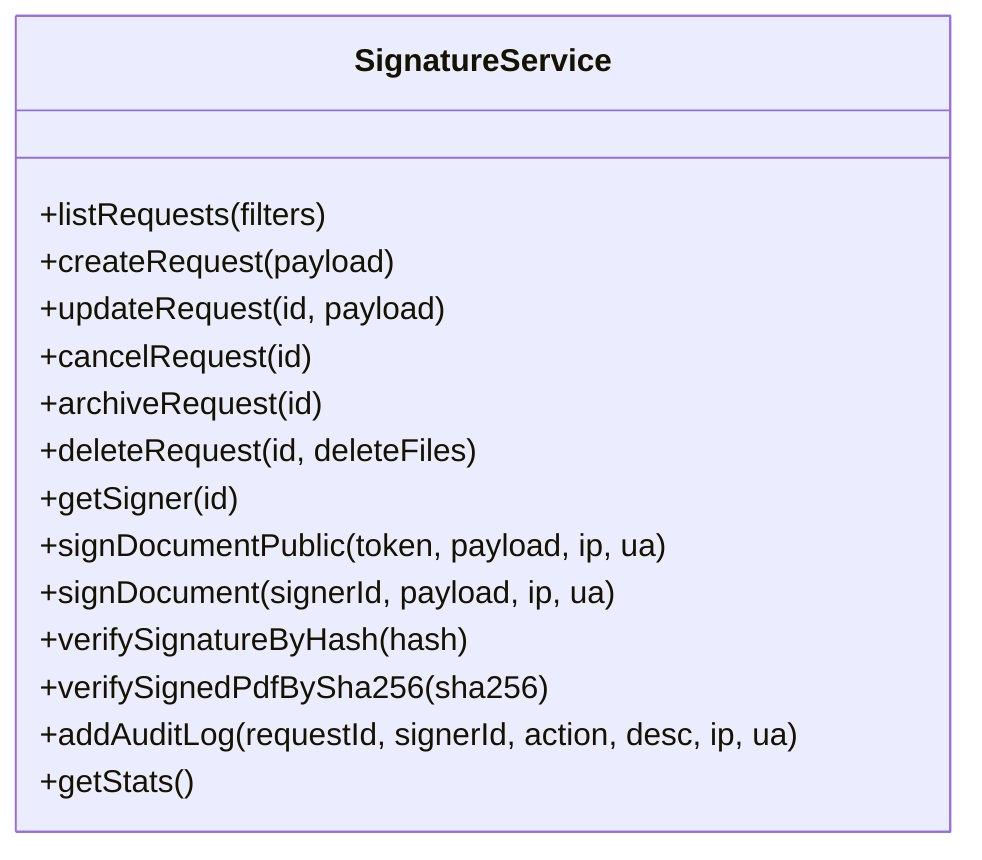

**Diagram sources**
- [signature.service.ts:18-1116](file://src/services/signature.service.ts#L18-L1116)

**Section sources**
- [signature.service.ts:18-1116](file://src/services/signature.service.ts#L18-L1116)

### PDF Signature Service
Responsibilities:
- Embed signature images into PDFs at configured positions
- Generate verification QR codes and integrity hashes
- Append comprehensive report pages with signer details and audit trail
- Support DOCX conversion and signature placement across sections
- Save signed PDFs to storage and compute SHA-256

Processing pipeline:
- Load original PDF and optional attachments
- Load signature/facial images from storage
- Place signature images according to fields or fallback to last page
- Append report and footer stamps with verification data
- Compute integrity hash across original and attached documents

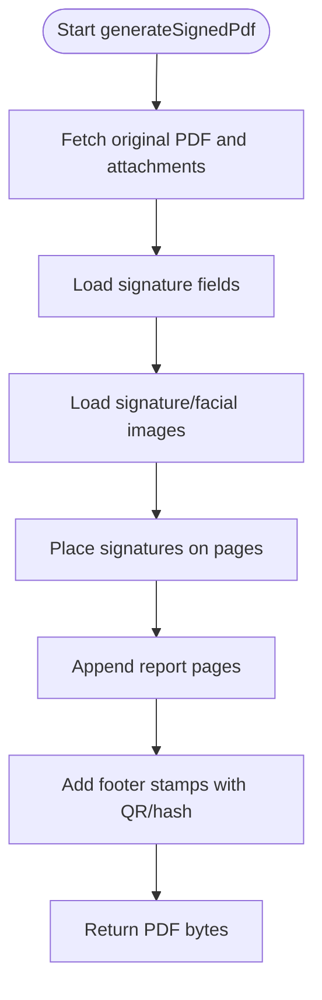

**Diagram sources**
- [pdfSignature.service.ts:1096-1249](file://src/services/pdfSignature.service.ts#L1096-L1249)

**Section sources**
- [pdfSignature.service.ts:23-2178](file://src/services/pdfSignature.service.ts#L23-L2178)

### Signature Explorer Service
Responsibilities:
- Organize signature requests and generated documents into folders
- Track item-to-folder associations with sort order and creators
- Support batch operations (move, upsert, delete)

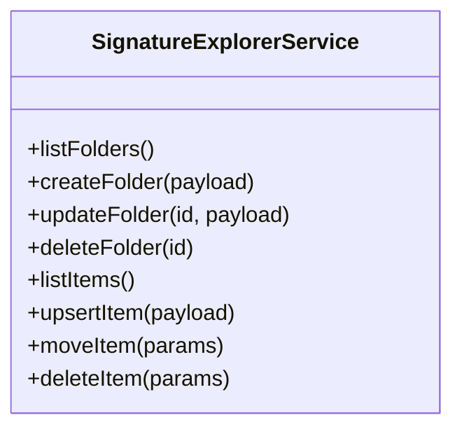

**Diagram sources**
- [signatureExplorer.service.ts:11-119](file://src/services/signatureExplorer.service.ts#L11-L119)

**Section sources**
- [signatureExplorer.service.ts:11-119](file://src/services/signatureExplorer.service.ts#L11-L119)

### Signature Fields Service
Responsibilities:
- Manage signature fields per request with page and percentage-based coordinates
- Upsert fields by replacing existing ones for simplicity

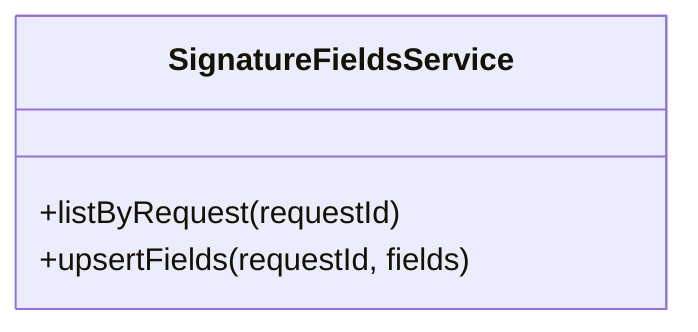

**Diagram sources**
- [signatureFields.service.ts:4-50](file://src/services/signatureFields.service.ts#L4-L50)

**Section sources**
- [signatureFields.service.ts:4-50](file://src/services/signatureFields.service.ts#L4-L50)

### Types and Validation Rules
Core types define the data model for signature requests, signers, fields, and audit logs. Validation rules and constraints:
- Status transitions: pending → signed, cancelled, expired
- Required fields: document identifiers, request metadata, field coordinates
- Authentication providers: google, email_link, phone
- Field types: signature, initials, name, cpf, date
- Integrity: SHA-256 computed over original and attached documents
- Security: verification hash per signer/request, public tokens for anonymous signing

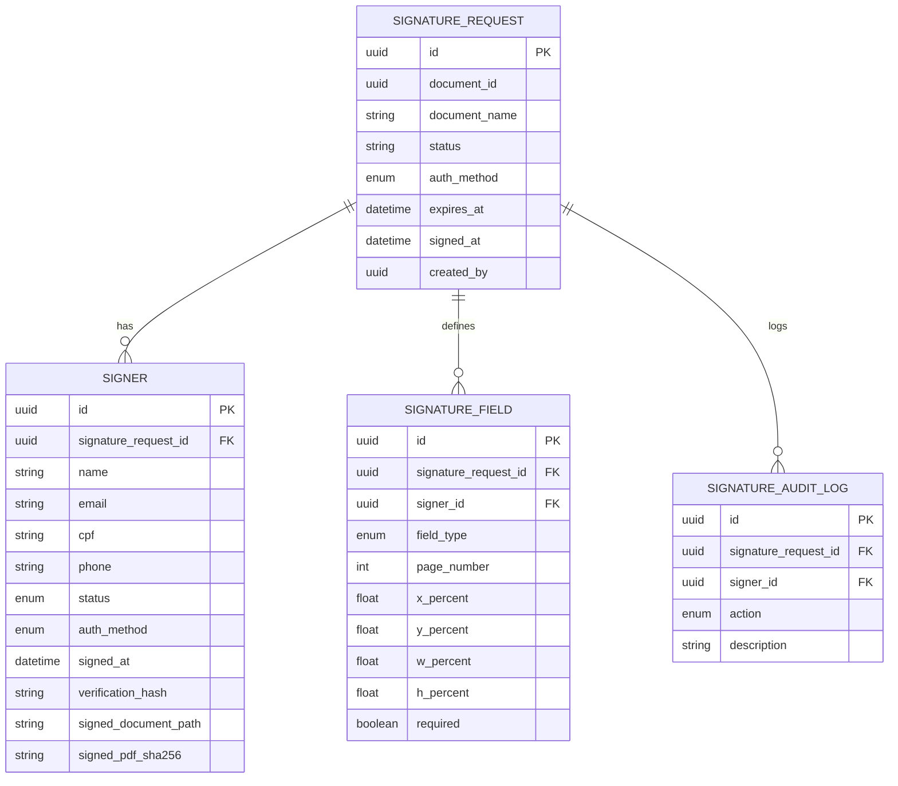

**Diagram sources**
- [signature.types.ts:7-180](file://src/types/signature.types.ts#L7-L180)

**Section sources**
- [signature.types.ts:1-180](file://src/types/signature.types.ts#L1-L180)

## Dependency Analysis
- UI components depend on services for data operations and PDF generation
- Services depend on Supabase for database and storage operations
- PDF service depends on signature fields and storage for assets
- Explorer service manages cross-references between folders and items

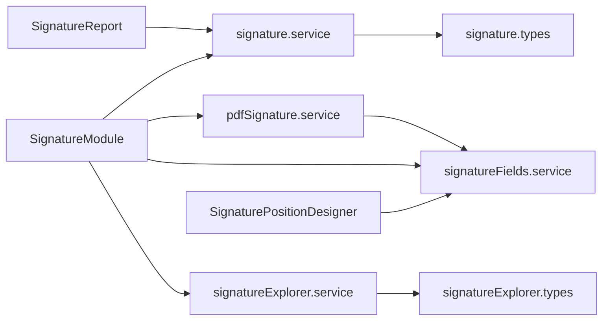

**Diagram sources**
- [SignatureModule.tsx:168-800](file://src/components/SignatureModule.tsx#L168-L800)
- [signature.service.ts:18-1116](file://src/services/signature.service.ts#L18-L1116)
- [pdfSignature.service.ts:23-2178](file://src/services/pdfSignature.service.ts#L23-L2178)
- [signatureFields.service.ts:4-50](file://src/services/signatureFields.service.ts#L4-L50)
- [signatureExplorer.service.ts:11-119](file://src/services/signatureExplorer.service.ts#L11-L119)
- [signature.types.ts:1-180](file://src/types/signature.types.ts#L1-L180)
- [signatureExplorer.types.ts:1-44](file://src/types/signatureExplorer.types.ts#L1-L44)

**Section sources**
- [SignatureModule.tsx:168-800](file://src/components/SignatureModule.tsx#L168-L800)
- [signature.service.ts:18-1116](file://src/services/signature.service.ts#L18-L1116)
- [pdfSignature.service.ts:23-2178](file://src/services/pdfSignature.service.ts#L23-L2178)
- [signatureFields.service.ts:4-50](file://src/services/signatureFields.service.ts#L4-L50)
- [signatureExplorer.service.ts:11-119](file://src/services/signatureExplorer.service.ts#L11-L119)
- [signature.types.ts:1-180](file://src/types/signature.types.ts#L1-L180)
- [signatureExplorer.types.ts:1-44](file://src/types/signatureExplorer.types.ts#L1-L44)

## Performance Considerations
- Canvas rendering uses device pixel ratio scaling to maintain crispness on high-DPI displays.
- PDF generation streams attachments and computes integrity hashes incrementally.
- Storage operations use signed URLs with caching to minimize repeated fetches.
- Real-time subscriptions reduce polling overhead for live updates.

## Troubleshooting Guide
Common issues and resolutions:
- Signature not appearing in PDF: verify signature image upload succeeded and fields exist for the request.
- Verification hash mismatch: ensure SHA-256 is computed over the concatenated original and attached documents.
- Storage upload failures: check bucket permissions and file size limits.
- Real-time updates not reflecting: confirm Supabase channel subscription and visibility state.

**Section sources**
- [signature.service.ts:936-1017](file://src/services/signature.service.ts#L936-L1017)
- [pdfSignature.service.ts:1148-1149](file://src/services/pdfSignature.service.ts#L1148-L1149)

## Conclusion
The Signature Management module provides a robust, auditable, and scalable digital signature solution. It combines intuitive UI components, secure backend services, and comprehensive PDF generation to deliver a complete lifecycle for electronic signatures with verification and compliance reporting.

## Appendices

### Customization Examples
- Customizing workflow steps: adjust wizard steps and navigation in the SignatureModule component.
- Implementing verification: use public verification URLs and QR codes generated by the PDF service.
- Integrating external signing services: leverage public signing endpoints and OTP functions exposed by the signature service.

**Section sources**
- [SignatureModule.tsx:168-800](file://src/components/SignatureModule.tsx#L168-L800)
- [signature.service.ts:1019-1095](file://src/services/signature.service.ts#L1019-L1095)
- [pdfSignature.service.ts:1142-1146](file://src/services/pdfSignature.service.ts#L1142-L1146)