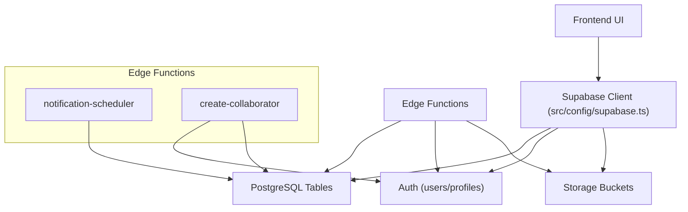
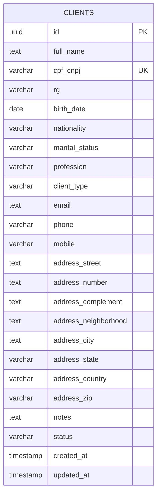
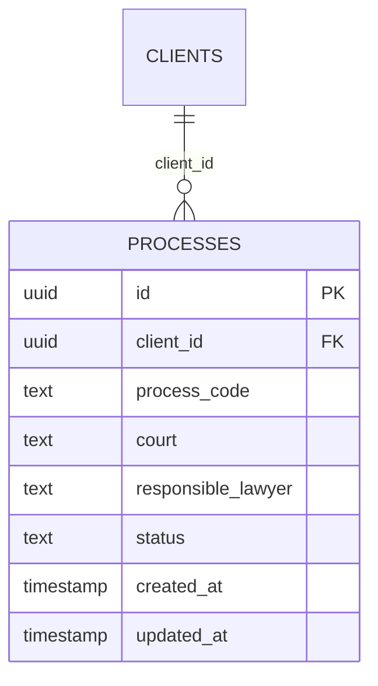
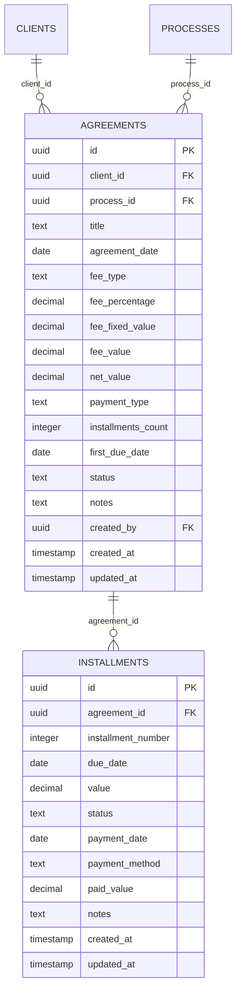
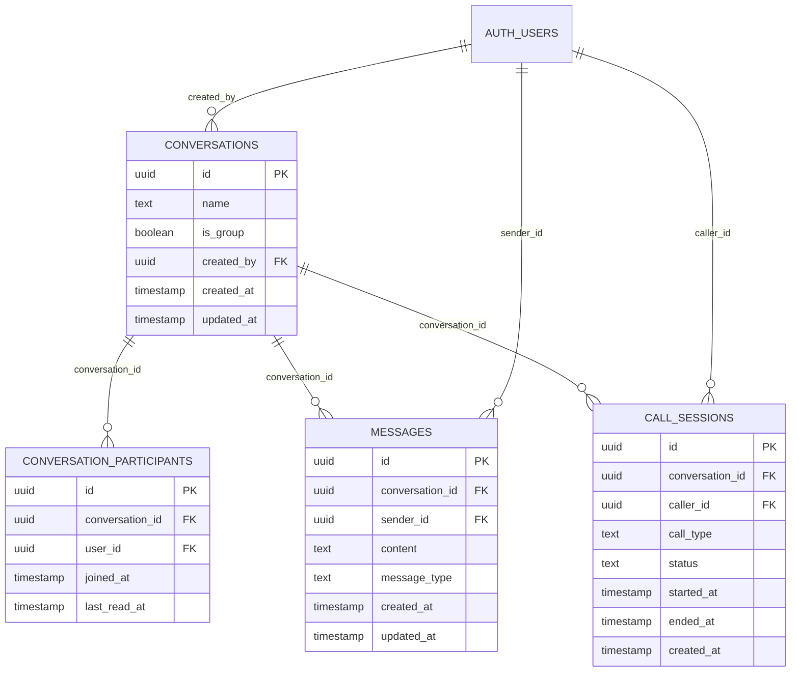
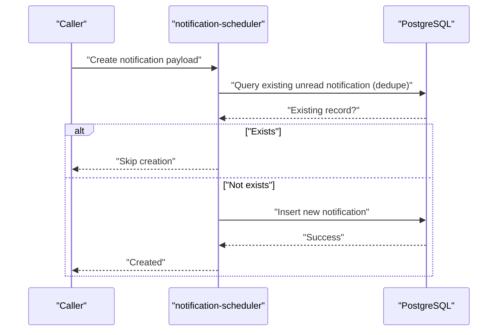
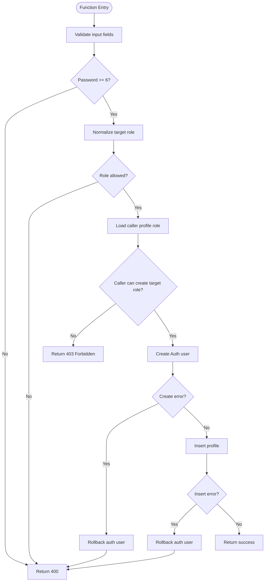
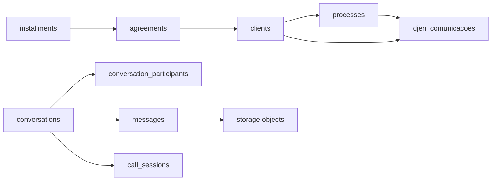

# Database Design

<cite>
**Referenced Files in This Document**
- [README.md](file://README.md)
- [supabase-chat-schema.sql](file://supabase-chat-schema.sql)
- [fix-all-rls-policies.sql](file://fix-all-rls-policies.sql)
- [fix-supabase-issues.sql](file://fix-supabase-issues.sql)
- [create_ai_analysis_table.sql](file://sql/create_ai_analysis_table.sql)
- [create_financial_tables.sql](file://sql/create_financial_tables.sql)
- [supabase.ts](file://src/config/supabase.ts)
- [process.service.ts](file://src/services/process.service.ts)
- [djenLocal.service.ts](file://src/services/djenLocal.service.ts)
- [notification-scheduler/index.ts](file://supabase/functions/notification-scheduler/index.ts)
- [userNotification.service.ts](file://src/services/userNotification.service.ts)
- [create-collaborator/index.ts](file://supabase/functions/create-collaborator/index.ts)
- [MIGRATION_DJEN_SYNC.sql](file://MIGRATION_DJEN_SYNC.sql)
- [apply_requirement_migration.sql](file://apply_requirement_migration.sql)
- [OTIMIZACAO_SUPABASE.md](file://OTIMIZACAO_SUPABASE.md)
</cite>

## Table of Contents
1. [Introduction](#introduction)
2. [Project Structure](#project-structure)
3. [Core Components](#core-components)
4. [Architecture Overview](#architecture-overview)
5. [Detailed Component Analysis](#detailed-component-analysis)
6. [Dependency Analysis](#dependency-analysis)
7. [Performance Considerations](#performance-considerations)
8. [Troubleshooting Guide](#troubleshooting-guide)
9. [Conclusion](#conclusion)
10. [Appendices](#appendices)

## Introduction
This document provides comprehensive data model documentation for the CRM Jurídico database schema. It focuses on core entities such as clients, processes, documents, and notifications, detailing table structures, primary and foreign keys, indexes, constraints, validation rules, referential integrity, and Row Level Security (RLS) policies. It also covers migration strategy, version management, data lifecycle policies, security measures, backup procedures, and performance optimization strategies tailored for legal practice data.

## Project Structure
The CRM Jurídico project is built on Supabase (PostgreSQL + Auth + Storage + Edge Functions). The database schema is composed of:
- Core business tables (clients, processes, deadlines, requirements, calendar events)
- Chat module tables (conversations, participants, messages, call sessions)
- Financial tables (agreements, installments)
- AI analysis table for intimation insights
- Storage buckets for attachments
- Supabase Edge Functions for business logic and scheduling
- Migration scripts and fix scripts for schema evolution and RLS corrections

```mermaid
graph TB
subgraph "Supabase Schema"
clients["public.clients"]
processes["public.processes"]
deadlines["public.deadlines"]
requirements["public.requirements"]
calendar_events["public.calendar_events"]
conversations["public.conversations"]
conversation_participants["public.conversation_participants"]
messages["public.messages"]
call_sessions["public.call_sessions"]
agreements["public.agreements"]
installments["public.installments"]
djen_comunicacoes["public.djen_comunicacoes"]
user_notifications["public.user_notifications"]
storage_objects["storage.objects"]
end
subgraph "Edge Functions"
notification_scheduler["functions/notification-scheduler"]
create_collaborator["functions/create-collaborator"]
end
clients <-- "FK: client_id" --> djen_comunicacoes
processes <-- "FK: process_id" --> djen_comunicacoes
clients <-- "FK: client_id" --> processes
agreements <-- "FK: client_id" --> clients
installments <-- "FK: agreement_id" --> agreements
conversations < --> conversation_participants
conversations < --> messages
conversations < --> call_sessions
messages --> storage_objects
notification_scheduler --> user_notifications
create_collaborator --> clients
```

**Diagram sources**
- [supabase-chat-schema.sql:14-54](file://supabase-chat-schema.sql#L14-L54)
- [create_financial_tables.sql:2-56](file://sql/create_financial_tables.sql#L2-L56)
- [fix-all-rls-policies.sql:130-163](file://fix-all-rls-policies.sql#L130-L163)
- [fix-supabase-issues.sql:44-71](file://fix-supabase-issues.sql#L44-L71)
- [notification-scheduler/index.ts:22-38](file://supabase/functions/notification-scheduler/index.ts#L22-L38)
- [create-collaborator/index.ts:126-161](file://supabase/functions/create-collaborator/index.ts#L126-L161)

**Section sources**
- [README.md:60-83](file://README.md#L60-L83)
- [supabase-chat-schema.sql:14-54](file://supabase-chat-schema.sql#L14-L54)
- [create_financial_tables.sql:2-56](file://sql/create_financial_tables.sql#L2-L56)
- [fix-all-rls-policies.sql:130-163](file://fix-all-rls-policies.sql#L130-L163)
- [fix-supabase-issues.sql:44-71](file://fix-supabase-issues.sql#L44-L71)

## Core Components
This section documents the core entities and their relationships, constraints, and policies.

### Clients
- Purpose: Store individual and corporate client information.
- Key attributes: id (UUID), full_name, cpf_cnpj (unique), rg (PF), birth_date, nationality, marital_status, profession, client_type, contact fields, address fields, notes, status, timestamps.
- Constraints:
  - Unique constraint on cpf_cnpj.
  - Status enum-like values enforced via application/business logic.
- Indexes: None explicitly defined in the referenced client schema; consider adding indexes on frequently filtered columns (e.g., status, client_type).
- RLS: Full access policy applied.

**Section sources**
- [README.md:62-83](file://README.md#L62-L83)
- [fix-all-rls-policies.sql:130-146](file://fix-all-rls-policies.sql#L130-L146)

### Processes
- Purpose: Track legal matters linked to clients.
- Key attributes: id (UUID), client_id (FK), process_code (searchable), court, responsible_lawyer, status (with sub-stages), timestamps.
- Constraints:
  - Referential integrity to clients via client_id.
  - Status values managed by application/service logic.
- Indexes: None explicitly defined; consider indexing process_code and status for performance.
- RLS: Full access policy applied.

**Section sources**
- [process.service.ts:95-191](file://src/services/process.service.ts#L95-L191)
- [fix-all-rls-policies.sql:148-163](file://fix-all-rls-policies.sql#L148-L163)

### Deadlines
- Purpose: Manage deadlines associated with processes or tasks.
- Key attributes: id (UUID), process_id (FK), title, description, due_date, status, timestamps.
- Constraints:
  - FK to processes; optional depending on scope.
- Indexes: None explicitly defined; consider indexing due_date and status.
- RLS: Full access policy applied.

**Section sources**
- [fix-all-rls-policies.sql:166-182](file://fix-all-rls-policies.sql#L166-L182)

### Requirements
- Purpose: Capture legal requirement records linked to processes.
- Key attributes: id (UUID), process_id (FK), title, description, status, timestamps.
- Constraints:
  - FK to processes.
- Indexes: None explicitly defined; consider indexing status and process_id.
- RLS: Full access policy applied.

**Section sources**
- [fix-all-rls-policies.sql:184-199](file://fix-all-rls-policies.sql#L184-L199)

### Calendar Events
- Purpose: Schedule appointments related to processes or clients.
- Key attributes: id (UUID), process_id (FK), title, description, start_time, end_time, location, timestamps.
- Constraints:
  - Optional FK to processes.
- Indexes: None explicitly defined; consider indexing start_time and process_id.
- RLS: Full access policy applied.

**Section sources**
- [fix-all-rls-policies.sql:202-218](file://fix-all-rls-policies.sql#L202-L218)

### Chat Module Entities
- Conversations: id (UUID), name, is_group, created_by (FK auth.users), timestamps.
- Conversation Participants: id (UUID), conversation_id (FK), user_id (FK), joined_at, last_read_at, unique(user_id, conversation_id).
- Messages: id (UUID), conversation_id (FK), sender_id (FK auth.users), content, message_type, timestamps.
- Call Sessions: id (UUID), conversation_id (FK), caller_id (FK auth.users), call_type (audio/video), status (pending/active/ended/missed), timestamps.
- Indexes: Dedicated indexes for participant and message performance.
- RLS: Fine-grained policies per entity ensuring users can only access their conversations/participants/messages/calls.

**Section sources**
- [supabase-chat-schema.sql:14-54](file://supabase-chat-schema.sql#L14-L54)
- [supabase-chat-schema.sql:57-65](file://supabase-chat-schema.sql#L57-L65)
- [supabase-chat-schema.sql:67-162](file://supabase-chat-schema.sql#L67-L162)

### Financial Entities
- Agreements: id (UUID), client_id (FK), process_id (FK), title, agreement_date, fee_type (percentage/fixed), fee_percentage/fee_fixed_value, fee_value, net_value, payment_type (upfront/installments), installments_count, first_due_date, status (pendente/ativo/concluido/cancelado), notes, created_by (FK auth.users), timestamps.
- Installments: id (UUID), agreement_id (FK), installment_number, due_date, value, status (pendente/pago/vencido/cancelado), payment_date, payment_method, paid_value, notes, timestamps.
- Indexes: Indexes on client_id, process_id, status, due_date, payment_date.
- RLS: Policies allowing selective access and enforcing created_by for inserts.

**Section sources**
- [create_financial_tables.sql:2-56](file://sql/create_financial_tables.sql#L2-L56)
- [create_financial_tables.sql:58-86](file://sql/create_financial_tables.sql#L58-L86)
- [create_financial_tables.sql:87-124](file://sql/create_financial_tables.sql#L87-L124)

### Intimation AI Analysis
- Purpose: Store AI-derived insights from DJEN communications.
- Key attributes: id (UUID), intimation_id (FK djen_comunicacoes), summary, urgency (baixa/media/alta/critica), document_type, extracted deadline metadata, suggested_actions/key_points (JSONB), analyzed_at/analyzed_by/model_used, timestamps.
- Constraints:
  - Unique constraint on intimation_id.
  - Check constraints on enumerated fields.
- Indexes: On intimation_id, urgency, analyzed_at.
- RLS: Full access policy applied.

**Section sources**
- [create_ai_analysis_table.sql:8-37](file://sql/create_ai_analysis_table.sql#L8-L37)
- [create_ai_analysis_table.sql:39-48](file://sql/create_ai_analysis_table.sql#L39-L48)
- [create_ai_analysis_table.sql:64-74](file://sql/create_ai_analysis_table.sql#L64-L74)

### Notifications
- Purpose: System notifications for users with deduplication support.
- Key attributes: id (UUID), user_id (FK auth.users), type, title, message, deadline_id/appointment_id/intimation_id/process_id/requirement_id (optional FKs), metadata (JSONB), read flag, timestamps.
- Deduplication: Dedupe by user_id, type, and optional FKs; optional dedupe_key in metadata.
- RLS: Policies vary by module; see dedicated section.

**Section sources**
- [notification-scheduler/index.ts:22-38](file://supabase/functions/notification-scheduler/index.ts#L22-L38)
- [userNotification.service.ts:82-132](file://src/services/userNotification.service.ts#L82-L132)

### Storage
- Bucket: chat-attachments (public/private depending on configuration).
- Policies: Upload, select, and delete policies scoped to authenticated users and ownership.

**Section sources**
- [fix-supabase-issues.sql:54-71](file://fix-supabase-issues.sql#L54-L71)

## Architecture Overview
The system architecture integrates Supabase’s PostgreSQL, Auth, Storage, and Edge Functions. Business logic for notifications and collaboration is encapsulated in Edge Functions, while the UI interacts with Supabase via the configured client.



**Diagram sources**
- [supabase.ts:1-34](file://src/config/supabase.ts#L1-L34)
- [notification-scheduler/index.ts:1-38](file://supabase/functions/notification-scheduler/index.ts#L1-L38)
- [create-collaborator/index.ts:1-184](file://supabase/functions/create-collaborator/index.ts#L1-L184)

## Detailed Component Analysis

### Clients Entity
- Data model: id (PK), full_name, cpf_cnpj (unique), rg, birth_date, nationality, marital_status, profession, client_type, contact/address fields, notes, status, created_at/updated_at.
- Validation rules:
  - Unique cpf_cnpj enforced at DB level via unique constraint.
  - Status constrained to specific values via application logic.
- Referential integrity: No direct FKs; used as parent for processes and djen_comunicacoes.
- RLS: Full access policy applied.



**Diagram sources**
- [README.md:62-83](file://README.md#L62-L83)

**Section sources**
- [README.md:62-83](file://README.md#L62-L83)
- [fix-all-rls-policies.sql:130-146](file://fix-all-rls-policies.sql#L130-L146)

### Processes Entity
- Data model: id (PK), client_id (FK), process_code, court, responsible_lawyer, status, created_at/updated_at.
- Validation rules:
  - Status values managed by service logic; sub-stages supported.
- Referential integrity: FK to clients.
- RLS: Full access policy applied.



**Diagram sources**
- [process.service.ts:95-191](file://src/services/process.service.ts#L95-L191)
- [fix-all-rls-policies.sql:148-163](file://fix-all-rls-policies.sql#L148-L163)

**Section sources**
- [process.service.ts:95-191](file://src/services/process.service.ts#L95-L191)
- [fix-all-rls-policies.sql:148-163](file://fix-all-rls-policies.sql#L148-L163)

### Financial Entities (Agreements and Installments)
- Data model:
  - Agreements: id (PK), client_id (FK), process_id (FK), title, agreement_date, fee_type, fee_percentage/fee_fixed_value, fee_value, net_value, payment_type, installments_count, first_due_date, status, notes, created_by (FK auth.users), timestamps.
  - Installments: id (PK), agreement_id (FK), installment_number, due_date, value, status, payment_date, payment_method, paid_value, notes, timestamps.
- Validation rules:
  - Enumerated fields with check constraints.
  - Unique constraint on (agreement_id, installment_number).
- Referential integrity: FKs to clients and processes; cascade deletes for client_id; SET NULL for process_id on delete.
- RLS: Policies allow selective access; inserts restricted to created_by.



**Diagram sources**
- [create_financial_tables.sql:2-56](file://sql/create_financial_tables.sql#L2-L56)

**Section sources**
- [create_financial_tables.sql:2-56](file://sql/create_financial_tables.sql#L2-L56)
- [create_financial_tables.sql:58-86](file://sql/create_financial_tables.sql#L58-L86)
- [create_financial_tables.sql:87-124](file://sql/create_financial_tables.sql#L87-L124)

### Chat Module Entities
- Conversations: id (PK), name, is_group, created_by (FK auth.users), timestamps.
- Conversation Participants: id (PK), conversation_id (FK), user_id (FK), joined_at, last_read_at, unique(user_id, conversation_id).
- Messages: id (PK), conversation_id (FK), sender_id (FK auth.users), content, message_type, timestamps.
- Call Sessions: id (PK), conversation_id (FK), caller_id (FK auth.users), call_type, status, timestamps.
- Indexes: Dedicated indexes for participant and message performance.
- RLS: Fine-grained policies ensuring users can only access their conversations/participants/messages/calls.



**Diagram sources**
- [supabase-chat-schema.sql:14-54](file://supabase-chat-schema.sql#L14-L54)
- [supabase-chat-schema.sql:57-65](file://supabase-chat-schema.sql#L57-L65)
- [supabase-chat-schema.sql:67-162](file://supabase-chat-schema.sql#L67-L162)

**Section sources**
- [supabase-chat-schema.sql:14-54](file://supabase-chat-schema.sql#L14-L54)
- [supabase-chat-schema.sql:57-65](file://supabase-chat-schema.sql#L57-L65)
- [supabase-chat-schema.sql:67-162](file://supabase-chat-schema.sql#L67-L162)

### Notifications Workflow
- Deduplication logic checks for existing unread notifications matching user_id, type, and optional FKs; optional dedupe_key in metadata.
- Edge Function creates notifications with deduplication rules and supports multiple context IDs.



**Diagram sources**
- [notification-scheduler/index.ts:22-38](file://supabase/functions/notification-scheduler/index.ts#L22-L38)
- [userNotification.service.ts:82-132](file://src/services/userNotification.service.ts#L82-L132)

**Section sources**
- [notification-scheduler/index.ts:22-38](file://supabase/functions/notification-scheduler/index.ts#L22-L38)
- [userNotification.service.ts:82-132](file://src/services/userNotification.service.ts#L82-L132)

### Collaboration Creation Flow
- Validates role against allowed roles, enforces caller role hierarchy, creates Auth user, and inserts profile.



**Diagram sources**
- [create-collaborator/index.ts:56-171](file://supabase/functions/create-collaborator/index.ts#L56-L171)

**Section sources**
- [create-collaborator/index.ts:56-171](file://supabase/functions/create-collaborator/index.ts#L56-L171)

## Dependency Analysis
- Foreign Keys:
  - clients → processes (client_id)
  - processes → djen_comunicacoes (process_id)
  - clients → djen_comunicacoes (client_id)
  - agreements → clients (client_id)
  - agreements → processes (process_id)
  - installments → agreements (agreement_id)
  - conversations ↔ conversation_participants (conversation_id, user_id)
  - conversations ↔ messages (conversation_id, sender_id)
  - conversations ↔ call_sessions (conversation_id)
- Indexes:
  - Participants: user_id, conversation_id
  - Messages: conversation_id, sender_id, created_at DESC
  - Financial: client_id, process_id, status, due_date, payment_date
  - AI Analysis: intimation_id, urgency, analyzed_at DESC
- RLS:
  - Full access policies for most entities
  - Chat entities enforce fine-grained access based on participation
  - Storage bucket policies for chat-attachments



**Diagram sources**
- [fix-all-rls-policies.sql:130-163](file://fix-all-rls-policies.sql#L130-L163)
- [create_financial_tables.sql:2-56](file://sql/create_financial_tables.sql#L2-L56)
- [supabase-chat-schema.sql:14-54](file://supabase-chat-schema.sql#L14-L54)
- [fix-supabase-issues.sql:54-71](file://fix-supabase-issues.sql#L54-L71)

**Section sources**
- [fix-all-rls-policies.sql:130-163](file://fix-all-rls-policies.sql#L130-L163)
- [create_financial_tables.sql:2-56](file://sql/create_financial_tables.sql#L2-L56)
- [supabase-chat-schema.sql:14-54](file://supabase-chat-schema.sql#L14-L54)
- [fix-supabase-issues.sql:54-71](file://fix-supabase-issues.sql#L54-L71)

## Performance Considerations
- Indexes:
  - Add indexes on frequently filtered/sorted columns (e.g., clients.status, clients.client_type, processes.process_code, deadlines.due_date, requirements.status, calendar_events.start_time, agreements.status, installments.due_date/payment_date, intimation_ai_analysis.urgency, intimation_ai_analysis.analyzed_at).
- Triggers:
  - Use updated_at triggers on entities that require audit trails.
- Queries:
  - Prefer selective selects and pagination for large datasets.
  - Use ILIKE judiciously; consider GIN indexes for text search if needed.
- Storage:
  - Limit attachment sizes and leverage CDN caching for static assets.
- Supabase Optimizations:
  - Review Supabase-specific optimization guidelines and connection pooling.

[No sources needed since this section provides general guidance]

## Troubleshooting Guide
- RLS Issues:
  - Apply fix scripts to reset policies and enable/disable RLS as needed.
  - Verify policies for chats, clients, processes, deadlines, requirements, calendar events, profiles, document templates, and storage.
- Storage Bucket:
  - Create chat-attachments bucket and apply storage policies after bucket creation.
- Edge Functions:
  - Ensure environment variables (SUPABASE_URL, SUPABASE_SERVICE_ROLE_KEY) are present.
  - Validate authentication and authorization headers passed to functions.
- Data Integrity:
  - Confirm unique constraints (e.g., cpf_cnpj) and check constraints (e.g., enumerated fields) are respected.
- Notifications:
  - Deduplication relies on metadata dedupe_key; ensure consistent metadata structure.

**Section sources**
- [fix-all-rls-policies.sql:1-298](file://fix-all-rls-policies.sql#L1-L298)
- [fix-supabase-issues.sql:1-79](file://fix-supabase-issues.sql#L1-L79)
- [create-collaborator/index.ts:23-54](file://supabase/functions/create-collaborator/index.ts#L23-L54)
- [userNotification.service.ts:82-132](file://src/services/userNotification.service.ts#L82-L132)

## Conclusion
The CRM Jurídico database schema leverages Supabase to provide a robust foundation for managing clients, processes, deadlines, requirements, calendar events, chat, financial agreements, and notifications. Strong referential integrity, explicit constraints, and RLS policies ensure data consistency and access control. The included migration and fix scripts facilitate schema evolution and remediation. Performance can be improved with targeted indexes and optimized queries, while security is reinforced through RLS and secure storage policies.

[No sources needed since this section summarizes without analyzing specific files]

## Appendices

### Migration Strategy and Version Management
- Use migration scripts to evolve the schema over time.
- Apply DJEN synchronization and requirement-related migrations as needed.
- Maintain backward compatibility and test migrations in staging environments.

**Section sources**
- [MIGRATION_DJEN_SYNC.sql](file://MIGRATION_DJEN_SYNC.sql)
- [apply_requirement_migration.sql](file://apply_requirement_migration.sql)

### Data Lifecycle Policies
- Soft delete pattern: Mark clients as inactive rather than deleting rows.
- Archive or anonymize sensitive historical data per retention requirements.
- Regular audits of RLS policies and access logs.

**Section sources**
- [README.md:149-155](file://README.md#L149-L155)

### Data Security Measures
- Row Level Security enabled across core tables.
- Authenticated access for storage uploads and selective reads.
- Role-based access control via Edge Functions and application logic.

**Section sources**
- [fix-all-rls-policies.sql:1-298](file://fix-all-rls-policies.sql#L1-L298)
- [fix-supabase-issues.sql:54-71](file://fix-supabase-issues.sql#L54-L71)
- [create-collaborator/index.ts:72-124](file://supabase/functions/create-collaborator/index.ts#L72-L124)

### Backup Procedures
- Leverage Supabase-managed backups and point-in-time recovery.
- Export schema and critical data periodically for offsite storage.
- Validate restore procedures regularly.

[No sources needed since this section provides general guidance]

### Access Control Mechanisms Specific to Legal Practice Data
- RLS policies restrict access to conversations, messages, and chat attachments to participating users.
- Profiles allow self-service updates with ownership verification.
- Financial entities enforce created_by ownership for sensitive operations.

**Section sources**
- [supabase-chat-schema.sql:67-162](file://supabase-chat-schema.sql#L67-L162)
- [fix-all-rls-policies.sql:220-240](file://fix-all-rls-policies.sql#L220-L240)
- [create_financial_tables.sql:87-124](file://sql/create_financial_tables.sql#L87-L124)

### Sample Data Structures
- Clients: id, full_name, cpf_cnpj, client_type, status, timestamps.
- Processes: id, client_id, process_code, status, timestamps.
- Agreements: id, client_id, process_id, title, agreement_date, fee_type, fee_value, net_value, payment_type, installments_count, first_due_date, status, created_by, timestamps.
- Installments: id, agreement_id, installment_number, due_date, value, status, payment_date, payment_method, paid_value, notes, timestamps.
- Intimation AI Analysis: id, intimation_id, urgency, deadline_days, deadline_due_date, suggested_actions (JSONB), key_points (JSONB), analyzed_at/analyzed_by/model_used, timestamps.

**Section sources**
- [README.md:62-83](file://README.md#L62-L83)
- [process.service.ts:95-191](file://src/services/process.service.ts#L95-L191)
- [create_financial_tables.sql:2-56](file://sql/create_financial_tables.sql#L2-L56)
- [create_ai_analysis_table.sql:8-37](file://sql/create_ai_analysis_table.sql#L8-L37)