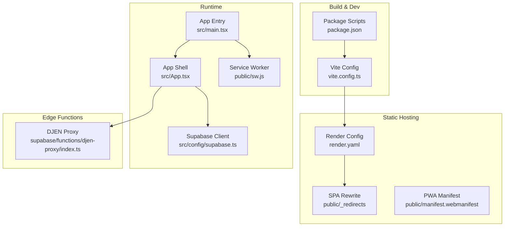
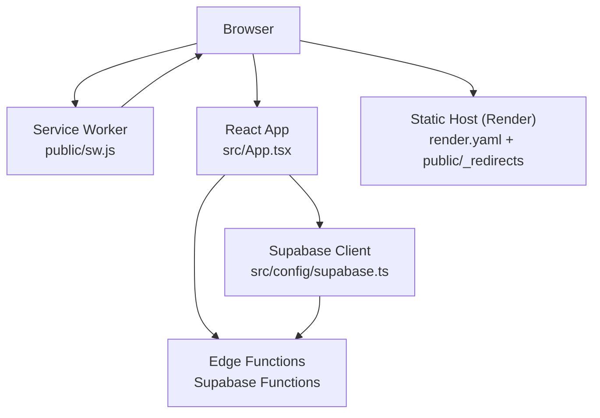
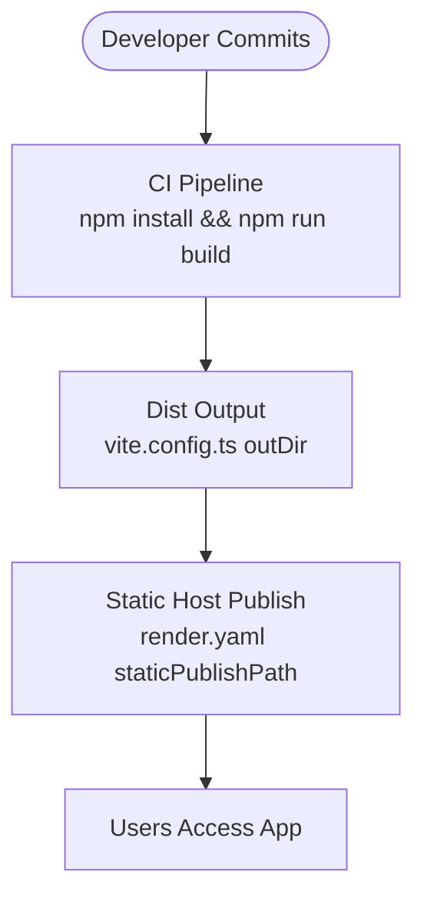
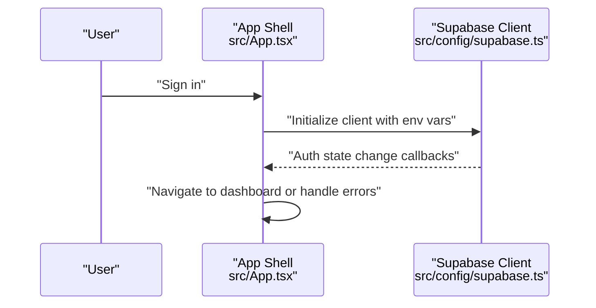
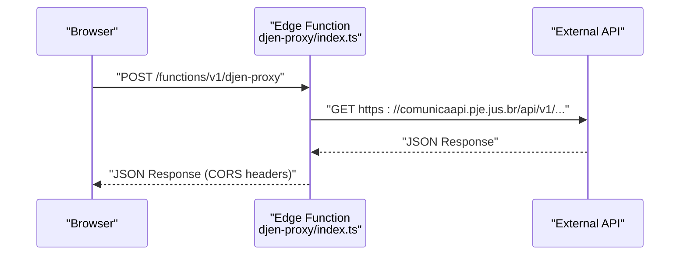
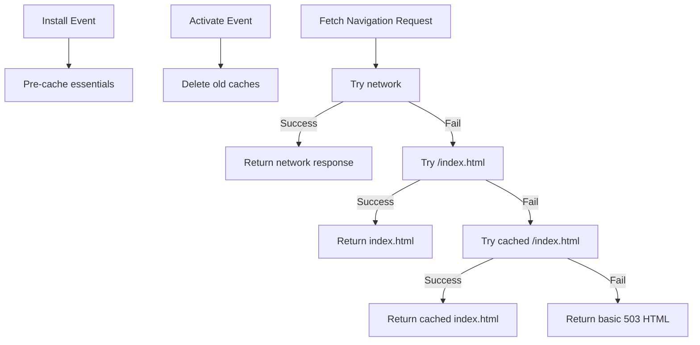
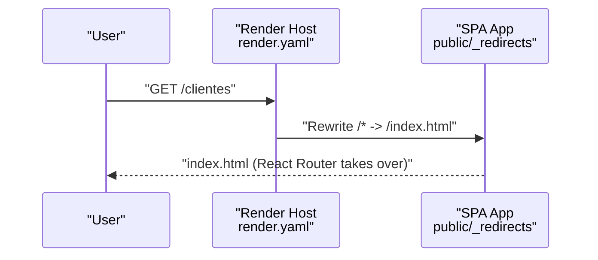
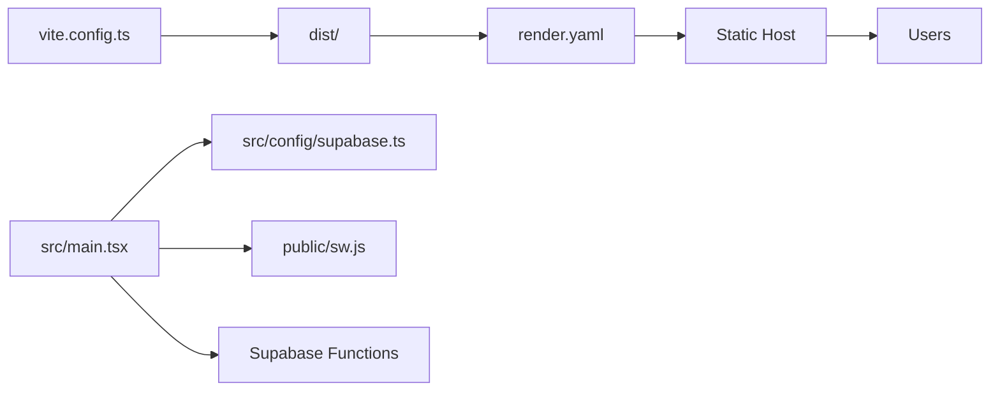

# Deployment & Production

<cite>
**Referenced Files in This Document**
- [DEPLOY_INSTRUCTIONS.md](file://DEPLOY_INSTRUCTIONS.md)
- [package.json](file://package.json)
- [vite.config.ts](file://vite.config.ts)
- [render.yaml](file://render.yaml)
- [src/config/supabase.ts](file://src/config/supabase.ts)
- [src/main.tsx](file://src/main.tsx)
- [src/App.tsx](file://src/App.tsx)
- [public/sw.js](file://public/sw.js)
- [public/clear-sw.js](file://public/clear-sw.js)
- [public/manifest.webmanifest](file://public/manifest.webmanifest)
- [public/_redirects](file://public/_redirects)
- [supabase/functions/djen-proxy/index.ts](file://supabase/functions/djen-proxy/index.ts)
</cite>

## Table of Contents
1. [Introduction](#introduction)
2. [Project Structure](#project-structure)
3. [Core Components](#core-components)
4. [Architecture Overview](#architecture-overview)
5. [Detailed Component Analysis](#detailed-component-analysis)
6. [Dependency Analysis](#dependency-analysis)
7. [Performance Considerations](#performance-considerations)
8. [Troubleshooting Guide](#troubleshooting-guide)
9. [Conclusion](#conclusion)
10. [Appendices](#appendices)

## Introduction
This document provides comprehensive deployment and production guidance for the CRM Jurídico system. It covers the build process, environment configuration, and deployment strategies for both development and production environments. It also explains the Supabase edge function deployment pipeline, database migration management, service worker configuration, caching strategies, offline functionality, production optimization techniques, performance monitoring, security hardening, deployment automation, rollback procedures, disaster recovery planning, scaling considerations, load balancing, CDN integration, and troubleshooting.

## Project Structure
The CRM Jurídico is a single-page application (SPA) built with React and Vite. It uses Supabase for authentication and real-time features, and Render for hosting static assets with SPA routing support. Edge functions under the Supabase Functions directory enable serverless logic such as proxying external APIs.

**Diagram sources**
- [vite.config.ts:1-31](file://vite.config.ts#L1-L31)
- [package.json:1-79](file://package.json#L1-L79)
- [render.yaml:1-18](file://render.yaml#L1-L18)
- [public/_redirects:1-2](file://public/_redirects#L1-L2)
- [public/manifest.webmanifest:1-27](file://public/manifest.webmanifest#L1-L27)
- [src/main.tsx:1-90](file://src/main.tsx#L1-L90)
- [src/App.tsx:1-800](file://src/App.tsx#L1-L800)
- [public/sw.js:1-157](file://public/sw.js#L1-L157)
- [src/config/supabase.ts:1-34](file://src/config/supabase.ts#L1-L34)
- [supabase/functions/djen-proxy/index.ts:1-82](file://supabase/functions/djen-proxy/index.ts#L1-L82)

**Section sources**
- [vite.config.ts:1-31](file://vite.config.ts#L1-L31)
- [package.json:1-79](file://package.json#L1-L79)
- [render.yaml:1-18](file://render.yaml#L1-L18)
- [public/_redirects:1-2](file://public/_redirects#L1-L2)
- [public/manifest.webmanifest:1-27](file://public/manifest.webmanifest#L1-L27)
- [src/main.tsx:1-90](file://src/main.tsx#L1-L90)
- [src/App.tsx:1-800](file://src/App.tsx#L1-L800)
- [public/sw.js:1-157](file://public/sw.js#L1-L157)
- [src/config/supabase.ts:1-34](file://src/config/supabase.ts#L1-L34)
- [supabase/functions/djen-proxy/index.ts:1-82](file://supabase/functions/djen-proxy/index.ts#L1-L82)

## Core Components
- Build and bundling: Vite with a single HTML entry and React plugin.
- Static hosting: Render configured for static publishing with SPA rewrite and cache headers.
- Authentication and real-time: Supabase client configured with auto-refresh and persistence.
- Edge functions: Supabase edge functions for proxying external APIs and other serverless tasks.
- Service worker and offline: PWA-manifest-driven service worker with navigation fallback and push notifications.
- Environment variables: Supabase credentials and optional Syncfusion license key loaded from environment.

**Section sources**
- [vite.config.ts:9-30](file://vite.config.ts#L9-L30)
- [render.yaml:1-18](file://render.yaml#L1-L18)
- [src/config/supabase.ts:6-20](file://src/config/supabase.ts#L6-L20)
- [public/manifest.webmanifest:1-27](file://public/manifest.webmanifest#L1-L27)
- [public/sw.js:1-157](file://public/sw.js#L1-L157)
- [package.json:5-11](file://package.json#L5-L11)

## Architecture Overview
The system follows a modern SPA architecture with a static front end and a Supabase backend. Edge functions provide controlled serverless logic, while the service worker enables offline-first behavior and push notifications.

**Diagram sources**
- [render.yaml:1-18](file://render.yaml#L1-L18)
- [public/_redirects:1-2](file://public/_redirects#L1-L2)
- [public/sw.js:1-157](file://public/sw.js#L1-L157)
- [src/App.tsx:1-800](file://src/App.tsx#L1-L800)
- [src/config/supabase.ts:1-34](file://src/config/supabase.ts#L1-L34)
- [supabase/functions/djen-proxy/index.ts:1-82](file://supabase/functions/djen-proxy/index.ts#L1-L82)

## Detailed Component Analysis

### Build Process and Environment Configuration
- Single HTML entry point ensures SPA routing works correctly on static hosts.
- Environment variables for Supabase and optional Syncfusion license are loaded at runtime.
- Build script compiles TypeScript and bundles the app for production.

**Diagram sources**
- [vite.config.ts:19-24](file://vite.config.ts#L19-L24)
- [render.yaml:5-6](file://render.yaml#L5-L6)
- [package.json:8](file://package.json#L8)

**Section sources**
- [vite.config.ts:9-30](file://vite.config.ts#L9-L30)
- [package.json:5-11](file://package.json#L5-L11)
- [src/main.tsx:12-16](file://src/main.tsx#L12-L16)

### Supabase Authentication and Real-Time
- Supabase client is initialized with environment variables for URL and anonymous key.
- Auto-refresh token, persistence, and session detection are enabled.
- Auth state change listener triggers cleanup and navigation logic.

**Diagram sources**
- [src/config/supabase.ts:6-20](file://src/config/supabase.ts#L6-L20)
- [src/App.tsx:638-670](file://src/App.tsx#L638-L670)

**Section sources**
- [src/config/supabase.ts:1-34](file://src/config/supabase.ts#L1-L34)
- [src/App.tsx:638-710](file://src/App.tsx#L638-L710)

### Supabase Edge Functions Deployment
- Edge functions are placed under the Supabase Functions directory.
- Example: DJEN proxy function handles CORS and forwards requests to an external API.
- Deployment is managed by the Supabase CLI or platform provider.

**Diagram sources**
- [supabase/functions/djen-proxy/index.ts:1-82](file://supabase/functions/djen-proxy/index.ts#L1-L82)

**Section sources**
- [supabase/functions/djen-proxy/index.ts:1-82](file://supabase/functions/djen-proxy/index.ts#L1-L82)

### Database Migration Management
- Migrations are stored under the Supabase migrations directory.
- Apply migrations using the Supabase CLI against the target project.
- Keep migration order and naming consistent to avoid conflicts.

[No sources needed since this section provides general guidance]

### Service Worker, Caching, and Offline Functionality
- Service worker registers and manages a named cache, pre-caching essential resources.
- Navigation requests fall back to index.html for SPA routing.
- Provides push notification support and cache cleanup utilities.
- Manifest defines PWA metadata and icons.

**Diagram sources**
- [public/sw.js:1-157](file://public/sw.js#L1-L157)

**Section sources**
- [public/sw.js:1-157](file://public/sw.js#L1-L157)
- [public/clear-sw.js:1-38](file://public/clear-sw.js#L1-L38)
- [public/manifest.webmanifest:1-27](file://public/manifest.webmanifest#L1-L27)

### SPA Routing and Static Hosting
- Render serves static files and rewrites all routes to index.html for client-side routing.
- Cache headers differentiate HTML freshness versus long-lived asset caching.
- A dedicated _redirects file ensures compatibility with static hosts.

**Diagram sources**
- [render.yaml:14-17](file://render.yaml#L14-L17)
- [public/_redirects:1-2](file://public/_redirects#L1-L2)

**Section sources**
- [render.yaml:1-18](file://render.yaml#L1-L18)
- [public/_redirects:1-2](file://public/_redirects#L1-L2)
- [DEPLOY_INSTRUCTIONS.md:20-24](file://DEPLOY_INSTRUCTIONS.md#L20-L24)

### Production Optimization Techniques
- Long-term caching for static assets and HTML freshness via cache headers.
- Single HTML entry point and SPA rewrite for efficient routing.
- Lazy loading of route components to reduce initial bundle size.
- Prefetching of frequently accessed modules after login.

**Section sources**
- [render.yaml:7-13](file://render.yaml#L7-L13)
- [src/App.tsx:258-292](file://src/App.tsx#L258-L292)

### Security Hardening Measures
- Environment variables for Supabase credentials enforced at runtime.
- Syncfusion license key loaded from environment.
- Edge functions handle CORS and forward only necessary data.
- Service worker does not intercept API traffic by design.

**Section sources**
- [src/config/supabase.ts:6-11](file://src/config/supabase.ts#L6-L11)
- [src/main.tsx:12-16](file://src/main.tsx#L12-L16)
- [supabase/functions/djen-proxy/index.ts:9-18](file://supabase/functions/djen-proxy/index.ts#L9-L18)
- [public/sw.js:48-55](file://public/sw.js#L48-L55)

### Deployment Automation and Rollback Procedures
- Automated builds on Render triggered by Git pushes.
- Manual deploy option available for immediate releases.
- Rollback: redeploy previous successful commit or tag.
- Clear build cache option to force clean builds.

**Section sources**
- [DEPLOY_INSTRUCTIONS.md:35-41](file://DEPLOY_INSTRUCTIONS.md#L35-L41)
- [DEPLOY_INSTRUCTIONS.md:98-100](file://DEPLOY_INSTRUCTIONS.md#L98-L100)

### Disaster Recovery Planning
- Maintain separate environments (staging/production) with distinct Supabase projects.
- Back up critical configurations and environment variables externally.
- Use edge functions for critical integrations to minimize single points of failure.
- Monitor cold start behavior and plan accordingly for free-tier hosting.

[No sources needed since this section provides general guidance]

### Scaling Considerations, Load Balancing, and CDN Integration
- Static assets served via Render’s global infrastructure with caching headers.
- Consider integrating a CDN for further edge caching and reduced latency.
- Horizontal scaling is implicit with static hosting; backend scaling depends on Supabase capacity and edge function limits.

[No sources needed since this section provides general guidance]

## Dependency Analysis
The application has clear separation of concerns:
- Build-time: Vite and plugins.
- Runtime: React app, Supabase client, service worker.
- Hosting: Render with SPA rewrite and cache headers.
- Backend: Supabase (auth, realtime, edge functions).

**Diagram sources**
- [vite.config.ts:19-24](file://vite.config.ts#L19-L24)
- [render.yaml:1-18](file://render.yaml#L1-L18)
- [src/main.tsx:1-90](file://src/main.tsx#L1-L90)
- [src/config/supabase.ts:1-34](file://src/config/supabase.ts#L1-L34)
- [public/sw.js:1-157](file://public/sw.js#L1-L157)

**Section sources**
- [vite.config.ts:1-31](file://vite.config.ts#L1-L31)
- [render.yaml:1-18](file://render.yaml#L1-L18)
- [src/main.tsx:1-90](file://src/main.tsx#L1-L90)
- [src/config/supabase.ts:1-34](file://src/config/supabase.ts#L1-L34)
- [public/sw.js:1-157](file://public/sw.js#L1-L157)

## Performance Considerations
- Use long-term caching for immutable assets and fresh HTML.
- Lazy-load route components and prefetch likely next navigations.
- Minimize third-party dependencies and monitor bundle size.
- Optimize images and fonts; leverage browser caching.

[No sources needed since this section provides general guidance]

## Troubleshooting Guide
Common issues and resolutions:
- 404 on direct route access: ensure SPA rewrite is configured and cache headers are applied.
- Service worker not updating: unregister old service workers and clear caches.
- Build artifacts missing: verify build command and static publish path.
- Cold start delays: expect slower first load after inactivity on free tiers.

**Section sources**
- [DEPLOY_INSTRUCTIONS.md:80-111](file://DEPLOY_INSTRUCTIONS.md#L80-L111)
- [render.yaml:14-17](file://render.yaml#L14-L17)
- [public/sw.js:28-46](file://public/sw.js#L28-L46)

## Conclusion
The CRM Jurídico system is designed for reliable, scalable deployment using modern SPA and edge computing practices. By following the outlined build, hosting, edge function, caching, and operational procedures, teams can maintain a secure, performant, and resilient production environment.

## Appendices
- Environment variable requirements:
  - Supabase URL and anonymous key for client initialization.
  - Optional Syncfusion license key for document editor features.

**Section sources**
- [src/config/supabase.ts:6-11](file://src/config/supabase.ts#L6-L11)
- [src/main.tsx:12-16](file://src/main.tsx#L12-L16)