# Development Tools

<cite>
**Referenced Files in This Document**
- [package.json](file://package.json)
- [vite.config.ts](file://vite.config.ts)
- [tsconfig.json](file://tsconfig.json)
- [tailwind.config.js](file://tailwind.config.js)
- [postcss.config.js](file://postcss.config.js)
- [src/main.tsx](file://src/main.tsx)
- [index.html](file://index.html)
- [src/vite-env.d.ts](file://src/vite-env.d.ts)
- [DEPLOY_INSTRUCTIONS.md](file://DEPLOY_INSTRUCTIONS.md)
- [.githooks/pre-commit](file://.githooks/pre-commit)
- [scripts/setup-githooks.cjs](file://scripts/setup-githooks.cjs)
- [scripts/verify-version-changelog.cjs](file://scripts/verify-version-changelog.cjs)
- [src/App.tsx](file://src/App.tsx)
- [src/components/Login.tsx](file://src/components/Login.tsx)
- [src/contexts/AuthContext.tsx](file://src/contexts/AuthContext.tsx)
- [docs/ARCHITECTURE.md](file://docs/ARCHITECTURE.md)
- [docs/PETITION_EDITOR_MODULE.md](file://docs/PETITION_EDITOR_MODULE.md)
- [src/components/DocsChangesPage.tsx](file://src/components/DocsChangesPage.tsx)
- [src/components/DocsPage.tsx](file://src/components/DocsPage.tsx)
</cite>

## Update Summary
**Changes Made**
- Enhanced documentation structure in DocsChangesPage component with consistent naming conventions (moduleId instead of module)
- Added mandatory title fields for release entries, improving documentation quality and consistency
- Updated Git Hooks section to document new exemption logic for documentation files
- Updated pre-commit hook system documentation with intelligence for version bump enforcement
- Added details about exemption criteria for .qoder/, docs/, and .md files
- Improved troubleshooting guidance for documentation-only commits

## Table of Contents
1. [Introduction](#introduction)
2. [Project Structure](#project-structure)
3. [Core Components](#core-components)
4. [Architecture Overview](#architecture-overview)
5. [Detailed Component Analysis](#detailed-component-analysis)
6. [Dependency Analysis](#dependency-analysis)
7. [Performance Considerations](#performance-considerations)
8. [Troubleshooting Guide](#troubleshooting-guide)
9. [Conclusion](#conclusion)
10. [Appendices](#appendices)

## Introduction
This document describes the development tools and build system for the CRM Jurídico project. It covers build configuration, development server setup, optimization strategies, Vite configuration, TypeScript compilation, TailwindCSS integration, development scripts, debugging and profiling techniques, code quality tools, and deployment preparation. It also explains hot reload, source maps, and troubleshooting steps for the development environment.

## Project Structure
The project uses Vite as the build tool and dev server, TypeScript for type-safe compilation, and TailwindCSS for styling. Key configuration files define how the app is built, served, and optimized.

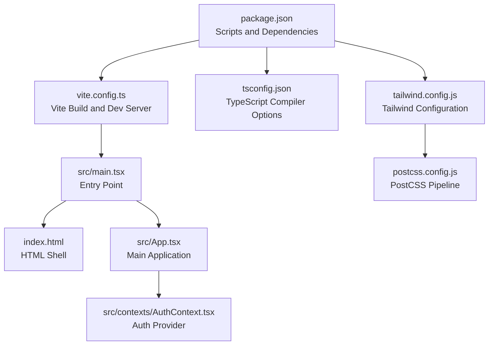

**Diagram sources**
- [package.json](file://package.json)
- [vite.config.ts](file://vite.config.ts)
- [tsconfig.json](file://tsconfig.json)
- [tailwind.config.js](file://tailwind.config.js)
- [postcss.config.js](file://postcss.config.js)
- [src/main.tsx](file://src/main.tsx)
- [index.html](file://index.html)
- [src/App.tsx](file://src/App.tsx)
- [src/contexts/AuthContext.tsx](file://src/contexts/AuthContext.tsx)

**Section sources**
- [package.json](file://package.json)
- [vite.config.ts](file://vite.config.ts)
- [tsconfig.json](file://tsconfig.json)
- [tailwind.config.js](file://tailwind.config.js)
- [postcss.config.js](file://postcss.config.js)
- [src/main.tsx](file://src/main.tsx)
- [index.html](file://index.html)

## Core Components
- Build and Dev Server: Vite handles development server, hot module replacement, and production builds.
- Type System: TypeScript compiles TS/TSX with strictness and emits declarations and source maps.
- Styling: TailwindCSS with PostCSS auto-prefixing and dark mode support.
- Scripts: npm scripts orchestrate dev, build, preview, and API tests.
- Git Hooks: Pre-commit hook enforces version and changelog checks with intelligent exemption logic for documentation files.
- Documentation System: Enhanced DocsChangesPage component with consistent naming conventions and mandatory title fields for improved documentation quality.

**Section sources**
- [package.json](file://package.json)
- [vite.config.ts](file://vite.config.ts)
- [tsconfig.json](file://tsconfig.json)
- [tailwind.config.js](file://tailwind.config.js)
- [postcss.config.js](file://postcss.config.js)
- [.githooks/pre-commit](file://.githooks/pre-commit)
- [src/components/DocsChangesPage.tsx](file://src/components/DocsChangesPage.tsx)

## Architecture Overview
The runtime architecture integrates the Vite dev server, TypeScript compilation, TailwindCSS pipeline, and the React application. The main entry initializes providers and registers a service worker for offline support and SPA fallback.

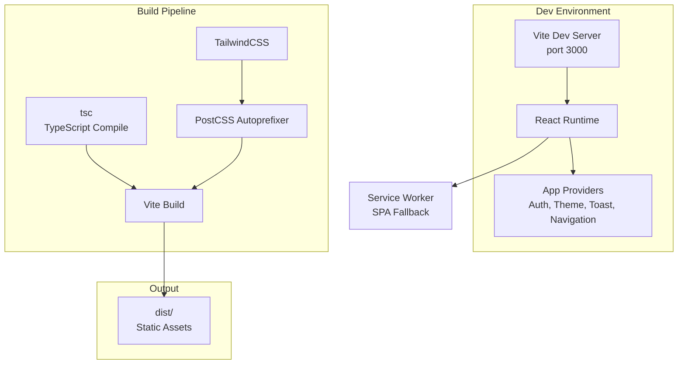

**Diagram sources**
- [vite.config.ts](file://vite.config.ts)
- [tsconfig.json](file://tsconfig.json)
- [tailwind.config.js](file://tailwind.config.js)
- [postcss.config.js](file://postcss.config.js)
- [src/main.tsx](file://src/main.tsx)

## Detailed Component Analysis

### Vite Configuration
- Plugins: React plugin enabled.
- Globals: Exposes __APP_VERSION__ from environment.
- Aliases: @ resolves to src/.
- Build: Single-page app entry via index.html, output to dist/.
- Dev Server: Port 3000, auto-open browser.
- Public Assets: publicDir configured.

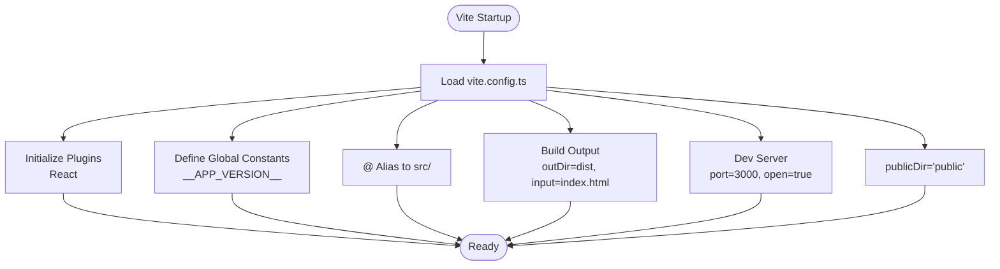

**Diagram sources**
- [vite.config.ts](file://vite.config.ts)

**Section sources**
- [vite.config.ts](file://vite.config.ts)
- [src/vite-env.d.ts](file://src/vite-env.d.ts)

### TypeScript Compilation
- Strict Mode: Enabled with noUnusedLocals/Parameters disabled.
- Module Resolution: Node with esnext modules.
- JSX: React JSX transform.
- Source Maps: Enabled for debugging.
- Declarations: Emitted with declaration maps.
- Paths: @/* mapped to ./src/*.
- OutDir/RootDir: dist/src for emitted files.

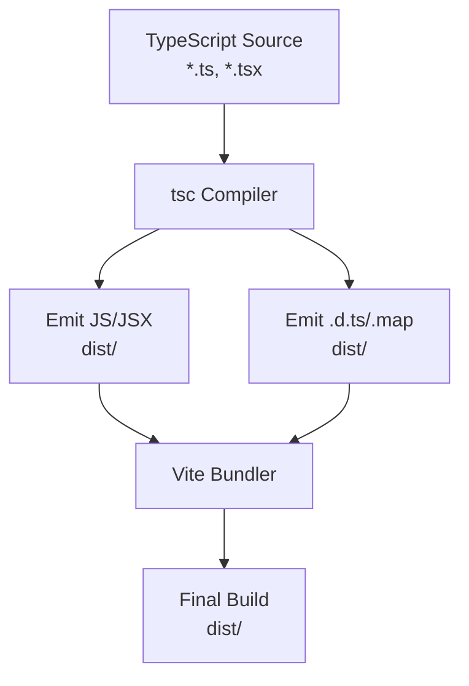

**Diagram sources**
- [tsconfig.json](file://tsconfig.json)
- [vite.config.ts](file://vite.config.ts)

**Section sources**
- [tsconfig.json](file://tsconfig.json)

### TailwindCSS Integration
- Content: Scans index.html and src/**/*.{js,ts,jsx,tsx}.
- Dark Mode: Class-based.
- Theme Extensions: Adds a primary palette.
- PostCSS: Uses @tailwindcss/postcss and autoprefixer.

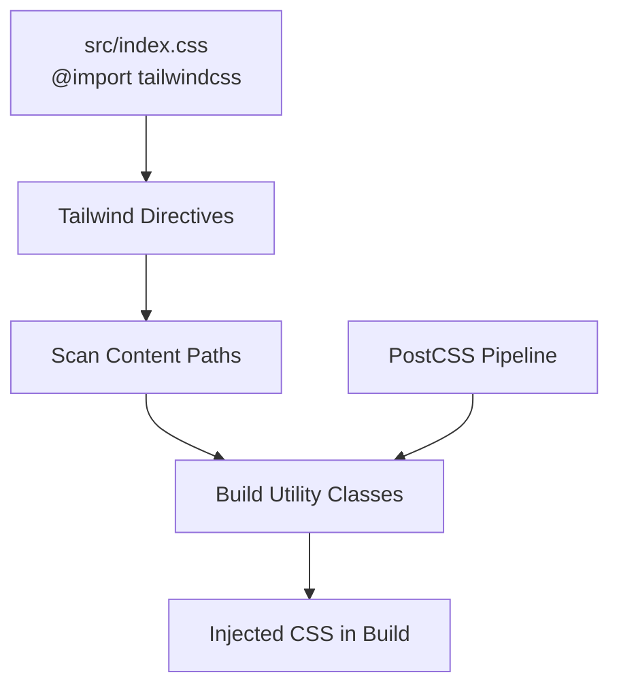

**Diagram sources**
- [tailwind.config.js](file://tailwind.config.js)
- [postcss.config.js](file://postcss.config.js)
- [src/index.css](file://src/index.css)

**Section sources**
- [tailwind.config.js](file://tailwind.config.js)
- [postcss.config.js](file://postcss.config.js)
- [src/index.css](file://src/index.css)

### Development Scripts
- start/dev: Run Vite dev server.
- build: Run tsc then vite build.
- preview: Preview the production build locally.
- test-api: Compile TS then run example script.
- prepare: Install githooks.

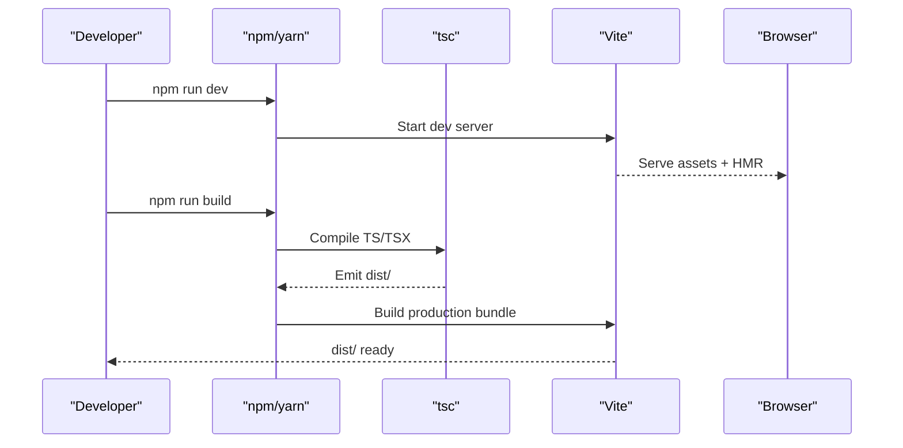

**Diagram sources**
- [package.json](file://package.json)
- [vite.config.ts](file://vite.config.ts)
- [tsconfig.json](file://tsconfig.json)

**Section sources**
- [package.json](file://package.json)

### Entry Point and Service Worker
- Entry: src/main.tsx registers Syncfusion license, sets up providers, and mounts the app.
- Service Worker: Registers a service worker in production to enable offline and SPA fallback behavior.

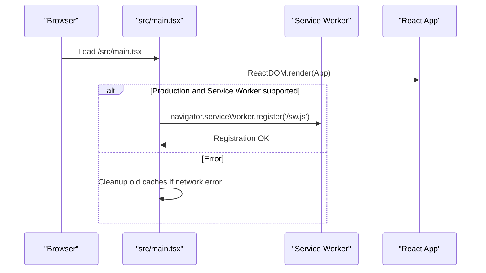

**Diagram sources**
- [src/main.tsx](file://src/main.tsx)
- [index.html](file://index.html)

**Section sources**
- [src/main.tsx](file://src/main.tsx)
- [index.html](file://index.html)

### Authentication and Session Management
- Auth provider listens to Supabase auth state changes, persists session start, and manages inactivity-based logout and session refresh.
- Provides sign-in, sign-out, and password reset flows.

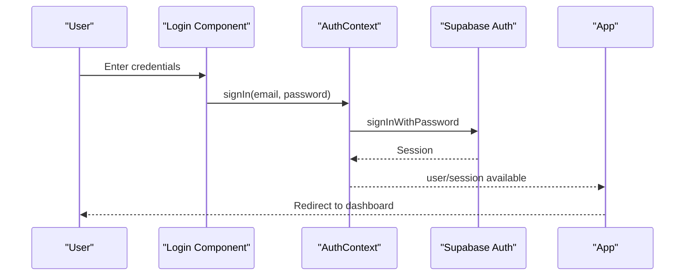

**Diagram sources**
- [src/components/Login.tsx](file://src/components/Login.tsx)
- [src/contexts/AuthContext.tsx](file://src/contexts/AuthContext.tsx)
- [src/App.tsx](file://src/App.tsx)

**Section sources**
- [src/contexts/AuthContext.tsx](file://src/contexts/AuthContext.tsx)
- [src/components/Login.tsx](file://src/components/Login.tsx)
- [src/App.tsx](file://src/App.tsx)

### Documentation System Enhancement
**Updated** The DocsChangesPage component has been enhanced with improved documentation structure featuring consistent naming conventions and mandatory title fields for release entries.

#### Enhanced Documentation Structure
- **Consistent Naming**: Changed from `module` to `moduleId` for all module references, ensuring consistency across the codebase
- **Mandatory Title Fields**: All release entries now require a `title` field, improving documentation quality and consistency
- **Improved Organization**: Better separation of modules with icons, colors, and structured change types
- **Enhanced Developer Experience**: Inline documentation for developers with detailed descriptions and examples

#### Key Improvements
- **Type Safety**: Strongly typed `ModuleChanges` interface with `moduleId` property
- **Consistent API**: All changelog entries now follow the same structure with mandatory fields
- **Better Navigation**: Enhanced filtering and search capabilities for changelog entries
- **Professional Presentation**: Improved visual design with module-specific colors and icons

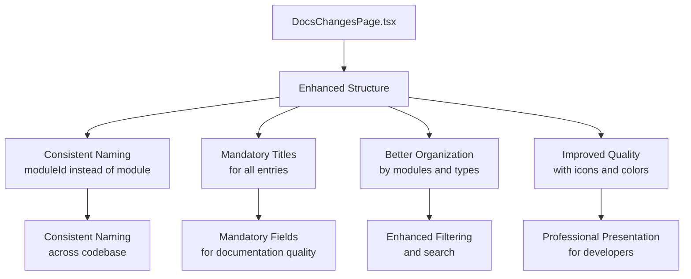

**Diagram sources**
- [src/components/DocsChangesPage.tsx](file://src/components/DocsChangesPage.tsx)

**Section sources**
- [src/components/DocsChangesPage.tsx](file://src/components/DocsChangesPage.tsx)

### Git Hooks and Maintenance
- Pre-commit hook runs a sophisticated version/changelog verification script with intelligent exemption logic.
- The system now exempts documentation-only commits from version bump requirements.
- prepare script configures core.hooksPath to .githooks.

**Updated** Enhanced pre-commit hook system with exemption logic for documentation files (.qoder/, docs/, .md) and intelligence to allow documentation commits to proceed without version increments.

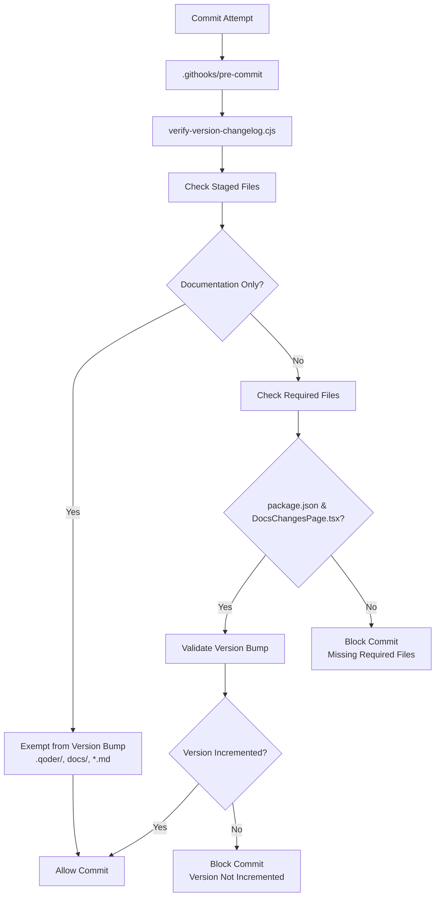

**Diagram sources**
- [.githooks/pre-commit](file://.githooks/pre-commit)
- [scripts/setup-githooks.cjs](file://scripts/setup-githooks.cjs)
- [scripts/verify-version-changelog.cjs](file://scripts/verify-version-changelog.cjs)

**Section sources**
- [.githooks/pre-commit](file://.githooks/pre-commit)
- [scripts/setup-githooks.cjs](file://scripts/setup-githooks.cjs)
- [scripts/verify-version-changelog.cjs](file://scripts/verify-version-changelog.cjs)

## Dependency Analysis
- Vite plugin-react enables JSX transform and HMR.
- TailwindCSS and autoprefixer integrated via PostCSS.
- TypeScript compiler options align with Vite's module resolution and emit targets.
- Syncfusion license registration is environment-driven.
- DocsChangesPage component depends on enhanced changelog structure with consistent naming conventions.

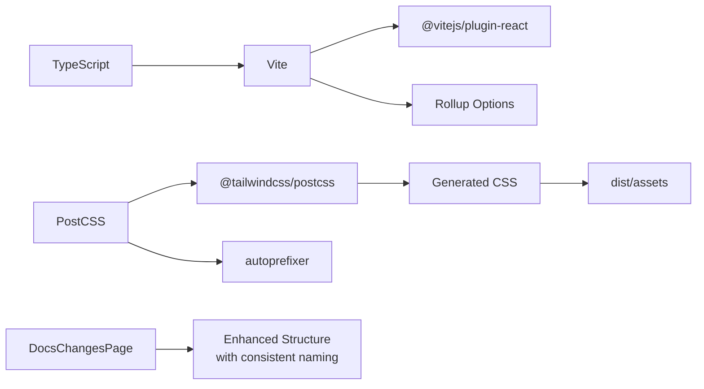

**Diagram sources**
- [vite.config.ts](file://vite.config.ts)
- [postcss.config.js](file://postcss.config.js)
- [tailwind.config.js](file://tailwind.config.js)
- [tsconfig.json](file://tsconfig.json)
- [src/components/DocsChangesPage.tsx](file://src/components/DocsChangesPage.tsx)

**Section sources**
- [vite.config.ts](file://vite.config.ts)
- [postcss.config.js](file://postcss.config.js)
- [tailwind.config.js](file://tailwind.config.js)
- [tsconfig.json](file://tsconfig.json)
- [src/components/DocsChangesPage.tsx](file://src/components/DocsChangesPage.tsx)

## Performance Considerations
- Single entry point: Simplifies SPA routing and reduces complexity.
- Lazy-loaded modules: App.tsx uses React.lazy for major modules to reduce initial bundle size.
- Prefetching: App performs lightweight prefetching of lazy modules during idle periods.
- Service Worker: Improves offline experience and ensures SPA fallback.
- Tailwind purging: Configure content globs to avoid shipping unused CSS.
- Documentation caching: Enhanced DocsChangesPage component with optimized rendering for large changelog datasets.

## Troubleshooting Guide
- 404 on direct route after sleep/deploy: Ensure SPA fallback and cache headers are configured. Clear browser cache and unregister old service workers.
- Service Worker not updating: Manually unregister and reload; force re-deploy with cache clearing.
- Network errors during SW registration: The app attempts to clean conflicting caches and logs remediation steps.
- Build artifacts missing: Confirm dist/_redirects exists and public assets are copied.
- Pre-commit hook blocking documentation-only commits: The system now exempts .qoder/, docs/, and .md files from version bump requirements automatically.
- **Updated** DocsChangesPage component issues: Ensure all changelog entries have mandatory title fields and use consistent moduleId naming conventions.

**Updated** Documentation-only commits (files in .qoder/, docs/, or with .md extension) are now automatically exempted from version bump enforcement, allowing developers to update documentation without incrementing the application version.

**Updated** Enhanced documentation structure requires all changelog entries to have mandatory title fields and consistent moduleId naming conventions for improved documentation quality and consistency.

**Section sources**
- [DEPLOY_INSTRUCTIONS.md](file://DEPLOY_INSTRUCTIONS.md)
- [src/main.tsx](file://src/main.tsx)
- [scripts/verify-version-changelog.cjs](file://scripts/verify-version-changelog.cjs)
- [src/components/DocsChangesPage.tsx](file://src/components/DocsChangesPage.tsx)

## Conclusion
The CRM Jurídico project leverages Vite for a fast dev experience, TypeScript for safety, and TailwindCSS for efficient styling. The build is streamlined for SPA hosting, with a robust service worker fallback and clear deployment instructions. Git hooks enforce quality gates with intelligent exemption logic for documentation files, and the app's architecture supports scalable development and maintenance. The enhanced DocsChangesPage component provides improved documentation quality with consistent naming conventions and mandatory title fields, ensuring professional and maintainable documentation standards.

## Appendices

### Development Workflow Optimization
- Use dev server with HMR for rapid iteration.
- Keep TypeScript strictness for early bug detection.
- Leverage lazy loading and prefetching for perceived performance.
- Use Tailwind utilities and dark mode variants consistently.
- Take advantage of documentation commit exemptions to streamline documentation updates.
- **Updated** Follow consistent naming conventions (moduleId instead of module) when creating new documentation entries.
- **Updated** Always include mandatory title fields for all changelog entries to maintain documentation quality.

### Extending the Build System
- Add Vite plugins in vite.config.ts.
- Introduce environment variables via .env and expose selectively using define.
- Extend PostCSS with additional plugins in postcss.config.js.
- Add new npm scripts in package.json for specialized tasks.

### Git Hook Enhancement Guidelines
- The pre-commit hook system now intelligently exempts documentation files from version bump requirements.
- Documentation files in .qoder/, docs/, and .md files are automatically recognized as exempt.
- This enhancement allows documentation updates without triggering version increment requirements.
- The exemption logic maintains strict enforcement for non-documentation code changes.
- **Updated** Enhanced documentation system requires consistent naming conventions and mandatory title fields for all new entries.

### Documentation Standards Enhancement
**Updated** The documentation system now enforces quality standards through enhanced structure and naming conventions:

- **Consistent Naming**: Use `moduleId` instead of `module` for all module references
- **Mandatory Titles**: Every changelog entry must include a descriptive title field
- **Structured Format**: Follow the established pattern for module organization and change categorization
- **Professional Quality**: Maintain consistent formatting, icons, and color schemes across all documentation entries

These enhancements improve the overall quality and maintainability of the project's documentation system while ensuring consistency across all components.

**Section sources**
- [vite.config.ts](file://vite.config.ts)
- [postcss.config.js](file://postcss.config.js)
- [package.json](file://package.json)
- [scripts/verify-version-changelog.cjs](file://scripts/verify-version-changelog.cjs)
- [src/components/DocsChangesPage.tsx](file://src/components/DocsChangesPage.tsx)