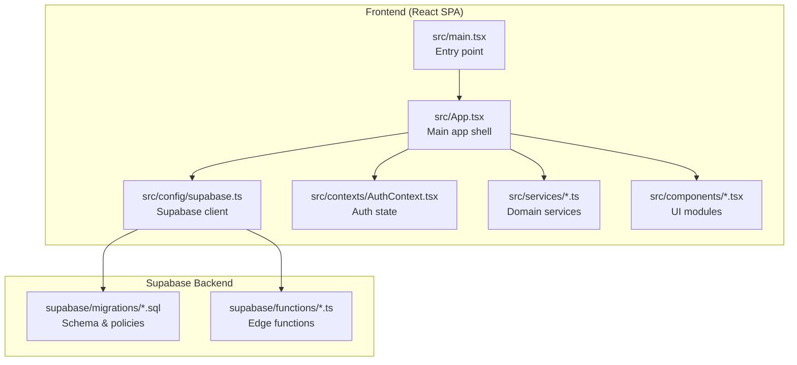
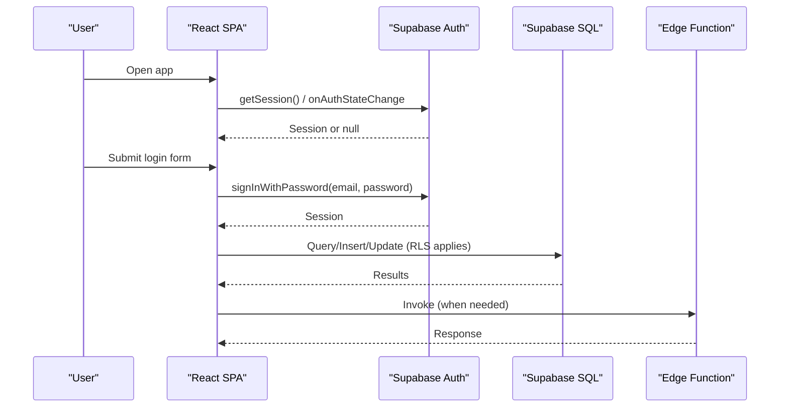
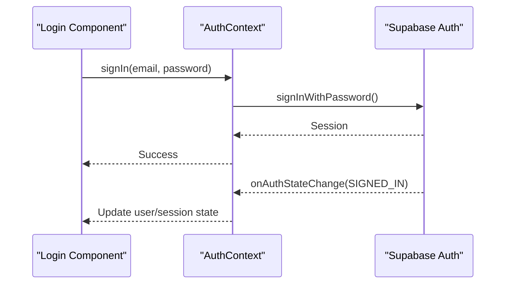
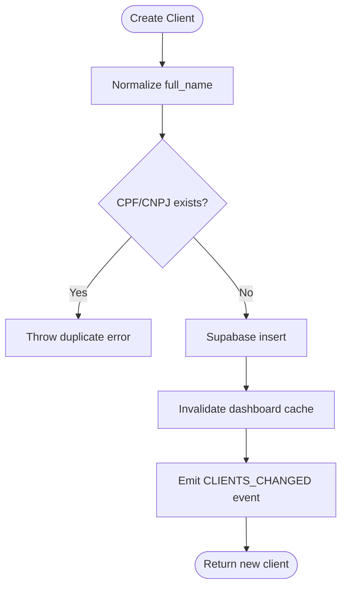
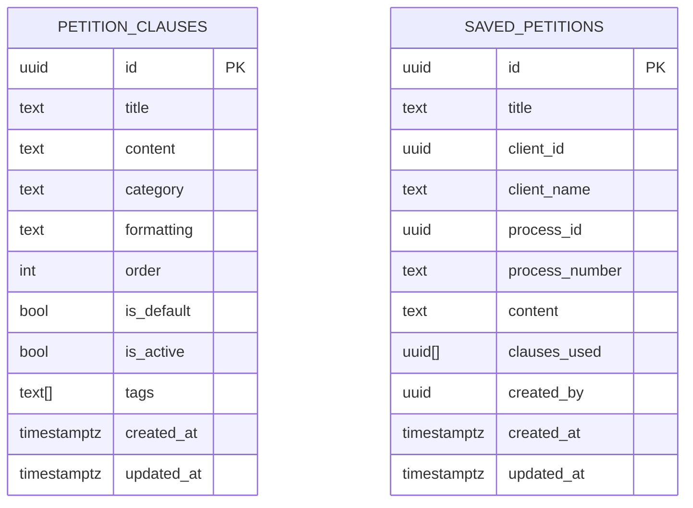
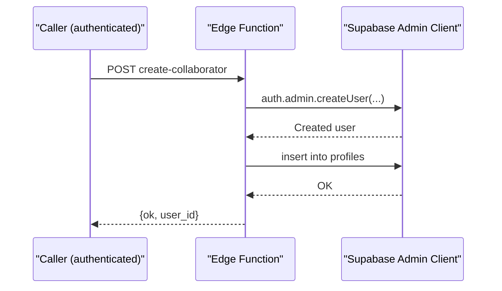
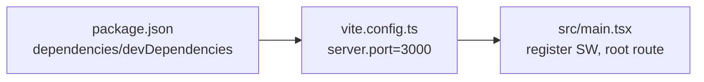

# Getting Started

<cite>
**Referenced Files in This Document**
- [README.md](file://README.md)
- [package.json](file://package.json)
- [vite.config.ts](file://vite.config.ts)
- [src/main.tsx](file://src/main.tsx)
- [src/config/supabase.ts](file://src/config/supabase.ts)
- [src/contexts/AuthContext.tsx](file://src/contexts/AuthContext.tsx)
- [src/components/Login.tsx](file://src/components/Login.tsx)
- [src/services/client.service.ts](file://src/services/client.service.ts)
- [src/types/client.types.ts](file://src/types/client.types.ts)
- [supabase/migrations/20251228_petition_editor.sql](file://supabase/migrations/20251228_petition_editor.sql)
- [supabase/migrations/20251227_djen_sync_history.sql](file://supabase/migrations/20251227_djen_sync_history.sql)
- [supabase/functions/create-collaborator/index.ts](file://supabase/functions/create-collaborator/index.ts)
- [DEPLOY_INSTRUCTIONS.md](file://DEPLOY_INSTRUCTIONS.md)
</cite>

## Table of Contents
1. [Introduction](#introduction)
2. [Project Structure](#project-structure)
3. [Core Components](#core-components)
4. [Architecture Overview](#architecture-overview)
5. [Detailed Component Analysis](#detailed-component-analysis)
6. [Dependency Analysis](#dependency-analysis)
7. [Performance Considerations](#performance-considerations)
8. [Troubleshooting Guide](#troubleshooting-guide)
9. [Conclusion](#conclusion)
10. [Appendices](#appendices)

## Introduction
This guide helps you install, configure, and run the CRM Jurídico system locally, and understand how to set up Supabase for authentication, database, and edge functions. It also covers first-time usage, initial data entry, and troubleshooting common setup issues. The system is a React 19 + TypeScript SPA built with Vite, using Supabase for authentication, real-time, and storage.

## Project Structure
The project is organized around a frontend SPA with a Supabase backend. Key areas:
- Frontend: React components, services, contexts, and configuration under src/
- Supabase: Edge functions under supabase/functions/ and migrations under supabase/migrations/
- Tooling: Vite for dev/build, TailwindCSS for styling, TypeScript for type safety

**Diagram sources**
- [src/main.tsx:1-90](file://src/main.tsx#L1-L90)
- [src/App.tsx:1-120](file://src/App.tsx#L1-L120)
- [src/config/supabase.ts:1-34](file://src/config/supabase.ts#L1-L34)
- [src/contexts/AuthContext.tsx:1-60](file://src/contexts/AuthContext.tsx#L1-L60)
- [supabase/migrations/20251228_petition_editor.sql:1-40](file://supabase/migrations/20251228_petition_editor.sql#L1-L40)
- [supabase/functions/create-collaborator/index.ts:1-40](file://supabase/functions/create-collaborator/index.ts#L1-L40)

**Section sources**
- [README.md:84-109](file://README.md#L84-L109)
- [vite.config.ts:1-31](file://vite.config.ts#L1-L31)
- [src/main.tsx:1-90](file://src/main.tsx#L1-L90)

## Core Components
- Supabase client initialization and auth state management
- Authentication provider and login flow
- Client domain service and types
- SPA routing and service worker integration

Key responsibilities:
- src/config/supabase.ts: Creates the Supabase client using Vite environment variables and sets auth persistence.
- src/contexts/AuthContext.tsx: Provides sign-in/sign-out/reset-password, session heartbeat, and inactivity logout.
- src/services/client.service.ts: Implements client CRUD, search, and merge logic against Supabase.
- src/types/client.types.ts: Defines client entity and DTOs.
- src/main.tsx: Registers Syncfusion license from environment, ensures root route, and registers service worker.

**Section sources**
- [src/config/supabase.ts:1-34](file://src/config/supabase.ts#L1-L34)
- [src/contexts/AuthContext.tsx:1-120](file://src/contexts/AuthContext.tsx#L1-L120)
- [src/services/client.service.ts:1-120](file://src/services/client.service.ts#L1-L120)
- [src/types/client.types.ts:1-88](file://src/types/client.types.ts#L1-L88)
- [src/main.tsx:1-90](file://src/main.tsx#L1-L90)

## Architecture Overview
High-level runtime architecture:
- Browser runs the SPA; it authenticates via Supabase Auth and queries/manipulates data through Supabase SQL and Edge Functions.
- Supabase manages Row Level Security (RLS) policies and storage.
- Edge functions provide serverless logic for privileged operations.

**Diagram sources**
- [src/contexts/AuthContext.tsx:45-120](file://src/contexts/AuthContext.tsx#L45-L120)
- [src/config/supabase.ts:22-34](file://src/config/supabase.ts#L22-L34)
- [src/services/client.service.ts:317-357](file://src/services/client.service.ts#L317-L357)
- [supabase/functions/create-collaborator/index.ts:126-175](file://supabase/functions/create-collaborator/index.ts#L126-L175)

## Detailed Component Analysis

### Supabase Configuration and Environment Setup
- Environment variables:
  - VITE_SUPABASE_URL: Supabase project URL
  - VITE_SUPABASE_ANON_KEY: Supabase anonymous/public key
  - Optional: VITE_SYNCFUSION_LICENSE_KEY for Syncfusion
- The Supabase client is created with auto-refresh and persisted sessions.

Verification steps:
- Confirm environment variables are present in the browser context (Vite injects them at build time).
- Ensure the Supabase client is initialized before any auth/network calls.

**Section sources**
- [src/config/supabase.ts:6-20](file://src/config/supabase.ts#L6-L20)
- [src/main.tsx:12-16](file://src/main.tsx#L12-L16)

### Authentication Flow
- On app load, the auth provider retrieves the current session and subscribes to auth state changes.
- Login component supports email/CPF identification and password sign-in.
- Automatic session renewal and inactivity-based logout are handled.

**Diagram sources**
- [src/components/Login.tsx:623-658](file://src/components/Login.tsx#L623-L658)
- [src/contexts/AuthContext.tsx:224-235](file://src/contexts/AuthContext.tsx#L224-L235)
- [src/contexts/AuthContext.tsx:75-115](file://src/contexts/AuthContext.tsx#L75-L115)

**Section sources**
- [src/contexts/AuthContext.tsx:1-120](file://src/contexts/AuthContext.tsx#L1-L120)
- [src/components/Login.tsx:387-460](file://src/components/Login.tsx#L387-L460)

### Client Management Service
- Provides list/search/create/update/delete/count operations.
- Enforces uniqueness of CPF/CNPJ and soft-invalidates records on delete.
- Uses Supabase RLS and triggers for audit/update timestamps.

**Diagram sources**
- [src/services/client.service.ts:317-357](file://src/services/client.service.ts#L317-L357)

**Section sources**
- [src/services/client.service.ts:1-120](file://src/services/client.service.ts#L1-L120)
- [src/types/client.types.ts:9-52](file://src/types/client.types.ts#L9-L52)

### Supabase Schema and Policies
- Example migration initializes reusable petition blocks and saved petitions with RLS and indexes.
- Another migration adds robust DJEN sync history with RLS and indices.

**Diagram sources**
- [supabase/migrations/20251228_petition_editor.sql:5-42](file://supabase/migrations/20251228_petition_editor.sql#L5-L42)

**Section sources**
- [supabase/migrations/20251228_petition_editor.sql:64-100](file://supabase/migrations/20251228_petition_editor.sql#L64-L100)
- [supabase/migrations/20251227_djen_sync_history.sql:71-98](file://supabase/migrations/20251227_djen_sync_history.sql#L71-L98)

### Edge Functions
- Example collaborator creation function validates role, checks caller permissions, creates user, and inserts profile.

**Diagram sources**
- [supabase/functions/create-collaborator/index.ts:126-175](file://supabase/functions/create-collaborator/index.ts#L126-L175)

**Section sources**
- [supabase/functions/create-collaborator/index.ts:1-184](file://supabase/functions/create-collaborator/index.ts#L1-L184)

## Dependency Analysis
- Frontend dependencies include React, React Router, TailwindCSS, Supabase JS, Syncfusion, and others.
- Vite dev server runs on port 3000 and serves static assets from public/.
- SPA routing is client-side; service worker and redirects support deep links.

**Diagram sources**
- [package.json:28-77](file://package.json#L28-L77)
- [vite.config.ts:25-28](file://vite.config.ts#L25-L28)
- [src/main.tsx:48-89](file://src/main.tsx#L48-L89)

**Section sources**
- [package.json:1-79](file://package.json#L1-L79)
- [vite.config.ts:1-31](file://vite.config.ts#L1-L31)

## Performance Considerations
- Lazy-load heavy modules to reduce initial bundle size.
- Debounce search and avoid excessive network calls.
- Use RLS and indexes to keep database queries efficient.
- Keep service worker updated to improve offline and navigation reliability.

[No sources needed since this section provides general guidance]

## Troubleshooting Guide

### Local Development
- Port conflict: Change port in vite.config.ts if 3000 is in use.
- Environment variables missing: Ensure VITE_SUPABASE_URL and VITE_SUPABASE_ANON_KEY are set in your .env file and rebuilt.
- Service worker issues after deploy: Follow the SPA rewrite and cache cleanup steps in the deployment guide.

**Section sources**
- [vite.config.ts:25-28](file://vite.config.ts#L25-L28)
- [src/config/supabase.ts:9-11](file://src/config/supabase.ts#L9-L11)
- [DEPLOY_INSTRUCTIONS.md:80-111](file://DEPLOY_INSTRUCTIONS.md#L80-L111)

### Authentication Problems
- Invalid credentials: Verify email/password; check rate limiting messages.
- Session expired or cleared: The app enforces inactivity-based logout; refresh or sign in again.
- Password reset: Use the reset flow; ensure redirect is configured.

**Section sources**
- [src/components/Login.tsx:429-453](file://src/components/Login.tsx#L429-L453)
- [src/contexts/AuthContext.tsx:117-189](file://src/contexts/AuthContext.tsx#L117-L189)

### Database Initialization
- Apply migrations via Supabase CLI or dashboard to create tables, indexes, and RLS policies.
- Confirm RLS is enabled and policies match your intended access control.

**Section sources**
- [supabase/migrations/20251228_petition_editor.sql:64-100](file://supabase/migrations/20251228_petition_editor.sql#L64-L100)
- [supabase/migrations/20251227_djen_sync_history.sql:71-98](file://supabase/migrations/20251227_djen_sync_history.sql#L71-L98)

### First-Time User Steps
- Install dependencies and start the dev server.
- Access http://localhost:3000 and log in with your Supabase credentials.
- Navigate to the Clients module and add your first client using the form.
- Explore dashboard widgets and module navigation.

**Section sources**
- [README.md:37-58](file://README.md#L37-L58)
- [README.md:127-148](file://README.md#L127-L148)

## Conclusion
You now have the essentials to install, configure, and run CRM Jurídico locally, connect it to Supabase, and onboard your first client. For production, follow the deployment guide’s SPA rewrite and service worker strategies to ensure deep-link navigation works reliably.

[No sources needed since this section summarizes without analyzing specific files]

## Appendices

### Installation and Setup Checklist
- Install Node.js 18+ and npm.
- Clone the repository and install dependencies.
- Create a Supabase project and configure environment variables.
- Run the dev server and verify the login page.
- Initialize database with migrations and verify RLS policies.

**Section sources**
- [README.md:39-58](file://README.md#L39-L58)
- [README.md:60-83](file://README.md#L60-L83)

### Supabase Credentials and Roles
- Use the Supabase project URL and anonymous key in Vite environment variables.
- Edge functions require the service role key for privileged operations.
- Roles and permissions are enforced via RLS and function-level checks.

**Section sources**
- [src/config/supabase.ts:6-11](file://src/config/supabase.ts#L6-L11)
- [supabase/functions/create-collaborator/index.ts:23-31](file://supabase/functions/create-collaborator/index.ts#L23-L31)
- [supabase/migrations/20251228_petition_editor.sql:64-100](file://supabase/migrations/20251228_petition_editor.sql#L64-L100)