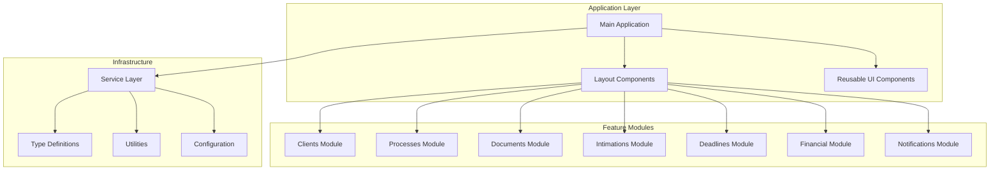
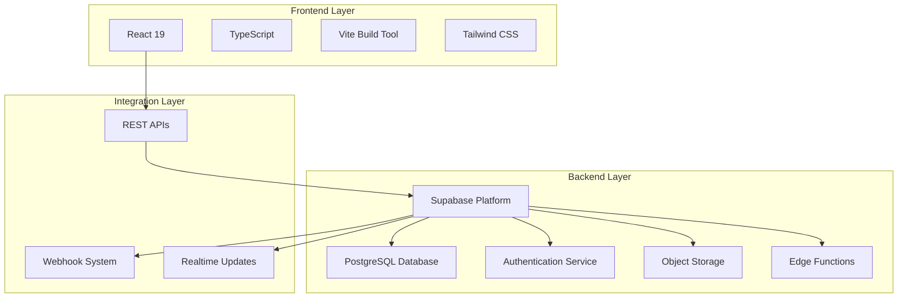
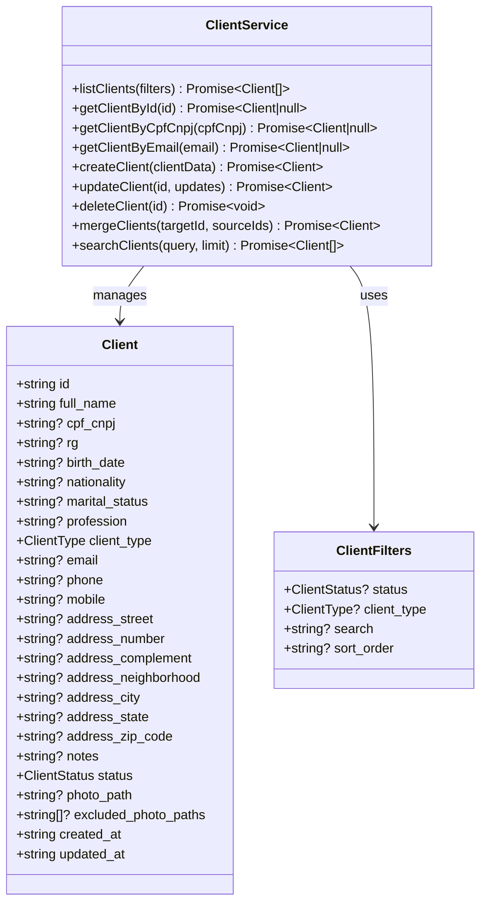
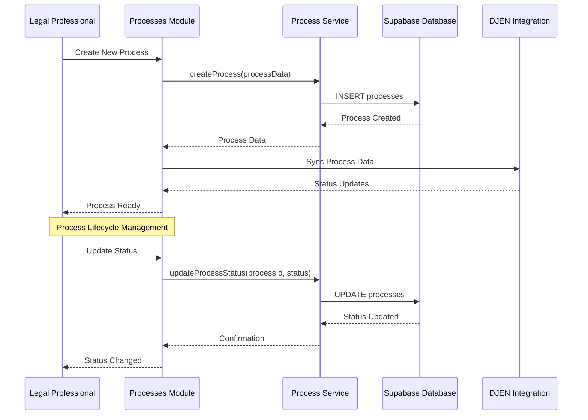
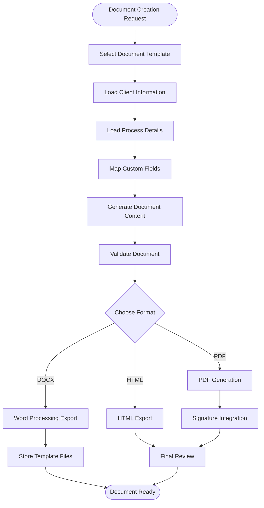
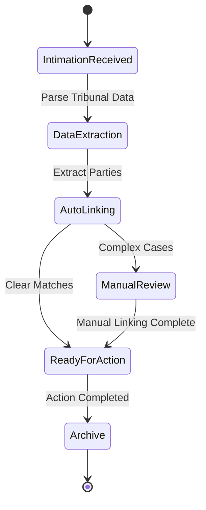
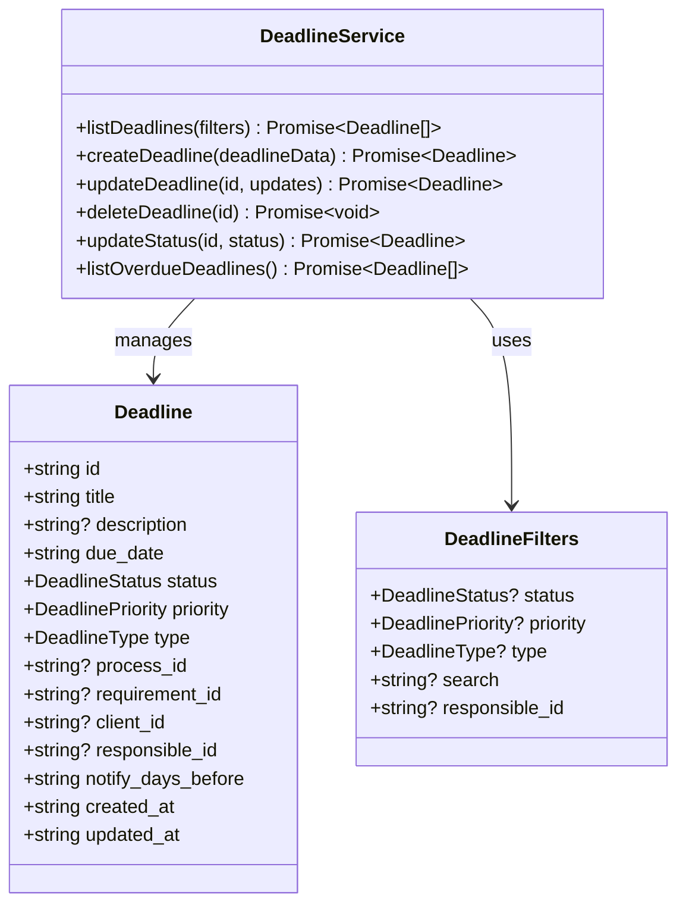
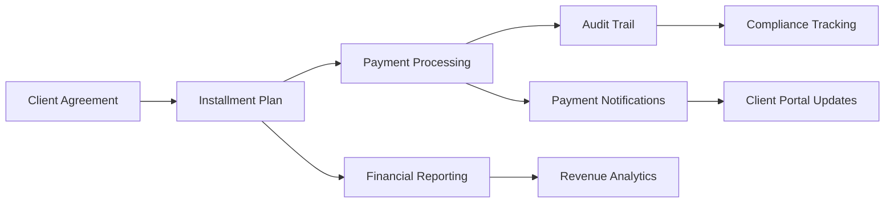
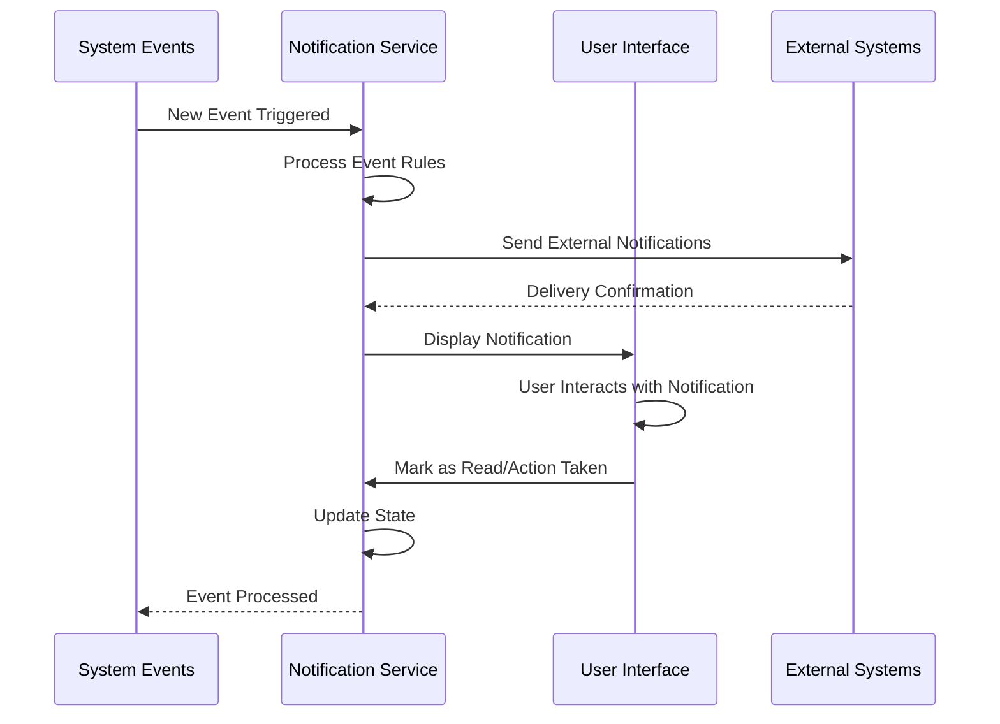

# Project Overview

<cite>
**Referenced Files in This Document**
- [README.md](file://README.md)
- [package.json](file://package.json)
- [docs/ARCHITECTURE.md](file://docs/ARCHITECTURE.md)
- [src/main.tsx](file://src/main.tsx)
- [src/App.tsx](file://src/App.tsx)
- [src/components/ClientsModule.tsx](file://src/components/ClientsModule.tsx)
- [src/components/ProcessesModule.tsx](file://src/components/ProcessesModule.tsx)
- [src/components/DocumentsModule.tsx](file://src/components/DocumentsModule.tsx)
- [src/components/IntimationsModule.tsx](file://src/components/IntimationsModule.tsx)
- [src/components/DeadlinesModule.tsx](file://src/components/DeadlinesModule.tsx)
- [src/components/FinancialModule.tsx](file://src/components/FinancialModule.tsx)
- [src/components/NotificationsModuleNew.tsx](file://src/components/NotificationsModuleNew.tsx)
- [src/services/client.service.ts](file://src/services/client.service.ts)
- [src/types/client.types.ts](file://src/types/client.types.ts)
- [src/types/process.types.ts](file://src/types/process.types.ts)
</cite>

## Table of Contents
1. [Introduction](#introduction)
2. [Project Structure](#project-structure)
3. [Core Components](#core-components)
4. [Architecture Overview](#architecture-overview)
5. [Detailed Component Analysis](#detailed-component-analysis)
6. [Dependency Analysis](#dependency-analysis)
7. [Performance Considerations](#performance-considerations)
8. [Troubleshooting Guide](#troubleshooting-guide)
9. [Conclusion](#conclusion)

## Introduction
CRM Jurídico is a comprehensive legal practice management platform designed specifically for law offices. The system streamlines core legal workflows including client relationship management, case/process tracking, document generation and management, deadline monitoring, and integrated notification systems. Built with modern web technologies, it provides a responsive, secure, and scalable solution for legal professionals to manage their practice efficiently.

The platform serves as a centralized hub where legal teams can coordinate client interactions, track case progress, manage deadlines, handle document workflows, and stay informed through automated notifications. Its modular architecture supports both stakeholder oversight and developer extensibility, making it suitable for practices of various sizes and specializations.

## Project Structure
The CRM Jurídico follows a modular React architecture with clear separation of concerns across components, services, and utilities. The project is organized into distinct functional modules, each representing a core business capability within the legal practice ecosystem.



**Diagram sources**
- [src/main.tsx:32-46](file://src/main.tsx#L32-L46)
- [src/App.tsx:46-76](file://src/App.tsx#L46-L76)

**Section sources**
- [README.md:84-109](file://README.md#L84-L109)
- [docs/ARCHITECTURE.md:3-63](file://docs/ARCHITECTURE.md#L3-L63)

## Core Components
The CRM Jurídico comprises several interconnected modules that collectively address the fundamental needs of legal practice management:

### Client Management System
The Clients Module provides comprehensive client relationship management with advanced search capabilities, quality assessment tools, and automated duplicate detection. It supports both individual and corporate clients with detailed demographic and contact information capture.

### Case/Process Tracking
The Processes Module offers sophisticated case lifecycle management with status tracking, practice area categorization, hearing scheduling, and timeline visualization. It integrates with external legal databases for automated updates and status synchronization.

### Document Management
The Documents Module enables template-based document generation, custom field management, and multi-format export capabilities. It supports both traditional word processing and modern digital document workflows.

### Intimation Processing
The Intimations Module handles automated legal notice processing, tribunal data synchronization, and intelligent linking between notices and relevant cases and clients.

### Deadline Monitoring
The Deadlines Module provides comprehensive deadline tracking with priority categorization, automated notifications, and integration with calendar systems for proactive case management.

### Financial Management
The Financial Module manages client agreements, payment plans, installment tracking, and revenue reporting with audit trails and compliance features.

### Integrated Notifications
The Notifications Module consolidates all system alerts, intimation updates, deadline reminders, and user-generated notifications into a unified interface with filtering and prioritization.

**Section sources**
- [src/components/ClientsModule.tsx:1-120](file://src/components/ClientsModule.tsx#L1-L120)
- [src/components/ProcessesModule.tsx:1-120](file://src/components/ProcessesModule.tsx#L1-L120)
- [src/components/DocumentsModule.tsx:1-120](file://src/components/DocumentsModule.tsx#L1-L120)
- [src/components/IntimationsModule.tsx:1-120](file://src/components/IntimationsModule.tsx#L1-L120)
- [src/components/DeadlinesModule.tsx:1-120](file://src/components/DeadlinesModule.tsx#L1-L120)
- [src/components/FinancialModule.tsx:1-120](file://src/components/FinancialModule.tsx#L1-L120)
- [src/components/NotificationsModuleNew.tsx:1-120](file://src/components/NotificationsModuleNew.tsx#L1-L120)

## Architecture Overview
The CRM Jurídico employs a modern, layered architecture that separates presentation, business logic, and data persistence concerns. The system utilizes React for the frontend with TypeScript for type safety, and Supabase as the backend-as-a-service provider offering database, authentication, and storage capabilities.



**Diagram sources**
- [package.json:28-77](file://package.json#L28-L77)
- [src/main.tsx:1-20](file://src/main.tsx#L1-L20)

The architecture emphasizes scalability, security, and maintainability through:

- **Modular Component Design**: Each feature module is self-contained with dedicated services and types
- **Type Safety**: Comprehensive TypeScript implementation ensures runtime reliability
- **Real-time Capabilities**: Supabase's realtime features enable live updates across connected clients
- **Security Model**: Row-level security policies protect data isolation between organizations
- **Extensible Services**: Clean service layer abstraction enables easy testing and mocking

**Section sources**
- [docs/ARCHITECTURE.md:65-119](file://docs/ARCHITECTURE.md#L65-L119)
- [src/main.tsx:1-20](file://src/main.tsx#L1-L20)

## Detailed Component Analysis

### Client Management Module
The Client Management system provides comprehensive customer relationship management with advanced features for legal practice environments.



**Diagram sources**
- [src/types/client.types.ts:9-52](file://src/types/client.types.ts#L9-L52)
- [src/services/client.service.ts:37-604](file://src/services/client.service.ts#L37-L604)

The module implements advanced features including:

- **Quality Assessment**: Automated detection of incomplete records and outdated information
- **Duplicate Detection**: Intelligent merging of duplicate client records
- **Photo Management**: Facial recognition integration for client identification
- **Search Optimization**: Accent-insensitive search across multiple client attributes
- **Status Tracking**: Comprehensive client lifecycle management

**Section sources**
- [src/components/ClientsModule.tsx:1-200](file://src/components/ClientsModule.tsx#L1-L200)
- [src/services/client.service.ts:1-120](file://src/services/client.service.ts#L1-L120)

### Process/Case Tracking Module
The Process Management module provides sophisticated case lifecycle tracking with status management, practice area categorization, and timeline visualization.



**Diagram sources**
- [src/components/ProcessesModule.tsx:346-556](file://src/components/ProcessesModule.tsx#L346-L556)
- [src/types/process.types.ts:28-51](file://src/types/process.types.ts#L28-L51)

The module features include:

- **Status Management**: Complete case progression tracking from initiation to closure
- **Practice Area Classification**: Specialization tracking for different legal domains
- **Hearing Coordination**: Scheduling and tracking of court appearances
- **Timeline Visualization**: Interactive case progression timelines
- **DJEN Integration**: Automated status updates from legal databases

**Section sources**
- [src/components/ProcessesModule.tsx:1-200](file://src/components/ProcessesModule.tsx#L1-L200)
- [src/types/process.types.ts:1-85](file://src/types/process.types.ts#L1-L85)

### Document Management System
The Document Management module enables template-based document generation with extensive customization capabilities and multi-format export functionality.



**Diagram sources**
- [src/components/DocumentsModule.tsx:232-320](file://src/components/DocumentsModule.tsx#L232-L320)

The system supports:

- **Template Management**: Extensive template library with custom field support
- **Multi-format Export**: DOCX, PDF, and HTML document generation
- **Signature Integration**: Digital signature workflow integration
- **Custom Fields**: Dynamic field mapping for personalized documents
- **Version Control**: Document revision tracking and management

**Section sources**
- [src/components/DocumentsModule.tsx:1-200](file://src/components/DocumentsModule.tsx#L1-L200)

### Intimation Processing Module
The Intimation Processing module handles automated legal notice processing with intelligent linking and tribunal data synchronization.



**Diagram sources**
- [src/components/IntimationsModule.tsx:323-406](file://src/components/IntimationsModule.tsx#L323-L406)

Key capabilities include:

- **Automated Processing**: Intelligent parsing of tribunal communications
- **Party Matching**: Automatic linking of notices to relevant clients and cases
- **DJEN Integration**: Real-time tribunal data synchronization
- **Analysis Tools**: AI-powered content analysis for legal insights
- **Export Capabilities**: Multi-format reporting and export options

**Section sources**
- [src/components/IntimationsModule.tsx:1-200](file://src/components/IntimationsModule.tsx#L1-L200)

### Deadline Management System
The Deadline Management module provides comprehensive deadline tracking with priority categorization and automated notifications.



**Diagram sources**
- [src/components/DeadlinesModule.tsx:1-120](file://src/components/DeadlinesModule.tsx#L1-L120)

The system features:

- **Priority Management**: Urgent, high, medium, and low priority categorization
- **Status Tracking**: Real-time status updates and completion tracking
- **Automated Reminders**: Proactive notification system for upcoming deadlines
- **Reporting**: Comprehensive deadline analytics and compliance reporting
- **Integration**: Seamless integration with calendar and notification systems

**Section sources**
- [src/components/DeadlinesModule.tsx:1-200](file://src/components/DeadlinesModule.tsx#L1-L200)

### Financial Management Module
The Financial Management module handles client agreements, payment plans, and revenue tracking with comprehensive audit capabilities.



**Diagram sources**
- [src/components/FinancialModule.tsx:1-200](file://src/components/FinancialModule.tsx#L1-L200)

Core functionalities include:

- **Agreement Management**: Comprehensive contract and agreement tracking
- **Installment Planning**: Flexible payment plan creation and management
- **Payment Processing**: Multi-method payment handling with reconciliation
- **Audit Trails**: Complete transaction history and compliance documentation
- **Reporting**: Financial analytics and revenue forecasting

**Section sources**
- [src/components/FinancialModule.tsx:1-200](file://src/components/FinancialModule.tsx#L1-L200)

### Notification System
The integrated notification system consolidates all system alerts, updates, and user-generated notifications into a unified interface.



**Diagram sources**
- [src/components/NotificationsModuleNew.tsx:95-144](file://src/components/NotificationsModuleNew.tsx#L95-L144)

The notification system provides:

- **Unified Interface**: Single pane for all notification types
- **Priority Classification**: Urgent, high, normal priority categorization
- **Smart Filtering**: Advanced filtering and search capabilities
- **External Integration**: Integration with external communication channels
- **Audit Logging**: Complete notification delivery and interaction tracking

**Section sources**
- [src/components/NotificationsModuleNew.tsx:1-200](file://src/components/NotificationsModuleNew.tsx#L1-L200)

## Dependency Analysis
The CRM Jurídico maintains a well-structured dependency hierarchy that promotes modularity and maintainability while enabling powerful integrations.

```mermaid
graph TB
subgraph "Core Dependencies"
React[react@^19.2.0]
TS[typescript@^5.9.3]
Vite[vite@^7.1.9]
Supabase[@supabase/supabase-js@^2.58.0]
end
subgraph "UI Framework"
Lucide[lucide-react@^0.544.0]
Tailwind[tailwindcss@^4.1.14]
Framer[framer-motion@^12.23.24]
end
subgraph "Legal Tech Integration"
Syncfusion[@syncfusion/ej2-react-documenteditor@^32.1.19]
OpenAI[openai@^6.3.0]
DJEN[djen-integration]
end
subgraph "Utility Libraries"
PDF[jspdf@^3.0.4]
XLSX[xlsx@^0.18.5]
Formatters[formatters]
Search[search-utils]
end
React --> Lucide
React --> Tailwind
React --> Framer
Supabase --> Syncfusion
Supabase --> OpenAI
Syncfusion --> PDF
XLSX --> Formatters
Formatters --> Search
```

**Diagram sources**
- [package.json:28-77](file://package.json#L28-L77)

The dependency structure supports:

- **Frontend Performance**: Lightweight core dependencies with optimized bundle sizes
- **Legal Technology Integration**: Specialized libraries for document processing and legal data
- **Developer Experience**: Comprehensive type definitions and development tooling
- **Scalability**: Modular dependencies that can be independently updated and maintained

**Section sources**
- [package.json:1-79](file://package.json#L1-L79)

## Performance Considerations
The CRM Jurídico is designed with performance optimization as a core principle, implementing several strategies to ensure responsive operation under various load conditions.

### Caching Strategies
- **Client Photo Caching**: Local storage caching for client photos with TTL management
- **Dashboard Data Caching**: Intelligent caching of frequently accessed data
- **Template Caching**: Efficient template rendering with memoization
- **Search Result Caching**: Optimized search result caching for improved responsiveness

### Lazy Loading Implementation
- **Module-based Lazy Loading**: Feature modules load only when accessed
- **Component-level Code Splitting**: Large components split into smaller chunks
- **Service Optimization**: Services loaded on-demand based on usage patterns
- **Image Optimization**: Progressive loading with placeholder management

### Database Optimization
- **Indexed Queries**: Strategic indexing for frequently accessed fields
- **Query Optimization**: Efficient query patterns for large datasets
- **Connection Pooling**: Optimized database connection management
- **Caching Layer**: Multi-level caching for reduced database load

### Real-time Performance
- **Efficient WebSocket Usage**: Optimized real-time updates with debouncing
- **Selective Updates**: Targeted updates to minimize UI re-renders
- **Background Synchronization**: Non-blocking data synchronization
- **Event Optimization**: Efficient event handling and propagation

## Troubleshooting Guide
Common issues and their solutions within the CRM Jurídico system:

### Authentication and Authorization Issues
- **Symptom**: Users unable to access protected modules
- **Cause**: Expired authentication tokens or insufficient permissions
- **Solution**: Clear browser cache, re-authenticate, verify user role assignments
- **Prevention**: Regular session refresh, proper role management

### Data Synchronization Problems
- **Symptom**: Outdated information in modules
- **Cause**: Network connectivity issues or service downtime
- **Solution**: Force refresh, check network connectivity, verify service status
- **Prevention**: Implement retry mechanisms, monitor service health

### Performance Degradation
- **Symptom**: Slow loading times or unresponsive UI
- **Cause**: Memory leaks, excessive re-renders, or large dataset queries
- **Solution**: Clear browser cache, disable unnecessary extensions, restart browser
- **Prevention**: Regular performance monitoring, code optimization

### Document Generation Failures
- **Symptom**: Failed document exports or corrupted files
- **Cause**: Template corruption, missing dependencies, or memory issues
- **Solution**: Reinstall templates, increase memory allocation, check file permissions
- **Prevention**: Template validation, dependency management

### Notification Delivery Issues
- **Symptom**: Missing or delayed notifications
- **Cause**: Network issues, service outages, or user preference conflicts
- **Solution**: Check notification settings, verify network connectivity, review user preferences
- **Prevention**: Health monitoring, redundant delivery mechanisms

**Section sources**
- [src/App.tsx:638-710](file://src/App.tsx#L638-L710)
- [src/components/NotificationsModuleNew.tsx:146-151](file://src/components/NotificationsModuleNew.tsx#L146-L151)

## Conclusion
CRM Jurídico represents a comprehensive solution for modern legal practice management, combining robust functionality with modern architectural principles. The system's modular design, extensive feature set, and focus on user experience make it an ideal choice for law offices seeking to digitize and streamline their operations.

Key strengths include:
- **Comprehensive Coverage**: Addresses all major aspects of legal practice management
- **Modern Architecture**: Built with contemporary web technologies and best practices
- **Scalable Design**: Modular structure supports growth and customization
- **Security Focus**: Enterprise-grade security with data protection and access controls
- **Developer-Friendly**: Well-structured codebase with clear documentation and patterns

The platform's emphasis on automation, integration capabilities, and user experience positions it as a valuable asset for legal practices looking to enhance efficiency, improve client service, and maintain competitive advantage in the digital age.