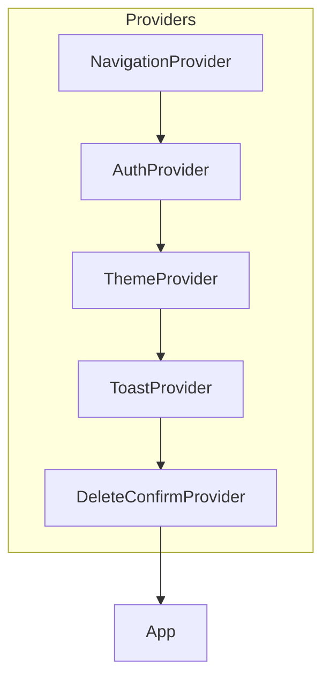
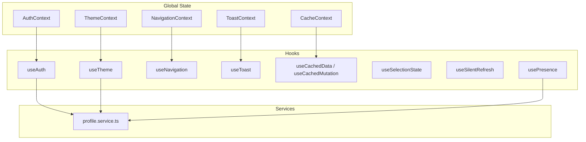
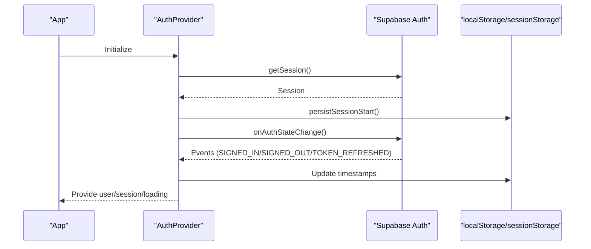
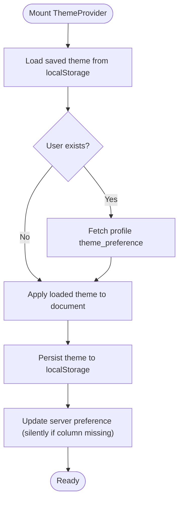
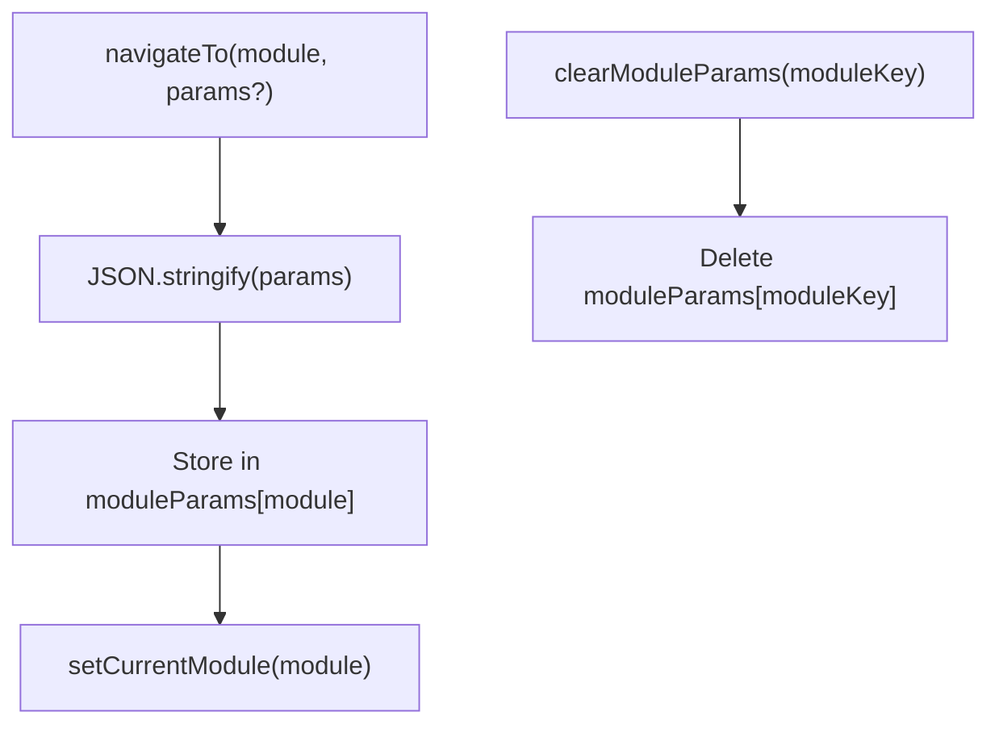
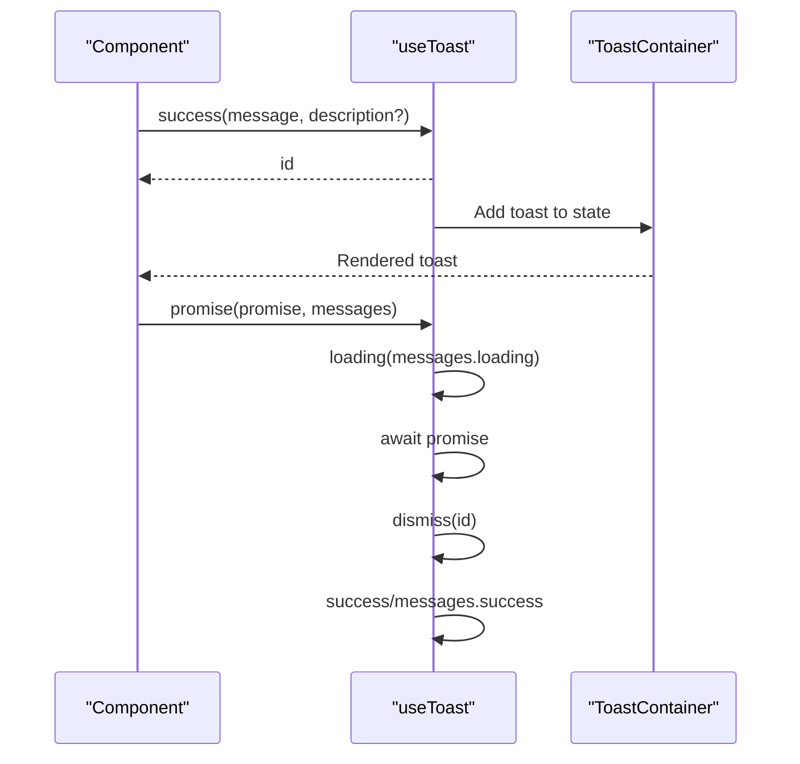
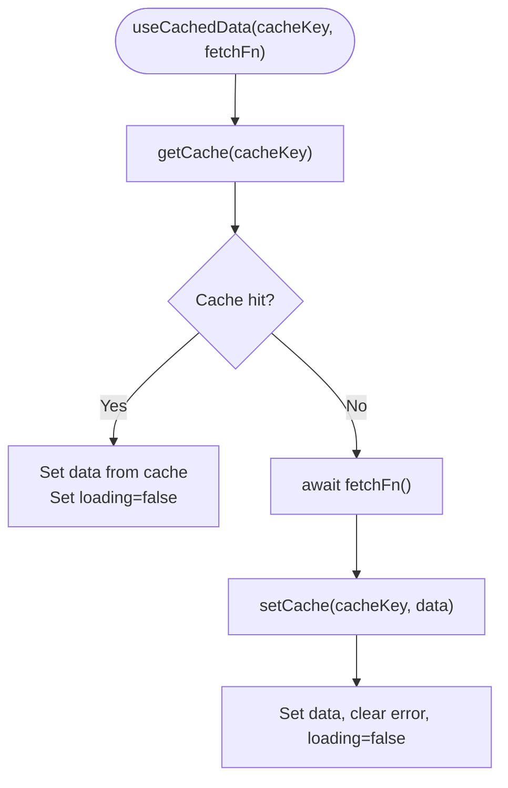
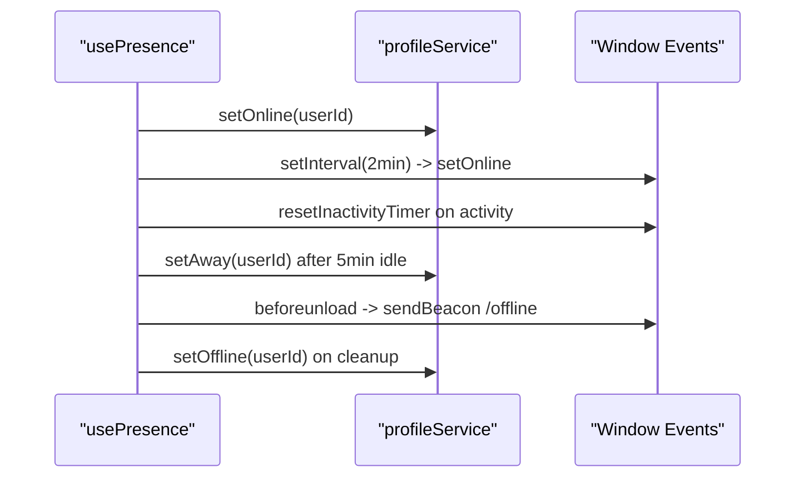
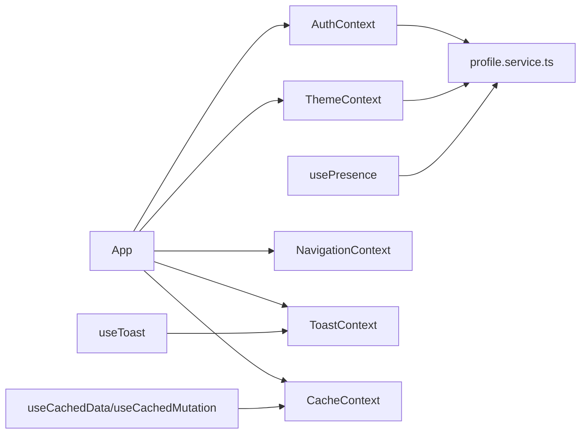

# State Management

<cite>
**Referenced Files in This Document**
- [AuthContext.tsx](file://src/contexts/AuthContext.tsx)
- [ThemeContext.tsx](file://src/contexts/ThemeContext.tsx)
- [ToastContext.tsx](file://src/contexts/ToastContext.tsx)
- [NavigationContext.tsx](file://src/contexts/NavigationContext.tsx)
- [CacheContext.tsx](file://src/contexts/CacheContext.tsx)
- [useQueryCache.ts](file://src/hooks/useQueryCache.ts)
- [useToast.ts](file://src/hooks/useToast.ts)
- [useSelectionState.ts](file://src/hooks/useSelectionState.ts)
- [useSilentRefresh.ts](file://src/hooks/useSilentRefresh.ts)
- [usePresence.ts](file://src/hooks/usePresence.ts)
- [App.tsx](file://src/App.tsx)
- [main.tsx](file://src/main.tsx)
- [Toast.tsx](file://src/components/Toast.tsx)
- [profile.service.ts](file://src/services/profile.service.ts)
- [queryKeys.ts](file://src/constants/queryKeys.ts)
</cite>

## Table of Contents
1. [Introduction](#introduction)
2. [Project Structure](#project-structure)
3. [Core Components](#core-components)
4. [Architecture Overview](#architecture-overview)
5. [Detailed Component Analysis](#detailed-component-analysis)
6. [Dependency Analysis](#dependency-analysis)
7. [Performance Considerations](#performance-considerations)
8. [Troubleshooting Guide](#troubleshooting-guide)
9. [Conclusion](#conclusion)
10. [Appendices](#appendices)

## Introduction
This document explains the state management architecture of the CRM Jurídico React application. It covers the context provider stack, global state patterns, component state coordination, and the integration of React Context with custom hooks. It also documents caching strategies, optimistic updates, real-time synchronization with Supabase, persistence and memory management, performance optimizations, debugging and testing approaches, and migration patterns for evolving state needs. Practical guidance is included for extending the architecture with new state management patterns.

## Project Structure
The application initializes providers at the root level and organizes state concerns into focused contexts and hooks:
- Root providers wrap the application in a strict hierarchy to ensure context availability.
- Authentication, theme, navigation, and toast contexts encapsulate global state.
- A lightweight in-memory cache context supports TTL-based caching.
- Custom hooks implement data fetching, caching, selection state, silent refresh, and presence.

**Diagram sources**
- [main.tsx:32-46](file://src/main.tsx#L32-L46)
- [App.tsx:177-300](file://src/App.tsx#L177-L300)

**Section sources**
- [main.tsx:32-46](file://src/main.tsx#L32-L46)
- [App.tsx:177-300](file://src/App.tsx#L177-L300)

## Core Components
This section outlines the primary state management building blocks and their responsibilities.

- Authentication Context
  - Manages user session, loading state, and session warnings.
  - Integrates with Supabase for auth state changes, token refresh, and inactivity-based auto-logout.
  - Persists session start timestamps in localStorage and enforces heartbeat checks.

- Theme Context
  - Synchronizes theme preference across localStorage, system preference, and user profile.
  - Applies theme classes to the document root and persists preferences server-side when available.

- Navigation Context
  - Centralizes module routing and parameter passing between modules.
  - Provides navigation helpers and parameter lifecycle management.

- Toast Context and Hook
  - Provides a toast container and a hook-based API for notifications.
  - Implements smart durations, concurrency limits, and promise-based async feedback.

- Cache Context and Hook
  - Offers a simple TTL-based in-memory cache with wildcard invalidation.
  - Complements custom hooks for cached queries and mutations.

- Selection State Hook
  - Encapsulates selection mode and selected item sets for list-like components.

- Silent Refresh Hook
  - Schedules periodic silent refreshes based on visibility and focus.

- Presence Hook
  - Updates user presence (online/away/offline) via service calls and cleanup on unload.

**Section sources**
- [AuthContext.tsx:1-285](file://src/contexts/AuthContext.tsx#L1-L285)
- [ThemeContext.tsx:1-88](file://src/contexts/ThemeContext.tsx#L1-L88)
- [NavigationContext.tsx:1-94](file://src/contexts/NavigationContext.tsx#L1-L94)
- [ToastContext.tsx:1-42](file://src/contexts/ToastContext.tsx#L1-L42)
- [useToast.ts:1-132](file://src/hooks/useToast.ts#L1-L132)
- [CacheContext.tsx:1-93](file://src/contexts/CacheContext.tsx#L1-L93)
- [useQueryCache.ts:1-88](file://src/hooks/useQueryCache.ts#L1-L88)
- [useSelectionState.ts:1-77](file://src/hooks/useSelectionState.ts#L1-L77)
- [useSilentRefresh.ts:1-71](file://src/hooks/useSilentRefresh.ts#L1-L71)
- [usePresence.ts:1-63](file://src/hooks/usePresence.ts#L1-L63)

## Architecture Overview
The state architecture combines React Context for global state with custom hooks for data operations and side effects. Providers are layered to expose state to the entire component tree. Real-time synchronization leverages Supabase auth and RPC calls, while caching is handled locally with TTL and manual invalidation.

**Diagram sources**
- [AuthContext.tsx:21-276](file://src/contexts/AuthContext.tsx#L21-L276)
- [ThemeContext.tsx:13-78](file://src/contexts/ThemeContext.tsx#L13-L78)
- [NavigationContext.tsx:47-84](file://src/contexts/NavigationContext.tsx#L47-L84)
- [ToastContext.tsx:24-32](file://src/contexts/ToastContext.tsx#L24-L32)
- [CacheContext.tsx:19-83](file://src/contexts/CacheContext.tsx#L19-L83)
- [useQueryCache.ts:5-87](file://src/hooks/useQueryCache.ts#L5-L87)
- [useToast.ts:7-131](file://src/hooks/useToast.ts#L7-L131)
- [profile.service.ts:45-199](file://src/services/profile.service.ts#L45-L199)

## Detailed Component Analysis

### Authentication Context and Hooks
- Responsibilities
  - Initialize session from Supabase, subscribe to auth state changes, and deduplicate rapid events.
  - Persist session start time in localStorage and enforce heartbeat checks.
  - Extend session on user activity and trigger auto-logout after extended inactivity.
  - Expose sign-in, sign-out, and password reset actions.

- Real-time and Persistence
  - Subscribes to Supabase auth state changes and handles SIGNED_OUT, SIGNED_IN, TOKEN_REFRESHED.
  - Uses localStorage for session start timestamps and sessionStorage for profile cache.

- Session Management
  - Heartbeat refreshes sessions when nearing expiry and user is active.
  - Throttles activity detection to reduce frequent updates.

**Diagram sources**
- [AuthContext.tsx:45-115](file://src/contexts/AuthContext.tsx#L45-L115)
- [AuthContext.tsx:118-189](file://src/contexts/AuthContext.tsx#L118-L189)
- [AuthContext.tsx:192-222](file://src/contexts/AuthContext.tsx#L192-L222)

**Section sources**
- [AuthContext.tsx:21-285](file://src/contexts/AuthContext.tsx#L21-L285)

### Theme Context and Service Integration
- Responsibilities
  - Load theme preference from localStorage or system setting on startup.
  - Sync with user profile when logged in and apply theme classes to document root.
  - Persist theme preference to localStorage and optionally to server.

- Service Integration
  - Uses profile service to fetch and update theme preference.

**Diagram sources**
- [ThemeContext.tsx:18-38](file://src/contexts/ThemeContext.tsx#L18-L38)
- [ThemeContext.tsx:41-52](file://src/contexts/ThemeContext.tsx#L41-L52)
- [ThemeContext.tsx:54-72](file://src/contexts/ThemeContext.tsx#L54-L72)
- [profile.service.ts:133-140](file://src/services/profile.service.ts#L133-L140)

**Section sources**
- [ThemeContext.tsx:1-88](file://src/contexts/ThemeContext.tsx#L1-L88)
- [profile.service.ts:133-140](file://src/services/profile.service.ts#L133-L140)

### Navigation Context and Parameter Coordination
- Responsibilities
  - Track current module and module-specific parameters.
  - Provide navigation helpers and parameter lifecycle management with JSON serialization.

- Parameter Lifecycle
  - Serialize parameters per module and support clearing by module key.

**Diagram sources**
- [NavigationContext.tsx:54-70](file://src/contexts/NavigationContext.tsx#L54-L70)

**Section sources**
- [NavigationContext.tsx:1-94](file://src/contexts/NavigationContext.tsx#L1-L94)

### Toast Context, Provider, and Hook
- Responsibilities
  - Provide a toast container and a hook-based API for notifications.
  - Smart durations, concurrency limit, and promise-based async feedback.

- Implementation Highlights
  - Portal rendering for toast container.
  - Concurrency limit to avoid overwhelming notifications.
  - Promise wrapper to orchestrate loading, success, and error states.

**Diagram sources**
- [ToastContext.tsx:24-32](file://src/contexts/ToastContext.tsx#L24-L32)
- [useToast.ts:92-118](file://src/hooks/useToast.ts#L92-L118)
- [Toast.tsx:125-166](file://src/components/Toast.tsx#L125-L166)

**Section sources**
- [ToastContext.tsx:1-42](file://src/contexts/ToastContext.tsx#L1-L42)
- [useToast.ts:1-132](file://src/hooks/useToast.ts#L1-L132)
- [Toast.tsx:1-167](file://src/components/Toast.tsx#L1-L167)

### Cache Context and Query Hooks
- Responsibilities
  - Provide a TTL-based in-memory cache with wildcard invalidation.
  - Support cached data retrieval and mutation invalidation.

- Query Hooks
  - useCachedData: fetch with cache-first strategy and TTL checks.
  - useCachedMutation: execute mutations and invalidate cache keys.

**Diagram sources**
- [CacheContext.tsx:22-40](file://src/contexts/CacheContext.tsx#L22-L40)
- [useQueryCache.ts:17-38](file://src/hooks/useQueryCache.ts#L17-L38)

**Section sources**
- [CacheContext.tsx:1-93](file://src/contexts/CacheContext.tsx#L1-L93)
- [useQueryCache.ts:1-88](file://src/hooks/useQueryCache.ts#L1-L88)

### Presence Hook and Real-time Status
- Responsibilities
  - Mark user online on mount and periodically.
  - Transition to away after inactivity and set offline on unload.
  - Use sendBeacon for reliable offline reporting.

**Diagram sources**
- [usePresence.ts:11-61](file://src/hooks/usePresence.ts#L11-L61)
- [profile.service.ts:147-157](file://src/services/profile.service.ts#L147-L157)

**Section sources**
- [usePresence.ts:1-63](file://src/hooks/usePresence.ts#L1-L63)
- [profile.service.ts:142-157](file://src/services/profile.service.ts#L142-L157)

### Selection State Hook
- Responsibilities
  - Manage selection mode and selected IDs with operations to toggle, select, clear, and prune.

**Section sources**
- [useSelectionState.ts:1-77](file://src/hooks/useSelectionState.ts#L1-L77)

### Silent Refresh Hook
- Responsibilities
  - Schedule silent refreshes on intervals, focus, and visibility changes.
  - Debounce refresh scheduling to avoid redundant calls.

**Section sources**
- [useSilentRefresh.ts:1-71](file://src/hooks/useSilentRefresh.ts#L1-L71)

## Dependency Analysis
The state management stack exhibits clear separation of concerns:
- Providers depend on each other to expose state upward in the tree.
- Hooks consume contexts and services to implement domain logic.
- Services encapsulate Supabase interactions and RPC calls.

**Diagram sources**
- [AuthContext.tsx:21-276](file://src/contexts/AuthContext.tsx#L21-L276)
- [ThemeContext.tsx:13-78](file://src/contexts/ThemeContext.tsx#L13-L78)
- [usePresence.ts:8-61](file://src/hooks/usePresence.ts#L8-L61)
- [profile.service.ts:45-199](file://src/services/profile.service.ts#L45-L199)
- [App.tsx:177-300](file://src/App.tsx#L177-L300)
- [useQueryCache.ts:5-87](file://src/hooks/useQueryCache.ts#L5-L87)
- [useToast.ts:7-131](file://src/hooks/useToast.ts#L7-L131)

**Section sources**
- [App.tsx:177-300](file://src/App.tsx#L177-L300)
- [profile.service.ts:45-199](file://src/services/profile.service.ts#L45-L199)

## Performance Considerations
- Provider Layering
  - Keep providers minimal and avoid unnecessary re-renders by scoping state to the smallest necessary subtree.

- Caching Strategy
  - Use TTL-based cache for frequently accessed data; invalidate selectively after mutations.
  - Prefer wildcard invalidation patterns to maintain cache hygiene without global clears.

- Silent Refresh
  - Tune intervalMs and visibility checks to balance freshness and resource usage.

- Activity Throttling
  - Throttle activity detection to reduce frequent updates and network calls.

- Lazy Loading and Prefetching
  - Continue leveraging lazy-loaded modules and prefetch strategies to improve perceived performance.

- Memory Management
  - Clear caches and local storage entries on logout to prevent stale state accumulation.
  - Avoid retaining large arrays or objects in global state; prefer normalized data structures.

[No sources needed since this section provides general guidance]

## Troubleshooting Guide
- Authentication Issues
  - Verify Supabase auth state subscriptions and deduplication logic.
  - Confirm session start timestamps are persisted and cleared on logout.

- Theme Synchronization
  - Ensure system theme preference is respected and server-side updates are handled gracefully.

- Navigation Parameter Conflicts
  - Validate JSON serialization/deserialization of module parameters.
  - Clear module parameters when navigating away from a module.

- Toast Overload
  - Respect concurrency limits and ensure long-running operations dismiss loading toasts.

- Cache Invalidation
  - Use targeted invalidation keys and wildcard patterns to keep cache consistent.

- Presence State
  - Confirm offline beacon delivery and cleanup routines.

**Section sources**
- [AuthContext.tsx:45-115](file://src/contexts/AuthContext.tsx#L45-L115)
- [ThemeContext.tsx:54-72](file://src/contexts/ThemeContext.tsx#L54-L72)
- [NavigationContext.tsx:54-70](file://src/contexts/NavigationContext.tsx#L54-L70)
- [useToast.ts:41-51](file://src/hooks/useToast.ts#L41-L51)
- [CacheContext.tsx:53-77](file://src/contexts/CacheContext.tsx#L53-L77)
- [usePresence.ts:23-60](file://src/hooks/usePresence.ts#L23-L60)

## Conclusion
The CRM Jurídico application employs a robust, layered state management architecture centered on React Context and custom hooks. Authentication, theme, navigation, and toast systems are cleanly separated and integrated with Supabase for real-time capabilities. A lightweight TTL-based cache complements data-fetching hooks, while presence and silent-refresh hooks manage background synchronization. The architecture supports scalability, performance, and maintainability, with clear patterns for debugging, testing, and evolving state needs.

[No sources needed since this section summarizes without analyzing specific files]

## Appendices

### Implementing New State Management Patterns
- New Global State
  - Create a dedicated context provider and expose a typed hook.
  - Integrate with services and persistence as needed.

- Adding a New Cache Pattern
  - Extend the cache context with specialized invalidation strategies.
  - Wrap data operations with useCachedData/useCachedMutation variants.

- Optimistic Updates
  - Use mutation hooks to update cache immediately and roll back on error.
  - Invalidate affected cache keys after successful writes.

- Real-time Synchronization
  - Subscribe to Supabase channels and update cache or local state accordingly.
  - Combine with presence and heartbeat patterns for reliability.

- Testing Strategies
  - Mock contexts and services in unit tests.
  - Use act and waitFor to assert async state transitions.
  - Test cache invalidation and TTL behavior.

- Migration Patterns
  - Introduce new keys gradually and handle missing data gracefully.
  - Backfill defaults and normalize data during reads.

[No sources needed since this section provides general guidance]