# UI Components

<cite>
**Referenced Files in This Document**
- [src/components/ui/index.ts](file://src/components/ui/index.ts)
- [src/components/ui/Button.tsx](file://src/components/ui/Button.tsx)
- [src/components/ui/Card.tsx](file://src/components/ui/Card.tsx)
- [src/components/ui/Badge.tsx](file://src/components/ui/Badge.tsx)
- [src/components/ui/LoadingSpinner.tsx](file://src/components/ui/LoadingSpinner.tsx)
- [src/components/ui/EmptyState.tsx](file://src/components/ui/EmptyState.tsx)
- [src/components/dashboard/index.ts](file://src/components/dashboard/index.ts)
- [src/components/dashboard/DashboardHeader.tsx](file://src/components/dashboard/DashboardHeader.tsx)
- [src/components/dashboard/StatCard.tsx](file://src/components/dashboard/StatCard.tsx)
- [src/components/dashboard/AlertBanner.tsx](file://src/components/dashboard/AlertBanner.tsx)
- [src/components/layout/AppLayout.tsx](file://src/components/layout/AppLayout.tsx)
- [src/components/layout/Header.tsx](file://src/components/layout/Header.tsx)
- [src/components/layout/Sidebar.tsx](file://src/components/layout/Sidebar.tsx)
- [src/components/layout/MobileSidebar.tsx](file://src/components/layout/MobileSidebar.tsx)
- [src/components/shared/ClientAvatar.tsx](file://src/components/shared/ClientAvatar.tsx)
</cite>

## Table of Contents
1. [Introduction](#introduction)
2. [Project Structure](#project-structure)
3. [Core Components](#core-components)
4. [Architecture Overview](#architecture-overview)
5. [Detailed Component Analysis](#detailed-component-analysis)
6. [Dependency Analysis](#dependency-analysis)
7. [Performance Considerations](#performance-considerations)
8. [Troubleshooting Guide](#troubleshooting-guide)
9. [Conclusion](#conclusion)
10. [Appendices](#appendices)

## Introduction
This document describes the CRM Jurídico UI component library and design system. It explains the shared component library, design system principles, and component composition patterns. It covers the dashboard widget system, form-related components, and interactive elements. It documents responsive design implementation, accessibility features, and cross-browser compatibility. It also provides usage guidance, customization options, theming support, testing strategies, performance optimization, and integration patterns for building new components that remain consistent with the existing design system.

## Project Structure
The UI system is organized by feature domains:
- Shared primitives under ui (Button, Card, Badge, LoadingSpinner, EmptyState)
- Dashboard widgets under dashboard (StatCard, AlertBanner, DashboardHeader, and others)
- Layout scaffolding under layout (AppLayout, Header, Sidebar, MobileSidebar)
- Shared reusable assets under shared (ClientAvatar)

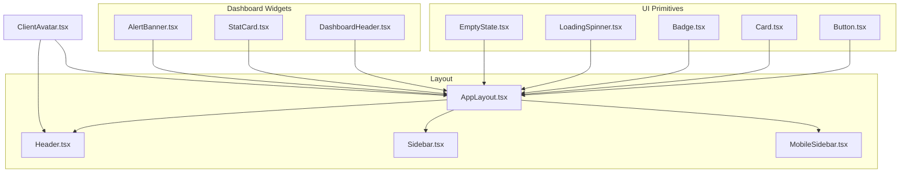

**Diagram sources**
- [src/components/ui/Button.tsx:1-53](file://src/components/ui/Button.tsx#L1-L53)
- [src/components/ui/Card.tsx:1-42](file://src/components/ui/Card.tsx#L1-L42)
- [src/components/ui/Badge.tsx:1-39](file://src/components/ui/Badge.tsx#L1-L39)
- [src/components/ui/LoadingSpinner.tsx:1-44](file://src/components/ui/LoadingSpinner.tsx#L1-L44)
- [src/components/ui/EmptyState.tsx:1-39](file://src/components/ui/EmptyState.tsx#L1-L39)
- [src/components/dashboard/DashboardHeader.tsx:1-59](file://src/components/dashboard/DashboardHeader.tsx#L1-L59)
- [src/components/dashboard/StatCard.tsx:1-66](file://src/components/dashboard/StatCard.tsx#L1-L66)
- [src/components/dashboard/AlertBanner.tsx:1-41](file://src/components/dashboard/AlertBanner.tsx#L1-L41)
- [src/components/layout/AppLayout.tsx:1-352](file://src/components/layout/AppLayout.tsx#L1-L352)
- [src/components/layout/Header.tsx:1-134](file://src/components/layout/Header.tsx#L1-L134)
- [src/components/layout/Sidebar.tsx:1-139](file://src/components/layout/Sidebar.tsx#L1-L139)
- [src/components/layout/MobileSidebar.tsx:1-157](file://src/components/layout/MobileSidebar.tsx#L1-L157)
- [src/components/shared/ClientAvatar.tsx:1-90](file://src/components/shared/ClientAvatar.tsx#L1-L90)

**Section sources**
- [src/components/ui/index.ts:1-6](file://src/components/ui/index.ts#L1-L6)
- [src/components/dashboard/index.ts:1-11](file://src/components/dashboard/index.ts#L1-L11)
- [src/components/layout/index.ts:1-5](file://src/components/layout/index.ts#L1-L5)

## Core Components
This section documents the shared primitive components and their props, variants, and styling approach.

- Button
  - Purpose: Primary action affordances with variants, sizes, icons, and loading states.
  - Props: variant, size, loading, icon, children, className, disabled, plus native button attributes.
  - Variants: primary, secondary, danger, ghost, outline.
  - Sizes: sm, md, lg.
  - Styling: Tailwind-based classes with theme tokens and transitions; disabled state handled explicitly.
  - Accessibility: Inherits native button semantics; ensure meaningful labels and visible focus.

- Card
  - Purpose: Container with optional click handler, padding, and hover effects.
  - Props: children, className, onClick, padding, hover.
  - Padding: none, sm, md, lg.
  - Behavior: Renders a button element when onClick is provided; otherwise div.

- Badge
  - Purpose: Status or metadata indicators with pulsing support.
  - Props: children, variant, size, pulse.
  - Variants: default, success, warning, danger, info.
  - Sizes: sm, md.

- LoadingSpinner
  - Purpose: Loading feedback with optional full-screen mode and messages.
  - Props: size, message, fullScreen.
  - Sizes: sm, md, lg.

- EmptyState
  - Purpose: Friendly messaging for empty lists or states with optional action.
  - Props: icon, title, description, action (label, onClick).

Styling approach
- Tailwind utility classes dominate component styles.
- Theme tokens are applied via semantic color names (e.g., amber, slate, emerald, red, blue).
- Hover, focus, and transition utilities are used consistently for interactivity.
- Responsive breakpoints are used to adapt spacing and typography across screen sizes.

**Section sources**
- [src/components/ui/Button.tsx:1-53](file://src/components/ui/Button.tsx#L1-L53)
- [src/components/ui/Card.tsx:1-42](file://src/components/ui/Card.tsx#L1-L42)
- [src/components/ui/Badge.tsx:1-39](file://src/components/ui/Badge.tsx#L1-L39)
- [src/components/ui/LoadingSpinner.tsx:1-44](file://src/components/ui/LoadingSpinner.tsx#L1-L44)
- [src/components/ui/EmptyState.tsx:1-39](file://src/components/ui/EmptyState.tsx#L1-L39)

## Architecture Overview
The application’s layout is composed around a central AppLayout that orchestrates navigation, header actions, sidebar, and content area. Dashboard widgets integrate into the main content area, while shared primitives are reused across components.

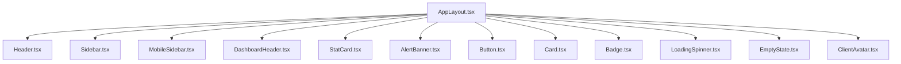

**Diagram sources**
- [src/components/layout/AppLayout.tsx:1-352](file://src/components/layout/AppLayout.tsx#L1-L352)
- [src/components/layout/Header.tsx:1-134](file://src/components/layout/Header.tsx#L1-L134)
- [src/components/layout/Sidebar.tsx:1-139](file://src/components/layout/Sidebar.tsx#L1-L139)
- [src/components/layout/MobileSidebar.tsx:1-157](file://src/components/layout/MobileSidebar.tsx#L1-L157)
- [src/components/dashboard/DashboardHeader.tsx:1-59](file://src/components/dashboard/DashboardHeader.tsx#L1-L59)
- [src/components/dashboard/StatCard.tsx:1-66](file://src/components/dashboard/StatCard.tsx#L1-L66)
- [src/components/dashboard/AlertBanner.tsx:1-41](file://src/components/dashboard/AlertBanner.tsx#L1-L41)
- [src/components/ui/Button.tsx:1-53](file://src/components/ui/Button.tsx#L1-L53)
- [src/components/ui/Card.tsx:1-42](file://src/components/ui/Card.tsx#L1-L42)
- [src/components/ui/Badge.tsx:1-39](file://src/components/ui/Badge.tsx#L1-L39)
- [src/components/ui/LoadingSpinner.tsx:1-44](file://src/components/ui/LoadingSpinner.tsx#L1-L44)
- [src/components/ui/EmptyState.tsx:1-39](file://src/components/ui/EmptyState.tsx#L1-L39)
- [src/components/shared/ClientAvatar.tsx:1-90](file://src/components/shared/ClientAvatar.tsx#L1-L90)

## Detailed Component Analysis

### Button
- Props interface: variant, size, loading, icon, children, className, disabled, plus native button attributes.
- Behavior: conditionally renders spinner or icon; disables during loading; merges className with computed variants and sizes.
- Composition: Used widely in forms, dialogs, and dashboard widgets.

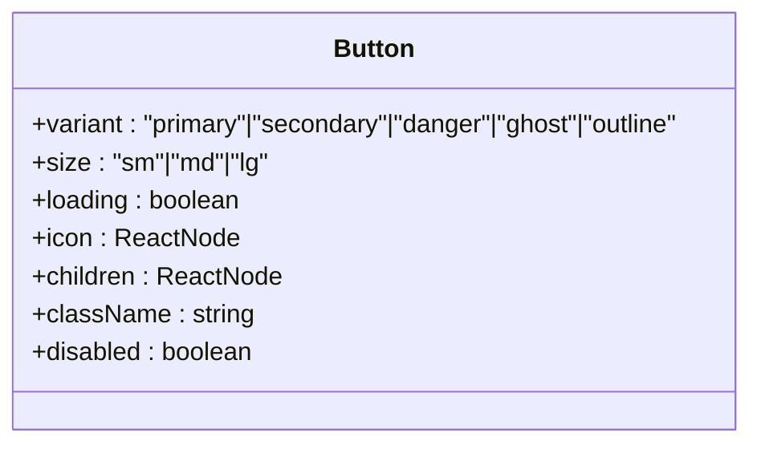

**Diagram sources**
- [src/components/ui/Button.tsx:4-10](file://src/components/ui/Button.tsx#L4-L10)

**Section sources**
- [src/components/ui/Button.tsx:1-53](file://src/components/ui/Button.tsx#L1-L53)

### Card
- Props interface: children, className, onClick, padding, hover.
- Behavior: toggles clickable container; applies padding and hover shadow classes; supports onClick to render a button wrapper.

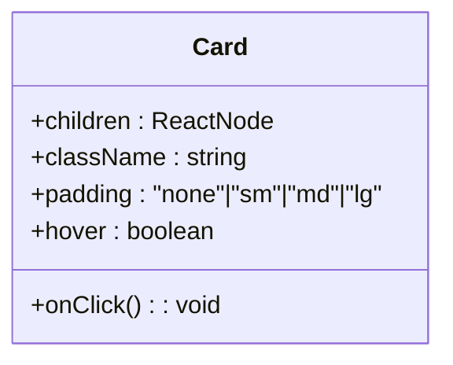

**Diagram sources**
- [src/components/ui/Card.tsx:3-9](file://src/components/ui/Card.tsx#L3-L9)

**Section sources**
- [src/components/ui/Card.tsx:1-42](file://src/components/ui/Card.tsx#L1-L42)

### Badge
- Props interface: children, variant, size, pulse.
- Behavior: renders a span with variant and size classes; optional pulse animation.

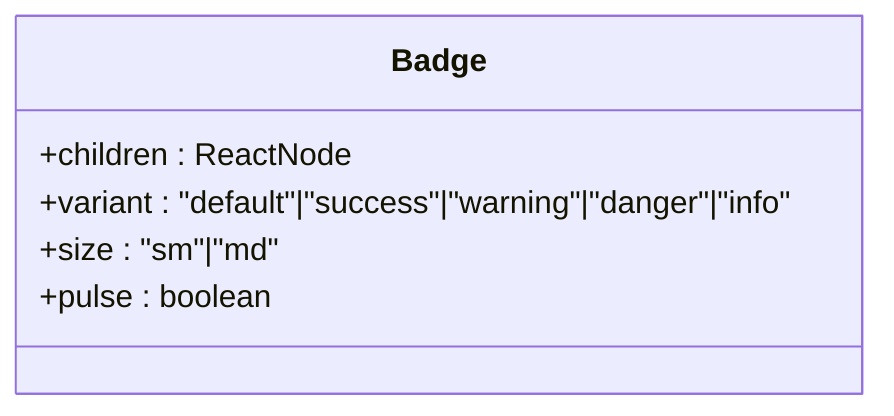

**Diagram sources**
- [src/components/ui/Badge.tsx:3-8](file://src/components/ui/Badge.tsx#L3-L8)

**Section sources**
- [src/components/ui/Badge.tsx:1-39](file://src/components/ui/Badge.tsx#L1-L39)

### LoadingSpinner
- Props interface: size, message, fullScreen.
- Behavior: renders centered spinner; fullScreen variant fills viewport; optional message below spinner.

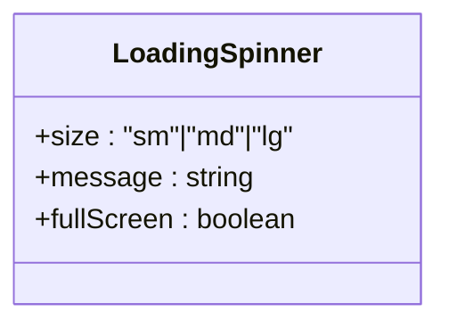

**Diagram sources**
- [src/components/ui/LoadingSpinner.tsx:4-8](file://src/components/ui/LoadingSpinner.tsx#L4-L8)

**Section sources**
- [src/components/ui/LoadingSpinner.tsx:1-44](file://src/components/ui/LoadingSpinner.tsx#L1-L44)

### EmptyState
- Props interface: icon, title, description, action (label, onClick).
- Behavior: displays icon, title, optional description, and optional action button.

```mermaid
classDiagram
class EmptyState {
+icon : ReactNode
+title : string
+description : string
+action : {label : string, onClick() : void}
}
```

**Diagram sources**
- [src/components/ui/EmptyState.tsx:3-11](file://src/components/ui/EmptyState.tsx#L3-L11)

**Section sources**
- [src/components/ui/EmptyState.tsx:1-39](file://src/components/ui/EmptyState.tsx#L1-L39)

### DashboardHeader
- Props interface: onNewClient.
- Behavior: renders greeting, date, gradient background, animated wave emoji, and a prominent CTA button.

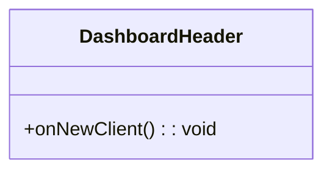

**Diagram sources**
- [src/components/dashboard/DashboardHeader.tsx:5-7](file://src/components/dashboard/DashboardHeader.tsx#L5-L7)

**Section sources**
- [src/components/dashboard/DashboardHeader.tsx:1-59](file://src/components/dashboard/DashboardHeader.tsx#L1-L59)

### StatCard
- Props interface: icon, value, label, color, onClick.
- Behavior: renders a card-like button with color-coded accent; supports click handler.

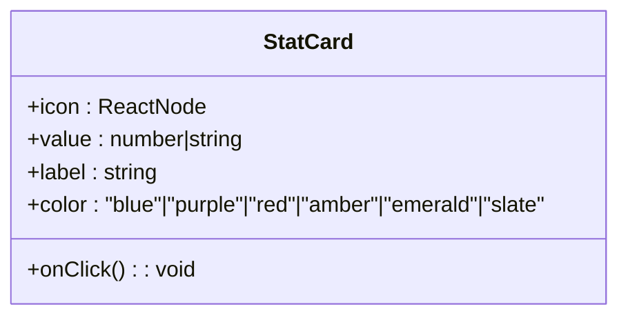

**Diagram sources**
- [src/components/dashboard/StatCard.tsx:3-9](file://src/components/dashboard/StatCard.tsx#L3-L9)

**Section sources**
- [src/components/dashboard/StatCard.tsx:1-66](file://src/components/dashboard/StatCard.tsx#L1-L66)

### AlertBanner
- Props interface: alerts (array of { type, count, action }), onNavigate.
- Behavior: renders a banner with alert items; each item triggers navigation action.

```mermaid
classDiagram
class AlertBanner {
+alerts : {type : string, count : number, action : string}[]
+onNavigate(action : string) : void
}
```

**Diagram sources**
- [src/components/dashboard/AlertBanner.tsx:10-13](file://src/components/dashboard/AlertBanner.tsx#L10-L13)

**Section sources**
- [src/components/dashboard/AlertBanner.tsx:1-41](file://src/components/dashboard/AlertBanner.tsx#L1-L41)

### AppLayout
- Props interface: activeModule, onNavigate, onOpenProfile, onSignOut, profile, pendingTasksCount, children, plus client search and notification center props.
- Behavior: manages mobile backdrop, sidebar visibility, header actions, client search dropdown, tasks badge, and notification center injection.

```mermaid
classDiagram
class AppLayout {
+activeModule : ModuleName
+onNavigate(module : ModuleName) : void
+onOpenProfile() : void
+onSignOut() : void
+profile : {name : string, avatarUrl : string}
+pendingTasksCount : number
+children : ReactNode
+clientSearchTerm : string
+onClientSearchChange(term : string) : void
+onClientSearchFocus() : void
+clientSearchOpen : boolean
+clientSearchLoading : boolean
+clientSearchResults : Client[]
+onClientSearchSelect(clientId : string) : void
+onClientSearchKeyDown(e : KeyboardEvent) : void
+onAddNewClient(prefillName? : string) : void
+notificationCenter : ReactNode
}
```

**Diagram sources**
- [src/components/layout/AppLayout.tsx:37-66](file://src/components/layout/AppLayout.tsx#L37-L66)

**Section sources**
- [src/components/layout/AppLayout.tsx:1-352](file://src/components/layout/AppLayout.tsx#L1-L352)

### Header
- Props interface: activeModule, isMobileNavOpen, onToggleMobileNav, profile, pendingTasksCount, onNavigateToTasks, onSignOut, children.
- Behavior: renders module title/description, brand logo, tasks badge, and profile/logout controls; exposes a child slot for search/notification center.

```mermaid
classDiagram
class Header {
+activeModule : ModuleName
+isMobileNavOpen : boolean
+onToggleMobileNav() : void
+profile : {name : string, avatarUrl : string}
+pendingTasksCount : number
+onNavigateToTasks() : void
+onSignOut() : void
+children : ReactNode
}
```

**Diagram sources**
- [src/components/layout/Header.tsx:6-18](file://src/components/layout/Header.tsx#L6-L18)

**Section sources**
- [src/components/layout/Header.tsx:1-134](file://src/components/layout/Header.tsx#L1-L134)

### Sidebar
- Props interface: activeModule, onNavigate, onOpenProfile, logoUrl, canView, isAdmin, permissionsLoading.
- Behavior: renders a vertical icon-only sidebar with permission-aware navigation items and profile action.

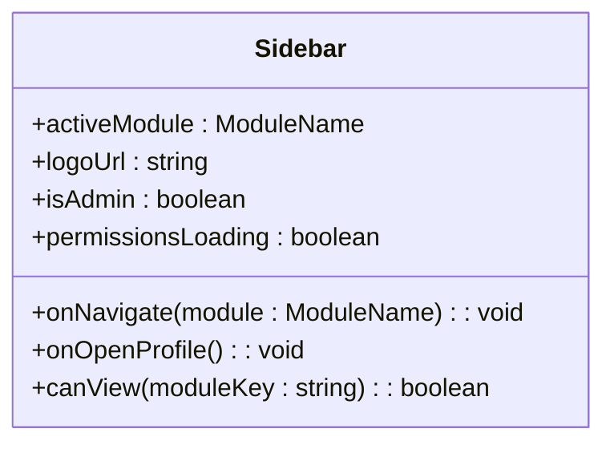

**Diagram sources**
- [src/components/layout/Sidebar.tsx:22-30](file://src/components/layout/Sidebar.tsx#L22-L30)

**Section sources**
- [src/components/layout/Sidebar.tsx:1-139](file://src/components/layout/Sidebar.tsx#L1-L139)

### MobileSidebar
- Props interface: isOpen, activeModule, onNavigate, onClose, onOpenProfile, logoUrl, canView, isAdmin, permissionsLoading.
- Behavior: renders a full-height drawer with permission-aware navigation and profile action; closes on backdrop click.

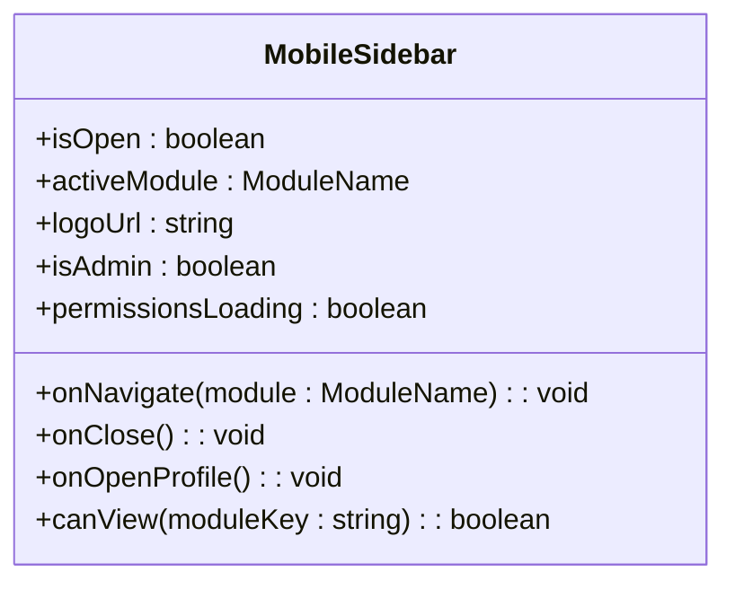

**Diagram sources**
- [src/components/layout/MobileSidebar.tsx:23-33](file://src/components/layout/MobileSidebar.tsx#L23-L33)

**Section sources**
- [src/components/layout/MobileSidebar.tsx:1-157](file://src/components/layout/MobileSidebar.tsx#L1-L157)

### ClientAvatar
- Props interface: client, photoUrl, size, className.
- Behavior: prioritizes real photo, falls back to corporate icon, then deterministic colored initials with ring and color derived from name hash.

```mermaid
classDiagram
class ClientAvatar {
+client : {full_name? : string|null, client_type? : string|null}
+photoUrl : string
+size : number
+className : string
}
```

**Diagram sources**
- [src/components/shared/ClientAvatar.tsx:30-35](file://src/components/shared/ClientAvatar.tsx#L30-L35)

**Section sources**
- [src/components/shared/ClientAvatar.tsx:1-90](file://src/components/shared/ClientAvatar.tsx#L1-L90)

## Dependency Analysis
- Component exports are centralized via barrel files for ui and dashboard packages, enabling clean imports across the app.
- AppLayout composes Header, Sidebar, MobileSidebar, and dashboard widgets; it also composes shared primitives and ClientAvatar.
- There are no circular dependencies among the analyzed components; coupling is primarily unidirectional from layout and dashboard to primitives.

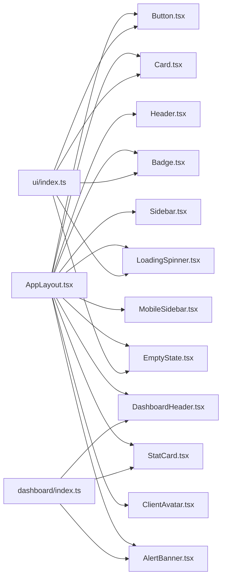

**Diagram sources**
- [src/components/ui/index.ts:1-6](file://src/components/ui/index.ts#L1-L6)
- [src/components/dashboard/index.ts:1-11](file://src/components/dashboard/index.ts#L1-L11)
- [src/components/layout/AppLayout.tsx:1-352](file://src/components/layout/AppLayout.tsx#L1-L352)

**Section sources**
- [src/components/ui/index.ts:1-6](file://src/components/ui/index.ts#L1-L6)
- [src/components/dashboard/index.ts:1-11](file://src/components/dashboard/index.ts#L1-L11)
- [src/components/layout/index.ts:1-5](file://src/components/layout/index.ts#L1-L5)

## Performance Considerations
- Prefer memoization for derived navigation lists (already using useMemo in Sidebar and MobileSidebar).
- Defer heavy computations in header animations to requestAnimationFrame (already used in DashboardHeader).
- Keep loading states explicit on buttons to avoid layout shifts.
- Use minimal DOM nodes in dense lists; leverage virtualization for large datasets when applicable.
- Avoid unnecessary re-renders by passing stable callbacks and avoiding inline prop objects.

[No sources needed since this section provides general guidance]

## Troubleshooting Guide
- Disabled states: Buttons disable themselves when loading; ensure loading flags are cleared after async operations.
- Clickable cards: Cards render as buttons when onClick is provided; ensure handlers are safe and accessible.
- Responsive layout: AppLayout toggles mobile navigation and adjusts content padding; verify breakpoints and z-index stacking.
- Client search: AppLayout manages search term, results, and keyboard handling; confirm event handlers are wired correctly.
- Tasks badge: Numeric count is sanitized to finite numbers; ensure counts are numbers or safely coerced.

**Section sources**
- [src/components/ui/Button.tsx:26-50](file://src/components/ui/Button.tsx#L26-L50)
- [src/components/ui/Card.tsx:18-39](file://src/components/ui/Card.tsx#L18-L39)
- [src/components/layout/AppLayout.tsx:118-142](file://src/components/layout/AppLayout.tsx#L118-L142)
- [src/components/dashboard/DashboardHeader.tsx:16-21](file://src/components/dashboard/DashboardHeader.tsx#L16-L21)

## Conclusion
The CRM Jurídico design system centers on a small set of cohesive primitives (Button, Card, Badge, LoadingSpinner, EmptyState) composed within robust layout scaffolding (AppLayout, Header, Sidebar, MobileSidebar) and purpose-built dashboard widgets (DashboardHeader, StatCard, AlertBanner). Tailwind utilities and semantic color tokens ensure consistent styling, while responsive patterns and accessibility semantics support broad compatibility. New components should reuse primitives, follow variant/sizing patterns, and integrate cleanly into the layout system.

[No sources needed since this section summarizes without analyzing specific files]

## Appendices

### Design System Principles
- Tokens: amber, slate, emerald, red, blue, purple, and others are used consistently for backgrounds, borders, and accents.
- Typography: use relative units and responsive variants for headings and labels.
- Spacing: use consistent padding and margin utilities; avoid ad-hoc spacing values.
- Interactions: apply hover/focus/active states uniformly; ensure sufficient contrast and focus visibility.

[No sources needed since this section provides general guidance]

### Theming Support
- Color tokens are applied directly via Tailwind classes; theming can be extended by introducing additional variants or by adjusting color scales in Tailwind configuration.
- For dark mode, ensure semantic tokens invert appropriately; test hover and border contrasts.

[No sources needed since this section provides general guidance]

### Component Composition Patterns
- Primitive-first: Build complex widgets from Button, Card, Badge, etc.
- Slot-based composition: Use children props to inject search, notifications, or actions (as seen in Header and AppLayout).
- Permission-aware navigation: Filter visible items based on canView/isAdmin and permissionsLoading states.

[No sources needed since this section provides general guidance]

### Accessibility Features
- Buttons and links use native semantics; ensure labels are descriptive.
- Focus management: Maintain visible focus styles; test tab order in AppLayout.
- ARIA: Add aria-labels where icons are used as controls; manage aria-expanded for mobile navigation.

[No sources needed since this section provides general guidance]

### Cross-Browser Compatibility
- Tailwind utilities are broadly supported; test on target browsers.
- requestAnimationFrame is used for smooth animations; ensure polyfills if targeting legacy environments.
- SVG icons from lucide-react are embedded; verify fallbacks if needed.

[No sources needed since this section provides general guidance]

### Component Testing Strategies
- Unit tests: Verify rendering with different variants, sizes, and states (loading, disabled).
- Interaction tests: Simulate clicks on cards and buttons; assert handlers are called.
- Layout tests: Confirm responsive behavior by resizing viewport and checking mobile drawer visibility.
- Integration tests: Mount AppLayout with Header, Sidebar, and dashboard widgets to validate composition.

[No sources needed since this section provides general guidance]

### Performance Optimization Checklist
- Memoize derived data (navigation items).
- Lazy-load heavy widgets.
- Minimize re-renders by passing stable callbacks and avoiding inline objects.
- Use skeleton loaders with LoadingSpinner for async content.

[No sources needed since this section provides general guidance]

### Creating New Components
- Place new components under appropriate folders (ui, dashboard, layout, shared) or create a new folder if needed.
- Export via barrel files for discoverability.
- Reuse primitives; define clear props with defaults and enums for variants.
- Compose with existing layout components; respect responsive patterns.
- Add tests and document usage in this guide.

[No sources needed since this section provides general guidance]