# Utilities & Helpers

<cite>
**Referenced Files in This Document**
- [formatters.ts](file://src/utils/formatters.ts)
- [search.ts](file://src/utils/search.ts)
- [events.ts](file://src/utils/events.ts)
- [clientDuplicates.ts](file://src/utils/clientDuplicates.ts)
- [clientQuality.ts](file://src/utils/clientQuality.ts)
- [signatureFilters.ts](file://src/utils/signatureFilters.ts)
- [exportIntimations.ts](file://src/utils/exportIntimations.ts)
- [syncHistory.ts](file://src/utils/syncHistory.ts)
- [notificationSound.ts](file://src/utils/notificationSound.ts)
- [pushNotifications.ts](file://src/utils/pushNotifications.ts)
- [useSelectionState.ts](file://src/hooks/useSelectionState.ts)
- [useQueryCache.ts](file://src/hooks/useQueryCache.ts)
- [usePermissions.ts](file://src/hooks/usePermissions.ts)
- [check-destinatarios.js](file://scripts/check-destinatarios.js)
</cite>

## Table of Contents
1. [Introduction](#introduction)
2. [Project Structure](#project-structure)
3. [Core Components](#core-components)
4. [Architecture Overview](#architecture-overview)
5. [Detailed Component Analysis](#detailed-component-analysis)
6. [Dependency Analysis](#dependency-analysis)
7. [Performance Considerations](#performance-considerations)
8. [Troubleshooting Guide](#troubleshooting-guide)
9. [Conclusion](#conclusion)
10. [Appendices](#appendices)

## Introduction
This document describes the utilities and helper functions that power CRM Jurídico’s formatting, validation, search, client management, notification handling, data transformation, and developer automation. It also covers custom React hooks for selection state, query caching, and permission checks, along with practical guidance on extending these utilities and integrating them into the existing architecture.

## Project Structure
The utilities and helpers are organized under:
- src/utils: Shared formatting, search, eventing, filtering, export, synchronization history, sound, and push notification utilities
- src/hooks: Reusable React hooks for selection state, caching, and permissions
- scripts: Node.js maintenance and automation utilities

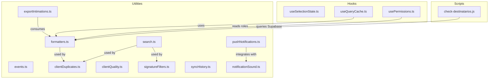

**Diagram sources**
- [formatters.ts](file://src/utils/formatters.ts)
- [search.ts](file://src/utils/search.ts)
- [events.ts](file://src/utils/events.ts)
- [clientDuplicates.ts](file://src/utils/clientDuplicates.ts)
- [clientQuality.ts](file://src/utils/clientQuality.ts)
- [signatureFilters.ts](file://src/utils/signatureFilters.ts)
- [exportIntimations.ts](file://src/utils/exportIntimations.ts)
- [syncHistory.ts](file://src/utils/syncHistory.ts)
- [notificationSound.ts](file://src/utils/notificationSound.ts)
- [pushNotifications.ts](file://src/utils/pushNotifications.ts)
- [useSelectionState.ts](file://src/hooks/useSelectionState.ts)
- [useQueryCache.ts](file://src/hooks/useQueryCache.ts)
- [usePermissions.ts](file://src/hooks/usePermissions.ts)
- [check-destinatarios.js](file://scripts/check-destinatarios.js)

**Section sources**
- [formatters.ts](file://src/utils/formatters.ts)
- [search.ts](file://src/utils/search.ts)
- [events.ts](file://src/utils/events.ts)
- [clientDuplicates.ts](file://src/utils/clientDuplicates.ts)
- [clientQuality.ts](file://src/utils/clientQuality.ts)
- [signatureFilters.ts](file://src/utils/signatureFilters.ts)
- [exportIntimations.ts](file://src/utils/exportIntimations.ts)
- [syncHistory.ts](file://src/utils/syncHistory.ts)
- [notificationSound.ts](file://src/utils/notificationSound.ts)
- [pushNotifications.ts](file://src/utils/pushNotifications.ts)
- [useSelectionState.ts](file://src/hooks/useSelectionState.ts)
- [useQueryCache.ts](file://src/hooks/useQueryCache.ts)
- [usePermissions.ts](file://src/hooks/usePermissions.ts)
- [check-destinatarios.js](file://scripts/check-destinatarios.js)

## Core Components
- Formatting and localization utilities for currency, dates, time, phones, CPF/CNPJ, truncation, and greetings
- Search normalization and matching helpers
- Event emitter for cross-module communication
- Client deduplication and quality scoring utilities
- Signature request and generated document filtering
- Export utilities for intimation reports (CSV, Excel, PDF)
- DJEN sync history persistence and statistics
- Notification sound and browser push notification services
- React hooks for selection state, cached queries/mutations, and permissions

**Section sources**
- [formatters.ts](file://src/utils/formatters.ts)
- [search.ts](file://src/utils/search.ts)
- [events.ts](file://src/utils/events.ts)
- [clientDuplicates.ts](file://src/utils/clientDuplicates.ts)
- [clientQuality.ts](file://src/utils/clientQuality.ts)
- [signatureFilters.ts](file://src/utils/signatureFilters.ts)
- [exportIntimations.ts](file://src/utils/exportIntimations.ts)
- [syncHistory.ts](file://src/utils/syncHistory.ts)
- [notificationSound.ts](file://src/utils/notificationSound.ts)
- [pushNotifications.ts](file://src/utils/pushNotifications.ts)
- [useSelectionState.ts](file://src/hooks/useSelectionState.ts)
- [useQueryCache.ts](file://src/hooks/useQueryCache.ts)
- [usePermissions.ts](file://src/hooks/usePermissions.ts)

## Architecture Overview
The utilities and helpers are designed to be:
- Pure and reusable across modules
- Decoupled from UI via small, focused APIs
- Integrated with Supabase for permissions and data
- Compatible with browser APIs for notifications and storage

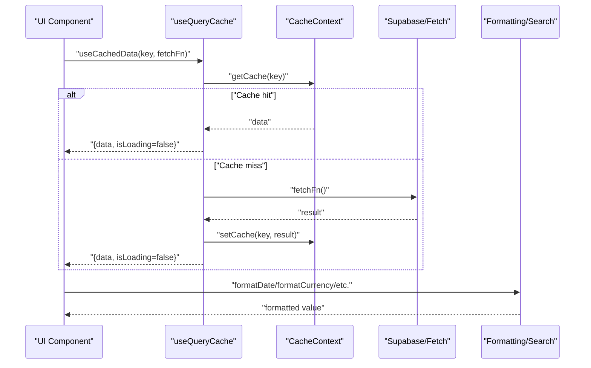

**Diagram sources**
- [useQueryCache.ts](file://src/hooks/useQueryCache.ts)
- [formatters.ts](file://src/utils/formatters.ts)
- [search.ts](file://src/utils/search.ts)

## Detailed Component Analysis

### Formatting and Localization Utilities
- Currency formatting (with and without decimals)
- Date/time formatting (short, long, time-only)
- Greeting generation based on time-of-day
- Days difference calculation and date comparisons (today/tomorrow)
- Text truncation
- Phone, CPF, and CNPJ formatting and input masking

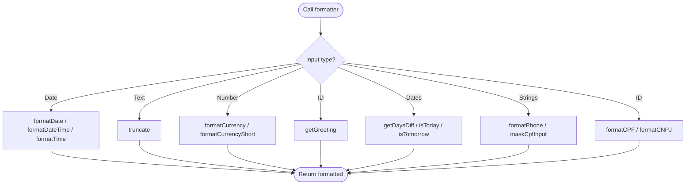

**Diagram sources**
- [formatters.ts](file://src/utils/formatters.ts)

**Section sources**
- [formatters.ts](file://src/utils/formatters.ts)

### Search and Matching Utilities
- Normalize search text (unicode decomposition, accents removed, lowercased, trimmed)
- Match normalized search against multiple values

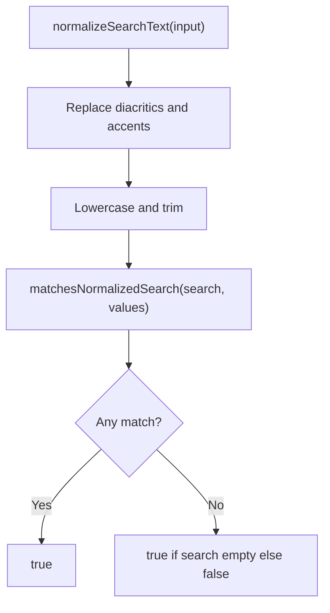

**Diagram sources**
- [search.ts](file://src/utils/search.ts)

**Section sources**
- [search.ts](file://src/utils/search.ts)

### Event System (Global Events)
- EventEmitter with on/off/emit
- Predefined system events for clients, processes, dashboard, notifications, presence, navigation, and editor widgets
- Emits both in-memory callbacks and a DOM CustomEvent for broad compatibility

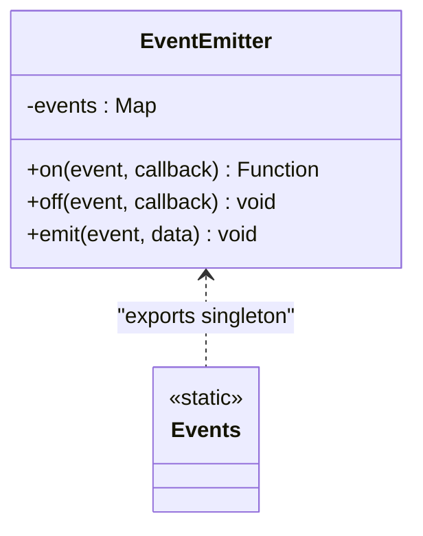

**Diagram sources**
- [events.ts](file://src/utils/events.ts)

**Section sources**
- [events.ts](file://src/utils/events.ts)

### Client Deduplication and Quality
- Duplicate grouping by CPF, phone, name, and email with confidence scoring
- Primary client selection by completeness, status, and recency
- Summary mapping for quick UI hints

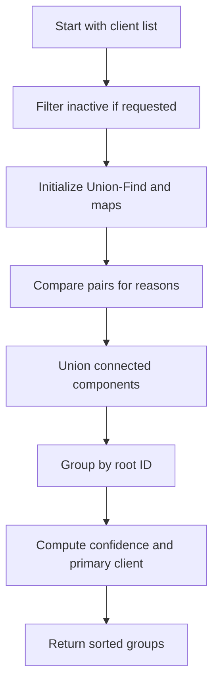

**Diagram sources**
- [clientDuplicates.ts](file://src/utils/clientDuplicates.ts)

**Section sources**
- [clientDuplicates.ts](file://src/utils/clientDuplicates.ts)
- [clientQuality.ts](file://src/utils/clientQuality.ts)

### Signature Request and Document Filtering
- Filter signature requests by status, period, month, date range, and search term
- Sort by newest/oldest
- Filter generated documents by folder and search term

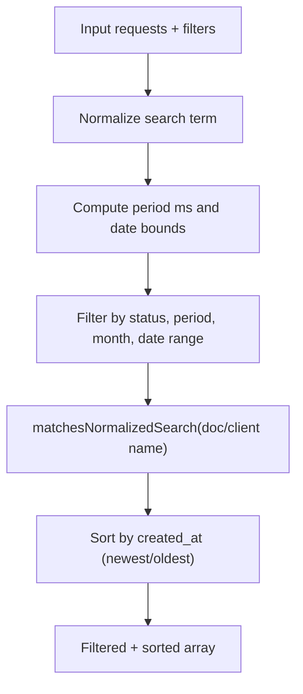

**Diagram sources**
- [signatureFilters.ts](file://src/utils/signatureFilters.ts)
- [search.ts](file://src/utils/search.ts)

**Section sources**
- [signatureFilters.ts](file://src/utils/signatureFilters.ts)
- [search.ts](file://src/utils/search.ts)

### Export Utilities for Intimation Reports
- CSV export with headers and rows
- Excel-like HTML export (opens in Excel)
- PDF-like report generation via browser print dialog

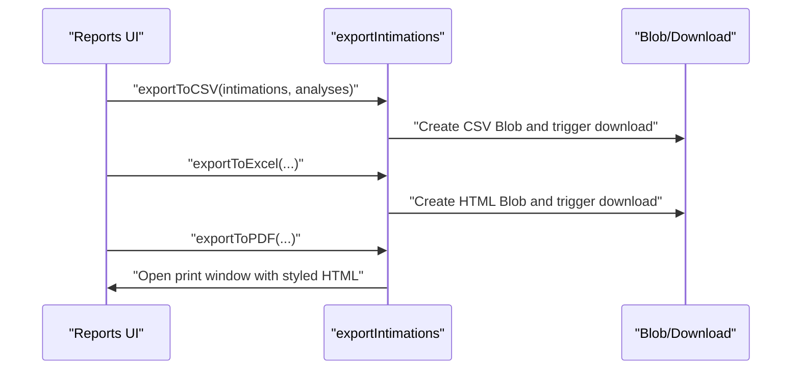

**Diagram sources**
- [exportIntimations.ts](file://src/utils/exportIntimations.ts)

**Section sources**
- [exportIntimations.ts](file://src/utils/exportIntimations.ts)

### DJEN Sync History Management
- Persist last N sync entries to localStorage
- Add entries, compute stats (totals, successes/failures, items saved), and clear history

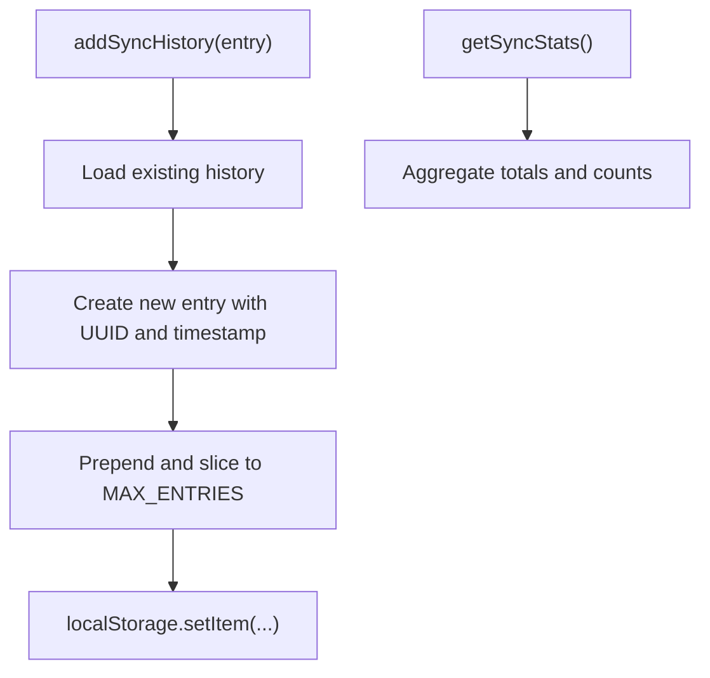

**Diagram sources**
- [syncHistory.ts](file://src/utils/syncHistory.ts)

**Section sources**
- [syncHistory.ts](file://src/utils/syncHistory.ts)

### Notification Sound and Browser Push Notifications
- NotificationSoundService: Web Audio API-based tones, enable/disable, preference persistence, and tests
- PushNotificationService: Permission checks, SW registration, showNotification, specialized alerts, clear all, initialization

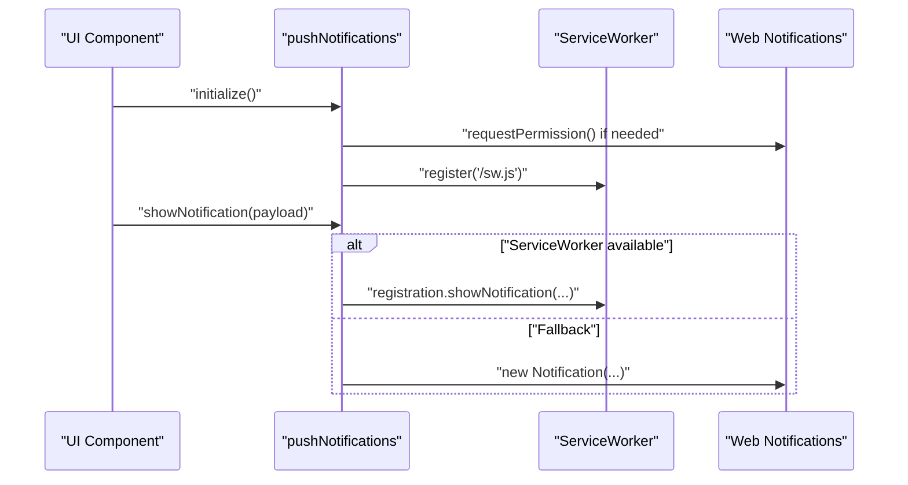

**Diagram sources**
- [pushNotifications.ts](file://src/utils/pushNotifications.ts)

**Section sources**
- [notificationSound.ts](file://src/utils/notificationSound.ts)
- [pushNotifications.ts](file://src/utils/pushNotifications.ts)

### React Hooks: Selection State, Query Cache, Permissions
- useSelectionState: Manage selection mode, selected IDs, enable/disable/toggle, replace/prune selections
- useQueryCache: Cached data retrieval and mutations with invalidation
- usePermissions: Role-based permission checks against Supabase role_permissions

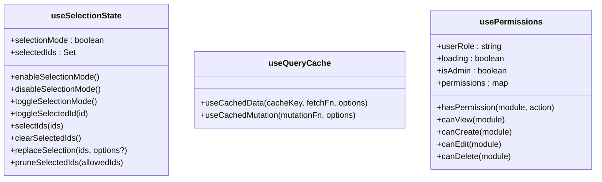

**Diagram sources**
- [useSelectionState.ts](file://src/hooks/useSelectionState.ts)
- [useQueryCache.ts](file://src/hooks/useQueryCache.ts)
- [usePermissions.ts](file://src/hooks/usePermissions.ts)

**Section sources**
- [useSelectionState.ts](file://src/hooks/useSelectionState.ts)
- [useQueryCache.ts](file://src/hooks/useQueryCache.ts)
- [usePermissions.ts](file://src/hooks/usePermissions.ts)

### Development Scripts and Maintenance Utilities
- check-destinatarios.js: Validates djen_comunicacoes and djen_destinatarios relationship and column presence

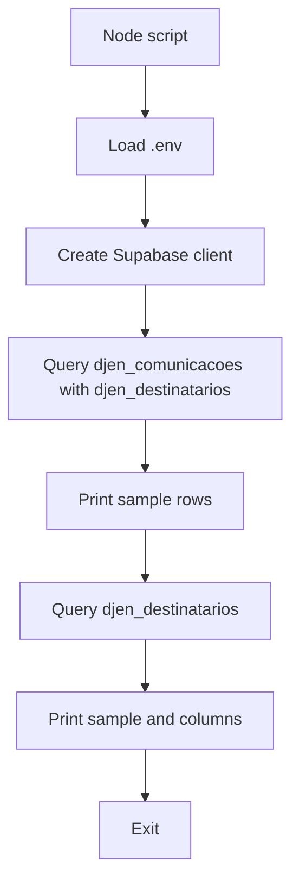

**Diagram sources**
- [check-destinatarios.js](file://scripts/check-destinatarios.js)

**Section sources**
- [check-destinatarios.js](file://scripts/check-destinatarios.js)

## Dependency Analysis
- Utilities depend on each other selectively:
  - search.ts is reused by clientDuplicates.ts and signatureFilters.ts
  - formatters.ts is used by exportIntimations.ts for localized display
  - pushNotifications.ts integrates with notificationSound.ts for audio feedback
- Hooks integrate with Supabase for permissions and with CacheContext for caching
- Scripts depend on Supabase client and environment configuration

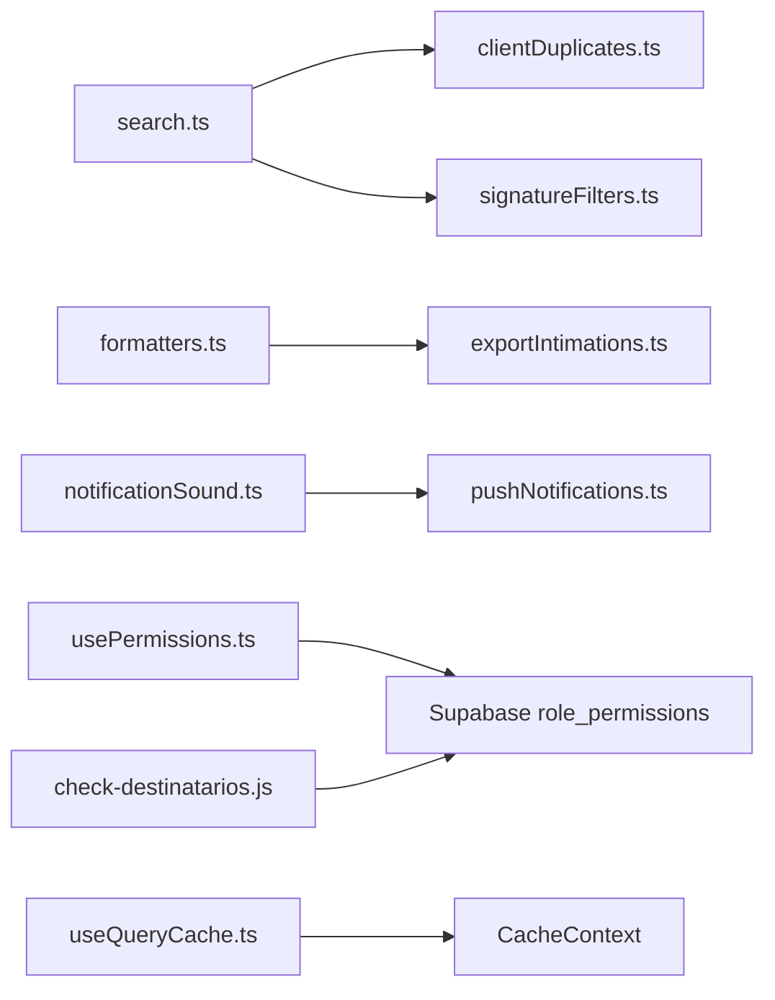

**Diagram sources**
- [search.ts](file://src/utils/search.ts)
- [clientDuplicates.ts](file://src/utils/clientDuplicates.ts)
- [signatureFilters.ts](file://src/utils/signatureFilters.ts)
- [formatters.ts](file://src/utils/formatters.ts)
- [exportIntimations.ts](file://src/utils/exportIntimations.ts)
- [notificationSound.ts](file://src/utils/notificationSound.ts)
- [pushNotifications.ts](file://src/utils/pushNotifications.ts)
- [usePermissions.ts](file://src/hooks/usePermissions.ts)
- [useQueryCache.ts](file://src/hooks/useQueryCache.ts)
- [check-destinatarios.js](file://scripts/check-destinatarios.js)

**Section sources**
- [search.ts](file://src/utils/search.ts)
- [clientDuplicates.ts](file://src/utils/clientDuplicates.ts)
- [signatureFilters.ts](file://src/utils/signatureFilters.ts)
- [formatters.ts](file://src/utils/formatters.ts)
- [exportIntimations.ts](file://src/utils/exportIntimations.ts)
- [notificationSound.ts](file://src/utils/notificationSound.ts)
- [pushNotifications.ts](file://src/utils/pushNotifications.ts)
- [usePermissions.ts](file://src/hooks/usePermissions.ts)
- [useQueryCache.ts](file://src/hooks/useQueryCache.ts)
- [check-destinatarios.js](file://scripts/check-destinatarios.js)

## Performance Considerations
- Prefer memoization and stable callbacks in hooks (as implemented) to avoid unnecessary renders
- Use normalized search to reduce repeated string processing costs
- Cache frequently accessed data via useQueryCache to minimize network calls
- Limit localStorage history sizes to keep reads/writes efficient
- Defer heavy computations (e.g., grouping duplicates) to background-friendly algorithms and avoid blocking UI threads
- Minimize DOM operations in push notification flows; leverage Service Worker when available

## Troubleshooting Guide
- Formatting issues
  - Verify input types for date and number formatters; ensure valid Date objects or parsable strings
  - Confirm locale settings for currency and date formatting
- Search not matching
  - Ensure search terms are normalized consistently using the provided helper
- Notification problems
  - Check browser support and permission status; request permission if needed
  - Verify Service Worker registration and availability
- Permissions not applied
  - Confirm user role is loaded and role_permissions table contains expected rows
- Cache not updating
  - Invalidate cache keys after mutations and confirm CacheContext provider is present

**Section sources**
- [pushNotifications.ts](file://src/utils/pushNotifications.ts)
- [usePermissions.ts](file://src/hooks/usePermissions.ts)
- [useQueryCache.ts](file://src/hooks/useQueryCache.ts)
- [search.ts](file://src/utils/search.ts)
- [formatters.ts](file://src/utils/formatters.ts)

## Conclusion
The CRM Jurídico utilities and helpers provide a robust foundation for formatting, validation, search, client management, notifications, and caching. Their modular design encourages reuse and maintainability while integrating seamlessly with Supabase and browser APIs. Extending these utilities follows established patterns: keep functions pure, reuse normalization/search helpers, and leverage hooks for stateful behaviors.

## Appendices

### Extending Utilities and Creating New Helpers
- Keep helpers pure and deterministic
- Reuse search.ts for normalization and matching
- Use formatters.ts for consistent localization
- For new filtering logic, mirror signatureFilters.ts patterns (filter + sort)
- For exports, follow exportIntimations.ts structure (CSV/HTML/PDF)
- For caching, wrap data-fetching logic with useQueryCache.ts
- For permissions, centralize checks via usePermissions.ts and Supabase role_permissions
- For scripts, follow check-destinatarios.js pattern: load env, create Supabase client, query and log results