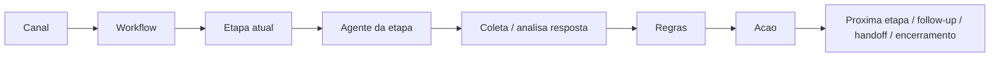
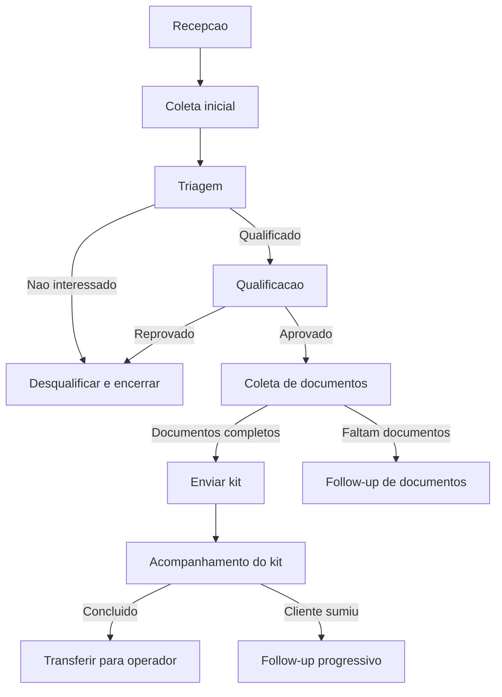
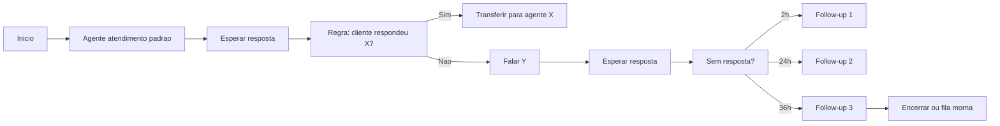

# WhatsApp Automation Engine

## Objetivo

Este documento define a estrutura de um novo projeto de automacao para WhatsApp, com agentes, workflows, follow-up e handoff para operadores humanos.

O objetivo nao e criar "um bot por canal". O objetivo e criar um motor visual de fluxo onde:

- um canal aponta para um workflow
- um workflow tem etapas
- cada etapa usa um agente
- cada etapa possui regras
- as regras definem proxima acao
- o sistema agenda follow-up respeitando horario comercial
- o fluxo pode terminar em operador humano, setor ou encerramento

## Problema que esta sendo resolvido

Hoje o modulo ja consegue atender, transferir, classificar parcialmente, enviar templates, acompanhar kit e assinatura.

O que falta e uma camada formal para:

- rodar varias campanhas em paralelo
- reaproveitar agentes padrao entre canais
- decidir visualmente o caminho da conversa
- automatizar follow-up progressivo
- encerrar ou desqualificar sem logica espalhada em prompt solto
- integrar o fluxo com o modulo existente de Leads

## Direcao de arquitetura

Este projeto deve nascer fora do `WhatsAppModule` atual.

Regra obrigatoria:

- se o projeto de automacao for desligado ou removido, o CRM e o modulo WhatsApp principal devem continuar funcionando

Isso significa:

- nao espalhar dependencias do workflow no fluxo basico do chat
- nao tornar inbox, envio, transferencias, agendamentos manuais e painel 360 dependentes do motor externo
- integrar por MCP, API ou camada de contrato equivalente
- manter fallback manual no CRM

## Separacao de responsabilidades

O CRM continua sendo:

- sistema operacional do escritorio
- fonte de conversas
- fonte de clientes e leads
- fonte de processos, documentos e assinaturas
- lugar de operacao humana

O novo projeto externo continua sendo:

- motor de agentes
- motor de workflows
- motor de regras
- motor de follow-up
- fila de excecao
- orquestrador de handoff

## Integracao com CRM e Leads

Este novo projeto ja deve nascer pensando em integracao com o CRM atual e com o modulo existente de Leads.

Objetivos da integracao:

- usar campanha, origem e contexto comercial ja existentes quando houver lead vinculado
- permitir criar lead automaticamente quando a conversa entrar por canal de campanha
- atualizar qualificacao do lead a partir do workflow
- sincronizar status operacional entre WhatsApp e Leads quando fizer sentido
- permitir que desqualificacao, warming e handoff fiquem refletidos no lead

Casos esperados:

- conversa entra em canal de campanha e vira lead automaticamente
- lead ja existe e o workflow reaproveita esse contexto
- lead qualificado segue para operador humano
- lead desqualificado guarda motivo padronizado

## Integracao por MCP/API

O engine externo nao deve depender do frontend do CRM.

Ele deve conversar com o CRM por contratos claros, por exemplo:

- buscar conversa
- buscar mensagens
- buscar cliente
- buscar lead
- atualizar estado do workflow
- criar nota interna
- transferir para operador
- transferir para setor
- agendar follow-up
- consultar status de assinatura
- consultar status de kit/preenchimento
- atualizar qualificacao do lead

## Modelo mental correto

Nao pensar em:

- "canal tem varios agentes soltos"

Pensar em:

- "canal entra em um workflow"
- "workflow passa por etapas"
- "cada etapa usa um agente"
- "cada etapa tem regras"
- "cada regra toma decisoes"

## Hierarquia principal

1. Canal
2. Workflow
3. Etapa
4. Agente
5. Regra
6. Acao
7. Estado da conversa

## Conceitos

### Canal

Porta de entrada da conversa.

Exemplos:

- Canal campanha FGTS
- Canal campanha BPC
- Canal recepcao geral
- Canal indicacoes

Um canal pode apontar para um workflow padrao.

### Workflow

Fluxo operacional visual vinculado a um canal ou reutilizavel entre varios canais.

Exemplos:

- Workflow campanha trabalhista
- Workflow triagem previdenciaria
- Workflow coleta e envio de kit

Um workflow define:

- ordem das etapas
- regras de transicao
- regras de follow-up
- criterios de encerramento
- pontos de handoff humano
- persistencia da etapa atual
- retomada exata sem reiniciar atendimento

### Etapa

Bloco do workflow.

Exemplos:

- recepcao
- coleta_inicial
- triagem
- qualificacao
- coleta_documentos
- envio_kit
- acompanhamento_kit
- handoff_humano
- encerramento

### Agente

Unidade responsavel por executar uma etapa.

O agente nao deve concentrar a logica do fluxo inteiro.

Ele deve cuidar de uma responsabilidade clara.

Exemplos:

- AgenteAtendimentoPadrao
- AgenteTriagem
- AgenteQualificacao
- AgenteDocumentos
- AgenteKit
- AgenteFollowUp
- AgenteHandoff

### Regra

Conjunto de condicoes que, quando satisfeitas, disparam uma acao.

Exemplos:

- se cliente responder "quero saber sobre rescisao", ir para triagem trabalhista
- se cliente nao responder por 2 horas, agendar follow-up 1
- se cliente responder que nao quer mais, encerrar follow-up e desqualificar
- se cliente concluiu kit, transferir para operador comercial

### Acao

Resultado de uma regra.

Exemplos:

- transferir para outro agente
- mudar de etapa
- enviar mensagem
- agendar follow-up
- cancelar follow-up
- aplicar etiqueta
- definir setor
- definir prioridade
- desqualificar lead
- transferir para humano
- encerrar conversa

## Fluxo estrutural



## Exemplo real do seu caso

Canal:

- `Canal campanha`

Workflow:

- `workflow_campanha_padrao`

Etapas:

1. recepcao
2. coleta_inicial
3. triagem
4. qualificacao
5. coleta_documentos
6. envio_kit
7. acompanhamento_kit
8. handoff_operador

### Etapa especial: coleta de documentos

Na etapa `coleta_documentos`, o operador deve conseguir definir na construcao do workflow quais documentos sao indispensaveis.

Isso deve funcionar em modo lista.

Exemplo de configuracao da etapa:

- RG
- CPF
- Comprovante de residencia
- Carteira de trabalho
- Extrato do FGTS

Cada item da lista deve aceitar pelo menos:

- nome do documento
- obrigatorio ou opcional
- descricao curta ou observacao
- ordem de exibicao

Essa lista faz parte da configuracao da etapa, nao do prompt solto do agente.

O agente usa essa lista para:

- pedir os documentos corretos
- marcar o que ja foi recebido
- identificar o que ainda falta
- disparar follow-up com base no que esta pendente

O workflow usa essa lista para decidir:

- se pode avancar para a proxima etapa
- se deve continuar cobrando documento
- se deve gerar resumo para o operador humano

## Exemplo de fluxo visual



## Reuso de agente entre campanhas

Voce pode ter varios canais e reutilizar um mesmo agente padrao.

Exemplo:

- `AgenteAtendimentoPadrao`

Prompt base:

- "Voce esta atendendo uma campanha de captacao juridica. Seja objetivo, cordial e conduza para coleta estruturada."

Contexto adicional por canal:

- "Voce esta atendendo a campanha FGTS."
- "Voce esta atendendo a campanha BPC."
- "Voce esta atendendo a campanha Trabalhista."

Conclusao importante:

- o agente pode ser reutilizado
- o workflow muda por canal
- o contexto muda por canal
- as regras mudam por workflow

## Assunto principal e assunto alternativo

A campanha pode ser sobre um assunto e o cliente pode trazer outro problema com potencial juridico.

O sistema deve suportar:

- assunto principal da campanha
- assunto principal detectado na conversa
- assuntos adicionais detectados
- score de confianca por assunto detectado
- decisao de coletar mais contexto antes do handoff
- oportunidade juridica fora do assunto original da campanha

Exemplo:

- campanha: FGTS
- cliente fala de rescisao e tambem de doenca ocupacional

Resultado esperado:

- a IA identifica o tema principal
- registra o tema adicional
- coleta o maximo de informacao possivel
- transfere ao operador escolhido com resumo consolidado

## Persistencia da etapa do atendimento

Regra obrigatoria:

- a etapa atual deve ser salva sempre

Objetivo:

- evitar reinicio de atendimento
- evitar repetir perguntas
- permitir retomada exata de onde a conversa parou

Eventos que nao podem reiniciar a etapa:

- refresh da tela
- troca de operador
- nova abertura do CRM
- retomada horas depois
- follow-up automatico no meio do fluxo

Dados minimos persistidos:

- workflow atual
- etapa atual
- agente atual
- dados coletados
- documentos recebidos
- documentos pendentes
- assunto principal
- assuntos adicionais detectados
- ultimo follow-up
- proximo follow-up
- motivo de pausa, excecao ou handoff

## Estrutura de cada agente

Cada agente deve ter:

- nome
- descricao
- tipo
- provider_ia
- modelo_ia
- prompt_base
- prompt_contextual
- objetivo
- campos_que_coleta
- pode_enviar_automaticamente
- exige_aprovacao_humana
- limite_de_tokens
- suporta_leitura_de_imagem
- suporta_leitura_de_pdf
- tempo_maximo_de_espera
- mensagem_fallback
- ativo

### Selecionar fonte de IA e modelo por agente

Cada agente deve permitir escolha explicita de:

- fonte de IA
- modelo

Em formato visual de select list.

Regras:

- a escolha do modelo e por agente, nao apenas por canal
- agentes simples podem usar modelo mais barato
- agentes criticos podem usar modelo melhor
- a UI deve sinalizar se o modelo suporta multimodal

### Tipos de agente

- atendimento_padrao
- coleta
- triagem
- qualificacao
- documentos
- followup
- handoff
- encerramento

## Estrutura de cada etapa

Cada etapa deve ter:

- nome
- slug
- workflow_id
- agent_id
- ordem
- descricao
- criterio_de_entrada
- criterio_de_saida
- permite_resposta_automatica
- timeout_minutos
- followup_policy_id
- required_documents_json
- resume_from_saved_state
- terminal

### `required_documents_json`

Campo recomendado para etapas de coleta documental.

Formato sugerido:

```json
[
  {
    "key": "rg",
    "label": "RG",
    "required": true,
    "description": "Foto legivel da identidade"
  },
  {
    "key": "cpf",
    "label": "CPF",
    "required": true,
    "description": "Pode ser cartao ou comprovante oficial"
  },
  {
    "key": "ctps",
    "label": "Carteira de trabalho",
    "required": true,
    "description": "Pagina com foto e contratos"
  }
]
```

## Estrutura de cada regra

Cada regra deve ter:

- etapa_origem
- prioridade
- nome
- condicoes
- operador_logico
- acao
- fallback
- ativo

### Tipos de condicao

- resposta contem texto
- resposta igual texto
- resposta corresponde regex
- campo coletado igual valor
- campo coletado preenchido
- assunto classificado
- assunto_adicional_detectado
- setor atual
- prioridade atual
- tag presente
- numero de tentativas
- tempo sem resposta
- documento entregue
- todos_documentos_obrigatorios_entregues
- documento_obrigatorio_pendente
- assinatura concluida
- assinatura recusada
- kit aberto
- kit abandonado
- horario comercial
- canal atual

### Tipos de acao

- ir_para_etapa
- transferir_para_agente
- transferir_para_operador
- transferir_para_setor
- enviar_mensagem
- sugerir_mensagem
- agendar_followup
- cancelar_followup
- aplicar_tag
- remover_tag
- definir_assunto
- definir_setor
- definir_prioridade
- desqualificar
- qualificar
- encerrar_conversa
- pausar_fluxo

## Capacidade multimodal

Alguns agentes precisam ler mais do que texto.

O projeto deve prever agentes com capacidade de:

- ler imagem
- ler PDF
- ler anexos do atendimento

Casos de uso:

- validar se um documento parece ser RG, CPF, comprovante ou CTPS
- ler PDF de contrato, laudo ou documento processual
- extrair informacoes importantes antes do handoff

Regra:

- a capacidade multimodal depende do modelo escolhido no agente
- a UI deve mostrar se o agente suporta texto apenas ou multimodal
- se o modelo nao suportar leitura de arquivo, o sistema deve cair em fallback seguro

## Camadas obrigatorias para piloto automatico

Para o sistema operar com minima intervencao humana, estas camadas sao obrigatorias.

### 1. Motor de excecoes

Nao abrir tela humana para tudo. Abrir apenas para desvio.

Deve existir fila de excecao com motivos claros:

- cliente confuso
- resposta fora do previsto
- baixa confianca da IA
- documento ilegivel
- regra conflitante
- canal desconectado
- assinatura travada
- lead sensivel ou reclamando

Regra:

- a intervencao humana entra primeiro aqui

### 2. Score de confianca

Cada decisao automatica precisa ter confianca numerica.

Exemplos:

- classificar assunto: `0.91`
- sugerir setor: `0.78`
- qualificar lead: `0.66`

Regra:

- acima do limiar alto: executa
- entre limiar alto e baixo: pede confirmacao
- abaixo do limiar baixo: manda para excecao

Sem isso, o piloto automatico vira chute.

### 3. Memoria estruturada da conversa

O agente precisa guardar estado util, nao apenas historico bruto.

Campos minimos:

- nome
- campanha
- assunto
- area juridica
- status da qualificacao
- documentos pendentes
- etapa atual
- objecoes do cliente
- ultimo follow-up enviado
- motivo de saida ou desqualificacao

Isso evita repeticao, perda de contexto e reinicio da conversa.

### 4. Qualificacao e desqualificacao formal

Isso precisa ser regra de negocio, nao comentario solto.

Status recomendados:

- qualificado
- desqualificado
- morno
- sem resposta
- aguardando documentos
- aguardando assinatura
- pronto para operador

Motivos recomendados:

- sem interesse
- perfil fora da campanha
- documentacao insuficiente
- parou de responder
- ja resolveu com outro escritorio

### 5. Biblioteca de mensagens por etapa

Nao deixar follow-up e respostas criticas apenas no prompt.

Mensagens devem ser versionadas por:

- etapa
- campanha
- tom
- horario
- status do lead

Exemplos:

- recepcao
- follow-up 2h
- follow-up 24h
- cliente sem interesse
- cliente pediu tempo
- documentos pendentes
- kit enviado
- assinatura parada

### 6. Regras de protecao

Para nao virar spam ou erro operacional, o sistema precisa de guardrails.

Obrigatorios:

- limite de mensagens automaticas por janela
- cooldown entre follow-ups
- bloqueio se cliente disser `pare`
- bloqueio fora do horario comercial
- bloqueio se ja houver operador humano atuando
- bloqueio se canal estiver instavel
- evitar loops entre agentes

### 7. Painel de supervisao

Voce nao vai governar conversa por conversa. Vai governar operacao.

O painel precisa mostrar:

- fluxos ativos por canal
- quantos estao em cada etapa
- quantos qualificados
- quantos desqualificados
- quantos aguardando documento
- quantos aguardando assinatura
- quantos em excecao
- taxa de resposta por campanha
- taxa de conversao por workflow
- gargalo por etapa

Sem isso, o sistema roda, mas nao fica governavel.

### 8. Simulador de workflow

Antes de ativar campanha, o fluxo precisa ser testado.

Perguntas que o simulador deve responder:

- se cliente responder X, vai para onde?
- se sumir por 24h, qual mensagem sai?
- se disser `nao quero mais`, o que acontece?
- se enviar 2 de 4 documentos, trava onde?
- se assinar, vai para qual operador?

## Limite de tokens

Cada agente deve ter limite configuravel de tokens.

Campos recomendados:

- max_input_tokens
- max_output_tokens
- max_context_messages
- summarization_threshold

Objetivos:

- controlar custo
- evitar contextos longos demais
- resumir automaticamente antes de estourar janela
- permitir usar modelos diferentes por custo e profundidade

## Regra principal de arquitetura

A IA pode:

- interpretar
- classificar
- resumir
- sugerir resposta
- extrair dados

A IA nao deve ser a unica responsavel por decidir o fluxo.

Quem decide o fluxo deve ser:

- regra estruturada
- condicao auditavel
- acao previsivel

## Formato sugerido de regra

```json
{
  "name": "cliente_pediu_trabalhista",
  "step": "triagem",
  "priority": 10,
  "match": "all",
  "conditions": [
    { "type": "classified_subject", "operator": "contains", "value": "trabalhista" },
    { "type": "message_contains_any", "value": ["rescisao", "demissao", "fgts"] }
  ],
  "action": {
    "type": "go_to_step",
    "target": "qualificacao_trabalhista"
  }
}
```

## Follow-up progressivo

O follow-up deve ser politica configuravel, nao mensagem fixa enterrada em prompt.

### Regra base

Se o cliente nao responder:

- enviar follow-up 1 em 2 horas
- enviar follow-up 2 em 24 horas
- enviar follow-up 3 em 36 horas

Sempre:

- respeitar horario comercial
- cancelar follow-up se houver resposta
- cancelar follow-up se lead for desqualificado
- cancelar follow-up se conversa for encerrada

## Politica padrao de follow-up

### Follow-up padrao de campanha

1. 2 horas
   Mensagem: "Oi, passando para dar continuidade no seu atendimento. Se quiser, posso seguir com as proximas informacoes por aqui."

2. 24 horas
   Mensagem: "Retomando seu atendimento: se ainda fizer sentido para voce, posso continuar a triagem e orientar os proximos passos."

3. 36 horas
   Mensagem: "Esta sera minha ultima mensagem por agora. Se quiser continuar, basta responder aqui e eu sigo com seu atendimento."

### Regras dessa politica

- se o cliente responder em qualquer ponto, cancelar follow-ups pendentes
- se o cliente disser que nao quer mais, cancelar follow-up, marcar como desqualificado e encerrar
- se o cliente responder com duvida nova, voltar para a etapa adequada
- se estiver fora do horario comercial, empurrar para a proxima janela valida

## Horario comercial

Toda politica de follow-up deve verificar:

- timezone do canal
- dias ativos
- hora inicial
- hora final
- feriados, se essa camada existir no futuro

Exemplo:

- canal usa `America/Cuiaba`
- horario comercial: segunda a sexta, 08:00 as 18:00

Se o follow-up vencer as 22:30:

- reagendar para o proximo dia util as 08:00

## Casos de encerramento automatico

O workflow deve suportar encerramento por regra.

Exemplos:

- cliente respondeu "nao tenho interesse"
- cliente pediu para parar contato
- cliente informou que nao quer contratar
- cliente ficou sem resposta apos ultimo follow-up e politica manda esfriar

Acao esperada:

- cancelar follow-ups futuros
- marcar desqualificacao
- salvar motivo
- encerrar ou mover para fila morna

## Estado da conversa dentro do workflow

Cada conversa precisa guardar:

- canal atual
- workflow atual
- etapa atual
- agente atual
- status do workflow
- dados coletados
- tags
- assunto
- assuntos adicionais detectados
- score de confianca por decisao relevante
- setor sugerido
- prioridade sugerida
- follow-ups ativos
- ultimo follow-up enviado
- numero de tentativas
- resultado final
- operador ou setor de destino

Sem isso o sistema reinicia perguntas e perde contexto operacional.

## Estados recomendados

- active
- waiting_customer
- waiting_internal
- followup_scheduled
- paused
- handed_off
- qualified
- disqualified
- completed
- cancelled

## Tela visual do construtor

Voce quer construir isso visualmente. A tela deve ser pensada como builder de fluxo.

### Blocos visuais

- inicio
- etapa com agente
- decisao por regra
- acao de mensagem
- espera por resposta
- follow-up
- transferencia para humano
- encerramento

### Painel lateral do bloco

Ao clicar em um bloco, editar:

- nome
- agente
- provider/modelo de IA do agente
- prompt
- campos esperados
- lista de documentos obrigatorios, quando a etapa for documental
- regras
- mensagens
- timeout
- follow-up
- setor ou operador de destino

## Fluxo visual sugerido para a UI



## Exemplo completo de campanha

### Canal

- `canal_campanha_fgts`

### Agente inicial

- `agente_atendimento_padrao`

### Prompt contextual

- "Voce esta atendendo campanha FGTS. Seu objetivo e identificar interesse real, coletar dados iniciais e encaminhar para a etapa correta."

### Regras

#### Regra 1

- se cliente responder sobre rescisao, demissao ou FGTS
- ir para `agente_triagem_trabalhista`

#### Regra 2

- se cliente responder sobre aposentadoria ou beneficio
- ir para `agente_triagem_previdenciaria`

#### Regra 3

- se cliente responder "nao quero mais"
- cancelar follow-up
- desqualificar
- encerrar conversa

#### Regra 4

- se cliente nao responder
- aplicar politica `followup_padrao_campanha`

#### Regra 5

- se qualificado
- transferir para `agente_documentos`

#### Regra 6

- se todos os documentos obrigatorios forem recebidos
- enviar kit

#### Regra 7

- se kit concluido
- transferir para operador humano do setor comercial

## Entidades de dados recomendadas no projeto novo

### Tabelas principais

- `wa_agent_profiles`
- `wa_workflows`
- `wa_workflow_steps`
- `wa_workflow_rules`
- `wa_followup_policies`
- `wa_followup_policy_steps`
- `wa_conversation_workflow_state`
- `wa_workflow_transition_log`
- `wa_workflow_action_log`
- `wa_ai_provider_profiles`

### Tabelas auxiliares

- `wa_workflow_channel_bindings`
- `wa_agent_channel_overrides`
- `wa_workflow_handoff_targets`
- `wa_agent_model_bindings`

## Estrutura minima de tabelas

### `wa_agent_profiles`

- id
- name
- slug
- type
- description
- ai_provider
- ai_model
- prompt_base
- multimodal_enabled
- max_input_tokens
- max_output_tokens
- active
- can_send_automatically
- requires_human_approval

### `wa_workflows`

- id
- name
- slug
- description
- active
- version

### `wa_workflow_steps`

- id
- workflow_id
- name
- slug
- order_index
- agent_id
- timeout_minutes
- required_documents_json
- terminal
- followup_policy_id

### `wa_workflow_rules`

- id
- workflow_id
- step_id
- name
- priority
- match_mode
- conditions_json
- action_json
- active

### `wa_followup_policies`

- id
- name
- slug
- description
- active

### `wa_followup_policy_steps`

- id
- policy_id
- order_index
- delay_minutes
- template_id
- stop_if_customer_replied
- business_hours_only

### `wa_conversation_workflow_state`

- conversation_id
- workflow_id
- current_step_id
- current_agent_id
- state
- collected_data_json
- detected_additional_issues_json
- subject
- confidence_scores_json
- suggested_department_id
- suggested_priority
- qualified
- disqualified_reason
- active_followup_job_id
- last_transition_at

## Logs obrigatorios

Tudo precisa ser auditavel.

Registrar:

- entrada no workflow
- troca de etapa
- regra disparada
- mensagem automatica enviada
- follow-up agendado
- follow-up cancelado
- handoff para humano
- desqualificacao
- encerramento
- resumo salvo para retomada
- abertura em fila de excecao

## Regras de produto importantes

### 1. Um canal pode ter varios workflows?

Sim, mas com uma regra clara:

- ou um workflow padrao por canal
- ou uma etapa inicial de roteamento que decide entre subfluxos

Nao deixar o canal com varias automacoes paralelas sem dono.

### 2. Um agente pode ser usado em varios workflows?

Sim.

Esse e o desenho ideal.

### 3. Prompt decide regra?

Nao.

Prompt ajuda a interpretar.

Regra estruturada decide.

### 4. Follow-up fica dentro do agente?

Nao.

Follow-up deve ser politica configuravel.

### 4.1. Lista de documentos fica no prompt?

Nao.

A lista de documentos obrigatorios deve ficar estruturada na configuracao da etapa.

O prompt pode usar essa lista como contexto, mas a fonte da verdade deve ser o workflow.

### 4.2. Estado da etapa fica so em memoria?

Nao.

O estado da etapa precisa ser persistido.

Se isso ficar apenas na UI, o atendimento reinicia e a automacao perde confiabilidade.

### 4.3. Fonte de IA e modelo ficam so no canal?

Nao.

O canal pode ter padrao, mas o agente precisa permitir override proprio.

### 4.4. Leitura de imagem e PDF e obrigatoria para alguns agentes?

Sim.

Especialmente:

- agente de coleta documental
- agente de triagem documental
- agente que resume anexos antes do handoff

### 5. Se cliente responder depois do follow-up 2?

- cancelar os proximos follow-ups
- reativar a conversa
- voltar para a etapa correta

## MVP recomendado dessa camada

Fase 1:

- workflow por canal
- etapas
- agente por etapa
- persistencia de etapa atual
- regras simples de transicao
- follow-up padrao 2h / 24h / 36h
- handoff para operador

Fase 2:

- builder visual
- select list de provider/model por agente
- politicas de follow-up reutilizaveis
- simulador de regra
- versao de workflow
- logs detalhados

Fase 3:

- subfluxos
- A/B por campanha
- score de qualificacao
- dashboards por workflow

## Decisao recomendada

Para o seu projeto, a melhor base e:

- `workflow engine leve`
- `state machine simples`
- `rule engine estruturado`
- `IA como apoio`

Resumo:

- canal recebe
- workflow organiza
- agente conversa
- etapa persiste
- regra decide
- follow-up insiste
- humano assume quando necessario

## O que o Claude deve fazer depois desta documentacao

1. Modelar tabelas Supabase
2. Modelar tipos TypeScript
3. Criar servico de workflow
4. Criar executor de regras
5. Criar agenda de follow-up respeitando horario comercial
6. Criar binding canal -> workflow
7. Criar UI inicial de builder
8. Criar painel de estado da conversa dentro do workflow

Sem essa ordem, a implementacao tende a virar um conjunto de prompts e excecoes dificeis de manter.

## Programa de implementacao por fase

As fases abaixo sao o roteiro oficial de entrega.

Marcar `[x]` somente quando a fase estiver realmente concluida.

### Fase 0. Descoberta e documentacao

- [x] definir arquitetura do submodulo de workflow/agentes
- [x] definir arquitetura do projeto externo
- [x] definir principio de desacoplamento em relacao ao `WhatsAppModule`
- [x] definir persistencia de etapa atual
- [x] definir follow-up progressivo
- [x] definir suporte a provider/model por agente
- [x] definir multimodal e limite de tokens
- [x] definir integracao com Leads

### Fase 1. Fundacao de dominio

- [ ] modelar agentes
- [ ] modelar workflows
- [ ] modelar etapas
- [ ] modelar regras
- [ ] modelar politicas de follow-up
- [ ] modelar estado persistido da conversa
- [ ] modelar binding canal -> workflow
- [ ] modelar integracao basica com Leads

### Fase 2. Motor operacional

- [ ] executor de regras
- [ ] persistencia e retomada de etapa sem reinicio
- [ ] agenda de follow-up respeitando horario comercial
- [ ] cancelamento automatico de follow-up por resposta, opt-out ou encerramento
- [ ] handoff para operador ou setor
- [ ] resumo automatico para entrega ao humano

### Fase 2.1. Contratos de integracao com CRM

- [ ] definir ferramentas MCP ou endpoints equivalentes
- [ ] definir contratos de leitura de conversa, lead, assinatura e kit
- [ ] definir contratos de escrita de nota, handoff, follow-up e qualificacao
- [ ] definir estrategia de fallback quando CRM estiver indisponivel

### Fase 3. Inteligencia e confianca

- [ ] score de confianca por decisao
- [ ] thresholds: executar, confirmar ou excecao
- [ ] deteccao de assunto principal e assunto alternativo
- [ ] memoria estruturada da conversa
- [ ] qualificacao e desqualificacao formais
- [ ] leitura de imagem, PDF e anexos para agentes que exigirem isso

### Fase 4. Protecao e governanca

- [ ] motor de excecoes
- [ ] fila de excecao por motivo
- [ ] guardrails anti-spam
- [ ] bloqueio por canal instavel
- [ ] bloqueio quando humano estiver atuando
- [ ] prevencao de loop entre agentes
- [ ] auditoria do workflow

### Fase 5. Conteudo operacional

- [ ] biblioteca de mensagens por etapa
- [ ] variacoes por campanha
- [ ] variacoes por horario
- [ ] variacoes por status do lead
- [ ] mensagens de follow-up versionadas
- [ ] mensagens de desqualificacao e pausa

### Fase 6. Builder visual

- [ ] canvas visual de workflow
- [ ] blocos de etapa, decisao, espera, follow-up, handoff e encerramento
- [ ] painel lateral de configuracao do bloco
- [ ] configuracao visual de documentos obrigatorios
- [ ] select list de provider/model por agente
- [ ] configuracao visual das regras

### Fase 7. Supervisao e simulacao

- [ ] painel de supervisao operacional
- [ ] metricas por canal e workflow
- [ ] funil por etapa
- [ ] fila de excecao supervisionavel
- [ ] simulador de workflow antes da ativacao
- [ ] validacao de cenarios criticos

### Fase 8. Rollout controlado

- [ ] ativar em um canal piloto
- [ ] acompanhar fila de excecao
- [ ] ajustar thresholds de confianca
- [ ] ajustar follow-ups e mensagens
- [ ] validar integracao com Leads
- [ ] expandir para novos canais
